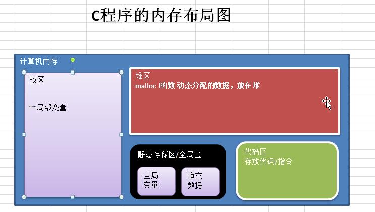
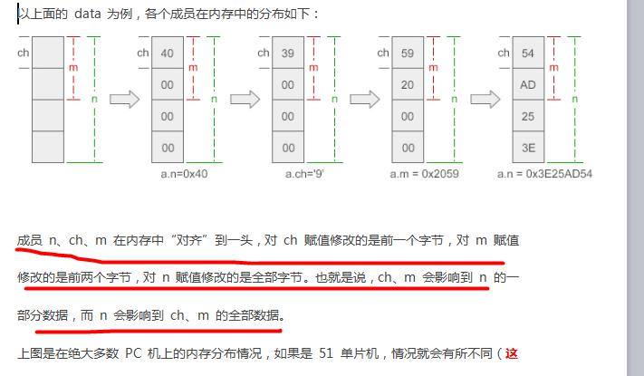
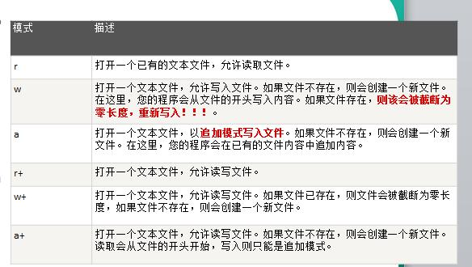

# 1. C语言概述

## 1.1 特点

1. **代码级别的跨平台**：由于标准的存在，使得几乎同样的C代码可用于多种操作系统。
2.  **允许直接访问物理地址**，对硬件进行操作。
3. C语言是一个有结构化程序设计、具有变量作用域（variable scope）以及递归功能的过程式语言。
4. C语言传递参数可以是值传递（pass by value，值），也可以传递指针（apointer passed by value，地址）。
5. C语言中，**没有对象**，不同的变量类型可以用结构体（struct）组合在一起。
6. **预编译处理（preprocessor）,生成目标代码质量高，程序执行效率高**。

## 1.2 运行机制

1. 编辑：比如编写我们的 hello.c 文件，就是源代码.
2. 编译：将 hello.c 程序翻译成目标文件 (hello.obj) // 在计算机底层执行
3. 链接：将目标文件 hello.obj + 库文件生成可执行文件(MyProject01.exe) // 在计算机底层执行
4. 运行：执行.exe文件，得到运行结果

* 编译
  1. 有了C源文件，通过编译器将其编译成 obj文件(目标文件)。
  2. 如果程序没有错误，没有任何提示，但在Debug目录下会出现一个 Hello.obj 文件，该文件称为目标文件。
* 链接
  1. 有了目标文件(.obj文件)，通过链接程序将其和运行需要的c库文件链接成exe文件(可执行文件)。
  2.  如果程序没有错误，没有任何提示，但在 Debug 目录下会出现一个项目名.exe文件，该文件称为可执行文件。
  3. 为什么需要链接库文件呢？因为我们的C程序中会使用C程序库的内容，比如<stdio.h><stdlib.h>中的函数 printf()、system() 等等,这些函数不是程序员自己写的，而是C程序库中提供的，因此需要链接。
  4. 你会发现链接后，生成的.exe文件，比obj文件大了很多.
* 运行
  1. 有了可执行的exe文件,也称为可执行程序(二进制文件)
  2. 在控制台下可以直接运行exe文件

## 1.3 转义字符

~~~ markdown
\t ：一个制表位，实现对齐的功能
\n ：换行符
\\ ：一个\
\" : 一个"
\' ：一个'
\r : 一个回车printf("张无忌赵敏周\r芷若小昭");
~~~

## 1.4 注释

~~~ c
// 单行注释

/*
	多行注释1
	多行注释2
	注释不允许嵌套
*/
~~~

## 1.5 标准库

C标准库是一组C内置函数、常量和头文件，比如<stdio.h>、<stdlib.h>、<math.h>，等等。

可以查手册来找需要使用的库和函数。

# 2. 变量

## 2.1 变量介绍

变量相当于**内存中一个数据存储空间的表示**，通过变量名可以访问到变量(值)。

1. 变量表示内存中的一个存储区域（不同的数据类型，占用的空间大小不一样）
2. 该区域有自己的名称和类型
3. 变量必须先声明，后使用
4. 该区域的数据可以在同一类型范围内不断变化
5. 变量在同一个作用域内不能重名
6. 变量三要素(变量名+值+数据类型)，这一点请大家注意。

## 2.2 数据类型

* 基本类型
  * 数值类型
    * 整型
      * short短整型
      * int整形
      * long长整型
    * 浮点数
      * float单精度
      * double双精度
  * char字符类型
* 构造类型
  * 数组
  * 结构体struct
  * 共用体union
  * 枚举类型enum
* 指针类型
* 空类型void

> 在c中，没有字符串类型,使用字符数组表示字符串
>
> 在不同系统上，部分数据类型字节长度不一样，int 2 或者 4个字节

## 2.3 整数类型

如

~~~ C
#include <stdio.h>
int main(){
    int num = 3;
    printf("num=%d", num);
    return(0);
}
~~~

| 类型               | 存储大小    | 值范围                                                       |
| ------------------ | ----------- | ------------------------------------------------------------ |
| char               | 1字节       | -128 即 -(2^7)  到 127(2^7 -1)                               |
| unsigned char      | 1 字节      | 0 到 255 (2^8 - 1)                                           |
| signed char        | 1 字节      | -128 即-(2^7) 到 127 (2^7-1)                                 |
| int signed int     | 2 或 4 字节 | -32,768 (- 2^15 ) 到 32,767 (2^15-1) 或 -2,147,483,648 (- 2^31) 到 2,147,483,647 (2^31 -1) |
| unsigned int       | 2 或 4 字节 | 0 到 65,535 (2^16-1) 或 0 到 4,294,967,295 (2^32 -1)         |
| short signed short | 2 字节      | -32,768 (- 2^15)到 32,767 (2^15 -1)                          |
| unsigned short     | 2 字节      | 0 到 65,535 (2^16 - 1)                                       |
| long signed long   | 4 字节      | -2,147,483,648 (- 2^31) 到 2,147,483,647 (2^31 - 1)          |
| unsigned long      | 4 字节      | 0 到 4,294,967,295 (2^32 - 1)                                |

* 使用细节
  1. **各种类型的存储大小与操作系统、系统位数和编译器有关**，目前通用的以 64 位系统为主。 
  2. C 语言的整型类型，分为有符号 signed 和无符号 unsigned 两种， 默认是 signed。
  3. C 程序中整型常声明为 int 型，除非不足以表示大数，才使用 long long
  4. bit(位): 计算机中的最小存储单位。 byte(字节):计算机中基本存储单元。  

## 2.4 浮点类型

如

~~~ c
#include <stdio.h>
 
int main()
{
    double salary = 10000.56;
    double num1 = 1.3;
    double num2 = 4.5;
    double sum = num1 + num2;
    printf("sum = %.2f \n" , sum);
    printf("sum = %f" , sum);
    return(0);
}

sum = 5.80 
sum = 5.800000
~~~

|     类型      | 存储大小 |        值范围        |   精度    |
| :-----------: | :------: | :------------------: | :-------: |
| float 单精度  |  4 字节  |  1.2E-38 到 3.4E+38  | 6 位小数  |
| double 双精度 |  8 字节  | 2.3E-308 到 1.7E+308 | 15 位小数 |

* 注意
  1. 关于浮点数在机器中存放形式的简单说明，浮点数 = 符号位 + 指数位 + 尾数位，浮点数是近似值。
  2. 尾数部分可能丢失，造成精度损失。
* 使用细节
  1. 浮点型常量默认为 double 型，声明 float 型常量时，须后加‘f’ 或‘F’ 。
  2. 浮点型常量有两种表示形式
     1. 十进制数形式： 如：5.12、512.0f、.512 (必须有小数点）
     2. 科学计数法形式：如：5.12e2、5.12E-2
  3. 通常情况下，应该使用 double 型，因为它比 float 型更精确。
  4. printf("d1=%f ", d1);  // 在输出时，默认保留 小数点 6 位。

~~~ cint main()
int main(){
    //浮点型常量默认为 double 型 ， 声明 float 型常量时， 须后加‘f’ 或‘F’
    float d1 = 1.18909095; //从“double” 到“float” 截断, 1.1 是 double
    float d2 = 1.1f; // 1.1f 就是 float
    double d3 = 1.3; // ok
    double d4 = 5.12;
    double d5 = .512; // 等价 0.512
    double d6 = 5.12e2; //等价 5.12 * (10^2) = 512
    double d7 = 5.12e-2; // 等价 5.12 * (10^-2) = 5.12 / 100 = 0.0512
    //在输出时， 如果%f 默认保留小数点 6 位
    printf("d1=%.15f d2=%f d3=%f d4=%f d5=%f d6=%f d7=%f", d1,d2,d3,d4,d5,d6,d7);
    return(0);
}

d1=1.189090967178345 d2=1.100000 d3=1.300000 d4=5.120000 d5=0.512000 d6=512.000000 d7=0.051200
~~~

## 2.5 字符类型

* 字符类型可以表示单个字符，字符类型是 char，char 是 1 个字节(可以存字母或者数字)
* 多个字符称为字符串，在C 语言中 使用 char 数组 表示，数组不是基本数据类型，而是构造类型。

如

~~~ c
int main(){
    char c1 = 'A';
    char c2 = '0';
    char c3 = '\t';
    printf("c1=%c c3=%c c2=%c", c1, c3, c2); // %c 表示以字符的形式输出
    return(0);
}

c1=A c3=	 c2=0
~~~

* 使用细节
  1. 字符常量是用单引号括起来的单个字符。 例如：char c1 = 'a'; char c3 = '9';  
  2. C 中还允许使用转义字符‘\’ 来将其后的字符转变为特殊字符型常量。例如：char c3 = ‘\n’ ; // '\n'表示换行符
  3. 在 C 中，char 的本质是一个整数，在输出时，是 ASCII 码对应的字符。
  4. 可以直接给 char 赋一个整数，然后输出时，会按照对应的 ASCII 字符输出 [97]。
  5. char 类型是可以进行运算的，相当于一个整数，因为它都对应有 Unicode 码。

~~~ c
int main(){
    char c1 = 'a';
    char c2 = 'b';
    //这时当我们以 %c 输出时，就会按照 ASCII 编码表(理解 字符 <==> 数字 对应关系 ) 对应的 97 对应字符输出
    char c3 = 97;
    int num = c2 + 10; // 98 + 10 = 108
    
    printf("c1=%c c2=%c c3=%c \n", c1, c2, c3); // c3= 'a'
    printf("num=%d", num); // 108
    return(0);
}

c1=a c2=b c3=a 
num=108 
~~~

## 2.6 布尔类型

* C 语言标准(C89)没有定义布尔类型，所以 C 语言判断真假时以 0 为假，非 0 为真。
* 但这种做法不直观，所以我们可以借助 C 语言的宏定义。

> C 语言标准(C99)提供了 _Bool 型， _Bool 仍是整数类型， 但与一般整型不同的是， _Bool 变量只能赋值为 0 或 1，非 0 的值都会被存储为 1。
>
> _ C99 还提供了一个头文件 <stdbool.h> 定义了 bool 代表_Bool，true 代表 1，false 代表 0。只要导入 stdbool.h，就能方便的操作布尔类型了 , 比如 bool flag = false;

~~~ c
 //宏定义
#define BOOL int
#define TURE 1
#define FALSE 0
 
int main(){
    int isPass = -1;
    //定义一个布尔变量
    BOOL isOk = TURE; // 等价 int isOK = 0
    if(isPass) { // 0 表示假， 非 0 表示真
        printf("通过考试");
    }
    if(isOk) {
        printf("ok");
    }
    return(0);
}
~~~

## 2.7 基本类型转换

当 C 程序在进行赋值或者运算时，精度小的类型自动转换为精度大的数据类型，这个就是自动类型转
换。  

**数据类型按精度(容量)大小排序（从低到高）：**

1. short
2. int
3. unsigned int
4. long
5. unsigned long
6. float
7. double
8. long double

**自动转换表**

~~~ mermaid
flowchart LR

A[Char, short] --> B(int)
B --> C[unsigned]
C --> D[long]
D --> E[double]
F[float] --> E[double]
~~~

* 细节说明
  1. 有多种类型的数据混合运算时，系统首先自动将所有数据转换成精度最大的那种数据类型，然后再进行计算（如int 型 和 short 型 运算时，先把 short 转成 int 型后再进行运算）。
  2. 若两种类型的字节数不同，转换成字节数大的类型，若两种类型的字节数相同，且一种有符号，一种无符号，则转换成无符号类型。
  3. 在赋值运算中，赋值号两边量的数据类型不同时，赋值号右边的类型将转换为左边的类型， 如果右边变量的数据类型长度比左边长时，将丢失一部分数据，这样会降低精度，丢失的部分按四舍五入向前舍入。

~~~ c
int main(){
    //举例 1
    char c1 = 'a';
    int num1 = c1; // ok
    double d1 = num1; // ok
    printf("d1=%f \n", d1);
    //ok
    //举例 2
    short s1 = 10;
    int num2 = 20;
    int num3 = s1 + num2; //ok
    printf("num3=%d \n", num3);
    //举例 3
    float f1 = 1.1f; //ok
    double d2 = 4.58667435;
    f1 = d2; // 出现精度损失 (double -> float )
    printf("f1=%.8f", f1); // 期望： 4.58667435

    return(0);
}

d1=97.000000 
num3=30 
f1=4.58667421
~~~

## 2.8 强制类型转换

将**精度高**的数据类型转换为**精度小**的数据类型。 使用时要加上**强制转换符 ( )**，但可能造成精度降低或溢出，格外要注意。  

~~~ c
int main(){
    double d1 = 1.934;
    int num = (int) d1; //这里注意， 不是进行四舍五入， 而是直接截断小数后的部分
    printf("\n num=%d d1=%f" , num, d1); // d1 仍然是 double
    
    // 强制转换只对最近的数有效, 如果希望针对更多的表达式转换， 使用（）
    // int num2 = (int) 3.5 * 10 + 6 * 1.5; // 3 * 10 + 6 * 1.5 = 30 + 9.0 = 39.0
    int num3 = (int) (3.5 * 10 + 6 * 1.5); // 35.0 + 9.0 = 44.0 -> int = 44
    printf("\n num3=%d", num3); // num3 = 44
    
    return(0);
}

num=1 d1=1.934000
num3=44
~~~

* 注意
  1. 当进行数据的从 精度高 ——> 精度低，就需要使用到强制转换。
  2. 强转符号只针对于最近的操作数有效，往往会使用小括号提升优先级。

~~~ c
char c = 'a';
int i = 5;
float d = .314F;
double d2 = 1.0;
double result = c+i+d; // c+i+d 类型是 float -> double ok
char result = c+i+d+d2; // 提示? // 警告 double -> char
~~~

## 2.9 指针入门

指针表示一个地址（存放的是地址）。

~~~ c
int main(){
    int num = 1;
    //定义一个指针变量， 指针
    // 1. int * 表示类型为 指针类型
    // 2. 名称 ptr , ptr 就是一个 int * 类型
    // 3. ptr 指向了一个 int 类型的变量的地址
    int *ptr = &num;
    // num 的地址是多少
    // 说明 1：如果要输出一个变量的地址， 使用格式是 %p
    // 说明 2: &num 表示取出 num 这个变量对应地址
    printf("\n num的值=%d num的地址=%p", num, &num);
    // 1.指针变量，本身也有地址 &ptr
    // 2.指针变量, 存放的地址 ptr
    // 3.获取指针指向的值 *ptr
    printf("\n ptr的地址是 %p ptr存放的值是一个地址为 %p ptr 指向的值=%d", &ptr, ptr, *ptr);

    return(0);
}
~~~

简单来说：

~~~ markdown
int num = 1;  // 定义了一个值
int *ptr = &num;  // 定义了一个指针，指针存放的是 num的地址

&ptr 表示 ptr这个指针本身的地址
ptr  表示 ptr这个变量存放的那个地址值，也就是num的地址
*ptr 表示 ptr存放的地址值上，对应的值，也就是num的值

输出格式：
像输出地址，格式为 %p
像输出数值，格式和数值格式一样，%d等。
~~~

* 细节说明
  1. 基本类型，都有对应的指针类型，形式为 数据类型 *，比如 int 的对应的指针就是 int *, float 对应的指针类型就是 float * ，依次类推。
  2. 此外还有**指向数组的指针**、**指向结构体的指针**，**指向共用体的指针**， (二级指针， 多级指针)。  

## 2.10 值传递和地址传递

C 语言传递参数（或者赋值）可以是值传递（pass by value），也可以传递指针（a pointer passed by value），传递指针也叫地址传递。  

1. 默认传递值的类型： **基本数据类型 (整型类型、 小数类型， 字符类型), 结构体, 共用体**。
2. 默认传递地址的类似： 指针、 数组。

* 特点
  * 值传递：将变量指向的存储内容， 在传递/赋值时，拷贝一份给接收变量。
  * 地址传递 也叫 指针传递：如果是指针，就将指针变量存储的地址，传递给接收变量，如果是数组， 就将数组的首地址传递给接收变量。

# 3. 常量

* 常量是**固定值**， 在程序执行期间不能改变。 这些固定的值， 又叫做**字面量**。
* 常量可以是任何的基本数据类型，比如整数常量、浮点常量、字符常量，或字符串字面值，也有枚举常量。
* 常量的值在定义后不能进行修改。

## 3.1 经常使用的常量

**整数常量**

整数常量可以是十进制、 八进制或十六进制的常量。 

前缀指定基数：0x 或 0X 表示十六进制，0 表示八进制，不带前缀则默认表示十进制。 

整数常量也可以带一个后缀，后缀是 U 和 L 的组合， U 表示无符号整数（unsigned） ， L 表示长整数（long） 。 后缀可以是大写， 也可以是小写， U 和 L 的顺序任意。

~~~ markdown
85      /* 十进制 */
0213 	/* 八进制 */
0x4b 	/* 十六进制 */ 八进制和十六进制后面解释
30 		/* 整数 */
30u 	/* 无符号整数 */
30l 	/* 长整数 */
30ul 	/* 无符号长整数 */
~~~

**浮点常量**

浮点常量由整数部分、 小数点、 小数部分和指数部分组成。 您可以使用小数形式或者指数形式来表示浮点常量。

~~~ markdown
3.14159; 	//double 常量
314159E-5; 	// 科学计数法
3.1f; 		//float 常量
~~~

**字符常量**

字符常量是括在单引号中，例如，'x' 可以存储在 char 类型的变量中。字符常量可以是一个普通的字符（例如'x'）、一个转义序列（例如 '\t'）。

~~~ markdown
'X'
'Y'
'A'
'b'
'1'
'\t'
~~~

**字符串常量**

字符串字面值或常量是括在双引号 "" 中的。 一个字符串包含类似于字符常量的字符： 普通的字符、 转义序列和通用的字符。 可以使用空格做分隔符， 把一个很长的字符串常量进行分行。

~~~ markdown
"hello, world"
"北京"
"hello \
world"
~~~

## 3.2 常量的定义

* 方式一
  * 使用 #define 预处理器。
* 方式二
  * 使用 const 关键字。

~~~ c
#define PI 3.14 //定义常量 PI 常量值 3.14

int main() {
    // PI = 3.1415 可以吗?=》 不可以修改， 因为 PI 是常量
    // 可以修改 PI 值?
    // PI = 3.1415; // 提示 = 左值 必须是可修改的值
    double area;
    double r = 1.2;//半径
    area = PI * r * r;
    printf("面积 : %.2f", area);
    getchar();
    return 0;
}

面积 : 4.52
~~~

~~~ c
//1. const 是一个关键字，规定好，表示后面定义了一个常量
//2. PI 是常量名，即是一个常量，常量值就是 3.14
//3. PI 因为是常量，因此不可以修改
//4. const 定义常量时，需要加 分号
const double PI = 3.14;

int main() {
    //PI = 3.1415 可以吗? => 不可以
    double area;
    double r = 1.2;
    area = PI * r * r;
    printf("面积 : %.2f", area);
    getchar();
    return 0;
}
~~~

* const 和 #define 的区别
  1. const 定义的常量时，带类型，define 不带类型。
  2. const 是在 编译、运行的时候起作用，而 define 是在编译的预处理阶段起作用。
  3. define 只是简单的替换，没有类型检查。简单的字符串替换会导致边界效应。
  4. const 常量可以进行调试的，define 是不能进行调试的，主要是预编译阶段就已经替换掉了， 调试的时候就没它了。
  5. const 不能重定义，不可以定义两个一样的，而 define 通过 undef 取消某个符号的定义，再重新定义。
  6. define 可以配合#ifdef、#ifndef、#endif 来使用，可以让代码更加灵活，比如我们可以通过#define 来 启动或者关闭 调试信息。  

~~~ c
#define A 1
#define B (A+3) //
#define C A/B*3 //

// const不能重定义，不可以定义两个一样的，而define通过undef取消某个符号的定义，再重新定义
const double PI=3.14;
// const double PI=3.145;  // 错误

#define PI2 3.14
#undef PI2 // 取消 PI2 的定义
#define PI2 3.145

void main() {
    // 分析过程
    // #define 就是一个简单的替换!!!
    // C 其实是 A/A+3*3 = 1/1 + 3 * 3 = 1 + 9 = 10
    // C 其实是 A/(A+3)*3 = 1/(1+3) * 3 = 1/4 *3 = ?
    double d1 = 1.0/4 *3 ; // 0.25 * 3 = 0.75
    printf("\nc=%.2f", C);// 问 c = ?
    printf("\nd1=%.2f", d1);
}

c=0.00
d1=0.75
~~~

~~~ c
// #define DEBUG
int main() {
    #ifdef DEBUG //如果定义过 DEBUF
    	printf("ok, 调试信息");
    #endif
    #ifndef DEBUG //如果没有定义过 DEBUF
    	printf("hello, 另外的信息");
    #endif
    return 0;
}
~~~

# 4. 运算符

## 4.1 算术运算符

算术运算符是对数值类型的变量进行运算的， 在 C 程序中使用的非常多。

| 运算符 | 运算 |           实例            |        结果         |
| :----: | :--: | :-----------------------: | :-----------------: |
|   +    |  加  |                           |                     |
|   -    |  减  |                           |                     |
|   *    |  乘  |                           |                     |
|   /    |  除  |                           |                     |
|   %    | 取余 |                           |                     |
|   ++   |      | a=2;b=++a; a=2;b=a++; | a=3;b=3 a=3;b=2 |
|   --   |      | a=2;b=--a; a=2;b=a--; | a=1;b=1 a=1;b=2 |

* 细节说明
  1. 对于除号“/” ， 它的整数除和小数除是有区别的： 整数之间做除法时， 只保留整数部分而舍弃小数部分。 例如： int x= 10/3 ,结果是 3。如果想要保留小数，参与运算数必须有浮点数。
  2. 当对一个数取模时， 可以等价 a%b=a-a/b*b ， 这样我们可以看到 取模的一个本质运算。  
  3. 当 自增 当做一个 表达式使用时 j = ++i 等价 i = i + 1; j = i;  
  4. 当 自增 当做一个 表达式使用时 j = i++ 等价 j = i; i = i + 1;  

~~~ c
//处理的流程 10 / 4 = 2.5 == 截取整数 ==> 2 => 2.00000
double d1 = 10 / 4; //
double d2 = 10.0 / 4; //如果希望保留小数， 参与运算数必须有浮点数

int res1 = 10 % 3; // 求 10/3 的余数 1
int res2 = -10 % 3; // = -10 - (-10) / 3 * 3 = -10- (-3) * 3 = -10 + 9 = -1
int res3 = 10 % -3; // 10 - 10 / (-3) * (-3) = 10 - 9 = 1
int res4 = -10 % -3; // ? -1
~~~

## 4.2 关系运算符

结果只有 false 和 非0

~~~ markdown
== 等于
!= 不等于
< 小于
> 大于
<= 小于等于
>= 大于等于
~~~

## 4.3 逻辑运算符

用于连接多个条件（一般来讲就是关系表达式），最终的结果要么是真(非 0 表示)，要么是假(0 表示) 。  

~~~ markdown
&&
||
!
~~~

> 在进行 && 操作时, 如果第一个条件为 false ,则后面的条件不在判断；
>
> 该现象称为 短路现象， 所以 逻辑与 也称为 短路逻辑与。

## 4.4 赋值运算符

赋值运算符就是将某个运算后的值， 赋给指定的变量。

| 运算符 |       描述       |        效果        |
| :----: | :--------------: | :----------------: |
|   +=   |                  |                    |
|   -=   |                  |                    |
|   *=   |                  |                    |
|   /=   |                  |                    |
|   %=   |                  |                    |
|  <<=   |                  |                    |
|  >>=   |                  |                    |
|   &=   |  按位与之后赋值  |  C&=2 等同于C=C&2  |
|   ^=   | 按位异或之后赋值 |  C^=2 等同于C=C^2  |
|  \|=   |  按位或之后赋值  | C\|=2 等同于C=C\|2 |

## 4.5 位运算符

位运算符作用于位，并逐位执行操作。

~~~ markdown
& 按位与
| 按位或
^ 按位异或，不一样为1，一样为0
~ 按照二进制取反
<< 左移，右边补0
>> 右移，正数左边补0，负数左边补1。也可以直接认为左边补的就是符号位。
~~~

## 4.6 三元运算符

~~~ markdown
条件表达式 ? 表达式 1: 表达式 2;

如果条件表达式为非 0 (真)， 运算后的结果是表达式 1；
如果条件表达式为 0 (假)， 运算后的结果是表达式 2；
~~~

* 注意细节
  1. 表达式 1 和表达式 2 要为可以赋给接收变量的类型(或可以自动转换), 否则会有精度损失。
  2. 三元运算符可以转成 if--else 语句。

## 4.7 运算符优先级

| **优先级** | **运算符** |  **名称或含义**  |       **使用形式**        | **结合方向** |  **说明**  |
| :--------: | :--------: | :--------------: | :-----------------------: | :----------: | :--------: |
|     1      |     []     |     数组下标     |    数组名[常量表达式]     |    左到右    |            |
|            |     ()     |      圆括号      | (表达式)   函数名(形参表) |              |            |
|            |     .      | 成员选择（对象） |        对象.成员名        |              |            |
|            |     ->     | 成员选择（指针） |     对象指针->成员名      |              |            |
|     2      |     -      |    负号运算符    |          -表达式          |    右到左    | 单目运算符 |
|            |   (类型)   |   强制类型转换   |     (数据类型)表达式      |              |            |
|            |     ++     |    自增运算符    |    ++变量名   变量名++    |              | 单目运算符 |
|            |     --     |    自减运算符    |    --变量名   变量名--    |              | 单目运算符 |
|            |     *      |    取值运算符    |         *指针变量         |              | 单目运算符 |
|            |     &      |   取地址运算符   |          &变量名          |              | 单目运算符 |
|            |     !      |   逻辑非运算符   |          !表达式          |              | 单目运算符 |
|            |     ~      |  按位取反运算符  |          ~表达式          |              | 单目运算符 |
|            |   sizeof   |    长度运算符    |      sizeof(表达式)       |              |            |
|     3      |     /      |        除        |      表达式 / 表达式      |    左到右    | 双目运算符 |
|            |     *      |        乘        |       表达式*表达式       |              | 双目运算符 |
|            |     %      |   余数（取模）   |   整型表达式%整型表达式   |              | 双目运算符 |
|     4      |     +      |        加        |       表达式+表达式       |    左到右    | 双目运算符 |
|            |     -      |        减        |       表达式-表达式       |              | 双目运算符 |
|     5      |     <<     |       左移       |       变量<<表达式        |    左到右    | 双目运算符 |
|            |     >>     |       右移       |       变量>>表达式        |              | 双目运算符 |
|     6      |     >      |       大于       |       表达式>表达式       |    左到右    | 双目运算符 |
|            |     >=     |     大于等于     |      表达式>=表达式       |              | 双目运算符 |
|            |     <      |       小于       |       表达式<表达式       |              | 双目运算符 |
|            |     <=     |     小于等于     |      表达式<=表达式       |              | 双目运算符 |
|     7      |     ==     |       等于       |      表达式==表达式       |    左到右    | 双目运算符 |
|            |     !=     |      不等于      |      表达式!= 表达式      |              | 双目运算符 |
|     8      |     &      |      按位与      |       表达式&表达式       |    左到右    | 双目运算符 |
|     9      |     ^      |     按位异或     |       表达式^表达式       |    左到右    | 双目运算符 |
|     10     |     \|     |      按位或      |      表达式\|表达式       |    左到右    | 双目运算符 |
|     11     |     &&     |      逻辑与      |      表达式&&表达式       |    左到右    | 双目运算符 |
|     12     |    \|\|    |      逻辑或      |     表达式\|\|表达式      |    左到右    | 双目运算符 |
|     13     |     ?:     |    条件运算符    | 表达式1? 表达式2: 表达式3 |    右到左    | 三目运算符 |
|     14     |     =      |    赋值运算符    |        变量=表达式        |    右到左    |            |
|            |     /=     |     除后赋值     |       变量/=表达式        |              |            |
|            |     *=     |     乘后赋值     |       变量*=表达式        |              |            |
|            |     %=     |    取模后赋值    |       变量%=表达式        |              |            |
|            |     +=     |     加后赋值     |       变量+=表达式        |              |            |
|            |     -=     |     减后赋值     |       变量-=表达式        |              |            |
|            |    <<=     |    左移后赋值    |       变量<<=表达式       |              |            |
|            |    >>=     |    右移后赋值    |       变量>>=表达式       |              |            |
|            |     &=     |   按位与后赋值   |       变量&=表达式        |              |            |
|            |     ^=     |  按位异或后赋值  |       变量^=表达式        |              |            |
|            |    \|=     |   按位或后赋值   |       变量\|=表达式       |              |            |
|     15     |     ,      |    逗号运算符    |      表达式,表达式,…      |    左到右    |            |

> 算术运算符 > 关系运算符 > 逻辑运算符(逻辑非! 除外) > 赋值运算符 > 逗号运算符  

## 4.8 表示符名命规范

C 语言 对各种变量、函数等命名时使用的字符序列称为标识符。

凡是自己可以起名字的地方都叫标识符。

* 命名规则
  1. 由 26 个英文字母大小写， 0-9 ， _或 $ 组成。
  2. 数字不可以开头。
  3. 不可以使用关键字和保留字，但能包含关键字和保留字。
  4. C 语言中严格区分大小写， 长度无限制。
  5. 标识符不能包含空格。

* 规范
  1. 程序中不得出现仅靠大小写区分的相似的标识符
  2. 所有宏定义、 枚举常数、 常量(只读变量)全用大写字母命名， 用下划线分隔单词
  3. 定义变量别忘了初始化。 定义变量时编译器并不一定清空了这块内存，它的值可能是无效的数据，运行程序，会异常退出。
  4. 变量名、函数名：多单词组成时，第一个单词首字母小写， 第二个单词开始每个单词首字母大写。小驼峰。

## 4.9 关键字

被C语言用作特殊用途的字符串

~~~ markdown
auto、break、case、char、const、continue、default、do、
double、else、enum、extern、float、for、goto、if、
int、long、register、return、short、signed、sizeof、static、
struct、switch、typedef、union、unsigned、void、volatile、while
~~~

C99标准中有增加了5个

~~~ markdown
inline、retrict、_Bool、_Complex、_Imaginary
~~~

C11标准中新增了7个

~~~ markdown
_Alignas、_Alignof、_Atomic、_Static_assert、_Noreturn、
_Thread_local、_Generic
~~~

## 4.10 键盘输入语句

步骤

1. include <stdio.h> 
2. 使用 scanf 函数
3. 使用适当的格式接收

~~~ c
#include <stdio.h>

void main() {
    //使用字符数组接收名
    char name[10] = "";
    int age = 0;
    double sal = 0.0;
    char gender = ' ';
    
    // 提示用户输入信息
    printf("请输入名字： ");
    // scanf("%s", name) 表示接收 一个字符串， 存放到 name 字符数组
    scanf("%s", name);
    
    printf("请输入年龄： ");
    scanf("%d", &age); // 因为我们将得到输入存放到 age 变量指向地址,因此需要加 &
    
    printf("请输入薪水： ");
    scanf("%lf", &sal); // 接收一个 double 时， 格式参数 %lf
    
    printf("请输入性别(m/f)： ");
    scanf("%c", &gender); // 这里是接收到了上面的回车字符
    scanf("%c", &gender); // 等待用户输入.
    //输 出得到信息
    printf("\nname %s age %d sal %.2f gender %c", name, age,sal,gender);
    getchar(); // 接收到一个回车
    getchar(); // 这个 getchar() 才会让控制台暂停
}
~~~

# 5. 二进制和位运算

## 5.1 进制

~~~ c
int num2 = 210;     	// 十进制
int num3 = 01010; 		// 八进制
int num4 = 0x1010;		// 十六进制
~~~

## 5.2 位运算

~~~ c
#define DEBUG
int main() {
    int a = 1>>2; // 1 向右位移 2 位 , 这里还涉及到二进制中 原码， 反码， 补码
    int b = -1>>2;
    int c = 1<<2;
    int d = -1<<2;
    // a,b,c,d,e 结果是多少
    printf("a=%d b=%d c=%d d=%d ",a,b,c,d);
    return 0;
}

标准输出：a=0 b=-1 c=4 d=-4 
~~~

>二进制最高位 表示符号位。0表示正，1表示负。
>
>原码：正数 0000 1111、0000 0001、负数 1000 0001、1000 1111
>
>反码：         0000 1111、0000 0001、         1111 1110、1111 0000
>
>补码：         0000 1111、0000 0001、         1111 1111、1111 0001（就是反码+1）
>
>计算机中存储的都是补码。没有原码和反码，移动的也都是补码。
>
>对于正数好理解、就按照原码移动理解就好了。
>
>对于负数，比如-1，补码是 1111 1111，除去符号位剩下 111 1111，不管右移几位，左边都要补上1，最后加上符号位还是 1111 1111，对应的数还是-1.所以 -1不管左移几位都还是 -1。
>
>**计算按位与 按位或等 都是这样的逻辑，用反码算。**

# 6. 程序与流程控制

* 顺序控制
* 分支控制
* 循环控制

## 6.1 if 分支控制

~~~ c
if(条件表达式){
    // 这是单分支语句
}
~~~

~~~ c
if(条件表达式){
    // 分支1
} else {
    // 分支2
}
~~~

~~~ c
if(条件表达式1){
    // 分支1
} else if(条件表达式2){
    // 分支2
} else if(条件表达式3){
    // 分支3
}
...
else {
    // 分支n
}
~~~

## 6.2 switch 分支结构

~~~ c
switch(表达式){
    case 常量1:
        语句块1;
        break;
    case 常量2:
        语句块2;
        break;
    case 常量3:
        语句块3;
        break;
    case 常量4:
        语句块4;
        break;
    default:
        default语句块1;
        break;
}
~~~

* 细节
  1. switch 语句中的 expression 是一个常量表达式， 必须是一个**整型(char、 short, int, long 等) 或枚举类型**。
  2. case 子句中的值必须是常量，而不能是变量。
  3. default 子句是可选的，当没有匹配的 case 时，执行 default。
  4. break 语句用来在执行完一个 case 分支后使程序跳出 switch 语句块。
  5. 如果没有写 break，会执行下一个 case 语句块，直到遇到 break 或者执行到 switch 结尾，这个现象称为穿透。

## 6.3 for循环控制

~~~ c

for(int i = 1;i <= 5;i++){
	printf("hello world, i=%d", i);
}
~~~

* 使用细节
  1. 循环条件是 返回一个表示真(非 0)假(0) 的表达式。
  2. **for(;循环判断条件;)**中的初始化和变量迭代可以不写（写到其它地方），但是两边的分号不能省略。
  3. 循环初始值可以有多条初始化语句， 但要求类型一样， 并且中间用逗号隔开， 循环变量迭代也可以有多条变量迭代语句， 中间用逗号隔开。  **for(i = 0, j = 0; j < count; i++, j += 2)**

## 6.4 while循环控制

~~~ c
int i = 1;
while(i < 5){
    printf("hello world, i=%d", i);
    i++;
}
~~~

## 6.5 do...while循环控制

~~~ c
int i = 1; //循环变量初始化
int max = 5; //循环的最大次数
do {
    printf("\n hello，world i=%d", i); //循环体
    i++; //循环变量迭代
}while(i <= max); // 循环条件 后面有一个分号，不能省略.
~~~

## 6.6 跳转控制语句break

结束循环。

## 6.7 跳转控制语句continue

结束本轮循环。直接开始下一轮循环。**只能配合循环语言使用，不能单独和 switch/if 使用**。  

## 6.8 跳转控制语句goto

1. C 语言的 goto 语句可以无条件地转移到程序中指定的行。
2. goto 语句通常与条件语句配合使用。可用来实现条件转移，跳出循环体等功能。
3. 在 C 程序设计中一般不主张使用 goto 语句，以免造成程序流程的混乱，使理解和调试程序都产生困难。

~~~ c
goto lable1; //lable1 称为标签
printf("ok1\n");
printf("ok2\n");
lable1:
printf("ok3\n");
printf("ok4\n");
~~~

## 6.9 跳转控制语句return

return 使用在函数，表示跳出所在的函数。

# 7. 枚举

举个例子， 比如： 一星期有 7 天， 请定义数据表示星期一到星期天. 

~~~ c
// 方式1
#define MON 1
#define TUE 2
#define WED 3
#define THU 4
#define FRI 5
#define SAT 6
#define SUN 7
~~~

## 7.1 基本介绍

1. 枚举是 C 语言中的一种构造数据类型，它可以让数据更简洁，更易读, 对于只有几个有限的特定数据，可以使用枚举。
2. 枚举对应英文(enumeration, 简写 enum)。
3. 枚举是一组常量的集合，包含一组有限的特定的数据。
4. 枚举语法定义格式为：`enum 枚举名 {枚举元素1,枚举元素2,……};  `

~~~ c
int main() {
    enum DAY{
        MON=1, TUE=2, WED=3, THU=4, FRI=5, SAT=6, SUN=7
    }; // 这里 DAY 就是枚举类型, 包含了 7 个枚举元素
    enum DAY day; // enum DAY 是枚举类型， day 就是枚举变量
    day = WED; //给枚举变量 day 赋值， 值就是某个枚举元素
    printf("%d", day); // 3 ， 每个枚举元素对应一个值
    return 0;
}
~~~

## 7.2 枚举的遍历

C 语言中，枚举类型是被当做 int 或者 unsigned int 类型来处理的，枚举类型必须连续是可以实现有条件的遍历。

以下实例使用 for 来遍历枚举的元素

~~~ c
// 遍历枚举元素
// day++ 会给出警告， 但是可以运行
for (day = MON; day <= SUN; day++) { // 要求枚举元素是连续赋值
    printf("枚举元素： %d \n", day);
}
~~~

## 7.3 switch 中使用枚举  

~~~ c
int main() {
    enum SEASONS {SPRING=1, SUMMER, AUTUMN, WINTER}; //定义枚举类型 enum SEASONS
    enum SEASONS season;//定义了一个枚举类型变量 season(类型 enum SEASONS )
    printf("请输入你喜欢的季节: (1. spring, 2. summer, 3. autumn 4. winter): ");
    scanf("%d", &season);
    switch (season) {
        case SPRING:
            printf("你喜欢的季节是春天");
            break;
        case SUMMER:
            printf("你喜欢的季节是夏天");
            break;
        case AUTUMN:
            printf("你喜欢的季节是秋天");
            break;
        case WINTER:
            printf("你喜欢的季节是冬天");
            break;
        default:
            printf("你没有选择你喜欢的季节");
    }
    return 0;
}
~~~

* 使用细节

  1. 第一个枚举成员的默认值为整型的 0，后续枚举成员的值在前一个成员上加 1。 我们在这个实例中把第一个枚举成员的值定义为 1，第二个就为 2，以此类推。

  2. 在定义枚举类型时改变枚举元素的值

     ~~~ c
     enum DAY {
     MON, TUE, WED, THU=9, FRI, SAT, SUN // 如果没有给赋值， 就会按照顺序赋值
     } day; // 表示 定义了一个枚举类型 enum Day ,同时定义了一个变量 day(类型是 enum DAY)
     // 说明 FRI, SAT, SUN 就是 10, 11, 12
     ~~~

  3. 枚举类型的 三种定义方式。

     1. ~~~ c
        enum DAY {
        	MON=1, TUE, WED, THU, FRI, SAT, SUN
        };
        enum DAY day;
        ~~~

     2. ~~~ c
        enum DAY {
        	MON=1, TUE, WED, THU, FRI, SAT, SUN
        } day;
        ~~~

     3. ~~~ c
        enum {
        	MON=1, TUE, WED, THU, FRI, SAT, SUN
        } day; // 这样使用枚举， 该枚举类型只能使用一次.
        ~~~

  4. 不能直接将一个整数，赋给枚举变量，但是可以将整数，转成枚举类型，再赋给枚举变量.  

     ~~~ c
     enum SEASONS {SPRING=1, SUMMER, AUTUMN, WINTER};
     enum SEASONS season;
     int n = 4;
     season = (enum SEASONS) n;
     printf("season=:%d",season);
     
     标准输出：season=:4
     ~~~

# 8. 函数

* 为完成某一功能的程序指令(语句)的集合，称为函数。
* 在 C 语言中，函数分为：自定义函数、系统函数(查看 C 语言函数手册)
* 函数还有其它叫法，比如方法等，我们统一称为 函数。

## 8.1 函数的定义

~~~ markdown
返回类型 函数名(形参列表){
	执行语句;
	return 返回值;  // 如果 返回类型为void 可以没有返回值
}

double cal(int n1, int n2) {
	double res = 0.0;
	res = n1 + n2
	return res;
}

int main(){
    int num1 = 10; //第一个数
    int num2 = 20; //第二个数
	return cal(num1, num2);
}
~~~

## 8.2 头文件

在实际的开发中，我们往往需要在不同的文件中，去调用其它文件的定义的函数， 比如 hello.c 中，去使用myfuns.c 文件中的函数。

* 头文件
  1. 头文件是**扩展名为 .h**的文件， 包含了**C 函数声明和宏定义**， 被多个源文件中引用共享。 有两种类型的头文件：程序员编写的头文件和 C 标准库自带的头文件。
  2. 在程序中要使用头文件，需要使用**C 预处理指令 #include**来引用它。 前面我们已经看过 stdio.h 头文件，它是C 标准库自带的头文件。
  3. \#include 叫做文件包含命令， 用来引入对应的头文件（.h 文件）。#include 也是 C 语言预处理命令的一种。#include 的处理过程很简单， 就是将头文件的内容插入到该命令所在的位置， 从而把头文件和当前源文件连接成一个源文件， 这与复制粘贴的效果相同。 
  4. **建议把所有的常量、宏、系统全局变量和函数原型写在头文件中，在需要的时候随时引用这些头文件。**

如

myfun.c

~~~ c
#include <stdio.h>

int myCal(int n1, int n2, char oper) {
    //定义一个变量 res ,保存运算的结果
    double res = 0.0;
    switch(oper) {
        case '+' :
            res = n1 + n2;
            break;
        case '-':
            res = n1 - n2;
            break;
        case '*':
            res = n1 * n2;
            break;
        case '/':
            res = n1 / n2;
            break;
        default :
            printf("你的运算符有误~");
    } 
    printf("\n%d %c %d = %.2f\n", n1, oper, n2, res);
    return res;
}

void sayHello() { //定义函数
    printf("say Hello");
}
~~~

myfun.h

~~~ c
#include <stdio.h>
// 声明函数
int myCal(int n1, int n2, char oper);

void sayHello();
~~~

hello.c

~~~ c
#include <stdio.h>
//引入我们需要的头文件(用户头文件)
#include "myfun.h"

void main() {
    //使用 myCal 完成计算任务
    int n1 = 10;
    int n2 = 50;
    char oper = '-';
    double res = 0.0;
    //调用 myfun.c 中定义的函数 myCal
    res = myCal(n1, n2, oper);
    printf("\nres=%.2f", res);
    sayHello();
    getchar();
}
~~~

* 使用细节
  1. 引用头文件相当于复制头文件的内容。
  2. 源文件的名字 可以不和头文件一样，但是为了好管理，一般头文件名和源文件名一样。
  3. C 语言中 include <> 与 include "" 的区别
     1. include <>：引用的是编译器的类库路径里面的头文件，用于引用系统头文件。
     2. include ""：引用的是你程序目录的相对路径中的头文件，如果在程序目录没有找到引用的头文件则到编译器的类库路径的目录下找该头文件，用于引用用户头文件。
     3. **引用系统头文件，两种形式都会可以，include <> 效率高。引用用户头文件，只能使用 include ""。**
  4. 一个 #include 命令只能包含一个头文件，多个头文件需要多个 #include 命令。
  5. 同一个头文件如果被多次引入，多次引入的效果和一次引入的效果相同，因为头文件在代码层面有防止重复引入的机制。
  6. 在一个被包含的文件(.c)中又可以包含另一个文件头文件(.h)
  7. 不管是标准头文件，还是自定义头文件，都只能包含变量和函数的声明，不能包含定义，否则在多次引入时会引起重复定义错误。

## 8.3 函数细节

1. 函数的形参列表可以是多个。

2. C 语言传递参数可以是值传递（pass by value） ， 也可以传递指针（a pointer passed by value） 也叫引用传递。

3. 函数的命名遵循标识符命名规范，首字母不能是数字，可以采用 驼峰法 或者 下划线法。

4. 函数中的变量是局部的，函数外不生效。

5. 基本数据类型默认是值传递的， 即进行值拷贝。在函数内修改，不会影响到原来的值。

   ~~~ c
   // 基本数据类型默认是值传递的， 即进行值拷贝。 在函数内修改， 不会影响到原来的值
   void f2(int n) {
       n++;
       printf("\n f2中的n=%d", n); // n=10
   }
   
   void main() {
       //函数中的变量是局部的， 函数外不生效
       //printf("num=%d", num);
       int n = 9;
       f2(n);
       printf("\n main 函数中 n=%d", n); // 9
       getchar();
   }
   ~~~

6. 如果希望函数内的变量能修改函数外的变量，可以传入变量的地址&，函数内以指针的方式操作变量。从效果上看类似引用(即传递指针)

   ~~~ c
   // 如果希望函数内的变量能修改函数外的变量，可以传入变量的地址&，
   // 函数内以指针的方式操作变量。 从效果上看类似引用(即传递指针)
   void f3(int *p) {
       (*p)++; // 修改会对函数外的变量有影响
   }
   
   void main() {
       // 函数中的变量是局部的， 函数外不生效
       // printf("num=%d", num);
       int n = 9;
       f3(&n);
       printf("\nmain 函数中 n=%d", n); //10
       getchar();
   }
   ~~~

7. C 语言 不支持函数重载。

8. C 语言支持可变参数函数。

   ~~~ c
   #include <stdio.h>
   #include <stdarg.h>
   
   // 说明
   // num 表示传递的参数格式
   // ... 表示可以传递多个参数和 num 一致即可
   int fun(int num, ...) // 可变函数， 即参数的个数可以不确定, 使用... 表示
   {
       int i, totalSum=0;  // totalSum 一定要初始化
       int val = 0;
       va_list v1;  // v1 实际是一个字符指针，从头文件里可以找到
       va_start(v1, num); // 使 v1 指向可变列表中第一个值， 即 num 后的第一个参数
       printf("*v = %d \n", *v1);
       for(i = 0; i < num; i++) //num 减一是为了防止下标超限
       {
           val = va_arg(v1, int); // 该函数返回 v1 指向的值， 并使 v1 向下移动一个 int 的距离， 使其指向下一个 int
           printf("val = %d\n", val); // val = 10 val=30 val=60
           totalSum += val;
       }
       va_end(v1); //关闭 v1 指针， 使其指向 null
       return totalSum;
   } 
   
   void main() {
       int res = fun(8, 10,30,60, -100,1,5,7,98);
       printf("和是=%d", res);
       getchar();
   }
   ~~~

## 8.4 函数参数的传递方式

C 语言传递参数可以是值传递（pass by value） ， 也可以传递指针（a pointer passed by value） 也叫传递地址或者 引用传递。  

> 其实，不管是值传递还是引用传递，传递给函数的都是变量的副本，不同的是，值传递的是值的拷贝，引用传递的是地址的拷贝，一般来说，地址拷贝效率高，因为数据量小，而值拷贝决定拷贝的数据大小，数据越大，效率越低。

* 值传递和引用传递使用特点
  * 值传递：变量直接存储值，内存通常在栈中分类。
  * **默认是值传递的数据类型有**：1. 基本数据类型；2. 结构体；3. 共用体；4. 枚举。
  * 引用传递：变量存储的是一个地址，这个地址对应的空间才真正存储数据（值）。
  * **默认是引用传递的数据类型有**：指针和数组。

如果希望函数内的变量能修改函数外的变量，可以传入变量的地址&，函数内以指针的方式操作变量(*指针)。
从效果上看类似引用，比如修改结构体的属性。

## 8.5 变量作用域

所谓变量作用域（Scope），就是指变量的有效范围。

1. 函数内部声明/定义的局部变量，作用域仅限于函数内部。
2. 函数的参数，形式参数，被当作该**函数内的局部变量**，如果与**全局变量同名**它们会优先使用**局部变量**(编译器使用就近原则)。
3. 在一个代码块，比如 for / if 中 的局部变量，那么这个变量的的作用域就在该代码块。
4. 在所有函数外部定义的变量叫全局变量，作用域在整个程序有效。

* 初始化
  1. 局部变量，系统不会对其默认初始化，必须对局部变量初始化后才能使用，否则，程序运行后可能会异常退出。
  2. 全局变量，系统会自动对其初始化，如下所示。
     1. int   0
     2. char   '\0'
     3. float   0.0
     4. double  0.0
     5. pointer指针  NULL
  3. 正确地初始化变量是一个良好的编程习惯，否则有时候程序可能会产生意想不到的结果，因为未初始化的变量会导致一些在内存位置中已经可用的垃圾值。

* 使用细节

  1. **全局变量(Global Variable)保存在内存的全局存储区中**，占用静态的存储单元，它的作用域默认是整个程序，也就是所有的代码文件，包括源文件（.c 文件）和头文件（.h 文件）。

     

  2. **局部变量(Local Variable)保存在栈中**，函数被调用时才动态地为变量分配存储单元，它的作用域仅限于函数内部。 

  3. C 语言规定，**只能从小的作用域向大的作用域中去寻找变量**，而不能反过来。

  4.  在**同一个作用域，变量名不能重复**，在不同的作用域，变量名可以重复，使用时编译器采用就近原则。

  5. 由**{ }包围的代码块也拥有独立的作用域**。

## 8.6 static关键字

static 关键字在 c 语言中比较常用，使用恰当能够大大提高程序的模块化特性，有利于扩展和维护。

* 局部变量使用 static 修饰

  1. 局部变量被 static 修饰后，我们称为静态局部变量。

  2. 对应静态局部变量在声明时未赋初值，编译器也会把它初始化为 0。

  3. 静态局部变量存储于进程的静态存储区(全局性质)，只会被初始一次，即使函数返回，它的值也会保持不变。

     ~~~ c
     void fn(void){
         int n = 10;  //普通变量, 每次执行都会初始化， n 在栈区
         printf("n=%d \n", n);
         n++;
         printf("n++=%d \n", n);
     } 
     
     void fn_static(void) {
         static int n = 10; //静态局部变量， 放在静态存储区， 全局性质空间
         printf("\n static n=%d \n", n); // 10
         n++; // n = 11
         printf("\n n++=%d \n", n); // 11
     } 
     
     int main(void) {
         fn_static();
         fn_static();
         return 0;
     }
     
     标准输出：  // 可以看出  第二次运行的初始化 并没有成功
     static n=10 
     n++=11
     static n=11 
     n++=12 
     ~~~

* 全局变量使用 static 修饰

  1. 普通全局变量对整个工程可见，其他文件可以使用 extern 外部声明后直接使用。也就是说其他文件不能再定义一个与其相同名字的变量了。静态全局变量仅对当前文件可见，其他文件不可访问，其他文件可以定义与其同名的变量，两者互不影响。

  2. 定义不需要与其他文件共享的全局变量时，加上 static 关键字能够有效地降低程序模块之间的耦合，避免不同文件同名变量的冲突，且不会误使用。

     ~~~ c
     file01.c
     #include <stdio.h>
         
     // 在一个文件中， 使用另外一个文件的全局变量, 使用 extern 引入即可
     extern int num;
     // extern int num2;  不可以
     int num2 = 60;
     void main() {
         printf("\nnum=%d num2=%d", num, num2);
         getchar();
     }
     
     file02.c
     int num = 10; // 普通全局变量
     static int num2 = 20;  // 静态全局变量, 只能在本文件中使用， 而不能在其它文件使用
     ~~~

* 函数使用 static 修饰
  1. 函数的使用方式与全局变量类似，**在函数的返回类型前加上 static，就是静态函数。**
  2. 非静态函数可以在另一个文件中通过 extern 引用。
  3. 静态函数**只能在声明它的文件中可见**，其他文件不能引用该函数。
  4. **不同的文件可以使用相同名字的静态函数**，互不影响。

## 8.7 字符串中常用的系统函数

头文件 <string.h>

1. 得到字符串的长度	`size_t strlen(const char *str)`
2. 拷贝字符串  `char *strcpy(char *dest, const char *src)`   把 src 所指向的字符串复制到 dest。
3. 连接字符串   `char *strcat(char *dest, const char *src)`    把 src 所指向的字符串追加到 dest 所指向的字符串的结尾。  

~~~ c
#include <stdlib.h>
#include <string.h>

int main(void) {
    
    char src[50] = "abc";
    char dest[50];  // 定义了两个字符数组(字符串) , 大小为 50
    
    char * str = "abcdff";
    printf("str.len=%d \n", strlen(str));  // 统计字符串的大小
    
    // 表示将 "hello" 拷贝到 src
    // 注意， 拷贝字符串会将原来的内容覆盖
    strcpy(src, "hello");
    printf("\s src=%s \n", src);
    
    strcpy(dest, "world ");
    //strcat 是将 src 字符串的内容连接到 dest ,但是不会覆盖 dest 原来的内容， 而是连接!!
    strcat(dest, src); // "hello 尚硅谷"
    printf("最终的目标字符串： dest=%s \n", dest);
    return 0;
}

标准输出：str.len=6 
s src=hello 
最终的目标字符串： dest=world hello 
~~~

## 8.8 时间和日期相关函数

头文件 <time.h>

1. 获取当前时间  `char *ctime(const time_t *timer)`    返回一个表示当地时间的字符串， 当地时间是基于参数 timer。  
2. 编写一段代码来统计 函数 test 执行的时间  `double difftime(time_t time1, time_t time2)`返回 time1 和 time2 之间相差的秒数 (time1-time2)。  

~~~ c
#include <stdlib.h>
#include <time.h>

void test() { // 运行 test 函数， 看看执行花费时间
    int i = 0;
    int sum = 0;
    int j = 0;
    for(i = 0; i < 77777777;i++) {
        sum = 0;
        for (j = 0; j< 10;j++) {
            sum += j;
        }
    }
}

int main(void) {
    
    time_t curtime; // time_h 是一个结构体类型
    time(&curtime); // time() 完成初始化
    // ctime 返回一个表示当地时间的字符串， 当地时间是基于参数 timer
    printf("当前时间 = %s", ctime(&curtime));

    //先得到执行 test 前的时间
    time_t start_t, end_t;
    double diff_t; //存放时间差
    printf("程序启动...\n");
    time(&start_t); //初始化得到当前时间
    test(); //执行 test
    //再得到执行 test 后的时间
    time(&end_t);//得到当前时间
    diff_t = difftime(end_t, start_t); //时间差， 按秒 ent_t - start_t
    //然后得到两个时间差就是耗用的时间
    printf("执行 test()函数 耗用了%.2f 秒", diff_t);
    return 0;
}

标准输出：当前时间 = Wed Sep  7 10:05:00 2022
程序启动...
执行 test()函数 耗用了1.00 秒
~~~

## 8.9 数学相关函数

math.h 头文件定义了各种数学函数和一个宏。 在这个库中所有可用的功能都带有一个 double 类型的参数， 且都返回 double 类型的结果。

1. `double exp(double x)  `  返回 e 的 x 次幂的值  
2. `double log(double x)  `返回 x 的自然对数（基数为 e 的对数）  
3. `double pow(double x, double y)  `  返回 x 的 y 次幂。  
4. `double sqrt(double x)  `返回 x 的平方根
5. `double fabs(double x)  `返回 x 的绝对值。  

~~~ c
#include <math.h>

int main(void) {
    double d1 = pow(2.0,3.0);
    double d2 = sqrt(5.0);
    printf("d1=%.2f", d1);
    printf("d2=%.2f", d2);
    return 0;
}
~~~

## 8.10 基本数据类型和字符串类型的转换

我们经常需要将基本数据类型转成字符串类型(即 char 数组 )。  或者将字符串类型转成基本数据类型。

* sprintf 函数的用法
  1. sprintf 和平时我们常用的 printf 函数的功能很相似。sprintf 函数打印到字符串中，而 printf 函数打印输出到屏幕上。sprintf 函数在我们完成其他数据类型转换成字符串类型的操作中应用广泛。
  2. 该函数包含在 stdio.h 的头文件中。

**基本类型转字符串类型**

~~~ c
#include <stdio.h>

int main(void) {
    char str1[20];  // 字符数组， 即字符串
    char str2[20];
    char str3[20];
    int a = 20984, b = 48090;
    double d = 14.309948;
    
    // 说明
    // 1. sprintf 是一个系统函数， 可以将结果存放到字符串中
    // 2. 格式化的结果， 会存放到 str1 中
    sprintf(str1, "%d %d", a, b);
    sprintf(str2, "%.2f", d);
    sprintf(str3, "%8.2f", d); 
    // %8.2f 含义是格式化后， 一共有 8 位， 小数点后占用 2 位， 不够用空格占位
    
    printf("str1=%s str2=%s str3=%s", str1, str2, str3);
    return 0;
}

标准输出：str1=20984 48090 str2=14.31 str3=   14.31
~~~

**字符串类型转基本数据类型**

~~~ c
#include <stdio.h>

int main(void) {
    // 字符数组
    char str[10] = "123456";
    char str2[10] = "12.67423";
    char str3[3] = "ab";
    char str4[4] = "111";
    // 说明
    // 1. atoi(str) 将 str 转成整数
    int num1 = atoi(str);
    short s1 = atoi(str4);
    
    // 说明
    // 1. atof(str2); 将 str2 转成小数
    double d = atof(str2);
    // 说明
    // 1. str3[0] 表示获取到 str3 这个字符串(数组)的第一个元素 'a'
    char c = str3[0];
    printf("num1=%d d=%f c=%c s1=%d", num1, d, c, s1);//
    return 0;
}

标准输出：num1=123456 d=12.674230 c=a s1=111
~~~

* 注意事项
  1. 在将 char 数组 类型转成 基本数据类型时，要确保能够转成有效的数据，比如 我们可以把 "123" , 转成一个整数，但是不能把 "hello" 转成一个整数。
  2. 如果格式不正确，会默认转成 0 或者 0.0。

# 9. 预处理命令

* 使用库函数之前，应该用 #include 引入对应的头文件。这种以#号开头的命令称为预处理命令。
* 这些在编译之前对源文件进行简单加工的过程，就称为预处理（即预先处理、 提前处理）
* 预处理主要是处理以#开头的命令， 例如#include <stdio.h>等。 预处理命令要放在所有函数之外， 而且一般都放在源文件的前面。
* 预处理是 C 语言的一个重要功能，由预处理程序完成。当对一个源文件进行编译时，系统将自动调用预处理程序对源程序中的预处理部分作处理， 处理完毕自动进入对源程序的编译。
* C 语言提供了多种预处理功能，如宏定义、文件包含、条件编译等，合理地使用它们会使编写的程序便于阅读、修改、移植和调试，也有利于模块化程序设计。

## 9.1 预处理命令快速入门

* 要求
  * 开发一个 C 语言程序，让它暂停 5 秒以后再输出内容 "helllo, 尚硅谷!~"，并且要求跨平台，在 Windows 和Linux 下都能运行，如何处理。

> Windows 平台下的暂停函数的原型是 void Sleep(DWORD dwMilliseconds)，参数的单位是“ 毫秒” ，位于 <windows.h> 头文件。 
>
> Linux 平台下暂停函数的原型是 unsigned int sleep (unsigned int seconds)， 参数的单位是“秒” ， 位于 <unistd.h> 头文件。
>
> \#if、 #elif、 #endif 就是预处理命令， 它们都是在编译之前由预处理程序来执行的。

~~~ c
#if _WIN32 //如果是 windows 平台, 就执行 #include <windows.h>
    #include <windows.h>
#elif __linux__ //否则判断是不是 linux ,如果是 linux 就引入<unistd.h>
    #include <unistd.h>
#endif

int main() {
    // 不同的平台下调用不同的函数
    #if _WIN32  // 识别 windows 平台
        Sleep(5000); //毫秒
    #elif __linux__ //识别 linux 平台
        sleep(5); //秒
    #endif
    
    puts("hello, world~"); //输出
    getchar();
    return 0;
}
~~~

## 9.2 C 语言宏定义

* 基本介绍
  
* `#define` 叫做宏定义命令，它也是 C 语言预处理命令的一种。所谓宏定义，就是用一个标识符来表示一个字符串，如果在后面的代码中出现了该标识符，那么就全部替换成指定的字符串。
  
* 宏定义的形式

  * `#define 宏名 字符串`
  * \#表示这是一条预处理命令，所有的预处理命令都以 # 开头。宏名是标识符的一种，命名规则和变量相同。字符串可以是数字、表达式、if 语句、函数等。
  * 这里所说的字符串是一般意义上的字符序列，不要和 C 语言中的字符串等同，它不需要双引号。
  * 程序中反复使用的表达式就可以使用宏定义。

* 注意细节

  1. 宏定义是用宏名来表示一个字符串，在宏展开时又以该字符串取代宏名，这只是一种简单的替换。字符串中可以含任何字符，它可以是常数、表达式、if 语句、函数等，预处理程序对它不作任何检查， 如有错误，只能在编译已被宏展开后的源程序时发现。

  2. 宏定义不是说明或语句，在行末不必加分号，如加上分号则连分号也一起替换。

  3. 宏定义必须写在函数之外，其作用域为宏定义命令起到源程序结束。如要终止其作用域可使用#undef 命令。

  4. 代码中的宏名如果被引号包围， 那么预处理程序不对其作宏代替。

     ~~~ c
     #include <stdio.h>
     #define OK 100
     int main(){
         printf("OK \n");
         return 0;
     }
     ~~~

  5. 宏定义允许嵌套，在宏定义的字符串中可以使用已经定义的宏名，在宏展开时由预处理程序层层代换。

  6. 习惯上宏名用大写字母表示， 以便于与变量区别。 但也允许用小写字母。

  7. 可用宏定义表示数据类型， 使书写方便。

  8. **宏定义表示数据类型**和用 **typedef 定义数据说明符**的区别：**宏定义只是简单的字符串替换，由预处理器来处理**；而 **typedef 是在编译阶段由编译器处理的**， 它并不是简单的字符串替换， 而给原有的数据类型起一个新的名字，将它作为一种新的数据类型。

## 9.3 带参数的宏定义

* C 语言允许宏带有参数。在宏定义中的参数称为“形式参数” ，在宏调用中的参数称为“实际参数” ，这点和
  函数有些类似。
* 对带参数的宏， 在展开过程中不仅要进行字符串替换， 还要用实参去替换形参。
* 带参宏定义的一般形式为 #define 宏名(形参列表) 字符串 ,在字符串中可以含有各个形参。
* 带参宏调用的一般形式为 : `宏名(实参列表)`

~~~ c
// 说明
// 1. MAX 就是带参数的宏
// 2. (a,b) 就是形参
// 3. (a>b) ? a : b 是带参数的宏对应字符串， 该字符串中可以使用形参
#define MAX(a,b) (a>b) ? a : b
int main(){
    int x , y, max;
    printf("input two numbers: ");
    scanf("%d %d", &x, &y);
    // 说明
    // 1. MAX(x, y); 调用带参数宏定义
    // 2. 在宏替换时(预处理， 由预处理器)， 会进行字符串的替换， 同时会使用实参， 去替换形参
    // 3. 即 MAX(x, y) 宏替换后 (x>y) ? x : y
    max = MAX(x, y);
    printf("max=%d\n", max);
    return 0;
}

标准输出：input two numbers: max=32764
~~~

* 使用细节

  1. 带参宏定义中，形参之间可以出现空格，但是宏名和形参列表之间不能有空格出现。

     `#define MAX(a,b) (a>b)?a:b` 如果写成了`#define MAX (a, b) (a>b)?a:b`  

  2. 在带参宏定义中，不会为形式参数分配内存，因此不必指明数据类型。而在宏调用中，实参包含了具体的数据，要用它们去替换形参，因此实参必须要指明数据类型。

  3. 在宏定义中，字符串内的形参通常要用括号括起来以避免出错。

     `#define SQ(y) (y)*(y)` // 带参宏定义,字符串内的形参通常要用括号括起来以避免出错  

## 9.4 带参宏定义和函数的区别

1. 宏展开仅仅是字符串的替换，不会对表达式进行计算；宏在编译之前就被处理掉了，它没有机会参与编译，也不会占用内存。
2. 函数是一段可以重复使用的代码，会被编译，会给它分配内存，每次调用函数，就是执行这块内存中的代码。

## 9.5 预处理命令总结

|   指令   |                             说明                             |
| :------: | :----------------------------------------------------------: |
|    #     |                     空指令， 无任何效果                      |
| #include |                      包含一个源代码文件                      |
| #define  |                            定义宏                            |
|  #undef  |                        取消已定义的宏                        |
|   #if    |              如果给定条件为真， 则编译下面代码               |
|  #ifdef  |               如果宏已经定义， 则编译下面代码                |
| #ifndef  |               如果宏没有定义， 则编译下面代码                |
|  #elif   | 如果前面的#if 给定条件不为真， 当前条件 为真， 则编译下面代码 |
|  #endif  |                结束一个#if……#else 条件编译块                 |

* 注意事项
  1. 预处理功能是 C 语言特有的功能， 它是在对源程序正式编译前由预处理程序完成的， 程序员在程序中用预处理命令来调用这些功能。
  2. 宏定义可以带有参数，宏调用时是以实参代换形参，而不是“值传送” 。
  3. 为了避免宏代换时发生错误，宏定义中的字符串应加括号，字符串中出现的形式参数两边也应加括号。
  4. 文件包含是预处理的一个重要功能，它可用来把多个源文件连接成一个源文件进行编译，结果将生成一个目标文件。
  5. 条件编译允许只编译源程序中满足条件的程序段，使生成的目标程序较短，从而减少了内存的开销并提高了程序的效率。
  6. 使用预处理功能便于程序的修改、阅读、移植和调试，也便于实现模块化程序设计

# 10. 数组

**数组可以存放多个同一类型数据**。数组也是一种数据类型，是**构造类型**。传递是以**引用的方式传递**(即传递的是地址)

## 10.1 数组定义

* `数据类型 数组名 [数组大小];` 如 `int a[5]`  赋初值 a[0] = 1; a[1] = 30;  
* 内存
  1. `数组名` 就代表 `该数组的首地址`， 即 a[0]地址。
  2. **数组的各个元素是连续分布的**
     1. 假如 a[0] 地址 0x1122
     2. a[1] 地址 = a[0]的地址 + int 字节数(4) = 0x1122 + 4 =  0x1126
     3. a[2] 地址 = a[1]地址 + int 字节数(4) = 0x1126 + 4 = 0x112A
* 访问：数组名[下标]

**三种初始化方式**

~~~ c
int main(){
    // 方式
    int arr1[3];
    arr1[0] = 100;
    arr1[1] = 200;
    arr1[2] = 300;
    
    // 方式2
    int arr2[3] = {4, 5, 6};
    
    // 方式3
    int arr3[] = {7, 8, 9, 10};
    for (int i = 0; i < sizeof(arr3) / sizeof(int); i++){
        printf("%d", arr3[i]);
    }
    return 0;
}
~~~

* 使用细节
  1. 数组是多个相同类型数据的组合，一个数组一旦声明/定义了，其**长度是固定的**，不能动态变化。
  2. 数组创建后，如果没有赋值，则遵守如下规则。
     1. 全局数组默认值 0
     2. 非全局数组初值是机器垃圾值(即： 原来系统分配给这块空间的值)
  3. 使用数组的步骤 1. 定义数组 2 给数组各个元素赋值 3 使用数组, 也可以一步到位
  4. C 的数组属构造类型，是引用传递(传递的是地址)，因此当把一个数组传递给一个函数时/或者变量，函数/变量操作数组会影响到原数组。

## 10.2 字符数组与字符串

用来存放字符的数组称为字符数组。

1. `char a[10]; `  //  一维字符数组, 长度为 10
2. `char b[5][10]`;   //  二维字符数组
3. `char c[20]={'c', ' ', 'p', 'r', 'o', 'g', 'r', 'a','m'};`  //  给部分数组元素赋值

字符数组实际上是一系列字符的集合，也就是字符串（String）。在 C 语言中，没有专门的字符串变量，没有string 类型，通常就用一个字符数组来存放一个字符串。

> 在 C 语言中，字符串实际上是使用 null 字符 ('\0') 终止的一维字符数组。因此，一个以 null 结尾的字符串，包含了组成字符串的字符。
>
> '\0' 是 ASCII 码表中的第 0 个字符，用 NUL 表示，称为空字符。该字符既不能显示，也不是控制字符，输出该字符不会有任何效果，它在 C 语言中仅作为字符串的结束标志。

如果在给某个字符数组赋值时，

1. 赋给的元素的个数小于该数组的长度，则会自动在后面加 '\0'，表示字符串结束。
2. 赋给的元素的个数等于该数组的长度，则不会自动添加 '\0'

~~~ c
int main(){
    // c 是一个一维字符数组， 给部分元素赋值
    char c[7]={'t','o','m'};
    char str[4] = {'a','b','d','\0'};
    char str2[] = {'j','a','c','k'}; // 这个后面系统也不会自动添加 '\0'
    
    // 输出 c , 系统会这样处理
    //1. 从第一个字符开始输出， 直到遇到 \0 , 表示该字符串结束
    printf("\n c=%s", c);  // tom
    printf("\n str=%s", str); // abc（最后一个结束符不会输出）
    printf("\n str2=%s", str2); // jack 乱码（乱码直到碰到结束符为止）
    return 0;
}

标准输出： 
c=tom
str=abd
str2=jackabd
~~~

* 访问和遍历

  * 因为字符串的本质就是字符数组，因此可以按照数组的方式遍历和访问某个元素即可。

    ~~~ c
    int main(){
        char greeting[] = "Hello";
        int i;
        int len = strlen(greeting); // len = 5
        printf("\n greeting=%s", greeting);
        printf("\n len=%d", len); //5
        printf("\n 字符串第 3 个字符是=%c", greeting[2]); //l
        printf("\n");
        for(i = 0; i < len; i++) {//遍历
            printf("%c ", greeting[i]); //H e l l o
        }
        return 0;
    }
    
    标准输出： greeting=Hello
    len=5
    字符串第 3 个字符是=l
    H e l l o 
    ~~~

## 10.3 字符串的表示形式

* 两种表示形式
  1. 用字符数组存放一个字符串
     1. `char str[] = "hello tom";`
     2. `char str2[] = {'h', 'e'};`
  2. 用字符指针指向一个字符串
     1. `char* pStr = " hello tom";`
     2. C 语言对字符串常量" hello tom"是按字符数组处理的，在内存中开辟了一个字符数组用来存放字符串常量，程序在定义字符串指针变量 pStr 时只是把字符串首地址（即存放字符串的字符数组的首地址） 赋给 pStr。
     3. `printf("%s \n",pStr);` 可以输出 str 指向的字符串

* 区别
  1. 字符数组由若干个元素组成，每个元素放一个字符；而字符指针变量中存放的是地址（字符串/字符数组的首地址），绝不是将字符串放到字符指针变量中（是字符串首地址）
  2. 对字符数组只能对各个元素赋值，不能用`char str[14]; str="hello tom";`对字符数组赋值。
  3. 对字符指针变量，采用下面方法赋值，是可以的`char* a="yes"; a=" hello tom";`
  4. 如果定义了一个字符数组，那么它有确定的内存地址(即字符数组名是一个常量)；而定义一个字符指针变量时，它并未指向某个确定的字符数据，并且可以多次赋值。

## 10.4 字符串相关函数

|                |                                                              |
| -------------- | ------------------------------------------------------------ |
| strcpy(s1, s2) | 复制字符串S2到S1                                             |
| strcat(s1, s2) | 链接字符串S2到字符串S1的末尾                                 |
| strlen(s1)     | 返回字符串S1的长度                                           |
| strcmp(s1, s2) | 如果S1和S2是相同的，则返回0，如果S1<S2则返回小于0，如果S1>S2返回大于0 |
| strchr(s1, ch) | 返回一个指针，指向字符串S1中字符ch第一次出现的位置           |
| strstr(s1, s2) | 返回一个指针，指向字符串S1中字符串S2第一次出现的位置         |

~~~ c
#include <string.h>

int main(){
    char str1[12] = "Hello";
    char str2[12] = "World";
    char str3[12];
    int len ;
    
    /* 复制 str1 到 str3 */
    strcpy(str3, str1); // str3 内容 "Hello"
    printf("strcpy( str3, str1) : %s \n", str3 ); //"Hello"
    
    /* 连接 str1 和 str2 */
    strcat( str1, str2);
    printf("strcat( str1, str2): %s\n", str1 ); //"HelloWorld"
    
    /* 连接后， str1 的总长度 */
    len = strlen(str1);//
    printf("strlen(str1) : %d\n", len );//10
    return 0;
}

标准输出：strcpy( str3, str1) : Hello 
strcat( str1, str2): HelloWorld
strlen(str1) : 10
~~~

* 使用注意事项和细节

  1. 程序中往往依靠检测 '\0' 的位置来判定字符串是否结束，而不是根据数组的长度来决定字符串长度。 因此，字符串长度不会统计 '\0', 字符数组长度会统计。

  2. 在定义字符数组时应估计实际字符串长度，保证数组长度始终大于字符串实际长度，否则，在输出字符数组时可能出现未知字符。

  3. 系统对字符串常量也自动加一个'\0'作为结束符。例如"C Program” 共有 9 个字符，但在内存中占 10 个字节，最后一个字节'\0'是系统自动加上的。 

  4. 定义字符数组时，如果给的字符个数比数组的长度小，则系统会默认将剩余的元素空间，全部设置为 '\0', 比如 char str[6] = "ab" , str 内存布局就是`[a][b][\0][\0][\0][\0]`。

  5. 字符数组定义和初始化的方式比较多

     ~~~ c
     char str1[ ] = {"I am happy"}; // 默认后面加 '\0'
     char str2[ ] = "I am happy"; // 省略{}号 ,默认后面加 '\0'
     char str3[ ] = {'I',' ','a','m',' ','h','a','p','p','y'}; // 字符数组后面不会加 '\0', 可能有乱码
     char str4[5] = {'C','h','i','n','a'}; //字符数组后面不会加 '\0', 可能有乱码
     char * pStr = "hello"; //ok
     ~~~

# 11. 排序和查找

## 11.1 冒泡排序

~~~ c
//冒泡排序的函数
void bubbleSort(int arr[], int arrLen) {
    //因为每轮排序几乎一样， 因此， 我们可以使用 for 循环处理
    int j,i;
    int t;//临时变量
    for(i=0; i < arrLen - 1; i++) {
        for(j = 0; j < arrLen-1-i; j++) {
        //如果前面的数大于后面的数， 就交换
        if(arr[j] > arr[j+1]) {
            t = arr[j];
            arr[j] = arr[j+1];
            arr[j+1] = t;
            }
        }
    }
}

int main(){
    int arr[] = {3, 9, -1, 10, -2,-11} ;
    int arrLen = sizeof(arr) / sizeof(int); // 通过计算得到
    int j;
    bubbleSort(arr, arrLen); // 数组默认是地址传递(指针)
    
    printf("\n 排序后(函数)\n");
    for(j= 0; j < arrLen; j++) {
        printf("%d ", arr[j]);
    }
    return 0;
}
~~~

## 11.2 二分查找

~~~ c
int seqSearch(int arr[], int arrLen, int val) {
    int i;
    for(i = 0; i < arrLen; i++) {
        if(arr[i] == val) {
            return i;
        }
    } 
    // 如果在 for 循环中， 没有执行到 return ,说明没有找到
    return -1;
}

int main(){
    // 有一个数列： {23， 1， 34,89， 101}
    // 猜数游戏： 从键盘中任意输入一个数， 判断数列中是否包含该数【顺序查找】 要求: 如果找到了，
    // 就提示找到， 并给出下标值, 找不到提示 没有。
    // 分析思路
    // 1. 安装数组进行遍历， 一个一个的比较， 如果相等， 则找到
    int arr[] = {23, 1, 34, 89, 101};
    int arrLen = sizeof(arr) / sizeof(int);
    
    int index = seqSearch(arr, arrLen, 101);
    if (index != -1) { //找到
        printf("找到 下标为 %d", index);
    } else {
        printf("没有找到");
    }
    return 0;
}
~~~

## 11.3 多维数组-二维数组

**使用方式1**

`类型 数组名[大小][大小];`比如：比如: `int a[2][3]`;

二维数组在内存的存在形式，各个元素的地址是连续分布的，即在前一个元素基础上。

~~~ c
int main(){
    int a[4][6]; // 没有初始化， 则是分配的内存垃圾值
    int i, j;
    //全部初始化 0
    for(int i = 0; i < 4; i++) { //先遍历行
        for(int j = 0; j < 6; j++) {//遍历列
            a[i][j] = 0;
        }
    }
    
    //看看二维数组的内存布局
    printf("\n 二维数组 a 的首地址=%p", a);
    printf("\n 二维数组 a[0]的地址=%p", a[0]);
    printf("\n 二维数组 a[0][0]的地址=%p", &a[0][0]);
    printf("\n 二维数组 a[0][1]的地址=%p", &a[0][1]);
    //将二维数组的各个元素得地址输出
    printf("\n");
    
    for(i = 0; i < 4; i++) {
        printf("a[%d]的地址=%p ", i, a[i]);
        for(j=0; j < 6; j++) {
            printf("a[%d][%d]的地址=%p ", i, j , &a[i][j]);
        } 
        printf("\n");
    }
    return 0;
}

标准输出： 二维数组 a 的首地址=0x7ffdc984fb40
 二维数组 a[0]的地址=0x7ffdc984fb40
 二维数组 a[0][0]的地址=0x7ffdc984fb40
 二维数组 a[0][1]的地址=0x7ffdc984fb44
a[0]的地址=0x7ffdc984fb40 a[0][0]的地址=0x7ffdc984fb40 a[0][1]的地址=0x7ffdc984fb44 a[0][2]的地址=0x7ffdc984fb48 a[0][3]的地址=0x7ffdc984fb4c a[0][4]的地址=0x7ffdc984fb50 a[0][5]的地址=0x7ffdc984fb54 
a[1]的地址=0x7ffdc984fb58 a[1][0]的地址=0x7ffdc984fb58 a[1][1]的地址=0x7ffdc984fb5c a[1][2]的地址=0x7ffdc984fb60 a[1][3]的地址=0x7ffdc984fb64 a[1][4]的地址=0x7ffdc984fb68 a[1][5]的地址=0x7ffdc984fb6c 
a[2]的地址=0x7ffdc984fb70 a[2][0]的地址=0x7ffdc984fb70 a[2][1]的地址=0x7ffdc984fb74 a[2][2]的地址=0x7ffdc984fb78 a[2][3]的地址=0x7ffdc984fb7c a[2][4]的地址=0x7ffdc984fb80 a[2][5]的地址=0x7ffdc984fb84 
a[3]的地址=0x7ffdc984fb88 a[3][0]的地址=0x7ffdc984fb88 a[3][1]的地址=0x7ffdc984fb8c a[3][2]的地址=0x7ffdc984fb90 a[3][3]的地址=0x7ffdc984fb94 a[3][4]的地址=0x7ffdc984fb98 a[3][5]的地址=0x7ffdc984fb9c 

~~~

**使用方式2**

`类型 数组名[大小][大小] = {{值 1,值 2..},{值 1,值 2..},{值 1,值 2..}};  `

`类型 数组名[大小][大小] = { 值 1,值 2,值 3,值 4,值 5,值 6 ..};  `

~~~ c
int main(){
    int map[3][3] = {{0,0,1},{1,1,1},{1,1,3}};
    
    // 遍历
    // 先得到行
    // 1. sizeof(map) 得到这个 map 数组的大小 9 * 4 = 36
    // 2. sizeof(map[0]) 得到 map 中， 第一行有多大 3 * 4 = 12
    int rows = sizeof(map) / sizeof(map[0]); // 3
    
    // 得到列
    int cols = sizeof(map[0]) / sizeof(int); // 12 / 4 = 3
    int i,j, sum=0;
    for(i = 0; i < rows; i++) {
        for(j = 0; j < cols; j++) {
            printf("%d ", map[i][j]);
            sum += map[i][j];  //累计到 sum
        } 
        printf("\n");
    }
    
    printf("\n sum=%d", sum);
    
    return 0;
}
~~~

* 使用细节
  1. 可以只对部分元素赋值，未赋值的元素自动取“零” 值。
  2. 如果对全部元素赋值，那么第一维的长度可以不给出。
  3. 二维数组可以看作是由一维数组嵌套而成的；如果一个数组的每个元素又是一个数组，那么它就是二维数组。

# 12. 指针

1. 指针，也就是内存的地址；所谓指针变量，也就是保存了内存地址的变量。

2. 获取变量的地址，用&，比如：int num = 10，获取 num 的地址：&num。

3. 指针类型，指针变量存的是一个地址，这个地址指向的空间存的才是值。

   比如：`int *ptr = &num;` ptr 就是指向 int 类型的指针变量，即 ptr 是 int * 类型。

4. 获取指针类型所指向的值，使用：*(取值符号)，比如：int * ptr，使用 *ptr 获取 ptr 指向的值。

~~~ markdown
int *ip;   一个整型的指针 
double *dp; 一个 double 型的指针
float *fp;  一个浮点型的指针
char *ch; 一个字符型的指针 
~~~

## 12.1 指针的算术运算

指针是一个用数值表示的地址。可以对指针执行算术运算。可以对指针进行四种算术运算：++、 --、 +、 -。

当对指针进行++时，指针会按照它指向的数据类型字节数大小增加，比如 int * 指针，每++ ，就增加 4 个字节。

~~~ c
const int MAX = 3; // 常量

int main(){
    int var[] = {10, 100, 200}; // int 数组
    int i, *ptr; // ptr 是一个 int* 指针
    ptr = var; // ptr 指向了 var 数组的首地址
    
    for ( i = 0; i < MAX; i++) {
        printf("var[%d] 地址= %p \n", i, ptr );
        printf("存储值： var[%d] = %d\n", i, *ptr );
        ptr++;// ptr = ptr + 1(1 个 int 字节数); ptr 存放值+4 字节(int)
    }
    return 0;
}

标准输出：var[0] 地址= 0x7fff2cdffde4 
存储值： var[0] = 10
var[1] 地址= 0x7fff2cdffde8 
存储值： var[1] = 100
var[2] 地址= 0x7fff2cdffdec 
存储值： var[2] = 200

/* 指针中最后一个元素的地址 */
ptr = &var[MAX-1]; // &var[2]
ptr--;
~~~

> 如果是 ptr += 2；那就是一次增加8个字节（2个int类型的空间）。减法同理。

## 12.2 指针的比较

指针可以用关系运算符进行比较，如 ==、 <、<=  和 >、>=。

~~~ c
int main(){
    int var[] = {10, 100, 200};
    int *ptr;
    ptr = var; // ptr 指向 var 首地址(第一个元素)
    // if(ptr == var[0]) {//错误,类型不一样 (int *) 和 (int )
    //     printf("ok1");
    // }
    if(ptr == &var[0]) { // 可以
        printf("\n ok2"); //输出
    }
    if(ptr == var) { //可以
        printf("\n ok3"); //输出
    }
    if(ptr >= &var[1]) { //可以比较,但是返回 false
        printf("\n ok4"); //不会输出
    }

    return 0;
}
~~~

> 其实就是说 地址也是可以用来比较的。

## 12.3 指针数组

要让数组的元素 指向 int 或其他数据类型的地址(指针)。可以使用指针数组。

`数据类型 *指针数组名[大小];` 比如：int *ptr[3];   ptr 声明为一个指针数组。

由 3 个整数指针组成。因此，ptr 中的每个元素，都是一个指向 int 值的指针。

~~~ c
int main(){
    // 定义一个指针数组， 该数组的每个元素， 指向的是一个字符串
    char *books[] = {
                    "三国演义",
                    "西游记",
                    "红楼梦",
                    "水浒传"
                    };
    char * pStr = "abc";
    // 遍历
    int i, len = 4;
    for(i = 0; i < len; i++) {
        printf("\nbooks[%d] 指向字符串是=%s pStr 指向的内容=%s", i, books[i], pStr);
    }
    return 0;
}

标准输出：books[0] 指向字符串是=三国演义 pStr 指向的内容=abc
books[1] 指向字符串是=西游记 pStr 指向的内容=abc
books[2] 指向字符串是=红楼梦 pStr 指向的内容=abc
books[3] 指向字符串是=水浒传 pStr 指向的内容=abc
~~~

## 12.4 指向指针的指针

又叫`多重指针`

指向指针的指针是一种多级间接寻址的形式，或者说是一个指针链。通常，一个指针包含一个变量的地址。

当我们定义一个指向指针的指针时，第一个指针包含了第二个指针的地址，第二个指针指向包含实际值的位置。

一个指向指针的指针变量必须如下声明，即在变量名前放置两个星号。

 `int **ptr; // ptr 的类型是 int **  `

~~~ c
int main () {
    int var;
    int *ptr; //一级指针
    int **pptr; //二级指针
    int ***ppptr; // 三级指针
    var = 3000;
    ptr = &var; // var 变量的地址赋给 ptr
    pptr = &ptr;// 表示将 ptr 存放的地址， 赋给 pptr
    ppptr = &pptr; // 表示将 pptr 存放的地址， 赋给 ppptr
    printf("var 的地址=%p var = %d \n", &var, var );// 0x1133 3000
    printf("ptr 的本身的地址=%p ptr 存放的地址=%p *ptr = %d \n", &ptr, ptr, *ptr );
    printf("pptr 本身地址 = %p pptr 存放的地址=%p **pptr = %d\n", &pptr, pptr, **pptr);
    printf("ppptr 本身地址 = %p ppptr 存放的地址=%p ***pptr = %d\n", &ppptr, ppptr, ***ppptr);
    getchar();
    return 0;
}
~~~

## 12.5 传递指针(地址)给函数

当函数的形参类型是指针类型时，是使用该函数时，需要传递指针，或者地址，或者数组给该形参。

## 12.6 传数组给指针变量

数组名本身就代表该数组首地址，因此传数组的本质就是传地址。

## 12.7 指针函数

返回指针的函数

C 语言 允许函数的返回值是一个指针（地址），这样的函数称为指针函数。

~~~ c
// 请编写一个函数 strlong()， 返回两个字符串中较长的一个。

#include <string.h>
char *strlong(char *str1, char *str2){ // 函数返回的 char * (指针)
    printf("\nstr1 的长度%d str2 的长度%d", strlen(str1), strlen(str2));
    if(strlen(str1) >= strlen(str2)){
        return str1;
    }else{
        return str2;
    }
}

int main(){
    char str1[30], str2[30], *str; // str 是一个指针类型， 指向一个字符串
    printf("\n 请输入第 1 个字符串");
    gets(str1);
    printf("\n 请输入第 2 个字符串");
    gets(str2);
    str = strlong(str1, str2);
    printf("\nLonger string: %s \n", str);
    return 0;
}

输入：aaa bbbb

标准输出： 
请输入第 1 个字符串
请输入第 2 个字符串
str1 的长度3 str2 的长度4
Longer string: bbbb 
~~~

* 指针函数注意事项和细节

  1. 用指针作为函数返回值时需要注意，**函数运行结束后会销毁在它内部定义的所有局部数据，包括局部变量、局部数组和形式参数**，函数返回的指针不能指向这些数据。
  2. 函数运行结束后会销毁该函数所有的局部数据，这里所谓的销毁并不是将局部数据所占用的内存全部清零，而是程序放弃对它的使用权限，后面的代码可以使用这块内存。
  3. **C 语言不支持在调用函数时返回局部变量的地址， 如果确实有这样的需求， 需要定义局部变量为 static 变量**。

  ~~~ c
  int *func(){
      // int n = 100; //局部变量, 在 func 返回时，就会销毁
      static int n = 100; // 如果这个局部变量是 static 性质的，那么n存放数据的空间在静态数据区
      return &n;
  } 
  int main(){
      int *p = func(); //func 返回指针
      int n;
      printf("okoook~~"); //可能是使用到 局部变量 int n = 100 占用空间
      n = *p;
      printf("\n value = %d\n", n);// 思考，是否能够输出 100? 不一定
      return 0;
  }
  ~~~

## 12.8 函数指针

就是：指向函数的指针

1. 一个函数总是占用一段连续的内存区域， 函数名在表达式中有时也会被转换为该函数所在内存区域的首地址，这和数组名非常类似。
2. **把函数的这个首地址（或称入口地址）赋予一个指针变量，使指针变量指向函数所在的内存区域**，然后通过指针变量就可以找到并调用该函数。这种**指针就是函数指针**。

* 定义`returnType (*pointerName)(param list);`
  1. returnType 为函数指针指向的函数返回值类型
  2. pointerName 为函数指针名称
  3. param list 为函数指针指向的函数的参数列表
  4. 参数列表中可以同时给出参数的类型和名称， 也可以只给出参数的类型， 省略参数的名称
  5. 注意( )的优先级高于*，第一个括号不能省略，如果写作 returnType *pointerName(param list);就成了函数原型，它表明函数的返回值类型为 returnType *

~~~ c
// 用函数指针来实现对函数的调用, 返回两个整数中的最大值.
// 说明
// 1. max 函数
// 2. 接收两个 int ,返回较大数
int max(int a, int b){
    return a>b ? a : b;
}

int main(){
    int x, y, maxVal;
    // 说明 函数指针
    // 1. 函数指针的名字 pmax
    // 2. int 表示 该函数指针指向的函数是返回 int 类型
    // 3. (int, int) 表示 该函数指针指向的函数形参是接收两个 int
    // 4. 在定义函数指针时， 也可以写上形参名 int (*pmax)(int x, int y) = max;
    int (*pmax)(int , int) = max; //
    printf("Input two numbers:");
    scanf("%d %d", &x, &y);
    // (*pmax)(x, y) 通过函数指针去调用 函数 max
    maxVal = (*pmax)(x, y);
    printf("Max value: %d pmax=%p pmax 本身的地址=%p\n", maxVal, pmax, &pmax);
    return(0);
}
~~~

## 12.9 回调函数

1. 函数指针变量可以作为某个函数的参数来使用的， 回调函数就是一个通过函数指针调用的函数。
2. 回调函数是由别人的函数执行时调用你传入的函数（通过函数指针完成）

~~~ c
// 使用回调函数的方式， 给一个整型数组 int arr[10] 赋 10 个随机数

// 回调函数
// 1. int (*f)(void)
// 2. f 就是 函数指针, 它可以接收的函数是 (返回 int ,没有形参的函数)
// 3. f 在这里被 initArray 调用， 充当了回调函数角色
void initArray(int *array, int arraySize, int (*f)(void)) {
    int i;
    // 循环 10
    for (i=0; i<arraySize; i++) {
        array[i] = f(); //通过 函数指针调用了 getNextRandomValue 函数
    }
}

// 获取随机值
int getNextRandomValue(void) {
    return rand(); // rand 系统函数， 会返回一个随机整数
}

int main(void) {
    int myarray[10],i; //定义一个数组和 int
    // 说明
    // 1. 调用 initArray 函数
    // 2. 传入了一个函数名 getNextRandomValue (地址), 需要使用函数指针接收
    initArray(myarray, 10, getNextRandomValue);
    // 输出赋值后的数组
    for(i = 0; i < 10; i++) {
        printf("%d ", myarray[i]);
    } 
    printf("\n");
    return 0;
}
~~~

* 指针的注意事项和细节
  1. 指针变量存放的是地址，从这个角度看指针的本质就是地址。
  2. 变量声明的时候，如果没有确切的地址赋值，为指针变量赋一个 NULL 值是好的编程习惯。
  3. 赋为 NULL 值的指针被称为空指针，NULL 指针是一个定义在标准库 <stdio.h> 中的值为零的常量 #define NULL 0

## 12.10 动态内存分配

1. 全局变量——内存中的静态存储区
2. 非静态的局部变量——内存中的动态存储区——stack 栈
3. 临时使用的数据---建立动态内存分配区域， 需要时随时开辟， 不需要时及时释放——heap 堆
4. 根据需要向系统申请所需大小的空间，由于未在声明部分定义其为变量或者数组，不能通过变量名或者数组名来引用这些数据，只能通过指针来引用

* 相关函数  头文件 `#include <stdlib.h>` 声明了四个关于内存动态分配的函数
  * 函数原型 `void * malloc（usigned int size） // memory allocation`
    * 作用——在内存的动态存储区(堆区)中分配一个长度为 size 的连续空间。
    * 形参 size 的类型为无符号整型， 函数返回值是所分配区域的第一个字节的地址， 即此函数是一个指针型函数，返回的指针指向该分配域的开头位置。
    * malloc(100); 开辟 100 字节的临时空间， 返回值为其第一个字节的地址
  * 函数原型`void *calloc（unsigned n,unsigned size）`
    * 作用——在内存的动态存储区中分配 n 个长度为 size 的连续空间， 这个空间一般比较大， 足以保存一个数组。
    * 用 calloc 函数可以为一维数组开辟动态存储空间，n 为数组元素个数，每个元素长度为 size.  
    * 函数返回指向所分配域的起始位置的指针； 分配不成功， 返回 NULL。 
    * p = calloc(50, 4); //开辟 50*4 个字节临时空间， 把起始地址分配给指针变量 p
  * 函数原型： `void free（void *p）`
    * 作用——释放变量 p 所指向的动态空间， 使这部分空间能重新被其他变量使用。 
    * p 是最近一次调用 calloc 或 malloc 函数时的函数返回值
    * free 函数无返回值  
    * free(p); // 释放 p 所指向的已分配的动态空间
  * 函数原型：`void *realloc（void *p，unsigned int size)`  
    * 作用——重新分配 malloc 或 calloc 函数获得的动态空间大小，将 p 指向的动态空间大小改变为 size，p 的值不变，分配失败返回 NULL
    * realloc(p, 50); // 将 p 所指向的已分配的动态空间 改为 50 字节

~~~ c
#include <stdlib.h>
#include <stdio.h>
int main() {
    void check(int *);
    int * p,i;
    // 在堆区开辟一个 5 * 4 的空间， 并将地址 (void *） ， 转成 (int *) , 赋给 p
    p = (int *)malloc(5*sizeof(int));
    for( i = 0; i < 5; i++){
        scanf("%d", p + i);
    } 
    check(p);
    // free(p); //销毁 堆区 p 指向的空间
    return 0;
} 

void check(int *p) {
    int i;
    printf("\n 不及格的成绩 有: ");
    for(i =0; i < 5; i++){
        if(p[i] < 60) {
            printf(" %d ", p[i]);
        }
    }
}
~~~

* 动态分配内存的基本原则
  1. 避免分配大量的小内存块。分配堆上的内存有一些系统开销，所以分配许多小的内存块比分配几个大内存块的系统开销大。
  2. 仅在需要时分配内存。 只要使用完堆上的内存块， 就需要及时释放它(如果使用动态分配内存， 需要遵守原则：谁分配， 谁释放)， 否则可能出现内存泄漏。
  3. 总是确保释放以分配的内存。在编写分配内存的代码时，就要确定在代码的什么地方释放内存。
  4. 在释放内存之前， 确保不会无意中覆盖堆上已分配的内存地址， 否则程序就会出现内存泄漏。 

# 13. 结构体和共用体

## 13.1 结构体

~~~ c
void main() {
    /*
    张老太养了两只猫猫:一只名字叫小白,今年 3 岁,白色。 还有一只叫小花,今年 100 岁,花色。
    请编写一个程序， 当用户输入小猫的名字时， 就显示该猫的名字， 年龄， 颜色。
    如果用户输入的小猫名错误， 则显示 张老太没有这只猫猫。
    分析：
    1. 猫猫有 三个成员(变量)组成
    2. 使用结构体解决
    */
    // 创建 结构体 Cat 【是数据类型】
    struct Cat { // 结构体名 Cat, Cat 就是我们自己构造的一个数据类型
        char * name; //名字， 使用指针， 指向一个字符串
        int age; //年龄
        char *color; //颜色
    };
    // 使用 Cat 结构体， 创建变量
    struct Cat cat1; // cat1 就是 struct Cat 的一个变量
    struct Cat cat2; // cat2 就是 struct Cat 的一个变量
    // 给 cat1 的各个成员赋值
    cat1.name = "小白";
    cat1.age = 3;
    cat1.color = "白色";
    //给 cat2 的各个成员赋值
    cat2.name = "小花";
    cat2.age = 100;
    cat2.color = "花色";
    //输出两只猫的信息
    printf("\n 第 1 只猫 name=%s age=%d color=%s", cat1.name, cat1.age, cat1.color);
    printf("\n 第 2 只猫 name=%s age=%d color=%s", cat2.name, cat2.age, cat2.color);
}
~~~

* 结构体和结构体变量的区别和联系
  1. 结构体是自定义的数据类型， 表示的是一种数据类型.
  2. 结构体变量代表一个具体变量

> 其实就是面向对象里面说的，类 和 对象之间的关系。

* 声明结构体

  ~~~ c
  struct 结构体名称 { // 结构体名首字母大写， 比如 Cat, Person
      成员列表;
  };
  
  struct Student{
      char *name; //姓名
      int num; //学号
      int age; //年龄
      char group; //所在学习小组
      float score; //成绩
      //成员也可以是结构体
  };
  ~~~

* 成员
  * 成员是结构体的一个组成部分，一般是基本数据类型、也可以是数组、指针、结构体等。 
  * 成员声明语法同变量，示例：数据类型 成员名; 
  * 字段的类型可以为：基本类型、数组或指针、结构体等。
  * 在创建一个结构体变量后，需要给成员赋值，如果没有赋值就使用可能导致程序异常终止。
  * 不同结构体变量的成员是独立，互不影响，一个结构体变量的成员更改，不影响另外一个。 

**创建方式1**

~~~ c
struct Stu{
    char *name; //姓名
    int num; //学号
    int age; //年龄
    char group; //所在学习小组
    float score; //成绩
};

struct Stu stu1, stu2;
// 定义了两个变量 stu1 和 stu2， 它们都是 Stu 类型， 都由 5 个成员组成
// 注意关键字 struct 不能少
~~~

**创建方式2**

~~~ c
struct Stu{
    char *name; //姓名
    int num; //学号
    int age; //年龄
    char group; //所在学习小组
    float score; //成绩
} stu1, stu2;
// 在定义结构体 Stu 的同时， 创建了两个结构体变量 stu1 和 stu2
~~~

**创建方式3**

~~~ c
// 如果只需要 stu1、 stu2 两个变量， 后面不需要再使用结构体数据类型， 
struct { // 没有写 Stu
    char *name; //姓名
    int num; //学号
    int age; //年龄
    char group; //所在学习小组
    float score; //成绩
} stu1, stu2;
stu1.name = "tom"; stu1.num = 100;....
// 1. 该结构体数据类型， 没有名, 匿名结构体
// 2. stu1 和 stu2 就是 该结构体的两个变量
~~~

* 成员获取和赋值

  * 获取：结构体变量名.成员名;  

  * 赋值：

    1. struct Student stu3 = {"林黛玉 2", 12, 16, 'A', 100 }; 

    2. ~~~ c
       struct Student{
           char *name; //姓名
           int num; //学号
           int age; //年龄
           char group; //所在小组
           float score; //成绩
       } stu1 = {"贾宝玉", 11, 18, 'B', 90.50}, stu2 = { "林黛玉", 12, 16, 'A', 100 };
       ~~~

    3. ~~~ c
       struct Student stu4;
       //stu4 = {"林黛玉 2", 12, 16, 'A', 100 }; // 这样赋值不可以
       ~~~

常用操作

~~~ c
typedef struct stu
{
    rt_base_t pin;
    rt_base_t mode;
}stu_t;
// 定义一个名字叫stu的结构体类型，然后又把这个类型重定义了个叫stu_t的类型。
// 后续创建结构体的时候，就只需要
// stu_t studentA; 就可以了

typedef Stu_t *stu_ptr;
// 重定义了个指针类型
// stu_ptr studentA_t;
// 效果等同于
// stu_t * studentA_t;
~~~

## 13.2 共用体

共用体（Union）属于构造类型，它可以包含多个类型不同的成员。和结构体非常类似，但是也有不同的地方。

结构体和共用体的区别在于：结构体的各个成员会占用不同的内存，互相之间没有影响；而共用体的所有成员占用同一段内存，修改一个成员会影响其余所有成员。

~~~ c
union 共用体名{
    成员列表
};
~~~

**定义**

~~~ c
union data{
    int n;
    char ch;
    double f;
};
union data a, b, c;

union data{
    int n;
    char ch;
    double f;
}a, b, c;

union {
    int n;
    char ch;
    double f;
}a, b, c;
~~~

内存问题

~~~ c
union data{ // data 就是一个共用体(内存布局)， 包含三个成员, 共享数据空间, 该空间的大小以占用最大的成员为准
    int n;
    char ch;
    short m;
};

int main(){
    union data a;  // 定义一个 共用体变量 a
    printf("%d, %d\n", sizeof(a), sizeof(union data) ); // 4, 4
    a.n = 0x40;	   // 16 进制
    printf("%d, %c, %d \n", a.n, a.ch, a.m);
    a.ch = '9'; //
    printf("%d, %c, %d \n", a.n, a.ch, a.m);
    a.m = 0x2059;
    printf("%d, %c, %d \n", a.n, a.ch, a.m);
    a.n = 0x3E25AD54;
    printf("%d, %c, %d \n", a.n, a.ch, a.m);
    return 0;
}

标准输出：4, 4
64, @, 64
57, 9, 57
8281, Y, 8281
1042656596, T, -21164
~~~

现有一张关于学生信息和教师信息的表格。学生信息包括姓名、编号、性别、职业、分数，教师的信息包括姓名、编号、性别、职业、教学科目。请看下面的表格：请使用共用体编程完成。

| Name | Num  | Sex  | Profession | Score / Course |
| ---- | ---- | ---- | ---------- | -------------- |
| 张三 | 111  | 女   | 学生       | 80.1           |
| 李四 | 222  | 男   | 老师       | math           |
| 王五 | 333  | 女   | 老师       | English        |
| 赵六 | 444  | 男   | 学生       | 60.1           |

~~~ c
#define TOTAL 2 //人员总数

struct Person{
    char name[20]; //name
    int num; //编号
    char sex;//性别 f => 女 m=>男
    char profession; //职员 s=>学生 t=>老师
    union{
        float score;
        char course[20];
    } sc; // sc 是一个共用体变量
};

int main(){
    int i;
    struct Person persons[TOTAL];  // 定义了一个结构体数组
    // 输入人员信息
    for(i=0; i<TOTAL; i++){
        printf("Input info: ");
        scanf("%s %d %c %c", persons[i].name, &(persons[i].num), &(persons[i].sex), &(persons[i].profession));
        
        if(persons[i].profession == 's'){ //如果是学生
            printf("请输入该学生成绩:");
            scanf("%f", &persons[i].sc.score);
        }else{ //如果是老师
            printf("请输入该老师课程:");
            scanf("%s", persons[i].sc.course);
        } 
        fflush(stdin);//刷新
    }
        
    // 输出人员信息
    printf("\nName\t\tNum\tSex\tProfession\tScore / Course\n");
    for(i=0; i<TOTAL; i++){
        if(persons[i].profession == 's'){ //如果是学生
            printf("%s\t\t%d\t%c\t%c\t\t%f\n", persons[i].name, persons[i].num, persons[i].sex, persons[i].profession,
            persons[i].sc.score);
        }else{ //如果是老师
            printf("%s\t\t%d\t%c\t%c\t\t%s\n", persons[i].name, persons[i].num, persons[i].sex, persons[i].profession,
            persons[i].sc.course);
        }
    }
    return 0;
}
~~~

# 14. 文件操作

* 文件在程序中是以流的形式来操作的。
  * 流： 数据在数据源(文件)和程序(内存)之间经历的路径
  * 输入流： 数据从数据源(文件)到程序(内存)的路径
  * 输出流： 数据从程序(内存)到数据源(文件)的路径

C 标准库 - stdio .h 该头文件定义了三个变量类型、一些宏和各种函数来执行输入和输出, 在开发过程中，可以来查询.  

C 语言中的 I/O (输入/输出) 通常使用 printf() 和 scanf() 两个函数。 scanf() 函数用于从标准输入（键盘） 读取并格式化， printf() 函数发送格式化输出到标准输出（屏幕）

## 14.1 getchar() & putchar() 函数

1. int getchar(void) 函数从屏幕读取下一个可用的字符， 并把它返回为一个整数。 这个函数在同一个时间内只会读取一个单一的字符。 您可以在循环内使用这个方法， 以便从屏幕上读取多个字符。 
2. int putchar(int c) 函数把字符输出到屏幕上，并返回相同的字符。 这个函数在同一个时间内只会输出一个单一的字符。 您可以在循环内使用这个方法， 以便在屏幕上输出多个字符。 

~~~ c
#include <stdio.h>
int main( ){
    int c;
    printf( "Enter a value :");
    c = getchar( );
    printf( "\nYou entered: ");
    putchar( c );
    printf( "\n");
    return 0;
}
~~~

## 14.2 gets() & puts() 函数

1. char *gets(char *s) 函数从 stdin 读取一行到 s 所指向的缓冲区， 直到一个终止符或 EOF。
2. int puts(const char *s) 函数把字符串 s 和一个尾随的换行符写入到 stdout。  

~~~ c
int main( ){
    char str[100];
    printf( "Enter a value :");
    gets( str );
    printf( "\nYou entered: ");
    puts( str );
    return 0;
}
~~~

## 14.3 scanf() 和 printf() 函数

1. int scanf(const char *format, ...) 函数从标准输入流 stdin 读取输入， 并根据提供的 format 来浏览输入。
2. int printf(const char *format, ...) 函数把输出写入到标准输出流 stdout ， 并根据提供的格式产生输出。  
3. format 可以是一个简单的常量字符串， 但是您可以分别指定 %s、 %d、 %c、 %f 等来输出或读取字符串、整数、字符或浮点数。 还有许多其他可用的格式选项， 可以根据需要使用。   

~~~ c
// 您输入一个文本并按下回车键时， 程序读取输入，
#include <stdio.h>
int main( ) {
    char str[100];
    int i;
    printf( "Enter a value :");
    scanf("%s %d", str, &i);
    printf( "\nYou entered: %s %d ", str, i);
    printf("\n");
    return 0;
}
~~~

## 14.4 文件操作

**打开文件**

使用 fopen( ) 函数来创建一个新的文件或者打开一个已有的文件， 这个调用会初始化类型 FILE 的一个对象，类型 FILE 包含了所有用来控制流的必要的信息。  

FILE *fopen( const char * filename, const char * mode );  

1. filename 是字符串， 用来命名文件， 访问模式 mode 的值可以是下列值中的一个  
2. 如果处理的是二进制文件(图片， 视频..)， 则需使用下面的访问模式: "rb", "wb", "ab", "rb+", "r+b", "wb+", "w+b",  "ab+", "a+b" //b :binary 二进制  

**关闭文件**

关闭文件， 使用 fclose( ) 函数。int fclose( FILE *fp );  

1. 如果成功关闭文件， fclose( ) 函数返回零， 如果关闭文件时发生错误， 函数返回 EOF。 这个函数实际上， 会清空缓冲区中的数据， 关闭文件， 并释放用于该文件的所有内存。 EOF 是一个定义在头文件 stdio.h 中的常量。
2. C 标准库提供了各种函数来按字符或者以固定长度字符串的形式读写文件。
3. 使用完文件后(读， 写)， 一定要将该文件关闭。

**写入文件**

下面是把字符写入到流中的函数  

int fputc( int c, FILE *fp );  

说明：函数 fputc() 把参数 c 的字符值写入到 fp 所指向的输出流中。 如果写入成功， 它会返回写入的字符，如果发生错误， 则会返回 EOF。 您可以使用下面的函数来把一个以 null 结尾的字符串写入到流中：

 int fputs( const char *s, FILE *fp );  

说明： 函数 fputs() 把字符串 s 写入到 fp 所指向的输出流中。 如果写入成功， 它会返回一个非负值， 如果发生错误， 则会返回 EOF。 您也可以使用 int fprintf(FILE *fp,const char *format, ...) 函数来写把一个字符串写入到文件中  

~~~ c
void main() {
    // 创建一个文件指针
    FILE *fp = NULL;
    // 打开该文件
    fp = fopen("d:/test100.txt", "w+"); // w+ 模式是 文件会被截断为零长度
    // fp = fopen("d:/test100.txt", "a+"); //w+ 模式是 文件会被截断为零长度
    // 将内容写入到文件中
    /* 
    fprintf(fp, "你好 北京~~ \n");
    fputs("你好，上海~~ \n", fp);
    */
    //关闭文件!!!
    fclose(fp);
    printf("创建， 写入信息完成");
}
    
~~~

**读取文件**

下面是从文件读取单个字符的函数

int fgetc( FILE * fp );  

说明： fgetc() 函数从 fp 所指向的输入文件中读取一个字符。 返回值是读取的字符， 如果发生错误则返回 EOF。  

下面的函数从流中读取一个字符串：

char *fgets( char *buf, int n, FILE *fp );  

1. 说明： 函数 fgets() 从 fp 所指向的输入流中读取 n - 1 个字符。 它会把读取的字符串复制到缓冲区 buf， 并在最后追加一个 null 字符来终止字符串。 
2. 如果这个函数在读取最后一个字符之前就遇到一个换行符 '\n' 或文件的末尾 EOF， 则只会返回读取到的字符，包括换行符。  

~~~ c
void main() {
    // 创建一个文件指针
    FILE *fp = NULL;
    // 定义一个缓冲区
    char buff[1024];
    // 打开文件
    fp = fopen("d:/test200.txt", "r");
    // 方法 1
    // fscanf(fp, "%s", buff);
    // 输出
    // printf("%s\n", buff);
    // 方法 2 读取整个文件
    // 说明， 循环读取 fp 指向的文件内容， 如果读到 NULL,就结束
    while(fgets(buff, 1024,fp)!=NULL) {
        printf("%s", buff);
    }
    // 关闭文件
    fclose(fp);
    getchar();
}
~~~

