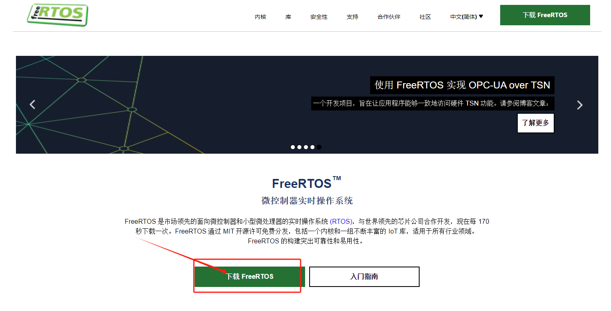

# 1. 移植

* 开发板：正点原子潘多拉开发板，主控STM32L475VET6

## 1.1 源码准备

官方地址：https://www.freertos.org/zh-cn-cmn-s/

下载后的压缩包解压后如下图所示，这里初步移植只需要关心第一个文件夹，里面是FreeRTOS的源码和一些案例。

进入**FreeRTOSv202212.01\FreeRTOS\Source文件夹**，可以看到源码。其中外面的c文件就是源码了，include文件夹中是头文件，portable是一些跟架构等内容相关东西。

## 1.2 新建工程

使用cubemx创建一个实例工程，命名为`FreeRTOS_Demo`，需要配置的配置项如下：

1. 配置时钟
2. 配置调试口
3. 配置个实例LED
4. 配置个串口

然后直接生成工程即可。

在while中添加LED闪烁代码，烧录后查看现象，确保生成的工程可以直接运行。

~~~ c
while (1)
{
    HAL_GPIO_WritePin(GPIOE, GPIO_PIN_7|GPIO_PIN_8|GPIO_PIN_9, GPIO_PIN_RESET);
    HAL_Delay(1000);
    HAL_GPIO_WritePin(GPIOE, GPIO_PIN_7|GPIO_PIN_8|GPIO_PIN_9, GPIO_PIN_SET);
    HAL_Delay(1000);
}
~~~

## 1.3 源码移植

**第一步：创建文件夹**

在工程目录下创建FreeRTOS文件夹，再在此文件夹中分别创建src、port、include文件夹。

~~~ sh
工程文件夹
├─Core
│  ├─Inc
│  └─Src
├─Drivers
│  ├─CMSIS
│  │  ├─Device
│  │  │  └─ST
│  │  │      └─STM32L4xx
│  │  │          ├─Include
│  │  │          └─Source
│  │  │              └─Templates
│  │  └─Include
│  └─STM32L4xx_HAL_Driver
│      ├─Inc
│      │  └─Legacy
│      └─Src
├─FreeRTOS
│  ├─include
│  ├─port
│  └─src
└─MDK-ARM
    ├─DebugConfig
    ├─FreeRTOS_Demo
    └─RTE
        └─_FreeRTOS_Demo
~~~

**第二步：添加文件**

1. 将`FreeRTOSv202212.01\FreeRTOS\Source`文件夹中的所有（七个）C文件，复制到我们创建的src文件夹中。
   1. croutine.c：协程功能。
   2. event_groups.c：事件组。
   3. list.c：核心，必需的。
   4. queue.c：核心，必需的。
   5. stream_buffer.c：流式缓冲区。
   6. tasks.c：核心，必需的。
   7. timers.c：软件定时器。
2. 将`FreeRTOSv202212.01\FreeRTOS\Source\include`文件夹中的所有文件，复制到我们创建的include文件夹中。
3. 将`FreeRTOSv202212.01\FreeRTOS\Source\portable\MemMang`文件夹，复制到我们创建的port文件夹中。
4. 将`FreeRTOSv202212.01\FreeRTOS\Source\portable\RVDS\ARM_CM4F`文件夹，复制到我们创建的port文件夹中。（这里注意，我这里是M4内核的，如果是其他芯片，则选择对应的内核文件夹）
5. 

