使用的开发板：RTT&正点原子的潘多拉loT Board开发板。主控：STM32L475VET6

软件：CubeMX 6.7.0、Keil 5.38、Nano 3.1.5

# 第一部分：工程版本及移植

移植的方式有好多种（任选一种）

1. 基于 Keil MDK 的移植；（最常用的工具）
2. 基于 CubeMX 的移植；（最常用的工具）
3. 基于官方软件 RT-Thread Studio；（自动创建工程，比较方便）

# 1. 使用 Keil MDK 移植

一共需要两步：

1. 创建一份裸机代码；
2. 在 Keil 软件中安装 RT-Thread Nano Pack；
3. 在源工程中添加 RT-Thread Nano 源代码；
4. 适配工作，主要从 中断、时钟、内存这几个方面进行适配，实现移植；
5. 添加LED闪烁例程进行验证；
6. 裁剪内核，通过配置文件 rtconfig.h 实现对系统的裁剪。

> 裸机代码获取：
>
> 1. 这里可以直接使用 CubeMX 生成一份，配置上时钟、调试接口、LED的IO口之后，直接点击生成即可。下面的案例就是使用这种方式生成的。
>
> 2. 也可以按照正点原子的教程，从固件包里面新建一个。
>
>       这两种方法在工程目录上有一点点差距，内容差不多，移植的时候找到对应的地方就可以了。

## 1.1 Nano Pack 安装

RT-Thread Master 的源码可以从https://github.com/RT-Thread/rt-thread下载。

Nano就是从里面扣出来的，去掉了一些组件和各种开发板的BSP，保留了OS的核心功能，但足够我们使用。

### 方式一：手动下载安装

RT-Thread 官方将抠出来的 Nano 作为一个Package放在了KEIL网站：http://www.keil.com/dd2/pack/，打开这条连接，然后拉到下面找到RealThread即可下载。

下载完成之后，直接双击安装即可，路径会自动选择Keil的安装路径。

安装完成之后，在：<u>E:\Keil5 MDK\PACK\RealThread\RT-Thread\3.1.5</u> 路径(Keil的安装路径)下，即可看到下载的源码。

### 方式二：在Keil中安装

1. 打开Keil，点击包安装图标，点击右侧的 Pack，展开 Generic，可以找到 RealThread::RT-Thread；
2. 点击 Action 栏对应的 Install ，就可以在线安装 Nano Pack 了。
3. 另外，如果需要安装其他版本，则需要展开 RealThread::RT-Thread，进行选择。
4. 图中 Remove 代表已经安装了。

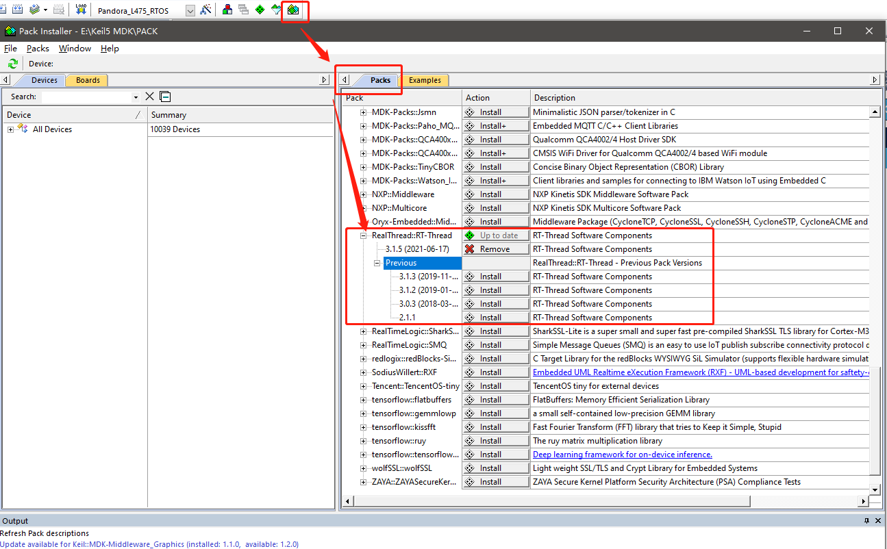

## 1.2 Nano 版本移植

在 Manage Rum-Time Environment 里 "Software Component" 栏找到 RTOS，Variant 栏选择 RT-Thread，然后勾选 kernel，点击 "OK" 就添加 RT-Thread 内核到工程了。

然后在左侧工程栏就可以看到相关代码了。

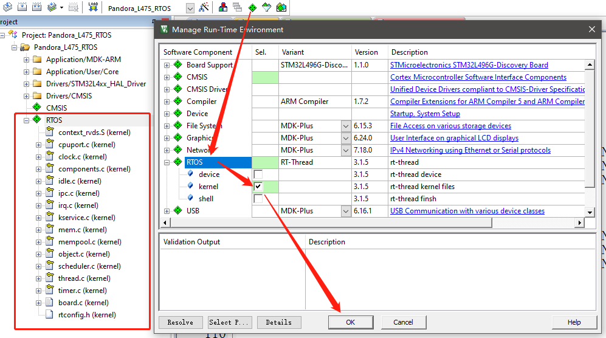

其中的文件包含：

**Cortex-M 芯片内核移植代码**

~~~ markdown
context_rvds.s
cpuport.c
~~~

**Kernel 文件**

~~~ markdown
clock.c
components.c
device.c
idle.c
ipc.c
irq.c
kservice.c
mem.c
mempool.c
object.c
scheduler.c
thread.c
timer.c
~~~

**配置文件**

~~~ markdown
board.c
rtconfig.h
~~~

> 如果不想使用CMSIS添加源码，也可以直接把下载的源码复制到工程中，对照着上面的文件名添加进去即可。注意可能同一个文件所处的位置略微有些差异，其余的部分都是一样的。
>
> 在工程文件夹的 Middlewares 文件夹中创建一个 RT-Thread 文件夹。
>
> * Middlewares/RT-Thread
>   * bsp
>     * _template
>       * board.c
>       * rtconfig.h
>   * components
>     * device（都要保留，后续可能用到）
>       * device.c
>     * finsh（都要保留，第四章用到）
>       * 文件都保留
>   * include（都要保留）
>   * libcpu
>     * arm
>       * cortex-m4
>         * context_rvds.S
>         * cpuport.c
>   * src（都要保留）
>
> 剩下的没提到的都删掉。
>
> 然后在 Keil MDK 内添加文件和头文件即可。后续学习内核的时候，这里用的就是这种方式移植的内核（因为与RTT无关的冗余文件少）。

## 1.3 适配工作

### 1.3.1 中断与异常处理

> RT-Thread 会接管异常处理函数 `HardFault_Handler()` 和悬挂处理函数 `PendSV_Handler()`，这两个函数已由 RT-Thread 实现，所以需要删除工程里中断服务例程文件中的这两个函数，避免在编译时产生重复定义。如果此时对工程进行编译，没有出现函数重复定义的错误，则不用做修改。

在`stm32l4xx_it.c`文件中找到上述两个函数，直接注释掉即可（也可以在使用CubeMX生成代码的时候，直接不生成这部分中断代码）。

### 1.3.2 系统时钟配置

> 在 board.c 中实现 `系统时钟配置`（为 MCU、外设提供工作时钟）与 `os tick ` 的配置 （为操作系统提供心跳 / 节拍）。

在`board.c`文件中修改如下函数，以完成系统初始化和 OS Tick 的配置。

~~~ c
#include "main.h"
extern void SystemClock_Config(void); // 此函数默认是在main.c中，此处声明一下

/* cortex-m 架构使用 SysTick_Handler() */
void SysTick_Handler()
{
  rt_interrupt_enter(); /* 进入中断时必须调用 */

  rt_tick_increase();  /* RT-Thread 系统时钟计数 */

  rt_interrupt_leave(); /* 退出中断时必须调用 */
}

/**
 * This function will initial your board.
 */
void rt_hw_board_init(void)
{
    /* 
     * TODO 1: OS Tick Configuration
     * Enable the hardware timer and call the rt_os_tick_callback function
     * periodically with the frequency RT_TICK_PER_SECOND. 
     */

	  /* 1、系统、时钟初始化 */
	  HAL_Init(); // 初始化 HAL 库
	  SystemClock_Config(); // 配置系统时钟
	  SystemCoreClockUpdate(); // 对系统时钟进行更新
	
	  /* 2、OS Tick 频率配置，RT_TICK_PER_SECOND = 1000 表示 1ms 触发一次中断 */
	  SysTick_Config(SystemCoreClock / RT_TICK_PER_SECOND);
	
	
    /* Call components board initial (use INIT_BOARD_EXPORT()) */
#ifdef RT_USING_COMPONENTS_INIT
    rt_components_board_init();
#endif

#if defined(RT_USING_USER_MAIN) && defined(RT_USING_HEAP)
    rt_system_heap_init(rt_heap_begin_get(), rt_heap_end_get());
#endif
}
~~~

另外，`SysTick_Handler()`函数在裸机工程中应该也有，也需要去`stm32l4xx_it.c`文件中注释掉。

### 1.3.3 内存堆初始化

> 系统内存堆的初始化在 board.c 中的 rt_hw_board_init() 函数中完成
>
> 内存堆功能是否使用取决于宏 RT_USING_HEAP 是否开启（位于`rtconfig.h`中）
>
> 开启系统 heap 将可以使用动态内存功能，如使用 rt_malloc、rt_free 以及各种系统动态创建对象的 API。
>
> 若需要使用系统内存堆功能，则打开 RT_USING_HEAP 宏定义即可，此时内存堆初始化函数 rt_system_heap_init() 将被调用。

如果需要使用动态创建线程等对象，则需要配置。

## 1.4 LED闪烁

在`main.c`中添加如下代码（注意：LED引脚初始化的代码在源代码中已经配置过了）

~~~c
#include <rtthread.h>	// 线程相关

int main(void)
{
  MX_GPIO_Init();

  while (1)
  {
	  HAL_GPIO_WritePin(GPIOE, GPIO_PIN_7, GPIO_PIN_RESET);
	  HAL_GPIO_WritePin(GPIOE, GPIO_PIN_8, GPIO_PIN_RESET);
	  HAL_GPIO_WritePin(GPIOE, GPIO_PIN_9, GPIO_PIN_RESET);
	  rt_thread_mdelay(500);
	  
	  HAL_GPIO_WritePin(GPIOE, GPIO_PIN_7, GPIO_PIN_SET);
	  HAL_GPIO_WritePin(GPIOE, GPIO_PIN_8, GPIO_PIN_SET);
	  HAL_GPIO_WritePin(GPIOE, GPIO_PIN_9, GPIO_PIN_SET);
	  rt_thread_mdelay(500);
  }
}
~~~

注意

1. 这里使用的延时函数是由RTT提供的，此函数引起系统调度，切换到其他线程运行。
2. 这里的main函数中不再执行初始化动作，RTT系统启动时已经做好了。

至此，将工程编译并下载，即可看到LED闪烁了。

## 1.5 裁剪内核

如果对内核的部分功能用不着，可以对其进行裁剪。

裁剪是通过`rtconfig.h`文件进行配置的。具体参照[内核裁剪](#5. 内核配置及裁剪)

先保持默认的，能用就行，后面分析阶段再说。

# 2. 使用 CubeMX 移植

其实和使用 Keil MDK 移植的步骤基本一样，只是添加源代码的过程不一样。

1. 在 CubeMX 软件中安装 RT-Thread Nano pack 安装包；
2. 在 CubeMX 配置界面添加 RT-Thread Nano 源码，然后生成工程；
3. 适配工作，主要从 中断、时钟、内存这几个方面进行适配，实现移植；
4. 添加LED闪烁例程进行验证；
5. 裁剪，通过配置文件 rtconfig.h 实现对系统的裁剪。

## 2.1 Nano Pack 安装

1. 在 CubeMX 中选择完芯片后，点击 Software Packs -> Manage Software Packs；
2. 在弹出的界面下方，点击 From Url 后，弹出新的界面；
3. 在弹出的界面下方。点击 New；
4. 在弹出的输入框中输入：https://www.rt-thread.org/download/cube/RealThread.RT-Thread.pdsc
5. 然后点击 Check，等待检查通过后安装即可。

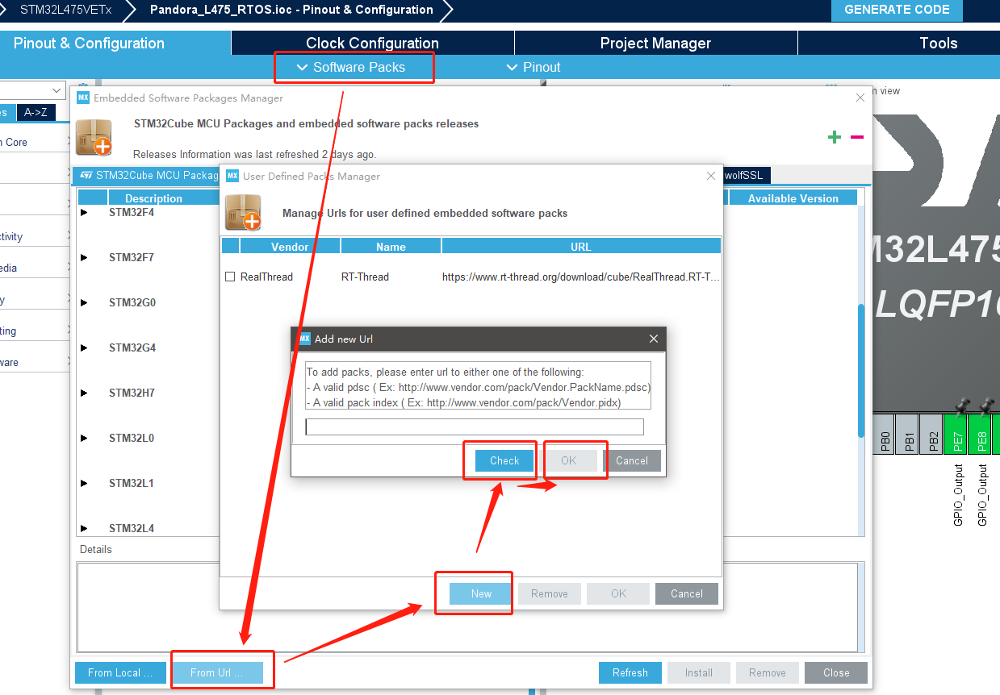

## 2.2 Nano 版本移植

点击 `Softwares Packages`->`Select Components`，进入组件配置界面，选择 `RealThread`， 然后根据需求选择 RT-Thread 组件，然后点击 OK 按钮。

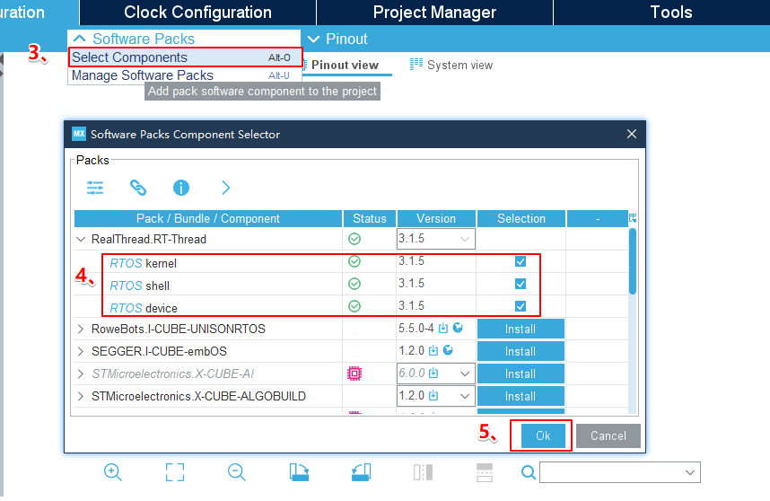

然后在左侧栏对组件和参数进行配置。

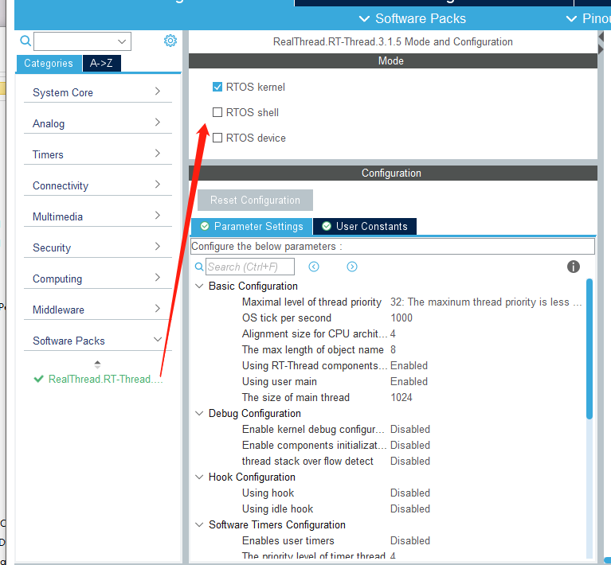

> RT-Thread Nano 软件包中包含 kernel, shell 和 device 三个部分，仅选择 kernel 表示只使用 RT-Thread 内核，工程中会添加内核代码；选择 kernel 与 shell 表示在使用 RT-Thread Nano 的基础上使用 FinSH Shell 组件，工程中会添加内核代码与 FinSH 组件的代码，FinSH 的移植详见 [《在 RT-Thread Nano 上添加控制台与 FinSH》](https://www.rt-thread.org/document/site/#/rt-thread-version/rt-thread-nano/finsh-port/an0045-finsh-port)。再选择 device 表示使用 rt-thread 的 device 框架，用户基于此框架编写外设驱动并注册后，就可以使用 device 统一接口操作外设。

剩下的按照需要的功能进行配置即可（记得把串口加上，否则后面`board.c`中的串口初始化会报错，如果用不到串口可以不用配置，把其中串口初始化报错的部分注释掉就行，后面还会有用）。

## 2.3 适配工作

### 2.3.1 中断与异常处理

RT-Thread 操作系统重定义 `HardFault_Handler`、`PendSV_Handler`、`SysTick_Handler` 中断函数，为了避免重复定义的问题，在生成工程之前，需要在中断配置中，代码生成的选项中，取消选择三个中断函数（对应注释选项是 `Hard fault interrupt`, `Pendable request`, `Time base :System tick timer`），最后点击生成代码，具体操作如下图 所示：

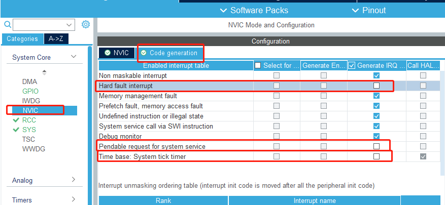

> 和使用 Keil MDK 不同的是，这里直接不让生成就好了，而不是生成了重新注释。
>
> 当然，使用 Keil MDK 创建源工程的时候，也可以不生成，就不用再注释了。

### 2.3.2 系统时钟配置

使用 CubeMX的话，生成的代码其实已经配置好了。

可以对比 1.3.2 小节的代码看一看。

### 2.3.3 内存堆初始化

同 1.3.3 小节。

> 这里注意，生成的工程目录中有个：RT-Thread 文件夹。里面只有一个`rtconfig.h`文件。
>
> 但是生成的工程中，没有包含这个文件夹，所以会发现根本找不到配置文件。
>
> 因此需要在工程中对其进行添加，并添加头文件路径（如果有就算了），如下图所示。

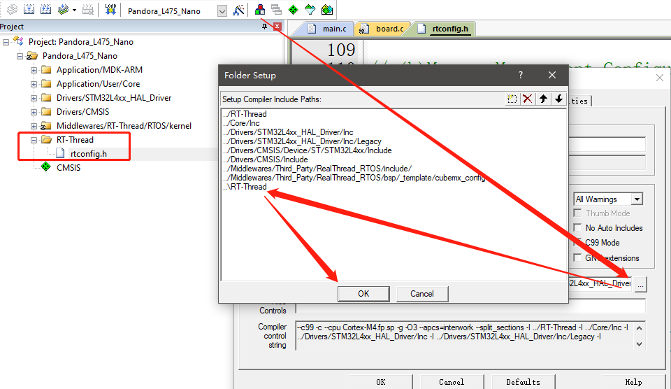

## 2.4 LED闪烁

在`main.c`文件的while中添加如下代码（注意：LED引脚初始化的代码在源代码中已经配置过了）

~~~c
while (1)
{
	  HAL_GPIO_WritePin(GPIOE, GPIO_PIN_7, GPIO_PIN_RESET);
	  HAL_GPIO_WritePin(GPIOE, GPIO_PIN_8, GPIO_PIN_RESET);
	  HAL_GPIO_WritePin(GPIOE, GPIO_PIN_9, GPIO_PIN_RESET);
	  rt_thread_mdelay(500);
	  
	  HAL_GPIO_WritePin(GPIOE, GPIO_PIN_7, GPIO_PIN_SET);
	  HAL_GPIO_WritePin(GPIOE, GPIO_PIN_8, GPIO_PIN_SET);
	  HAL_GPIO_WritePin(GPIOE, GPIO_PIN_9, GPIO_PIN_SET);
	  rt_thread_mdelay(500);
}
~~~

> main函数中的`HAL_Init()`、`SystemClock_Config();`在我们配置系统时钟（2.3.2小节）时已经初始化过了，因此在main函数中其实不用初始化了，可以选择注释掉，但是每次生成工程都还要重新注释。

注意

1. 这里使用的延时函数是由RTT提供的，此函数引起系统调度，切换到其他线程运行。
2. 这里的main函数中不再执行初始化动作，RTT系统启动时已经做好了。

至此，将工程编译并下载，即可看到LED闪烁了。

## 2.5 裁剪内核

如果对内核的部分功能用不着，可以对其进行裁剪。

裁剪是通过`rtconfig.h`文件进行配置的。具体参照[内核裁剪](#5. 内核配置及裁剪)

先保持默认的，能用就行，后面分析阶段再说。

# 3. 使用 RT-Thread Studio 创建

直接创建 nano 工程即可。

# 4. 移植 FinSH

这里移植 FinSH 主要有两种目的。

1. 基础功能：实现打印，用来向控制台对接的终端输出打印信息。
2. 移植 FinSH 组件：命令输入，用以在控制台输入命令调试系统。

如果只需要第一个功能，则只需要实现两个函数，串口初始化和系统输出函数，即可完成 UART 控制台打印功能。

如果还需要第二个功能，则在上述基础上还需要添加 FinSH 组件源码，并再对接一个系统输入函数即可实现。

 ## 4.1 打印功能

如果使用的是 CubeMX 移植的代码，其实已经在`board.c`中默认配置好了（2.2小节的最后一段话有提到），如下图所示。

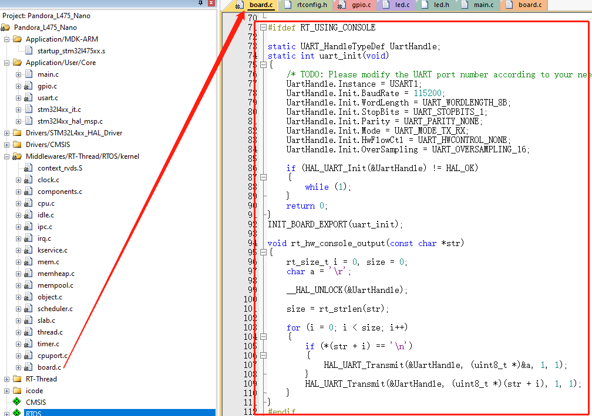

> 只需要确认这里使用的串口是不是自己实际对应的串口即可。

而如果使用的是 Keil 配置的 Nano，则如下图所示给预留了位置。

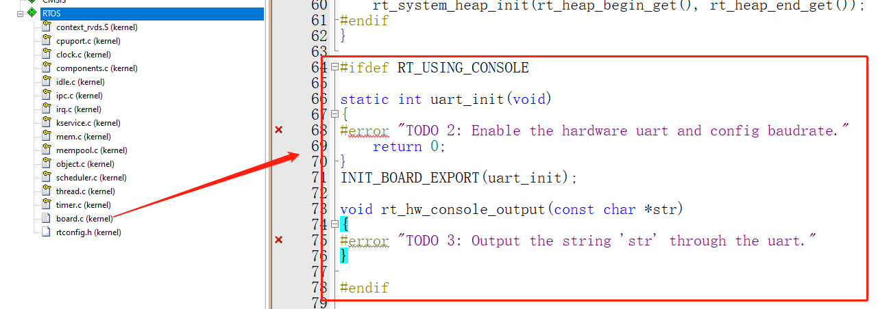

把上面的抄过来就好了

~~~ c
#ifdef RT_USING_CONSOLE

static UART_HandleTypeDef UartHandle;
static int uart_init(void)
{
    /* TODO: Please modify the UART port number according to your needs */
    UartHandle.Instance = USART1;
    UartHandle.Init.BaudRate = 115200;
    UartHandle.Init.WordLength = UART_WORDLENGTH_8B;
    UartHandle.Init.StopBits = UART_STOPBITS_1;
    UartHandle.Init.Parity = UART_PARITY_NONE;
    UartHandle.Init.Mode = UART_MODE_TX_RX;
    UartHandle.Init.HwFlowCtl = UART_HWCONTROL_NONE;
    UartHandle.Init.OverSampling = UART_OVERSAMPLING_16;

    if (HAL_UART_Init(&UartHandle) != HAL_OK)
    {
        while (1);
    }
    return 0;
}
INIT_BOARD_EXPORT(uart_init);

void rt_hw_console_output(const char *str)
{
    rt_size_t i = 0, size = 0;
    char a = '\r';

    __HAL_UNLOCK(&UartHandle);

    size = rt_strlen(str);

    for (i = 0; i < size; i++)
    {
        if (*(str + i) == '\n')
        {
            HAL_UART_Transmit(&UartHandle, (uint8_t *)&a, 1, 1);
        }
        HAL_UART_Transmit(&UartHandle, (uint8_t *)(str + i), 1, 1);
    }
}
#endif
~~~

> 初始化函数`uart_init()`的执行，是利用的`INIT_BOARD_EXPORT(uart_init);`语句。
>
> 可以查看官网对自动初始化机制的介绍。

然后，在main函数中添加使用到打印函数`rt_kprintf()`的语句。

~~~ c
// 这里放到了 mian 函数中的 while 之前
rt_uint32_t count = 0;
for (count = 0; count < 10 ; count++)
{
    rt_kprintf("count: %d\n", count);
    rt_thread_mdelay(500);
}
~~~

编译并下载至开发板，打开串口调试工具并复位开发板，即可看到串口输出。

## 4.2 移植 FinSH 组件

如果需要移植 FinSH 组件，在完成打印功能之后，还需要：

1. 在工程中添加 FinSH 源码。
2. 实现函数对接。

添加 FinSH 源码的方式和 添加 Nano 的方式一样，只需要把 shell 也勾选上即可。

如果使用 CubeMX 添加 FinSH 源码，重新生成工程后，会在工程目录多出如下几个文件。

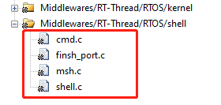

然后，在`rtconfig.h`中打开**#include "finsh_config.h"**。

> 注意：在`finsh_port.c`文件中，#error Please uncomment the line <#include "finsh_config.h"> in the rtconfig.h  这一行需要注释掉。

而在`board.c`中可以看到，相关函数已经默认写好了。

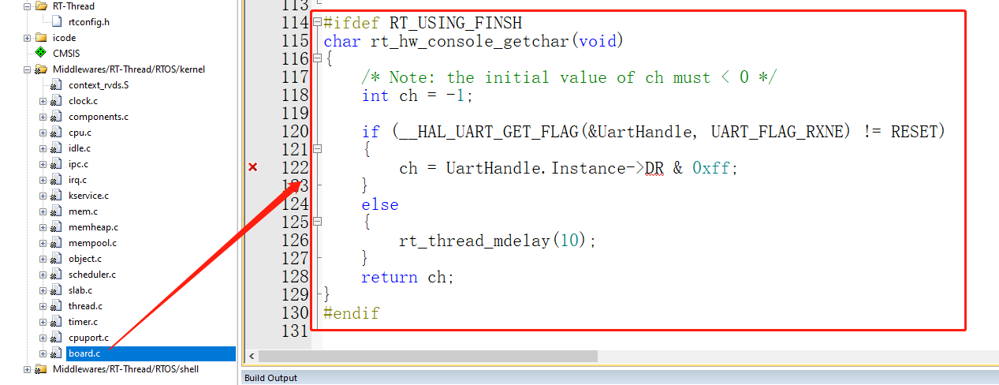

**但是，这里的 DR 会报错，因为有些芯片这个寄存器的名字为DR，有的为RDR。这里将 DR 改为 RDR 即可。**

而如果使用的是 Keil MDK 添加的源码。则会在工程目录多出几个文件。

同样的，添加之后，需要在`rtconfig.h`文件中打开**#include "finsh_config.h"**。

然后`finsh_port.c`文件中可以看到上面的接口，也是一样的，用这种方式的话，把上面的抄过来就好了。

这个是 RT-Thread 官网给的示例，直接抄上面的也行

~~~ c
#ifdef RT_USING_FINSH
char rt_hw_console_getchar(void)
{
    int ch = -1;

    if (__HAL_UART_GET_FLAG(&UartHandle, UART_FLAG_RXNE) != RESET)
    {
        ch = UartHandle.Instance->RDR & 0xff;
    }
    else
    {
        if(__HAL_UART_GET_FLAG(&UartHandle, UART_FLAG_ORE) != RESET)
        {
            __HAL_UART_CLEAR_OREFLAG(&UartHandle);
        }
        rt_thread_mdelay(10);
    }
    return ch;
}
#endif
~~~

可以发现，其实两种方法做的事情是一样的，最后除了`rt_hw_console_getchar`函数的位置不同，其他的基本都一样。

然后就可以测试了。使用串口助手。

1. 不勾选发送新行，输入h，点击发送
2. 不勾选发送新行，输入e，点击发送
3. 不勾选发送新行，输入l，点击发送
4. 不勾选发送新行，输入p，点击发送
5. 什么也不输，勾选发送新行，点击发送。 

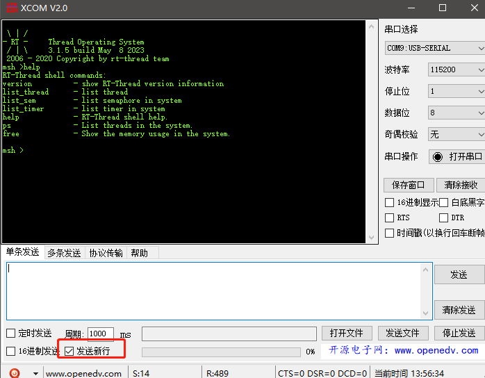

显然，这种查询的方式很沙雕。

## 4.3 更改中断方式

这种查询的方式显然很不对，因此进一步将其更改为中断方式。

官网有所有需要添加的代码，按照自己的习惯放到某个位置就好。

~~~ c
/* 第一部分：ringbuffer 实现部分 */
#include <rtthread.h>
#include <string.h>

#define rt_ringbuffer_space_len(rb) ((rb)->buffer_size - rt_ringbuffer_data_len(rb))

struct rt_ringbuffer
{
    rt_uint8_t *buffer_ptr;

    rt_uint16_t read_mirror : 1;
    rt_uint16_t read_index : 15;
    rt_uint16_t write_mirror : 1;
    rt_uint16_t write_index : 15;

    rt_int16_t buffer_size;
};

enum rt_ringbuffer_state
{
    RT_RINGBUFFER_EMPTY,
    RT_RINGBUFFER_FULL,
    /* half full is neither full nor empty */
    RT_RINGBUFFER_HALFFULL,
};

rt_inline enum rt_ringbuffer_state rt_ringbuffer_status(struct rt_ringbuffer *rb)
{
    if (rb->read_index == rb->write_index)
    {
        if (rb->read_mirror == rb->write_mirror)
            return RT_RINGBUFFER_EMPTY;
        else
            return RT_RINGBUFFER_FULL;
    }
    return RT_RINGBUFFER_HALFFULL;
}

/**
 * get the size of data in rb
 */
rt_size_t rt_ringbuffer_data_len(struct rt_ringbuffer *rb)
{
    switch (rt_ringbuffer_status(rb))
    {
    case RT_RINGBUFFER_EMPTY:
        return 0;
    case RT_RINGBUFFER_FULL:
        return rb->buffer_size;
    case RT_RINGBUFFER_HALFFULL:
    default:
        if (rb->write_index > rb->read_index)
            return rb->write_index - rb->read_index;
        else
            return rb->buffer_size - (rb->read_index - rb->write_index);
    };
}

void rt_ringbuffer_init(struct rt_ringbuffer *rb,
                        rt_uint8_t           *pool,
                        rt_int16_t            size)
{
    RT_ASSERT(rb != RT_NULL);
    RT_ASSERT(size > 0);

    /* initialize read and write index */
    rb->read_mirror = rb->read_index = 0;
    rb->write_mirror = rb->write_index = 0;

    /* set buffer pool and size */
    rb->buffer_ptr = pool;
    rb->buffer_size = RT_ALIGN_DOWN(size, RT_ALIGN_SIZE);
}

/**
 * put a character into ring buffer
 */
rt_size_t rt_ringbuffer_putchar(struct rt_ringbuffer *rb, const rt_uint8_t ch)
{
    RT_ASSERT(rb != RT_NULL);

    /* whether has enough space */
    if (!rt_ringbuffer_space_len(rb))
        return 0;

    rb->buffer_ptr[rb->write_index] = ch;

    /* flip mirror */
    if (rb->write_index == rb->buffer_size-1)
    {
        rb->write_mirror = ~rb->write_mirror;
        rb->write_index = 0;
    }
    else
    {
        rb->write_index++;
    }

    return 1;
}
/**
 * get a character from a ringbuffer
 */
rt_size_t rt_ringbuffer_getchar(struct rt_ringbuffer *rb, rt_uint8_t *ch)
{
    RT_ASSERT(rb != RT_NULL);

    /* ringbuffer is empty */
    if (!rt_ringbuffer_data_len(rb))
        return 0;

    /* put character */
    *ch = rb->buffer_ptr[rb->read_index];

    if (rb->read_index == rb->buffer_size-1)
    {
        rb->read_mirror = ~rb->read_mirror;
        rb->read_index = 0;
    }
    else
    {
        rb->read_index++;
    }

    return 1;
}

/* 第二部分：finsh 移植对接部分 */
#define UART_RX_BUF_LEN 16
rt_uint8_t uart_rx_buf[UART_RX_BUF_LEN] = {0};
struct rt_ringbuffer  uart_rxcb;         /* 定义一个 ringbuffer cb */
static UART_HandleTypeDef UartHandle;
static struct rt_semaphore shell_rx_sem; /* 定义一个静态信号量 */

/* 初始化串口，中断方式 */
static int uart_init(void)
{
    /* 初始化串口接收 ringbuffer  */
    rt_ringbuffer_init(&uart_rxcb, uart_rx_buf, UART_RX_BUF_LEN);

    /* 初始化串口接收数据的信号量 */
    rt_sem_init(&(shell_rx_sem), "shell_rx", 0, 0);

    /* 初始化串口参数，如波特率、停止位等等（cubemx生成的） */
    UartHandle.Instance = USART1;
    UartHandle.Init.BaudRate   = 115200;
    UartHandle.Init.HwFlowCtl  = UART_HWCONTROL_NONE;
    UartHandle.Init.Mode       = UART_MODE_TX_RX;
    UartHandle.Init.OverSampling = UART_OVERSAMPLING_16;
    UartHandle.Init.WordLength = UART_WORDLENGTH_8B;
    UartHandle.Init.StopBits   = UART_STOPBITS_1;
    UartHandle.Init.Parity     = UART_PARITY_NONE;

    /* 初始化串口引脚等 */
    if (HAL_UART_Init(&UartHandle) != HAL_OK)
    {
        while (1);
    }

    /* 中断配置 */
	HAL_NVIC_SetPriority(USART1_IRQn, 1, 1);			// 设置优先级
	HAL_NVIC_EnableIRQ(USART1_IRQn);					// 开启中断
	__HAL_UART_ENABLE_IT(&UartHandle, UART_IT_RXNE);	// 使能中断

    return 0;
}
INIT_BOARD_EXPORT(uart_init);

/* 移植控制台，实现控制台输出, 对接 rt_hw_console_output */
void rt_hw_console_output(const char *str)
{
    rt_size_t i = 0, size = 0;
    char a = '\r';

    __HAL_UNLOCK(&UartHandle);

    size = rt_strlen(str);
    for (i = 0; i < size; i++)
    {
        if (*(str + i) == '\n')
        {
            HAL_UART_Transmit(&UartHandle, (uint8_t *)&a, 1, 1);
        }
        HAL_UART_Transmit(&UartHandle, (uint8_t *)(str + i), 1, 1);
    }
}

/* 移植 FinSH，实现命令行交互, 需要添加 FinSH 源码，然后再对接 rt_hw_console_getchar */
/* 中断方式 */
char rt_hw_console_getchar(void)
{
    char ch = 0;

    /* 从 ringbuffer 中拿出数据 */
    while (rt_ringbuffer_getchar(&uart_rxcb, (rt_uint8_t *)&ch) != 1)
    {
        rt_sem_take(&shell_rx_sem, RT_WAITING_FOREVER);
    }
    return ch;
}

/* uart 中断 */
void USART1_IRQHandler(void)
{
    int ch = -1;
    /* enter interrupt */
    rt_interrupt_enter();          // 在中断中一定要调用这对函数，进入中断

    if ((__HAL_UART_GET_FLAG(&(UartHandle), UART_FLAG_RXNE) != RESET) &&
        (__HAL_UART_GET_IT_SOURCE(&(UartHandle), UART_IT_RXNE) != RESET))
    {
        while (1)
        {
            ch = -1;
            if (__HAL_UART_GET_FLAG(&(UartHandle), UART_FLAG_RXNE) != RESET)
            {
                ch =  UartHandle.Instance->RDR & 0xff;
            }
            if (ch == -1)
            {
                break;
            }
            /* 读取到数据，将数据存入 ringbuffer */
            rt_ringbuffer_putchar(&uart_rxcb, ch);
        }
        rt_sem_release(&shell_rx_sem);
    }

    /* leave interrupt */
    rt_interrupt_leave();    // 在中断中一定要调用这对函数，离开中断
}
~~~

之后，再次测试时，直接输入 help 并发送即可有同样的效果。

> CubeMX 生成的中断处理函数中的回调函数可以屏蔽掉。

# 5. 内核配置及裁剪

`rtconfig.c`文件内容如下

~~~ c
/* RT-Thread config file */

#ifndef __RTTHREAD_CFG_H__
#define __RTTHREAD_CFG_H__

/* ********************** 基础部分 *************************/
/* 设置系统最大优先级，可设置范围 8 到 256，默认值 32 */
#define RT_THREAD_PRIORITY_MAX 32

/* 设置 RT-Thread 操作系统节拍，表示多少 tick 每秒 */
/* 时钟节拍率越快，系统的额外开销就越大。常用值为 100 或 1000。 */
#define RT_TICK_PER_SECOND 1000

/* 字节对齐时设定对齐的字节个数，默认 4，常使用 ALIGN(RT_ALIGN_SIZE) 进行字节对齐 */
#define RT_ALIGN_SIZE 4

/* 设置对象名称的最大长度，默认 8 个字符，一般无需修改 */
#define RT_NAME_MAX 8

/* 设置使用组件自动初始化功能，默认需要使用，开启该宏则可以使用自动初始化功能 */
#define RT_USING_COMPONENTS_INIT

/* 开启 RT_USING_USER_MAIN 宏，则打开 user_main 功能，默认需要开启，这样才能调用 RT-Thread 的启动代码 */
/* main 线程的栈大小可修改 */
#define RT_USING_USER_MAIN
#define RT_MAIN_THREAD_STACK_SIZE 1024

/* ********************** 内核调试部分 *************************/
/* 定义 RT_DEBUG 宏则开启 debug 模式。若开启系统调试，则在实现打印之后可以打印系统 LOG 日志。请在代码开发与调试过程中打开该项，帮助调试定位问题，在代码发布时关闭该项 */
//#define RT_DEBUG					// 关闭 debug
#define RT_DEBUG_INIT 0				// 启用组件初始化调试配置，设置为 1 则会打印自动初始化的函数名称
//#define RT_USING_OVERFLOW_CHECK	// 关闭栈溢出检查

/* ********************** 钩子函数部分 *************************/
/* 设置是否使用钩子函数，默认关闭 */
//#define RT_USING_HOOK			// 是否 开启系统钩子功能
//#define RT_USING_IDLE_HOOK	// 是否 开启空闲线程钩子功能

/* ********************** 软件定时器部分 *************************/
/* 设置是否启用软件定时器，以及相关参数的配置，默认关闭 */
//#define RT_USING_TIMER_SOFT			// 是否 开启软件定时器功能
#define RT_TIMER_THREAD_PRIO 4			// 设置软件定时器线程的优先级，默认为 4
#define RT_TIMER_THREAD_STACK_SIZE 512	// 设置软件定时器线程的栈大小，默认为 512 字节

/* ********************** IPC 部分 *************************/
/* 系统支持的 IPC 有：信号量、互斥量、事件集、邮箱、消息队列。通过定义相应的宏打开或关闭该 IPC 的使用 */
#define RT_USING_SEMAPHORE		// 设置是否使用 信号量，默认打开
//#define RT_USING_MUTEX		// 设置是否使用 互斥量
//#define RT_USING_EVENT		// 设置是否使用 事件集
//#define RT_USING_MAILBOX		// 设置是否使用  邮箱
//#define RT_USING_MESSAGEQUEUE	// 设置是否使用 消息队列

/* ********************** 内存部分 *************************/
/* RT-Thread 内存管理包含：内存池、内存堆、小内存算法。通过开启相应的宏定义使用相应的功能 */
#define RT_USING_HEAP			// 是否使用 内存堆
#define RT_USING_SMALL_MEM		// 是否使用 小内存管理
//#define RT_USING_TINY_SIZE	// 是否使用 小体积的算法，牵扯到 rt_memset、rt_memcpy 所产生的体积

/* ********************** FinSH 部分 *************************/
#define RT_USING_CONSOLE			// 开启控制台功能，失能该宏则关闭控制台，不能实现打印
#define RT_CONSOLEBUF_SIZE 128		// 控制台缓冲大小（1-1024）
/* 当系统加入 FinSH 组件源码后，需要在 rtconfig.h 中开启以下项。参考 finsh_config.h 中内容。若未加入 FinSH 组件源码，请勿开启此项。 */
#include "finsh_config.h"

/* ********************** device 部分 *************************/
/* 当系统中加入 device 框架源码时，则需要在 rtconfig.h 中开启以下项。若未加入 device 源码，请勿开启此项 */
//#define RT_USING_DEVICE

#endif
~~~

`finsh_config.h`内容如下

~~~ c
/* FinSH config file */

#ifndef __MSH_CFG_H__
#define __MSH_CFG_H__

/* 打开 FinSH 组件 */
#define RT_USING_FINSH

/* 使用 MSH 模式 */
#define FINSH_USING_MSH
#define FINSH_USING_MSH_ONLY

/* tshell 线程的优先级与线程栈大小 */
#define FINSH_THREAD_PRIORITY       21		// 请检查系统最大优先级的值，该值必须在系统支持的优先级范围之内
#define FINSH_THREAD_STACK_SIZE     1024

/* 使用符号表，使用命令描述 */
#define FINSH_USING_SYMTAB
#define FINSH_USING_DESCRIPTION

#endif
~~~

