* 开发平台：RT-Thread Studio
* 开发板：潘多拉 STM32L475VET6、战舰板 STM32F103ZET6
* RTThread版本：4.0.3
* 芯片包版本：0.1.9（F1、F4、L4的都是）

# 一. 创建工程及时钟

## 1.1 创建工程

文件 -> 新建 -> RT-Thread 项目。

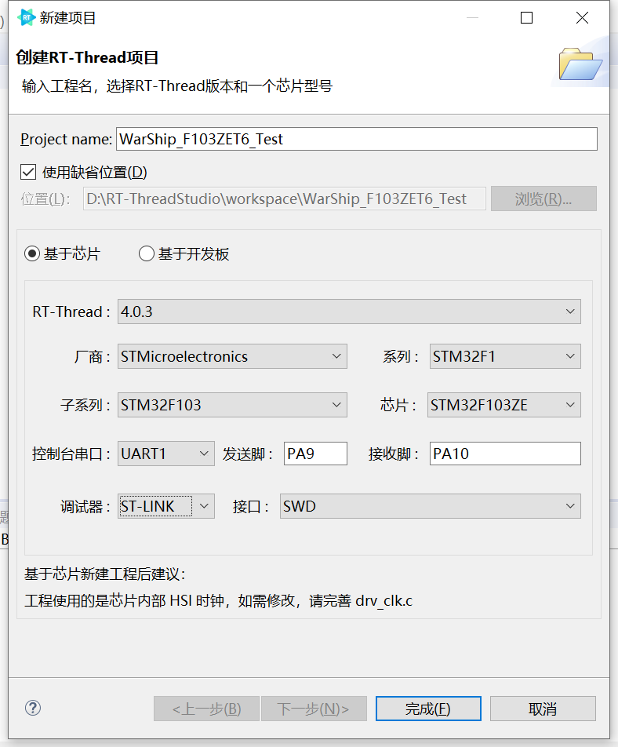

创建工程后，直接编译，无报错和警告

> 如果这个时候直接编译不通过的，在包管理器中降低芯片包的版本，不要用最新的，最新的更多会适配高版本的rtthread，比如为了适配4.1.1而新发的芯片包。（L4芯片的就有这个问题）

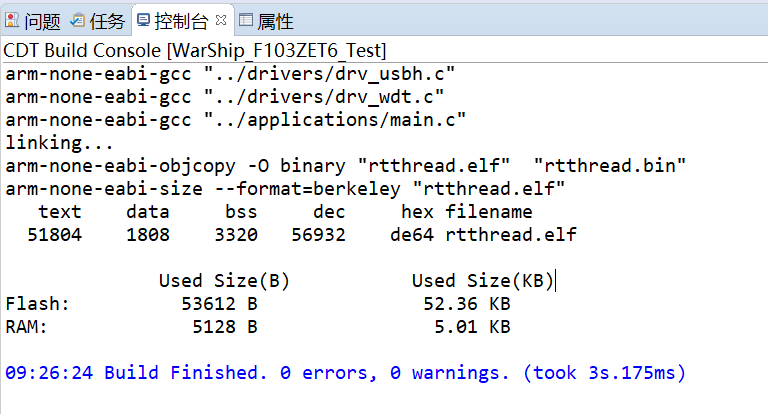

下载至开发板

打开串口助手可以看到内容输出。

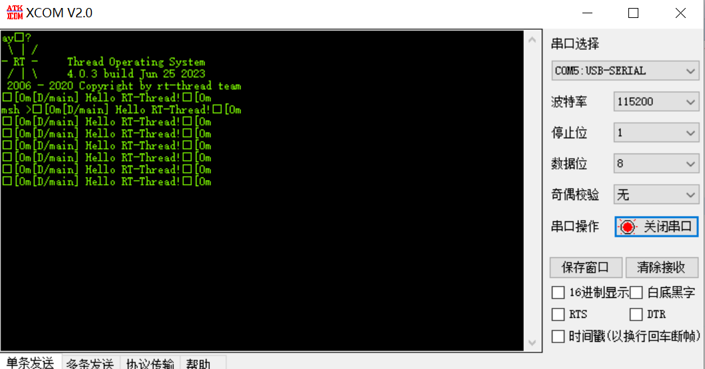

## 1.2 时钟分析

根据提示，默认使用的是内部时钟，如果需要修改，请修改`drv_clk.c`文件。

分析一下，根据启动文件，可以梳理一下启动过程。

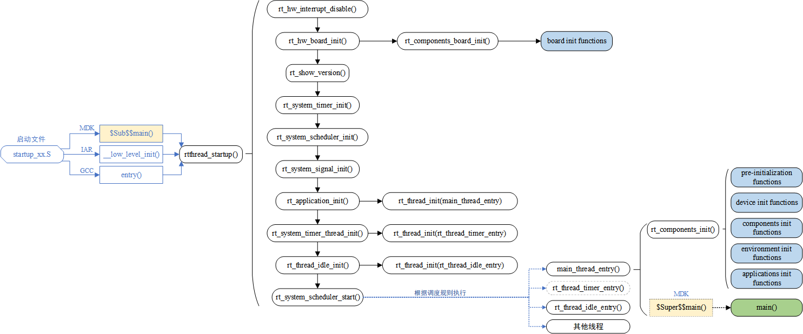

从这里启动

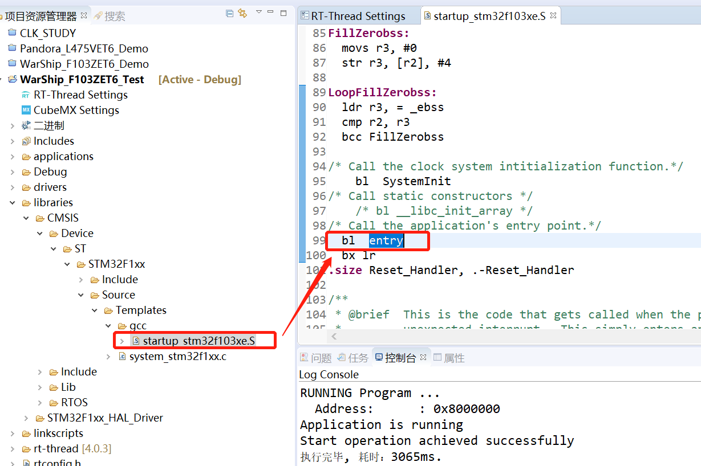

然后在 rt-thread -> src -> components.c 文件中能看到包含`int entry(void)`在内的所有初始化函数。

从`int entry(void);`函数中进入`rtthread_startup();`函数，再从中进入`rt_hw_board_init();`函数，再从中进入`hw_board_init(BSP_CLOCK_SOURCE, BSP_CLOCK_SOURCE_FREQ_MHZ, BSP_CLOCK_SYSTEM_FREQ_MHZ);`函数。

> 这里面传入的参数是定义在 board.h 文件中的，默认如下：
>
> /*-------------------------- CLOCK CONFIG BEGIN --------------------------*/
>
> #define BSP_CLOCK_SOURCE                  ("HSI")
> #define BSP_CLOCK_SOURCE_FREQ_MHZ         ((int32_t)0)
> #define BSP_CLOCK_SYSTEM_FREQ_MHZ         ((int32_t)80)
>
> /*-------------------------- CLOCK CONFIG END --------------------------*/
>
> 但是，继续往下翻下去，发现传入的这几个参数根本没用。

再从中进去`clk_init(clock_src, clock_src_freq, clock_target_freq);`函数。这个函数就定义在`drv_clk.c`文件中。

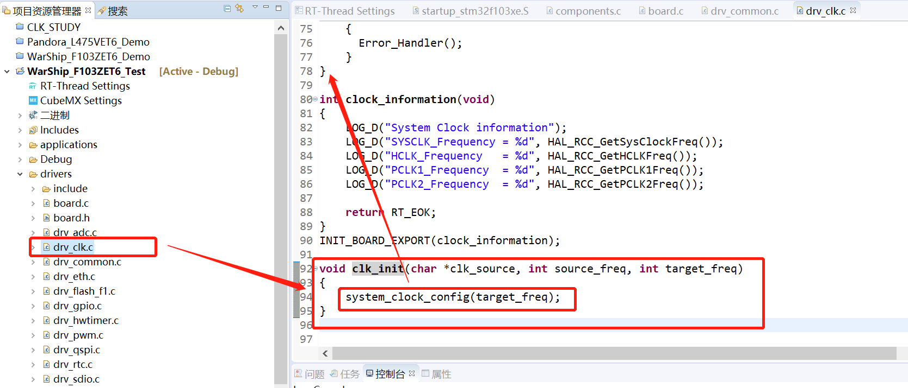

该函数又调用了`system_clock_config(target_freq);`函数，该函数内容如下，这里的时钟配置为默认使用的内部高速时钟。

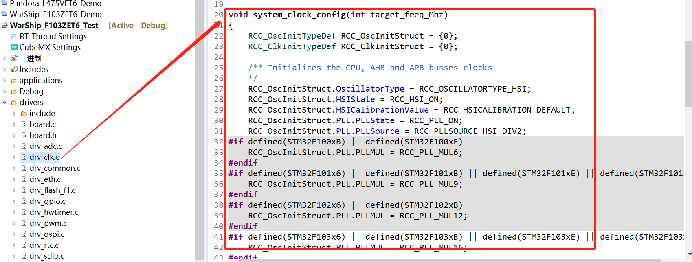

可以看出，最后这里是时钟初始化的地方。需要修改时钟只需要修改此函数即可。

> 可以看出，board.h中的那几个宏定义在传参的过程中，最后也没传过来。（即 没用）

## 1.3 时钟配置

最简单的配置时钟的方法还是，使用cubemx生成一个。

从左侧打开cubemx窗口，然后配置上调试接口、时钟树、**串口**，然后选择makefile，直接生成工程，其他的都没有改动。生成完毕之后，**然后关闭cubemx界面（后续都是关闭界面之后才生效，就不再写了）**，在左边可以看到cubemx文件夹。

> 注意：
>
> 1. 串口的配置，打开就行，具体的参数可以不用管其实。
> 2. 如果没看到这个文件夹，就鼠标在工程栏选中工程，然后右键刷新一下。

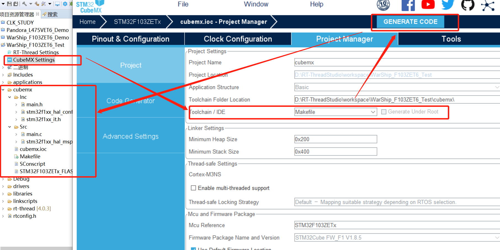

生成完成之后还会有提示有个文件被重命名了。

> 如果没弹出来，注意cubemx界面是否关掉了。一定要关掉才可以。
>
> 点击cubemx的时候，有时候会不小心点到多次，打开了两个cubemx界面，都要关掉才行。

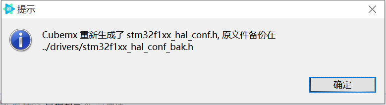

因为cubemx根据你的配置重新生成了一份配置文件，所以原有的那一份就给你换了个名字做备份。**而且后续每次使用cubemx生成代码后，该文件中的宏定义会自动打开，就不用手动打开了**。

> 为什么在上面的配置中需要勾选串口，是因为，默认的配置文件中是打开了串口的定义的，但是使用cubemx重新生成的话，不勾选串口，生成的配置文件中不会自动添加使用串口的宏定义。

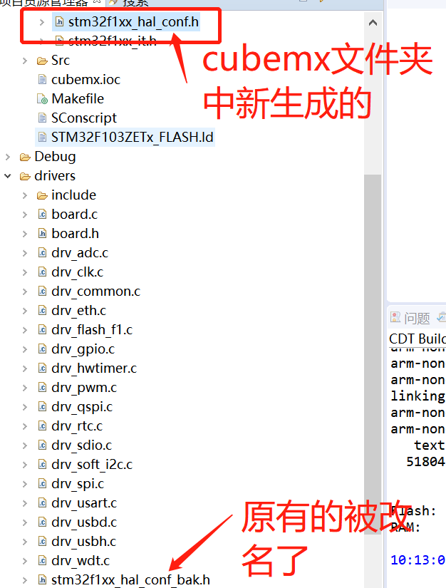

另外，再次打开上面提到的`drv_clk.c`文件查看`clk_init`函数。

可以发现使用cubemx生成之后，这个函数被自动更改了，提示我们这个函数现在使用的是cubemx生成的内容了。而且此时跟随`SystemClock_Config();`函数定义的位置，可以发现，它会跳到cubemx生成的那个`main.c`文件中的时钟初始化部分，即调用的是新生成的时钟初始化函数。

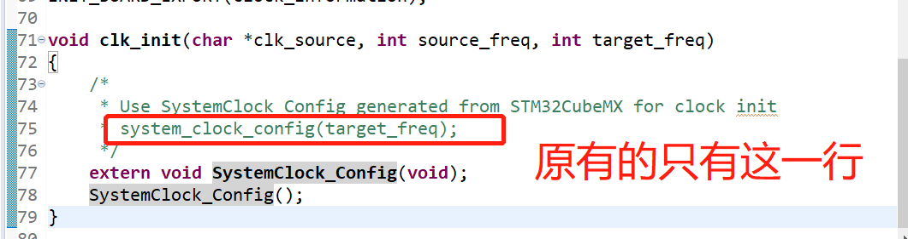

而且，在cubemx生成的main.c文件中的main函数中，在定义的前面自动加了**__WEAK**标识。

然后，点击编译，应该也是可以通过的，无错误无警告。

> 如果有串口相关错误：检查cubemx是否打开了串口一的配置（SHELL默认用的串口一，但是实际上随便勾选一个串口，让cubemx把串口的头文件打开就行了，具体的引脚初始化函数其实没用到）

# 二. 设备框架使用

以下并不一定是按照从简单到麻烦的顺序来的。

## 2.1 PIN设备

pin设备默认是开启的，直接使用即可。

### 2.1.1 LED闪烁

在工程中新建一个文件夹，在文件夹中新建一个`.c`文件，添加以下内容。

编译下载后，在Shell窗口输入`led_thread_test`命令，可以看到两个LED闪烁。

~~~ c
/*
 * 程序清单：这是一个 pin 设备使用例程
 * 例程导出了 led_thread_test 命令到控制终端
 * 命令调用格式：led_thread_test
 * 程序功能：运行后两个led闪烁，闪烁时间间隔分别为1s和2s
*/

#include <rtdevice.h>
#include "drv_common.h"
#include <rtthread.h>

// 线程函数体需要传入的参数
typedef struct
{
    rt_uint32_t flash_ms;
    rt_uint8_t led_index;
}Parameter_struct;

// 线程相关参数
#define THREAD_PRIORITY         25
#define THREAD_STACK_SIZE       512
#define THREAD_TIMESLICE        5

// LED引脚定义
#define LED0_PIN    GET_PIN(B, 5)
#define LED1_PIN    GET_PIN(E, 5)

// LED编号
#define LED0    0
#define LED1    1

// 定义LED0的参数结构体
Parameter_struct Parameter0_struct =
{
    .flash_ms = 1000,
    .led_index = LED0,
};

// 定义LED1的参数结构体
Parameter_struct Parameter1_struct =
{
    .flash_ms = 2000,
    .led_index = LED1,
};

/* led_test：动态创建线程
 * 1. 定义一个 线程结构体指针      这里命名为：led_thread
 * 2. 编写一个 线程函数体          这里命名为：led_thread_entry
 * 3. 调用 rt_thread_create 创建一个线程
 * 4. 调用 rt_thread_startup 启动线程
 */
static rt_thread_t led_thread = NULL;

/**
 * @brief   LED闪烁线程函数体
 *
 * @param   flash_ms     闪烁间隔时间，单位毫秒
 * @param   led_index    led编号，0/1
 *
 * @return  none
 *
 * @note    static防止和其他文件中的重名；此线程不会终止。
 */
static void led_thread_entry (void *parameter)
{
    // 接收传过来的参数
    Parameter_struct *in_parameter = (Parameter_struct *)parameter;
    // rt_kprintf("in_flash_ms = %d, in_led_index = %d \n", in_parameter->flash_ms, in_parameter->led_index);

    // 反转使用
    rt_uint32_t count = 0;
    while(1)
    {
        // 判断LED编号
        switch(in_parameter->led_index)
        {
            case LED0:
                rt_kprintf("led0 flash \n");
                rt_pin_write(LED0_PIN, count % 2);
                break;

            case LED1:
                rt_kprintf("led1 flash \n");
                rt_pin_write(LED1_PIN, count % 2);
                break;

            default:
                rt_kprintf("please enter the correct LED index.(0/1) \n");
        }
        count++;
        rt_thread_mdelay(in_parameter->flash_ms);
    }
}

static int led_thread_test(void)
{
    // LED模式初始化
    rt_pin_mode(LED0_PIN, PIN_MODE_OUTPUT);
    rt_pin_mode(LED1_PIN, PIN_MODE_OUTPUT);
    rt_pin_write(LED0_PIN, 1);
    rt_pin_write(LED1_PIN, 1);

    /* led0：动态创建线程 start */
    if(Parameter0_struct.flash_ms != 0)
    {
        led_thread = rt_thread_create("led0_th",                        // name
                                        led_thread_entry,               // 函数体入口
                                        (void*)&Parameter0_struct,      // 函数体 参数
                                        THREAD_STACK_SIZE,              // 分配内存大小
                                        THREAD_PRIORITY,                // 优先级
                                        THREAD_TIMESLICE);              // 时间片大小
        /* 如果获得线程控制块，启动这个线程 */
        if (led_thread != RT_NULL)
            rt_thread_startup(led_thread);    // 启动线程
        else
        {
            // 输出错误码
            rt_kprintf("led0 flash thread is failed...the error code is %ld \r\n", led_thread->error);
        }
    }
    /* led0：over  */

    led_thread = RT_NULL;

    /* led1：动态创建线程 start */
    if(Parameter1_struct.flash_ms != 0)
    {
        led_thread = rt_thread_create("led1_th",                        // name
                                        led_thread_entry,               // 函数体入口
                                        (void*)&Parameter1_struct,      // 函数体 参数
                                        THREAD_STACK_SIZE,              // 分配内存大小
                                        THREAD_PRIORITY,                // 优先级
                                        THREAD_TIMESLICE);              // 时间片大小
        /* 如果获得线程控制块，启动这个线程 */
        if (led_thread != RT_NULL)
            rt_thread_startup(led_thread);    // 启动线程
        else
        {
            // 输出错误码
            rt_kprintf("led1 flash thread is failed...the error code is %ld \r\n", led_thread->error);
        }
    }

    /* led1：over  */

    return RT_EOK;
}

MSH_CMD_EXPORT(led_thread_test, led thread test);
~~~

### 2.1.2 按键中断

在工程中新建一个文件夹，在文件夹中新建一个`.c`文件，添加以下内容。

编译下载后，在Shell窗口输入`key_irq_test`命令，然后按下按键，对应LED亮起。

~~~ c
/*
 * 程序清单：这是一个 PIN 设备绑定中断使用例程
 * 例程导出了 key_irq_test 命令到控制终端
 * 命令调用格式：key_irq_test
 * 程序功能：通过按键控制led亮灭
*/

#include <rtthread.h>
#include <rtdevice.h>

#include "drv_common.h"

// KEY引脚定义
#define KEY0_PIN    GET_PIN(E, 4)   // RIGHT
#define KEY2_PIN    GET_PIN(E, 2)   // LEFT
// LED引脚定义
#define LED0_PIN    GET_PIN(B, 5)
#define LED1_PIN    GET_PIN(E, 5)

void led0_on(void *args)
{
    rt_kprintf("led0 on, led1 off!\n");
    rt_pin_write(LED0_PIN, PIN_LOW);
    rt_pin_write(LED1_PIN, PIN_HIGH);
}

void led1_on(void *args)
{
    rt_kprintf("led0 off, led1 on!\n");
    rt_pin_write(LED0_PIN, PIN_HIGH);
    rt_pin_write(LED1_PIN, PIN_LOW);
}

static void key_irq_test(void)
{
    /* LED引脚为输出模式 */
    rt_pin_mode(LED0_PIN, PIN_MODE_OUTPUT);
    rt_pin_mode(LED1_PIN, PIN_MODE_OUTPUT);

    /* 默认高电平 */
    rt_pin_write(LED0_PIN, PIN_HIGH);
    rt_pin_write(LED1_PIN, PIN_HIGH);

    /* 按键0引脚为输入模式 */
    rt_pin_mode(KEY0_PIN, PIN_MODE_INPUT_PULLUP);
    /* 绑定中断，下降沿模式，回调函数名为led0_on */
    rt_pin_attach_irq(KEY0_PIN, PIN_IRQ_MODE_FALLING, led0_on, RT_NULL);
    /* 使能中断 */
    rt_pin_irq_enable(KEY0_PIN, PIN_IRQ_ENABLE);

    /* 按键2引脚为输入模式 */
    rt_pin_mode(KEY2_PIN, PIN_MODE_INPUT_PULLUP);
    /* 绑定中断，下降沿模式，回调函数名为led1_on */
    rt_pin_attach_irq(KEY2_PIN, PIN_IRQ_MODE_FALLING, led1_on, RT_NULL);
    /* 使能中断 */
    rt_pin_irq_enable(KEY2_PIN, PIN_IRQ_ENABLE);
}

/* 导出到 msh 命令列表中 */
MSH_CMD_EXPORT(key_irq_test, key irq test);
~~~

## 2.2 串口设备

**目标：串口二接收串口助手发来的数据，并且将数据重新发送出去。**

> 此设备的开启步骤在`board.h`中是有描述的。

第一步：在 RT-Thread Settings 中 -> 组件 -> 设备驱动程序 -> 使用UART设备驱动程序 -> 使能串口DMA模式，勾选上。

> 使用UART设备驱动程序 默认是打开的，因为串口一用于SHELL窗口了。这里只要把下面的DMA点开即可。

第二步：在 board.h 中，添加如下宏定义。

~~~ c
// 新增 串口2 设备
#define BSP_USING_UART2
#define BSP_UART2_TX_PIN       "PA2"
#define BSP_UART2_RX_PIN       "PA3"
// 串口2 使用接收DMA
#define BSP_UART2_RX_USING_DMA
~~~

> 此时如果直接编译，然后在Shell窗口输入list_device命令，就已经能看到uart2设备了。

第三步：编写测试代码

~~~ c
/*
 * 程序清单：这是一个串口设备 DMA 接收使用例程
 * 例程导出了 uart2_dma_test 命令到控制终端
 * 命令调用格式：uart2_dma_test
 * 程序功能：运行后通过串口输出字符串"usart2 test is running!"，之后，串口会将接收到的数据重新发送出去。
 * 此功能需要做出的适配如下：1. 在board.h串口部分添加如下宏定义
 * #define BSP_USING_UART2
 * #define BSP_UART2_TX_PIN       "PA2"
 * #define BSP_UART2_RX_PIN       "PA3"
 * #define BSP_UART2_RX_USING_DMA
 * 2.在rt-thread settings-组件-设备驱动程序-串口中打开DMA设置
*/

#include <rtthread.h>

// 串口接收消息结构
struct rx_msg
{
    rt_device_t dev;
    rt_size_t size;
};

//  串口设备名称
#define TEST_UART_NAME       "uart2"

// 串口设备句柄
static rt_device_t usart_serial;

// 消息队列控制块
static struct rt_messagequeue usart_rx_mq;

/* 接收数据回调函数 */
// 若串口以 DMA 接收模式打开，当 DMA 完成一批数据的接收后会调用此回调函数。
// dev 是设备句柄
// size 是缓冲区中接收到的数据长度
static rt_err_t uart_input(rt_device_t dev, rt_size_t size)
{
    struct rx_msg msg;
    rt_err_t result;

    // 把接收消息的对象 和 消息的大小放到msg结构体
    msg.dev = dev;
    msg.size = size;

    // 把包装好的msg发送到消息队列
    result = rt_mq_send(&usart_rx_mq, &msg, sizeof(msg));

    // 如果放满了输出提示信息
    if ( result == -RT_EFULL)
    {
        /* 消息队列满 */
        rt_kprintf("message queue full！\n");
    }
    return result;
}

// 串口线程函数体
static void serial_thread_entry(void *parameter)
{
    struct rx_msg msg;
    rt_err_t result;
    rt_uint32_t rx_length;

    static char rx_buffer[RT_SERIAL_RB_BUFSZ + 1];

    // 循环接收消息
    while (1)
    {
        // 将msg中的内容清零
        rt_memset(&msg, 0, sizeof(msg));

        /* 从消息队列中读取消息 放到msg中，采用一直等待的方式 */
        result = rt_mq_recv(&usart_rx_mq, &msg, sizeof(msg), RT_WAITING_FOREVER);

        if (result == RT_EOK)
        {
            /* 从串口读取 msg.size个字节的数据，并放到rx_buffer中  */
            rx_length = rt_device_read(msg.dev, 0, rx_buffer, msg.size);

            // 最后补 \0
            rx_buffer[rx_length] = '\0';

            /* 通过串口设备 serial 输出读取到的消息  */
            rt_device_write(usart_serial, 0, rx_buffer, rx_length);

            /* 打印数据 */
            rt_kprintf("%s\n", rx_buffer);
        }
    }
}

static int uart2_dma_test(void)
{
    rt_err_t ret = RT_EOK;

    static char msg_pool[256];

    char str[] = "usart2 test is running!\r\n";

    // 步骤1 通过串口名字找到串口句柄, 名称定义在最上边。
    usart_serial = rt_device_find(TEST_UART_NAME);
    if (!usart_serial)
    {
        // 未找到输出提示
        rt_kprintf(TEST_UART_NAME);
        rt_kprintf("not find!\n");

        return RT_ERROR;
    }

    // 步骤2 设置串口初始化参数 这里跳过

    // 步骤3 以DMA接收及轮询发送方式打开串口设备
    rt_device_open(usart_serial, RT_DEVICE_FLAG_DMA_RX);

    // 步骤4 设置串口接收回调函数
    // 3.1 初始化消息队列（回调函数中需要使用）
    rt_mq_init(&usart_rx_mq,
                "usart_rx_mq",
                msg_pool,                 /* 存放消息的缓冲区 */
                sizeof(struct rx_msg),    /* 一条消息的最大长度 */
                sizeof(msg_pool),         /* 存放消息的缓冲区大小 */
                RT_IPC_FLAG_FIFO);        /* 如果有多个线程等待，按照先来先得到的方法分配消息 */
    // 3.2 设置接收回调函数
    rt_device_set_rx_indicate(usart_serial, uart_input);

    // 步骤4 创建并启动 串口线程
    // 发送开始了的提示信息
    rt_device_write(usart_serial, 0, str, (sizeof(str) - 1));
    // 创建 serial 线程
    rt_thread_t thread = rt_thread_create("serial", serial_thread_entry, RT_NULL, 1024, 25, 10);
    // 创建成功则启动线程
    if (thread != RT_NULL)
    {
        rt_thread_startup(thread);
    }
    else
    {
        ret = RT_ERROR;
    }

    return ret;
}

/* 导出到 msh 命令列表中 */
MSH_CMD_EXPORT(uart2_dma_test, uart2 device dma test);
~~~

编译运行后，在SHELL窗口（串口一）输入`uart2_dma_test`命令，然后在串口二中发送信息，串口二会将收到的信息重新发送。

**如果想要使用串口一，需要做出的改动如下：**

1. board.c中的宏定义

~~~ c
#define BSP_USING_UART1
#define BSP_UART1_TX_PIN       "PA9"
#define BSP_UART1_RX_PIN       "PA10"
#define BSP_UART1_RX_USING_DMA
~~~

2. 在 RT-Thread Settings 中 -> 组件 -> shell命令中，将其关闭。

3. 将上述程序中的`#define TEST_UART_NAME       "uart2"`，2 改为 1。
4. 其余的函数名、命令名改不改都行，不影响运行，要能分辨就行。

**关于串口发送DMA**

经测试，在部分芯片包中貌似不支持发送DMA。（理由未知）

在潘多拉STM32L475VET6中，增加`#define BSP_UART2_TX_USING_DMA`宏定义会报错。

而在电子料架板卡STM32F407VET6中，增加`#define BSP_UART2_TX_USING_DMA`宏定义就可以正常编译通过。

## 2.3 CAN（需要改驱动）

**目标：使用CAN接口发送和接收数据。**

> 此设备的开启步骤在`board.h`中没有相关描述。但是有BUG。

**硬件配置**

* 硬件设备：CANelyst-Ⅱ，设备的CAN_L与开发板的L连接，设备的CAN_H与开发板的H连接。
* 软件：USB_CAN TOOL，切记切记要安装驱动，否则会一直显示未找到设备。

> 可以先按照软件上方目录 -> 设备操作 -> USBCAN测试工具中的操作指引，将硬件两个端口连起来，测试硬件是否正常运行，然后在搞软件。
>
> 常见问题：
>
> 1. 设备一直未找到（无法连接）。打开电脑设备管理器看CAN设备是否正常识别，如果未识别，说明没安装驱动。安装驱动方法参考：软件上方目录 -> 帮助 -> 帮助文档 -> 2. USB驱动安装与卸载说明书.pdf

**程序**

第一步：在 RT-Thread Settings 中 -> 组件 -> 设备驱动程序 -> CAN设备驱动程序，勾选上 -> 使能CAN硬件过滤器，也先勾选上。

> 硬件过滤器：作用未知，等了解了过来写上。

第二步：添加驱动程序。在RT-Thread Studio 软件的安装目录下：D:\RT-ThreadStudio\repo\Extract\RT-Thread_Source_Code\RT-Thread\4.0.3\bsp\stm32\libraries\HAL_Drivers\

找到`drv_can.c`放到我们工程的drivers文件夹，找到`drv_can.h`文件放到我们工程的drivers\include文件夹。

第三步：添加以下宏定义到`board.h`文件中，这里使用 CAN1 进行测试。注意：下面这部分宏定义都是自己添加的，默认是没有关于CAN接口的宏定义的。

~~~ c
/*-------------------------- CAN CONFIG BEGIN --------------------------*/

#define BSP_USING_CAN
#define BSP_USING_CAN1
/*#define BSP_USING_CAN2*/

/*-------------------------- CAN CONFIG END --------------------------*/
~~~

第四步：从左侧窗口打开cubemx，勾选上CAN接口，引脚是对的就可以，参数配置可以不用管。然后关闭cubemx界面，生成代码后刷新左侧目录界面。即可在cubemx文件夹中的`stm32f1xx_hal_msp.c`文件中看到CAN的引脚初始化代码。

> 此时如果直接编译，然后在Shell窗口输入list_device命令，就已经能看到can1设备了。

第五步：编写测试代码，程序运行后，打开CAN-USB软件并连接设备，波特率设置1000k，然后在Shell窗口输入can_test命令，即可从CAN-USB软件中看到开发板发送的消息。也可以使用CAN-USB软件发送消息，在Shell窗口可看到接收的消息。

~~~ c
/*
 * 程序清单：这是一个 CAN 设备使用例程
 * 例程导出了 can_test 命令到控制终端
 * 命令调用格式：can_test can1
 * 命令解释：命令第二个参数是要使用的 CAN 设备名称，为空则使用默认的 CAN 设备
 * 程序功能：通过 CAN 设备发送一帧，并创建一个线程接收数据然后打印输出。
*/

#include <rtthread.h>
#include "rtdevice.h"

#define CAN_DEV_NAME       "can1"      /* CAN 设备名称 */

static struct rt_semaphore rx_sem;     /* 用于接收消息的信号量 */
static rt_device_t can_dev;            /* CAN 设备句柄 */

/* 接收数据回调函数 */
static rt_err_t can_rx_call(rt_device_t dev, rt_size_t size)
{
    /* CAN 接收到数据后产生中断，调用此回调函数，然后发送接收信号量 */
    rt_sem_release(&rx_sem);

    return RT_EOK;
}

static void can_rx_thread(void *parameter)
{
    int i;
    rt_err_t res;
    struct rt_can_msg rxmsg = {0};

    /* 设置接收回调函数 */
    rt_device_set_rx_indicate(can_dev, can_rx_call);

#ifdef RT_CAN_USING_HDR
    struct rt_can_filter_item items[5] =
    {
        RT_CAN_FILTER_ITEM_INIT(0x100, 0, 0, 0, 0x700, RT_NULL, RT_NULL), /* std,match ID:0x100~0x1ff，hdr 为 - 1，设置默认过滤表 */
        RT_CAN_FILTER_ITEM_INIT(0x300, 0, 0, 0, 0x700, RT_NULL, RT_NULL), /* std,match ID:0x300~0x3ff，hdr 为 - 1 */
        RT_CAN_FILTER_ITEM_INIT(0x211, 0, 0, 0, 0x7ff, RT_NULL, RT_NULL), /* std,match ID:0x211，hdr 为 - 1 */
        RT_CAN_FILTER_STD_INIT(0x486, RT_NULL, RT_NULL),                  /* std,match ID:0x486，hdr 为 - 1 */
        {0x555, 0, 0, 0, 0x7ff, 7,}                                       /* std,match ID:0x555，hdr 为 7，指定设置 7 号过滤表 */
    };
    struct rt_can_filter_config cfg = {5, 1, items}; /* 一共有 5 个过滤表 */
    /* 设置硬件过滤表 */
    res = rt_device_control(can_dev, RT_CAN_CMD_SET_FILTER, &cfg);
    RT_ASSERT(res == RT_EOK);
#endif

    while (1)
    {
        /* hdr 值为 - 1，表示直接从 uselist 链表读取数据 */
        rxmsg.hdr = -1;
        /* 阻塞等待接收信号量 */
        rt_sem_take(&rx_sem, RT_WAITING_FOREVER);
        /* 从 CAN 读取一帧数据 */
        rt_device_read(can_dev, 0, &rxmsg, sizeof(rxmsg));
        /* 打印数据 ID 及内容 */
        rt_kprintf("ID:%x", rxmsg.id);
        for (i = 0; i < 8; i++)
        {
            rt_kprintf("%2x", rxmsg.data[i]);
        }

        rt_kprintf("\n");
    }
}

int can_test(int argc, char *argv[])
{
    struct rt_can_msg msg = {0};
    rt_err_t res;
    rt_size_t  size;
    rt_thread_t thread;
    char can_name[RT_NAME_MAX];

    if (argc == 2)
    {
        rt_strncpy(can_name, argv[1], RT_NAME_MAX);
    }
    else
    {
        rt_strncpy(can_name, CAN_DEV_NAME, RT_NAME_MAX);
    }

    /* 查找 CAN 设备 */
    can_dev = rt_device_find(can_name);
    if (!can_dev)
    {
        rt_kprintf("find %s failed!\n", can_name);
        return RT_ERROR;
    }

    /* 初始化 CAN 接收信号量 */
    rt_sem_init(&rx_sem, "rx_sem", 0, RT_IPC_FLAG_FIFO);

    /* 以中断接收及中断发送方式打开 CAN 设备 */
    res = rt_device_open(can_dev, RT_DEVICE_FLAG_INT_TX | RT_DEVICE_FLAG_INT_RX);
    RT_ASSERT(res == RT_EOK);

    /* 创建数据接收线程 */
    thread = rt_thread_create("can_rx", can_rx_thread, RT_NULL, 1024, 25, 10);
    if (thread != RT_NULL)
    {
        rt_thread_startup(thread);
    }
    else
    {
        rt_kprintf("create can_rx thread failed!\n");
    }

    msg.id = 0x78;              /* ID 为 0x78 */
    msg.ide = RT_CAN_STDID;     /* 标准格式 */
    msg.rtr = RT_CAN_DTR;       /* 数据帧 */
    msg.len = 8;                /* 数据长度为 8 */

    /* 待发送的 8 字节数据 */
    msg.data[0] = 0x00;
    msg.data[1] = 0x11;
    msg.data[2] = 0x22;
    msg.data[3] = 0x33;
    msg.data[4] = 0x44;
    msg.data[5] = 0x55;
    msg.data[6] = 0x66;
    msg.data[7] = 0x77;
    /* 发送一帧 CAN 数据 */
    size = rt_device_write(can_dev, 0, &msg, sizeof(msg));
    if (size == 0)
    {
        rt_kprintf("can dev write data failed!\n");
    }

    // 更改后再发送十次
    for(rt_uint8_t send_ind = 0; send_ind < 10; send_ind++)
    {
        rt_thread_mdelay(1000);

        msg.data[0] = msg.data[0] + 0x01;
        msg.data[1] = msg.data[1] + 0x01;
        msg.data[2] = msg.data[2] + 0x01;
        msg.data[3] = msg.data[3] + 0x01;
        msg.data[4] = msg.data[4] + 0x01;
        msg.data[5] = msg.data[5] + 0x01;
        msg.data[6] = msg.data[6] + 0x01;
        msg.data[7] = msg.data[7] + 0x01;
        /* 发送一帧 CAN 数据 */
        size = rt_device_write(can_dev, 0, &msg, sizeof(msg));
        if (size == 0)
        {
            rt_kprintf("can dev write data failed!\n");
        }
    }

    return res;
}

/* 导出到 msh 命令列表中 */
MSH_CMD_EXPORT(can_test, can device sample);
~~~

> 另外：上述程序使用F1的开发板没有出现问题，但是使用其他板卡（F407VET6）上一直发送失败。
>
> 问题和解决办法如下：https://club.rt-thread.org/ask/article/5cedb728813e6fd8.html
>
> 但是相比于上面文章，多更改了关于波特率表的设置，自己测试一下波特率250和500k的需不需要改。
>
> **修改后的CAN驱动文件在文件夹中附上了。**

## 2.4 ADC

**目标：串口打印ADC的值。**

> 此设备的开启步骤在`board.h`中是有描述的。

第一步：在 RT-Thread Settings 中 -> 组件 -> 设备驱动程序 ->  使用ADC设备驱动程序，勾选上。

第二步：在`board.h`中打开`#define BSP_USING_ADC1`宏定义。

> 这里测试使用的引脚为PA1（ADC1的通道1）。

第三步：从左侧窗口打开cubemx，勾选上ADC1的CH1，确认一下引脚是不是对的，参数配置可以不用管。ADC打开了，时钟树配置界面ADC的时钟也要配置一下，不能超过14Mhz（ADC的需求）。然后关闭cubemx界面，生成代码后刷新左侧目录界面。即可在cubemx文件夹中的`stm32f1xx_hal_msp.c`文件中看到ADC的引脚初始化代码。

> 此时如果直接编译，然后在Shell窗口输入list_device命令，就已经能看到adc1设备了。

第四步：编写测试代码，程序运行后，在Shell窗口输入adc_vol_test命令，即可以在Shell窗口看到连续发送50次的ADC采样值和电压值。在此过程中改变PA1接触的地方，可以看到电压值的改变。

~~~ c
/*
 * 程序清单： ADC 设备使用例程
 * 例程导出了 adc_vol_test 命令到控制终端
 * 命令调用格式：adc_vol_test
 * 程序功能：通过 ADC 设备采样电压值并转换为数值。
 *           示例代码参考电压为3.3V,转换位数为12位。
*/

#include <rtthread.h>
#include <rtdevice.h>

#define ADC_DEV_NAME        "adc1"      /* ADC 设备名称 */
#define ADC_DEV_CHANNEL     1           /* ADC 通道 */
#define REFER_VOLTAGE       330         /* 参考电压 3.3V,数据精度乘以100保留2位小数*/
#define CONVERT_BITS        (1 << 12)   /* 转换位数为12位 */

static int adc_vol_test(int argc, char *argv[])
{
    rt_adc_device_t adc_dev;
    rt_uint32_t value, vol;
    rt_err_t ret = RT_EOK;

    /* 查找设备 */
    adc_dev = (rt_adc_device_t)rt_device_find(ADC_DEV_NAME);

    if (adc_dev == RT_NULL)
    {
        rt_kprintf("adc test run failed! can't find %s device!\n", ADC_DEV_NAME);
        return RT_ERROR;
    }

    /* 使能设备 */
    ret = rt_adc_enable(adc_dev, ADC_DEV_CHANNEL);

    // 连续采集并发送50次
    for(rt_uint16_t times = 0; times <= 50; times++)
    {
        /* 读取采样值 */
        value = rt_adc_read(adc_dev, ADC_DEV_CHANNEL);
        /* 转换为对应电压值 */
        vol = value * REFER_VOLTAGE / CONVERT_BITS;
        // 输出
        rt_kprintf("the value is :%d, the voltage is :%d.%02d \n", value, vol / 100, vol % 100);
        // 等待一下下再开启下一轮
        rt_thread_mdelay(500);
    }

    /* 关闭通道 */
    ret = rt_adc_disable(adc_dev, ADC_DEV_CHANNEL);

    return ret;
}

/* 导出到 msh 命令列表中 */
MSH_CMD_EXPORT(adc_vol_test, adc voltage convert test);
~~~

## 2.5 IIC

**目标：实现对24C02的读写功能。**

> 此设备的开启步骤在`board.h`中是有描述的。

第一步：在 RT-Thread Settings 中 -> 组件 -> 设备驱动程序 ->  使用GPIO模拟I2C，勾选上。

第二步：在`board.h`中打开`#define BSP_USING_I2C1`宏定义，并修改对应的引脚。注意这里的引脚是用的软件模拟，跟硬件IIC没关系，所以引脚用哪个写哪个。这里如下：

~~~ c
#define BSP_USING_I2C1
#ifdef BSP_USING_I2C1
#define BSP_I2C1_SCL_PIN    GET_PIN(B, 6)
#define BSP_I2C1_SDA_PIN    GET_PIN(B, 7)
#endif
~~~

> 此时如果直接编译，然后在Shell窗口输入list_device命令，就已经能看到i2c1设备了。

第三步：编写24C02驱动代码及测试代码。

C文件

~~~ c
#include "drv_iic_24c02.h"

#define LOG_TAG               "AT24C02"
#define LOG_LVL               LOG_LVL_DBG
#include <rtdbg.h>

/* I2C总 线 设 备 句 柄 */
static struct rt_i2c_bus_device *i2c_bus = RT_NULL;

/**
 * @brief   读AT24C02中addr地址的数据
 *
 * @param   addr   读取的地址（0-255）
 *
 * @return  RT_EOK：正常；RT_ERROR：不正常。
 */
uint8_t at24c02_read_byte(uint8_t addr)
{
    struct rt_i2c_msg msg;
    uint8_t buffer[2];
    uint8_t data;

    msg.addr = AT24C02_I2C_ADDR;
    msg.flags = RT_I2C_WR;
    buffer[0] = addr;
    msg.buf = buffer;
    msg.len = 1;
    // 发送要读数据的地址
    rt_i2c_transfer(i2c_bus, &msg, 1);

    msg.flags = RT_I2C_RD;
    msg.buf = &data;
    // 读数据
    rt_i2c_transfer(i2c_bus, &msg, 1);

    return data;
}

/**
 * @brief   AT24C02写一个字节数据
 *
 * @param   addr   写入的地址（0-255）
 * @param   data   写入的数据
 *
 * @return  RT_EOK：正常；RT_ERROR：不正常。
 */
rt_err_t at24c02_write_byte(uint8_t addr, uint8_t data)
{
    struct rt_i2c_msg msg;

    uint8_t buffer[2];

    buffer[0] = addr;
    buffer[1] = data;

    msg.addr = AT24C02_I2C_ADDR;
    msg.flags = RT_I2C_WR;
    msg.buf = buffer;
    msg.len = 2;
    // 发送要写数据的地址、写的数据
    if(rt_i2c_transfer(i2c_bus, &msg, 1) != 1)
        return RT_ERROR;

    return RT_EOK;
}

/**
 * @brief   检查AT24C02设备是否正常
 *
 * @param   check   任意传入一个数（1字节），每次检查不要一样。
 *
 * @return  RT_EOK：正常；RT_ERROR：不正常。
 */
static rt_err_t at24c02_check(uint8_t check)
{
    uint8_t temp;

    // 读取最后一个字节的数据
    temp = at24c02_read_byte(AT24C02_SIZE - 1);
    if(temp != check)
    {
        // 把数据写入最后一个字节的位置
        at24c02_write_byte(AT24C02_SIZE - 1, check);
        rt_thread_mdelay(5);    // wait 5ms
        // 再次读取
        temp = at24c02_read_byte(AT24C02_SIZE - 1);
        if(temp != check)
            return RT_ERROR;
    }
    return RT_EOK;
}

/**
 * @brief   初始化AT24C02
 *
 * @param   void
 *
 * @return  none
 */
rt_err_t at24c02_init()
{
    // 查找I2C总线设备，获取I2C总线设备句柄
    i2c_bus = (struct rt_i2c_bus_device *)rt_device_find(AT24C02_I2C_BUS_NAME);
    if (i2c_bus == RT_NULL)
    {
        LOG_D("can't find device! \n");
        return RT_ERROR;
    }

    // 检查AT24C02
    if(at24c02_check(AT24C02_CHECK_VALUE) != RT_EOK)
    {
        LOG_D("at24c02 check fail! \n");
        return RT_ERROR;
    }
    LOG_D("at24c02 check ok! \n");
    return RT_EOK;
}
~~~

头文件

~~~ c
#ifndef APPLICATIONS_ICODE_IIC_24C02_SUPPORT_DRV_IIC_24C02_H_
#define APPLICATIONS_ICODE_IIC_24C02_SUPPORT_DRV_IIC_24C02_H_

#include <rtthread.h>
#include "drv_soft_i2c.h"

#define AT24C02_I2C_BUS_NAME    "i2c1"      // 挂载IIC1上，PB6、PB7
#define AT24C02_I2C_ADDR        0x50        // AT24C02从机地址(原有的是0xA0)
#define AT24C02_SIZE            256         // AT24C02大小，共256字节
#define AT24C02_CHECK_VALUE     0x5a

/*
 * 24C02是2K，A0/A1/A2均为0，根据数据手册地址应该为，1 0 1 0 0 0 0 R/W；
 * 即
 * 写：R/W=0，1 0 1 0 0 0 0 0，即0xA0；
 * 读：R/W=1，1 0 1 0 0 0 0 1，即0xA1；
 * 但是：对于7位地址模式，rt_i2c_transfer函数调用了bus->ops->master_xfer(bus, msgs, num);
 * 这个函数为：i2c_bit_xfer，这个函数又调用了i2c_bit_send_address。
 * 这个函数对于七位地址的处理为 addr1 = msg->addr << 1;
 * 即 左移了一位。我们原有的 0xA0 左移之后就不对了。
 * 因此，这里将我们的0xA0提前右移一位 变成0x50，然后再发送就可以了。
 *
 * */

rt_err_t at24c02_init();    // 初始化AT24C02
uint8_t at24c02_read_byte(uint8_t addr);
rt_err_t at24c02_write_byte(uint8_t addr, uint8_t data);

#endif /* APPLICATIONS_ICODE_IIC_24C02_SUPPORT_DRV_IIC_24C02_H_ */
~~~

测试代码

~~~ c
#include "drv_iic_24c02.h"
#include <rtthread.h>

static int iic_at24c02_test(void)
{
    rt_uint8_t *read_write_read_buf = RT_NULL;

    // 申请一段内存（256个字节）
    read_write_read_buf = (rt_uint8_t *)rt_malloc(AT24C02_SIZE);

    // 初始化 at24c02
    at24c02_init();

    // 擦除(即全部填充为0)
    for(rt_uint16_t addr = 0; addr < AT24C02_SIZE; addr++)
    {
        if(RT_EOK == at24c02_write_byte(addr, 0))
            rt_kprintf("address %x erase OK.\n", addr);
        else
            rt_kprintf("address %x erase Failed.\n", addr);
    }

    // 连续读255字节的数据
    for(rt_uint16_t addr = 0; addr < AT24C02_SIZE; addr++)
    {
        read_write_read_buf[addr] = at24c02_read_byte(addr);
        rt_kprintf("the data at address %x is %d.\n", addr, read_write_read_buf[addr]);
    }

    // 连续写
    for(rt_uint16_t addr = 0; addr < AT24C02_SIZE; addr++)
    {
        if(RT_EOK == at24c02_write_byte(addr, addr))
            rt_kprintf("address %x write OK.\n", addr);
        else
            rt_kprintf("address %x write Failed.\n", addr);
    }

    // 再次连续读255字节的数据
    for(rt_uint16_t addr = 0; addr < AT24C02_SIZE; addr++)
    {
        read_write_read_buf[addr] = at24c02_read_byte(addr);
        rt_kprintf("the data at address %x is %d.\n", addr, read_write_read_buf[addr]);
    }

    // 释放申请的内存
    rt_free(read_write_read_buf);

    return RT_EOK;
}
MSH_CMD_EXPORT(iic_at24c02_test, iic at24c02 read write test);

~~~

程序运行后，在Shell窗口输入`iic_at24c02_test`命令，即可看到程序首先将芯片数据全部擦除，然后读取，读取之后写入，并再次读取查看是否是写入的数据。

## 2.6 SPI + DFS

**目标：直接上文件系统。**

> 这里用的潘多拉的板子，存储使用SD卡，接口是SPI。

第一步：在 RT-Thread Settings 中 -> 组件 -> 设备驱动程序 ->  使用 SPI 总线/设备驱动程序，勾选上。

第二步：在`board.h`中打开`#define BSP_USING_SPI1`宏定义，根据自己实际使用的SPI接口设置即可。

第三步：从左侧窗口打开cubemx，SPI1，确认一下引脚是不是对的，参数配置可以不用管，然后关闭cubemx界面，生成代码后刷新左侧目录界面。即可在cubemx文件夹中的`stm32l4xx_hal_msp.c`文件中看到SPI的引脚初始化代码。

到了这里SPI就可以使用了。

第四步：在 RT-Thread Settings 中 -> 组件 -> 设备驱动程序 ->  使用 SPI 总线/设备驱动程序 -> 使用 SPI SD/TF 卡驱动程序，勾选上。

勾选上保存之后，就能在 rt-thread -> components 中看到 dfs 文件夹。这个文件夹中的文件定义了系统挂载、打开文件、创建文件夹等等接口。

## 2.7 PWM（需要改驱动）

**目标：PWM实现呼吸灯。**

> 此设备的开启步骤在`board.h`中是有描述的。但是**不全**，而且有BUG。

第一步：在 RT-Thread Settings 中 -> 组件 -> 设备驱动程序 ->  使用 PWM 设备驱动程序，勾选上。

第二步：在`board.h`中打开`#define BSP_USING_PWM3`宏定义，并添加使用的通道宏定义`#define BSP_USING_PWM3_CH2`。

> 这里测试使用的引脚为PB5（TIM3的通道2）。根据自己使用的定时器和通道进行修改上述宏定义。
>
> 另外，通道宏定义board.h里面没写，要自己添加上。

第三步：从左侧窗口打开cubemx，勾选上TIM3的CH2，确认一下引脚是不是对的，参数配置可以不用管，然后关闭cubemx界面，生成代码后刷新左侧目录界面。即可在cubemx文件夹中的`stm32f1xx_hal_msp.c`文件中看到TIM的引脚初始化代码，一共有两个函数。

~~~ c
void HAL_TIM_Base_MspInit(TIM_HandleTypeDef* htim_base)
void HAL_TIM_MspPostInit(TIM_HandleTypeDef* htim)
~~~

第四步：**修改drv_pwm.c**

在`drv_pwm.c`文件中的`static rt_err_t stm32_hw_pwm_init(struct stm32_pwm *device)`函数中，添加定时器的初始化。

~~~ c
static rt_err_t stm32_hw_pwm_init(struct stm32_pwm *device)
{
    rt_err_t result = RT_EOK;
    TIM_HandleTypeDef *tim = RT_NULL;
    TIM_OC_InitTypeDef oc_config = {0};
    TIM_MasterConfigTypeDef master_config = {0};
    TIM_ClockConfigTypeDef clock_config = {0};

    RT_ASSERT(device != RT_NULL);

    tim = (TIM_HandleTypeDef *)&device->tim_handle;

    /* configure the timer to pwm mode */
    tim->Init.Prescaler = 0;
    tim->Init.CounterMode = TIM_COUNTERMODE_UP;
    tim->Init.Period = 0;
    tim->Init.ClockDivision = TIM_CLOCKDIVISION_DIV1;
#if defined(SOC_SERIES_STM32F1) || defined(SOC_SERIES_STM32L4)
    tim->Init.AutoReloadPreload = TIM_AUTORELOAD_PRELOAD_DISABLE;
#endif

    // 以下是自己添加的
    // 注意这里是定时器的初始化 别看混了!!!
    if (HAL_TIM_Base_Init(tim) != HAL_OK)
    {
        LOG_E("%s tim init failed", device->name);
        result = -RT_ERROR;
        goto __exit;
    }
    // 以上是自己添加的
    
    if (HAL_TIM_PWM_Init(tim) != HAL_OK)
    {
        LOG_E("%s pwm init failed", device->name);
        result = -RT_ERROR;
        goto __exit;
    }
    ...
}

~~~

第五步：添加测试例程

~~~ c
/*
 * 程序清单：这是一个 PWM 设备使用例程
 * 例程导出了 pwm_thread_test 命令到控制终端
 * 命令调用格式：pwm_thread_test
 * 程序功能：通过 PWM 设备控制 LED 灯的亮度，可以看到LED不停的由暗变到亮，然后又从亮变到暗。
*/

#include <rtthread.h>
#include <rtdevice.h>

#define PWM_DEV_NAME        "pwm3"  /* PWM设备名称 */
#define PWM_DEV_CHANNEL     2       /* PWM通道 */

struct rt_device_pwm *pwm_dev;      /* PWM设备句柄 */

static rt_thread_t pwm_thread = NULL;

// 线程相关参数
#define THREAD_PRIORITY         25
#define THREAD_STACK_SIZE       512
#define THREAD_TIMESLICE        5

static void pwm_led_thread_entry(void *parameter)
{
    rt_uint32_t period, pulse, dir;

    period = 500000;    /* 周期为0.5ms，单位为纳秒ns */
    dir = 1;            /* PWM脉冲宽度值的增减方向 */
    pulse = 0;          /* PWM脉冲宽度值，单位为纳秒ns */

    /* 查找设备 */
    pwm_dev = (struct rt_device_pwm *)rt_device_find(PWM_DEV_NAME);
    if (pwm_dev == RT_NULL)
    {
        rt_kprintf("pwm sample run failed! can't find %s device!\n", PWM_DEV_NAME);
    }

    /* 设置PWM周期和脉冲宽度默认值 */
    rt_pwm_set(pwm_dev, PWM_DEV_CHANNEL, period, pulse);
    /* 使能设备 */
    rt_pwm_enable(pwm_dev, PWM_DEV_CHANNEL);

    while (1)
    {
        rt_thread_mdelay(50);
        if (dir)
        {
            pulse += 5000;      /* 从0值开始每次增加5000ns */
        }
        else
        {
            pulse -= 5000;      /* 从最大值开始每次减少5000ns */
        }
        if (pulse >= period)
        {
            dir = 0;
        }
        if (0 == pulse)
        {
            dir = 1;
        }

        /* 设置PWM周期和脉冲宽度 */
        rt_pwm_set(pwm_dev, PWM_DEV_CHANNEL, period, pulse);
    }
}

static int pwm_thread_test(void)
{
    pwm_thread = rt_thread_create("pwm_th",                        // name
                                    pwm_led_thread_entry,           // 函数体入口
                                    RT_NULL,                        // 函数体 参数
                                    THREAD_STACK_SIZE,              // 分配内存大小
                                    THREAD_PRIORITY,                // 优先级
                                    THREAD_TIMESLICE);              // 时间片大小
    /* 如果获得线程控制块，启动这个线程 */
    if (pwm_thread != RT_NULL)
        rt_thread_startup(pwm_thread);    // 启动线程
    else
    {
        // 输出错误码
        rt_kprintf("pwm led thread is failed...the error code is %ld \r\n", pwm_thread->error);
    }

    return RT_EOK;
}

/* 导出到 msh 命令列表中 */
MSH_CMD_EXPORT(pwm_thread_test, pwm thread test);
~~~

## 2.8 网口

