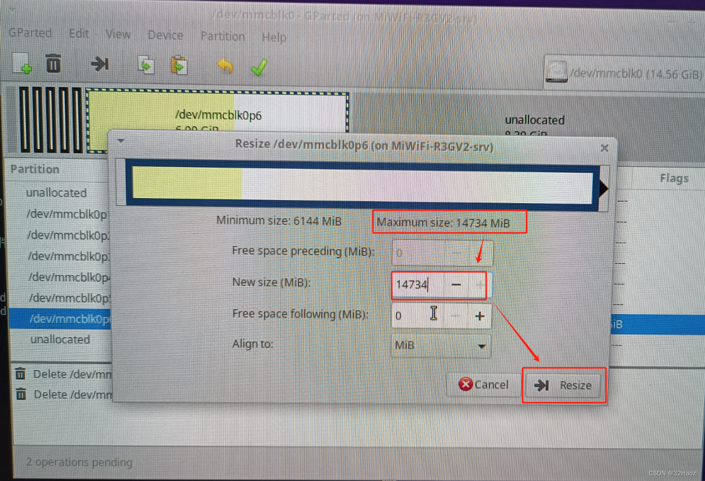
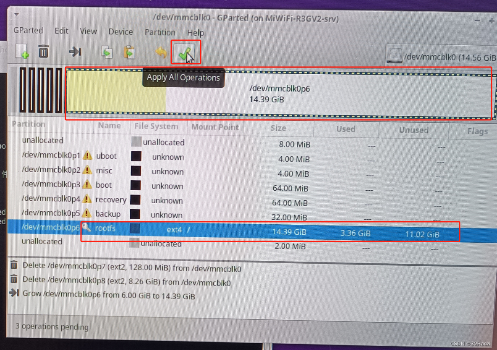
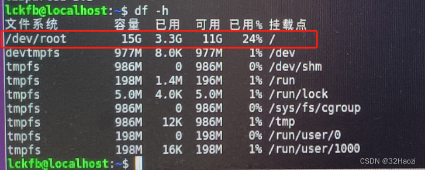
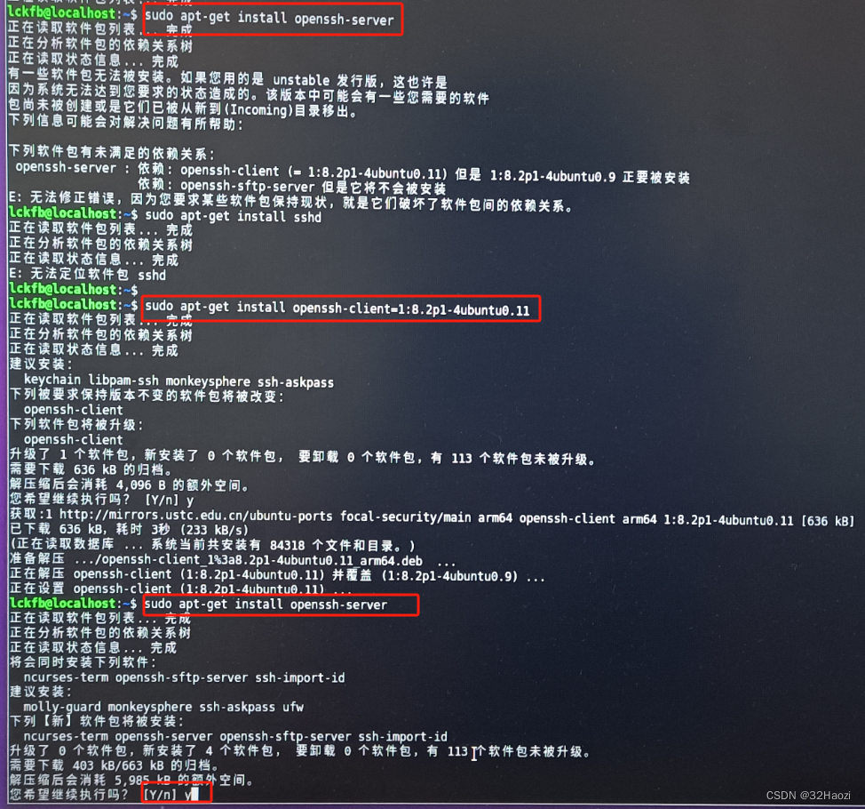
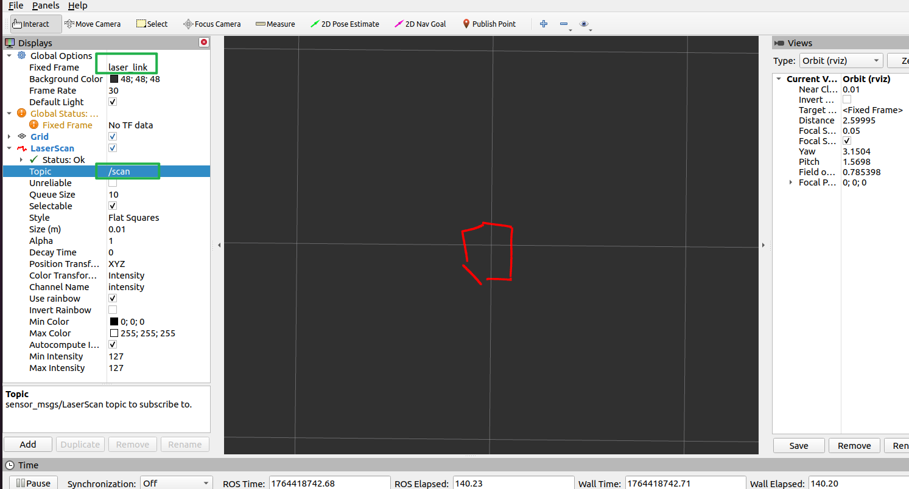

# 1. 泰山派设置

## 1.1 官方镜像

从官方资料中下载Ubuntu20系统镜像`ubuntu20.04_hdmi_20231130_update.img`，并按照官方教程烧录。

镜像地址：https://wiki.lckfb.com/zh-hans/tspi-rk3566/download-center.html

烧录完成后，板子上就有Ubuntu系统了。


## 1.2 内核修改

默认镜像中仅引出一个用户可以使用的串口，上位机需要的端口如下：

* 下位机通信，串口
* 雷达通信，串口

最基础的功能，控制**下位机控制、雷达通信**还差一个串口。

因此需要修改内核配置：

> 编译过程参考：https://wiki.lckfb.com/zh-hans/tspi-rk3566/project-case/fat-little-cell-phone/sdk-compile.html

文件需要做的修改如下：

1. 调试串口波特率修改（非必须）

找到下面这个文件

~~~ sh
tsp/kernel/arch/arm64/boot/dts/rockchip/tspi-rk3566-core-v10.dtsi
~~~

修改下面这段，把调试串口波特率从1500000修改位115200。非必须。

~~~ dtsi
	fiq-debugger {
		compatible = "rockchip,fiq-debugger";
		rockchip,serial-id = <2>;
		rockchip,wake-irq = <0>;
		/* If enable uart uses irq instead of fiq */
		rockchip,irq-mode-enable = <1>;
		rockchip,baudrate = <115200>;  /* Only 115200 and 1500000 */
		interrupts = <GIC_SPI 252 IRQ_TYPE_LEVEL_LOW>;
		pinctrl-names = "default";
		pinctrl-0 = <&uart2m0_xfer>;
		status = "okay";
	};
~~~

2. 添加一个串口（必须）

板子上引出的排针功能定义如下，选择一个合适的串口使用，此处使用`串口5`。


> 引脚定义：https://wiki.lckfb.com/zh-hans/tspi-rk3566/documentation/io-allocation-table.html

找到下面这个文件

~~~ sh
tsp/kernel/arch/arm64/boot/dts/rockchip/tspi-rk3566-user-v10-linux.dts
~~~

找到串口3的位置，将其复制一份，然后将3修改为5即可。

~~~ dtsi
//用户串口3
&uart3 {
	status = "okay";
	pinctrl-names = "default";
	pinctrl-0 = <&uart3m1_xfer>;
};

//用户串口5（新添加的）
&uart5 {
	status = "okay";
	pinctrl-names = "default";
	pinctrl-0 = <&uart5m1_xfer>;
};
~~~

然后按照教程中的步骤，**只编译内核，生成boot.img文件**即可，然后单独将boot.img烧录进板子。

> 烧录方法同样参考官方资料，比较简单。

烧录完成之后，板子上就的串口5就也可以用了，可以先接个串口工具试试能不能使用串口5收发数据。

## 1.3 空间分配

镜像烧录后，16G的EMMC空间有很大一部分都是空闲的，不能被直接使用，可用的空间还不够安装ROS的，因此需要将空闲的空间重新分配一下。

> 以下步骤需要将泰山派连接屏幕，下面的图片是最早的时候拍的，如果你按照我的流程生成的镜像，用户名可能不是这个。

在shell窗口中安装分配工具

~~~ sh
sudo apt-get install gparted
~~~


使用下面命令启动磁盘分配工具，将磁盘`oem`和`userdata`右键`取消挂载`，再右键`删除`。

~~~ sh
sudo gparted
~~~


将删除掉的空间分配给`rootfs`，右键选择Resize。



完成之后，即可看到效果，点击对号应用即可。



查看磁盘空间，已分配完成。




## 1.4 安装SSH

更新包

~~~ sh
sudo apt-get update
~~~


安装服务

~~~ sh
sudo apt-get install openssh-server
~~~

提示依赖关系不对时，提示需要哪个版本就安装哪个版本。



安装完成之后，将泰山派连接一个WIFI，使用ifconfig命令查看一下板子的IP地址，并记录一下。

~~~ sh
ifconfig
~~~


## 1.5 安装ROS

这里使用小鱼的一键安装，方便省力。

~~~ sh
wget http://fishros.com/install -O fishros && bash fishros
~~~


~~~ sh
lckfb@MiWiFi-R3GV2-srv:~$
lckfb@MiWiFi-R3GV2-srv:~$ wget http://fishros.com/install -O fishros && bash fishros
--2025-05-24 16:05:00--  http://fishros.com/install

# 省略一堆文字
# 等待弹出选项

ROS相关:
  [1]:一键安装(推荐):ROS(支持ROS/ROS2,树莓派Jetson)
  [3]:一键安装:rosdep(小鱼的rosdepc,又快又好用)
  [4]:一键配置:ROS环境(快速更新ROS环境设置,自动生成环境选择)
  [9]:一键安装:Cartographer(18 20测试通过,16未测. updateTime 20240125)
  [11]:一键安装:ROS Docker版(支持所有版本ROS/ROS2)
  [16]:一键安装：系统自带ROS (！！警告！！仅供特殊情况下使用)

常用软件:
  [2]:一键安装:github桌面版(小鱼常用的github客户端)
  [6]:一键安装:NodeJS环境
  [7]:一键安装:VsCode开发工具
  [8]:一键安装:Docker
  [10]:一键安装:微信(可以在Linux上使用的微信)
  [12]:一键安装:PlateformIO MicroROS开发环境(支持Fishbot)
  [15]:一键安装：QQ for Linux

配置工具:
  [5]:一键配置:系统源(更换系统源,支持全版本Ubuntu系统)
  [13]:一键配置:python国内源
  [17]:一键配置: Docker代理(支持VPN+代理服务两种模式)

[0]:quit

请输入[]内的数字以选择:1

# 输入1 选择安装ros

# 省略一堆文字
# 等待弹出选项

RUN Choose Task:[请输入括号内的数字]
新手或首次安装一定要一定要一定要换源并清理三方源，换源!!!系统默认国外源容易失败!!
[1]:更换系统源再继续安装
[2]:不更换继续安装
[0]:quit
请输入[]内的数字以选择:1
RUN Choose Task:[请输入括号内的数字]
请选择换源方式,如果不知道选什么请选2
[1]:仅更换系统源
[2]:更换系统源并清理第三方源
[0]:quit
请输入[]内的数字以选择:2

# 分别输入1、2

# 省略一堆文字
# 等待弹出选项

RUN Choose Task:[请输入括号内的数字]
请选择你要安装的ROS版本名称(请注意ROS1和ROS2区别):
[1]:foxy(ROS2)
[2]:galactic(ROS2)
[3]:noetic(ROS1)
[4]:rolling(ROS2)
[0]:quit
请输入[]内的数字以选择:3
RUN Choose Task:[请输入括号内的数字]
请选择安装的具体版本(如果不知道怎么选,请选1桌面版):
[1]:noetic(ROS1)桌面版
[2]:noetic(ROS1)基础版(小)
[0]:quit
请输入[]内的数字以选择:1

# 分别输入3、1；这里很重要安装的版本一定不要选错
# 然后开始等待
~~~


等待一段时间后，第一次提示软件包依赖不对，这里先敲回车继续。

~~~ sh
============================================================
请注意我，检测你在安装过程中出现依赖问题，请在稍后输入n,再选择y,即可解决（若无法解决，清在稍后手动运行命令: sudo aptitude install ros-noetic-desktop-full)
确认了解情况，请输入回车继续安装


# 第一次弹出上面的框，直接敲回车继续
# 片刻后，第一次弹出推荐方案。

是否接受该解决方案？[Y/n/q/?] n

# 输入n敲回车，拒绝第一次的方案。
# 片刻后，第二次弹出推荐方案。

是否接受该解决方案？[Y/n/q/?] Y

# 输入Y敲回车，接收第二次的方案。
# 片刻后，弹出要安装的包需要确认。

40 个软件包被升级，新安装 1025 个， 1 个将被删除， 同时 199 个将不升级。
需要获取 575 MB 的存档。 解包后将要使用 3,812 MB。
您要继续吗？[Y/n/?] Y

# 输入Y确认即可。
# 然后就是漫长漫长漫长漫长漫长漫长的等待

# 最后看到下面这句话 就安装完成了

恭喜你，安装成功了，再附赠你机器人学习宝藏网站：鱼香社区:https://fishros.org.cn/forum
Run CMD Task:[ls /opt/ros/noetic/setup.bash]
[-][0.01s] CMD Result:success

小鱼，黄黄的提示：您安装的是ROS1，可以打开一个新的终端输入roscore测试！
~~~

> 如果，这里第二次接受方案，然后往下走还是报错了，那就从头来，然后前两次都拒绝，第三次再接受。如果还失败，就再从头来，第四次再接受。 


安装完成后，重新起一个终端，输入`roscore`指令，能看到如下信息，就表示ros安装完成了。

~~~ sh
lckfb@MiWiFi-R3GV2-srv:~$ roscore
... logging to /home/lckfb/.ros/log/1647e6b0-38bd-11f0-b3d3-b81332af56be/roslaunch-MiWiFi-R3GV2-srv-16753.log
Checking log directory for disk usage. This may take a while.
Press Ctrl-C to interrupt
Done checking log file disk usage. Usage is <1GB.

started roslaunch server http://MiWiFi-R3GV2-srv:35197/
ros_comm version 1.17.3


SUMMARY
========

PARAMETERS
 * /rosdistro: noetic
 * /rosversion: 1.17.3

NODES

auto-starting new master
process[master]: started with pid [16761]
ROS_MASTER_URI=http://MiWiFi-R3GV2-srv:11311/

setting /run_id to 1647e6b0-38bd-11f0-b3d3-b81332af56be
process[rosout-1]: started with pid [16771]
started core service [/rosout]
~~~


## 1.6 安装Vscode

> 已经有经验的话，不需要频繁修改就可以不用装了。
>
> 我这里刚开始调试的时候装了，后来基础硬件调试完之后，重新烧录过系统，就没再安装了，在虚拟机中修改之后，再把代码放过去编译。


其实这个开发板跑Vscode只能将就，但是主要开发过程中需要不断改，装一个还是方便一点。

安装完成后，Vscode中安装个ssh插件，就可以在电脑上编辑开发板中的代码了。


Vscode其实相对好装，但是这里还是使用一键安装命令，省时省力。

~~~ sh
wget http://fishros.com/install -O fishros && bash fishros
~~~


~~~ sh
lckfb@MiWiFi-R3GV2-srv:~$ wget http://fishros.com/install -O fishros && bash fishros
--2025-05-25 08:07:07--  http://fishros.com/install

# 稍等片刻，然后选择数字7即可

ROS相关:
  [1]:一键安装(推荐):ROS(支持ROS/ROS2,树莓派Jetson)
  [3]:一键安装:rosdep(小鱼的rosdepc,又快又好用)
  [4]:一键配置:ROS环境(快速更新ROS环境设置,自动生成环境选择)
  [9]:一键安装:Cartographer(18 20测试通过,16未测. updateTime 20240125)
  [11]:一键安装:ROS Docker版(支持所有版本ROS/ROS2)
  [16]:一键安装：系统自带ROS (！！警告！！仅供特殊情况下使用)

常用软件:
  [2]:一键安装:github桌面版(小鱼常用的github客户端)
  [6]:一键安装:NodeJS环境
  [7]:一键安装:VsCode开发工具
  [8]:一键安装:Docker
  [10]:一键安装:微信(可以在Linux上使用的微信)
  [12]:一键安装:PlateformIO MicroROS开发环境(支持Fishbot)
  [15]:一键安装：QQ for Linux

配置工具:
  [5]:一键配置:系统源(更换系统源,支持全版本Ubuntu系统)
  [13]:一键配置:python国内源
  [17]:一键配置: Docker代理(支持VPN+代理服务两种模式)

[0]:quit

请输入[]内的数字以选择:7

# 然后等待安装完成即可
~~~


## 1.7 权限设置

### 1.7.1 串口权限

两个串口`/dev/ttyS3`和`/dev/ttyS5`使用普通用户登录默认都是没有操作权限的，在代码里不方便操作。

因此这里永久修改一下权限。

~~~ sh
# 创建udev规则文件
sudo vi /etc/udev/rules.d/99-serial-ports.rules
~~~

添加以下内容

~~~ sh
KERNEL=="ttyS3", MODE="0666"
KERNEL=="ttyS5", MODE="0666"
~~~

添加完成后重新加载

~~~ sh
# 重新加载udev规则
sudo udevadm control --reload-rules
sudo udevadm trigger

# 或者重启系统使规则生效
sudo reboot
~~~

查看串口权限，可以看到有读写权限了

~~~ sh
lckfb@MiWiFi-R3GV2-srv:~/ros1-car-ws$ ls -l /dev/ttyS5
crw-rw-rw- 1 root dialout 4, 69 11月 28 14:21 /dev/ttyS5
lckfb@MiWiFi-R3GV2-srv:~/ros1-car-ws$ ls -l /dev/ttyS3
crw-rw-rw- 1 root dialout 4, 67 11月 28 14:21 /dev/ttyS3
~~~


### 1.7.2 IO引脚

风扇和雷达供电控制引脚上电后默认也是没有操作权限的。

~~~ sh
lckfb@MiWiFi-R3GV2-srv:~$ echo 36 > /sys/class/gpio/export
-bash: /sys/class/gpio/export: 权限不够
lckfb@MiWiFi-R3GV2-srv:~$ sudo echo 36 > /sys/class/gpio/export
-bash: /sys/class/gpio/export: 权限不够
~~~

创建gpio用户组

```sh
sudo groupadd gpio          # 创建组（如果不存在）
sudo usermod -a -G gpio $USER   # 将当前用户加入 gpio 组
```

创建文件

~~~ sh
sudo vi /etc/udev/rules.d/99-gpio.rules
~~~

添加以下内容

~~~ sh
# Set permissions for GPIO sysfs interface
SUBSYSTEM=="gpio", KERNEL=="gpiochip*", ACTION=="add", PROGRAM="/bin/sh -c 'chown -R root:gpio /sys/class/gpio && chmod -R 775 /sys/class/gpio'"
SUBSYSTEM=="gpio", KERNEL=="gpio*", ACTION=="add", PROGRAM="/bin/sh -c 'chown -R root:gpio /sys/class/gpio/gpio* && chmod -R 775 /sys/class/gpio/gpio*'"
~~~

添加完成后重新加载

~~~ sh
# 重新加载udev规则
sudo udevadm control --reload-rules
sudo udevadm trigger --subsystem-match=gpio
sudo reboot
~~~

查看分组，可以看到gpio

~~~ sh
lckfb@MiWiFi-R3GV2-srv:~$ groups
lckfb sudo audio video gpio
~~~

然后重新测试就可以了。


### 1.7.3 摄像头权限

执行以下命令，重启生效。

```sh
# 添加权限
sudo usermod -aG video $USER

# 或者重启系统使规则生效
sudo reboot
```

重启完成之后，执行以下命令，看到有video输出即表示成功。

~~~ sh
lckfb@MiWiFi-R3GV2-srv:~$ groups
lckfb sudo audio video
~~~


# 2. 下位机开发（Base）

下位机相对来说核心逻辑比较简单，一共需要实现以下功能：

1. 串口接收上位机发送的目标电机速度，使用PID调节电机速度，保持速度稳定；
3. 获取电机编码器值、电池电量，通过串口定时上报；


## 2.1 目标速度控制

这里速度控制使用5ms的定时器中断完成，并且每4次中断，上报一次编码器和电池电压数据。

核心处理逻辑就是下面这个函数

~~~ c

void HAL_TIM_PeriodElapsedCallback(TIM_HandleTypeDef *htim)
{
	// 这个回调函数 是共用的，因此需要先判断，是不是定时器2
    if(htim->Instance == htim1.Instance)
	{
		/*
		实际上 因为编码器接线差异 导致编码器数值增加的方向不一定是电机正转的方向
		这里测试结果：
		右电机正转（顺时针，小车往前走）编码器值从0加，反转（逆时针，小车往后退）往后退是从65535减
		左电机反转（逆时针，小车往前走）编码器值从0加，正转（顺时针，小车往后退）往后退是从65535减
		也就是：左右轮都是 编码器值从0加是小车往前走
		
		但是这里需要都处理为顺时针正转时，编码器值增加。
		ROS就是规范~~~
		*/

		// 获取左右电机编码器计数 这里测试都是前进方向是从0加 后退方向是从65535减
		int32_t right_encoder_diff = __HAL_TIM_GET_COUNTER(&htim2);
		int32_t left_encoder_diff = __HAL_TIM_GET_COUNTER(&htim4);
		
		// 方向处理 得到的速度都是电机正转的速度（右电机往前走 左电机往后走）
		// 右轮 编码器值增加的方向就是电机正向旋转的方向 也是前进的方向(100表示正转了100 65535表示反转了1，需要处理为-1)
		if(right_encoder_diff > 30000)	
			right_encoder_diff = right_encoder_diff - 65536;
		// 左轮 编码器值增加的方向就是电机反向旋转的方向 也是前进的方向(100表示反转了100，需要处理为-100，65535表示正转了1)
		if(left_encoder_diff > 30000)
			left_encoder_diff = 65536 - left_encoder_diff;
		else
			left_encoder_diff = 0 - left_encoder_diff;
		// 清除计数
		__HAL_TIM_SET_COUNTER(&htim2, 0);
		__HAL_TIM_SET_COUNTER(&htim4, 0);
		// 编码器值累加（用于上报编码器值）
		left_encoder_count += left_encoder_diff;
		right_encoder_count += right_encoder_diff;
		// 计算为速度
		// 电机一圈7个脉冲 减速比50 也就是一圈350个脉冲 上下边沿都检测 一圈计数值为 350 * 4 = 1400
		// 圈数 = 编码器值 / 1400
		// 旋转的弧度 = 圈数 * 2PI
		// 电机速度(rad/s) = 旋转的弧度 / 0.005 = 圈数 * 2PI / 0.005 = 编码器值 / 1400 * 2PI / 0.005
		// 电机速度(rad/s) = 编码器值 * 6.2831852 / 7
		float left_speed = (float)left_encoder_diff * 6.2831852 / 7;
		float right_speed = (float)right_encoder_diff * 6.2831852 / 7;
		// 滤波
		left_speed = left_speed * 0.3 + real_left_speed * 0.7;
		right_speed = right_speed * 0.3 + real_right_speed * 0.7;
		// PID闭环计算
		float left_out = pic_ctrl(&left_pid, target_left_speed, left_speed);
		float right_out = pic_ctrl(&right_pid, target_right_speed, right_speed);
		// 设置
		if(left_out >= 0)	// 正转
		{
			HAL_GPIO_WritePin(GPIOA, GPIO_PIN_5, GPIO_PIN_RESET);
			HAL_GPIO_WritePin(GPIOA, GPIO_PIN_7, GPIO_PIN_SET);
			__HAL_TIM_SET_COMPARE(&htim3, TIM_CHANNEL_3, left_out);
		}
		else // 反转
		{
			HAL_GPIO_WritePin(GPIOA, GPIO_PIN_5, GPIO_PIN_SET);
			HAL_GPIO_WritePin(GPIOA, GPIO_PIN_7, GPIO_PIN_RESET);
			__HAL_TIM_SET_COMPARE(&htim3, TIM_CHANNEL_3, -left_out);
		}
		
		if(right_out >= 0)	// 正转
		{
			HAL_GPIO_WritePin(GPIOA, GPIO_PIN_3, GPIO_PIN_RESET);
			HAL_GPIO_WritePin(GPIOA, GPIO_PIN_4, GPIO_PIN_SET);
			__HAL_TIM_SET_COMPARE(&htim3, TIM_CHANNEL_1, right_out);
		}
		else // 反转
		{
			HAL_GPIO_WritePin(GPIOA, GPIO_PIN_3, GPIO_PIN_SET);
			HAL_GPIO_WritePin(GPIOA, GPIO_PIN_4, GPIO_PIN_RESET);
			__HAL_TIM_SET_COMPARE(&htim3, TIM_CHANNEL_1, -right_out);
		}
		
#if PID_DEBUG_NEED
		// 数据顺序（tar real kp ki kd）
//		float send_data[5] = {target_left_speed, left_speed, left_pid.kp, left_pid.ki, left_pid.kd};
		float send_data[5] = {target_right_speed, right_speed, right_pid.kp, right_pid.ki, right_pid.kd};
		debug_data_send(send_data, 5);
#else
		status_send_count++;
		if(status_send_count >= 4)
		{
			// 电池电压
			uint16_t battery_vol_mv = (uint16_t)(battery_vol_read() * 1000);
			
			uint8_t send_data[10];
			send_data[0] = 'R';
			send_data[1] = 'O';
			send_data[2] = 'S';
			send_data[3] = (left_encoder_count >> 0) & 0xFF;
			send_data[4] = (left_encoder_count >> 8) & 0xFF;
			send_data[5] = (right_encoder_count >> 0) & 0xFF;
			send_data[6] = (right_encoder_count >> 8) & 0xFF;
			send_data[7] = (battery_vol_mv >> 0) & 0xFF;
			send_data[8] = (battery_vol_mv >> 8) & 0xFF;
			send_data[9] = check_sum(send_data, 9);

			// 发送
			if(upper_data_send(send_data, 10) == 0)
			{
				// 清空累计值
				left_encoder_count = 0;
				right_encoder_count = 0;
			}
		
			// 清除计数
			status_send_count = 0;
		}
#endif
	}
}
~~~


## 2.2 目标速度获取

解析上位机数据使用串口中断完成

~~~ c

void HAL_UART_RxCpltCallback(UART_HandleTypeDef *huart)
{
	// 判断是不是串口1 中断
	if(huart->Instance == USART1)
	{
#if PID_DEBUG_NEED
		if(rx_buff[0] == '1')
			left_pid.kp = left_pid.kp + 10;
		else if(rx_buff[0] == '2')
			left_pid.kp = left_pid.kp - 10;
		if(rx_buff[0] == '3')
			left_pid.ki = left_pid.ki + 0.01;
		else if(rx_buff[0] == '4')
			left_pid.ki = left_pid.ki - 0.01;
		if(rx_buff[0] == '5')
			left_pid.kd = left_pid.kd + 0.01;
		else if(rx_buff[0] == '6')
			left_pid.kd= left_pid.kd - 0.01;
#else
		if((rx_len == 0) && (rx_buff[rx_len] != 'R'))
		{
			rx_len = 0;
		}
		else if((rx_len == 1) && (rx_buff[rx_len] != 'O'))
		{
			rx_len = 0;
		}
		else if((rx_len == 2) && (rx_buff[rx_len] != 'S'))
		{
			rx_len = 0;
		}
		else
		{
			rx_len++;
		}
		
		// 一包数据接收完了
		if(rx_len >= 8)
		{
			// 校验
			if(rx_buff[7] == check_sum(rx_buff, 7))
			{
				float left_speed = (float)((int16_t)((rx_buff[4] << 8) | (rx_buff[3] << 0))) / 1000;
				float right_speed = (float)((int16_t)((rx_buff[6] << 8) | (rx_buff[5] << 0))) / 1000;
				
				motor_write_speed(left_speed, right_speed);
			}
			
			comm_count = 0;
			rx_len = 0;
		}
#endif
		
		// 重新使能接收中断
		HAL_UART_Receive_IT(&huart1, (uint8_t *)&rx_buff[rx_len], 1);
	}
}
~~~


## 2.3 状态显示

另外添加了个LED显示功能，在main函数中处理。

* 正常情况下，下位机亮绿灯
* 发生通信超时，下位机亮红灯，并且停止移动

~~~ c
uint32_t last_led_time = HAL_GetTick();	// led周期闪烁时间

while (1)
{
    // 发送数据
    uint32_t current_time = HAL_GetTick();

    // LED状态
    if((current_time - last_led_time) >= 1000)
    {
        // 五秒未收到上位机有效命令
        comm_count++;
        if(comm_count > 5)
        {
            motor_write_speed(0, 0);
            led_write(LED_RED);
        }
        else
        {
            led_write(LED_GREEN);
        }
        last_led_time = current_time;
    }
}
~~~


# 3. 上位机开发（RosWs）

主要规划和构建各个软件包的功能。


## 3.1 创建项目

创建一个工作空间文件夹（就是一个工程文件夹）

1. 工作空间中可以有多个软件包
2. 软件包中又可以又多个节点


**步骤1：创建工作空间**

比如这里想创建一个小车项目，就可以创建下面的文件目录

* Ros1CarWs
  * src：存放代码，源代码、功能包等

创建一个`Ros1CarWs`目录作为本项目的工作空间。

~~~ sh
haozi@computer:~/develop$ mkdir Ros1CarWs
haozi@computer:~/develop$ cd Ros1CarWs/
haozi@computer:~/develop/Ros1CarWs$ mkdir src
~~~


**步骤2：创建软件包**

在工作空间的src目录下可以有多个软件包。

因此需要在src目录下进行创建，切换到工作空间的src目录下，执行如下格式指令：

~~~ sh
catkin_create_pkg 包名 <依赖项1> <依赖项2> ...
~~~

比如，创建一个名叫`test_pkg`的包，指令如下：

~~~ sh
haozi@computer:~/develop/Ros1CarWs/src$ catkin_create_pkg test_pkg rospy roscpp std_msgs
~~~

执行完成后，在src目录下就会多出一个新的目录`test_pkg`，该目录就是一个包了，包里面又包含了多个文件。

~~~ sh
haozi@computer:~/develop/Ros1CarWs/src$ ls
CMakeLists.txt  test_pkg  wpr_simulation
haozi@computer:~/develop/Ros1CarWs/src$ cd test_pkg/
haozi@computer:~/develop/Ros1CarWs/src/test_pkg$ ls
CMakeLists.txt  include  package.xml  src
~~~


**步骤3：添加节点代码**

在软件包的src目录下创建代码文件`main.cpp`

~~~ cpp
#include <ros/ros.h>

int main(int argc, char *argv[])
{
    printf("test_pkg running~ \n");
    
    // 后面的是节点名称
    ros::init(argc, argv, "test_node");

    while(ros::ok())
    {
        printf("test_node running~ \n");
        sleep(1);
    }
    return 0;
}
~~~

在这个包的CMakeLists.txt文件中，build部分，找到对应的注释的位置，添加如下两条（没注释掉的是添加的，注释掉的是原有的）。

~~~ cmake
## Declare a C++ executable
## With catkin_make all packages are built within a single CMake context
## The recommended prefix ensures that target names across packages don't collide
# add_executable(${PROJECT_NAME}_node src/test_pkg_node.cpp)
add_executable(test_node src/main.cpp)

## Specify libraries to link a library or executable target against
# target_link_libraries(${PROJECT_NAME}_node
#   ${catkin_LIBRARIES}
# )
target_link_libraries(test_node
  ${catkin_LIBRARIES}
)
~~~

其中：

* add_executable：表示需要编译可执行文件
* target_link_libraries：表示需要链接ros库


**步骤4：编译代码**

在工作空间目录Ros1CarWs下执行编译命令

~~~ sh
haozi@computer:~/develop/Ros1CarWs$ pwd
/home/haozi/develop/Ros1CarWs
haozi@computer:~/develop/Ros1CarWs$ catkin_make
[100%] Linking CXX executable /home/haozi/develop/Ros1CarWs/devel/lib/test_pkg/test_node
[100%] Built target test_node
~~~

编译完成后，工作空间下就会多出来两个文件夹，build、devel

~~~ sh
haozi@computer:~/develop/Ros1CarWs$ ls
build  devel  src
~~~

* build：编译文件
* devel：执行文件，执行前需要在这里添加源


**步骤5：执行**

启动一个新的终端，启动ros

~~~ sh
roscore
~~~

添加代码源（注意相对目录或者绝对目录）

~~~ sh
haozi@computer:~/develop/Ros1CarWs$ source devel/setup.bash
~~~

执行代码

~~~ sh
# 命令格式：rosrun 包名 节点名
haozi@computer:~/develop/Ros1CarWs$ rosrun test_pkg test_node
test_pkg running~ 
test_node running~ 
test_node running~ 
test_node running~
~~~

到这里，创建一个ros软件包并执行的流程就完成了。

还可以继续重复步骤2-5，就可以创建多个不同的软件包了。


**步骤6：优化**

每次打开终端总要source一下，可以修改配置，打开终端时自动source。

执行如下指令

~~~ sh
haozi@computer:~$ gedit ~/.bashrc
~~~

在弹出的编辑器中，最后一行添加如下内容。

~~~ sh
source ~/Ros1CarWs/devel/setup.bash
~~~

这样每次打开终端，就会自动执行这一行命令了。

> 不过这里我还是不用了。


## 3.2 电脑端可视化

小车主控不具有可视化能力，需要借用电脑来进行可视化操作。

**步骤1：**

虚拟机网络设置为桥接模式（这样开发板和虚拟机才可以在一个网段下）

**步骤2：**

将电脑和开发板连接同一个wifi

**步骤3：**

查看电脑端和开发板IP地址和设备名

~~~ sh
hostname
~~~

结果：

* 虚拟机
  * 主机名：computer
  * IP：192.168.31.28
* 开发板
  * 主机名：MiWiFi-R3GV2-srv
  * IP：192.168.31.35

**步骤4：**

编辑`/etc/hosts`文件，添加一行，添加对方的IP和主机名

开发板端

~~~ sh
192.168.31.28    computer
~~~

电脑端

~~~ sh
192.168.31.35    MiWiFi-R3GV2-srv
~~~

设置完成之后，分别ping对方的ip和主机名，应该都是可以ping通的。

**步骤5：**

这里将开发板作为ROS主机使用。编辑`~/.bashrc`文件，添加几行。

开发板端

~~~ sh
# ROS网络配置
export ROS_MASTER_URI=http://MiWiFi-R3GV2-srv:11311
export ROS_HOSTNAME=MiWiFi-R3GV2-srv

# 执行source
source ~/.bashrc
~~~

电脑端

~~~ sh
# ROS网络配置
export ROS_MASTER_URI=http://MiWiFi-R3GV2-srv:11311
export ROS_HOSTNAME=computer
# 执行source
source ~/.bashrc
~~~

然后在开发板端运行roscore及其他服务，在电脑端就可以使用相关命令看到状态了。

> 也可以直接将上面两行写入到这个文件，就不用每次打开终端都需要重新导入了。
>
> 这里就这么干了！！！


## 3.3 下位机控制包（base_ctrl_pkg）

本软件包主要实现以下功能：

1. 订阅速度控制消息，解析为两个轮子的速度后，定时下发给下位机
2. 解析两个轮子编码器值，计算里程计状态，发布里程计消息


### 3.3.1 速度订阅

创建一个速度订阅者对象

~~~ cpp
tar_speed_sub_ = nh_.subscribe("/cmd_vel", 10, &BaseCtrl::CmdVelCallback, this); // 订阅目标速度
~~~

回调函数中根据差速轮模型解析两个轮子速度

~~~ cpp
// 速度指令订阅回调函数
void BaseCtrl::CmdVelCallback(const geometry_msgs::Twist::ConstPtr &msg)
{
    // 解析为左右电机的速度
    // ROS_INFO("tar linear = %f(m/s), angular = %f(rad/s) ~ \n", msg->linear.x, msg->angular.z);

    // 第一步：把小车的移动速度，计算为小车轮子的线速度
    float left_linear = msg->linear.x - 0.5 * WHEEL_TRACK * msg->angular.z;
    float right_linear = msg->linear.x + 0.5 * WHEEL_TRACK * msg->angular.z;

    // 第二步：把轮子的线速度，计算为行走电机的旋转速度
    float left_angular = left_linear / WHEEL_RADIUS;
    float right_angular = right_linear / WHEEL_RADIUS;

    // 转换为可以下发的单位 0.001倍
    // 轮子向前线速度为正 轮子顺时针角速度为正 则左轮子的线速度和角速度符号是反的
    h2l_data_.left_speed = (int16_t)(-left_angular * 1000);
    h2l_data_.right_speed = (int16_t)(right_angular * 1000);
}
~~~

在定时器的中断回调函数中定时调用以下函数，将目标速度发送给下位机

~~~ cpp
// 下位机命令定时发布
void BaseCtrl::TimerUartSend()
{
    uint8_t send_data[8];
    // 数据头
    send_data[0] = 'R';
    send_data[1] = 'O';
    send_data[2] = 'S';
    // 电机速度
    send_data[3] = (h2l_data_.left_speed >> 0) & 0xFF;
    send_data[4] = (h2l_data_.left_speed >> 8) & 0xFF;
    send_data[5] = (h2l_data_.right_speed >> 0) & 0xFF;
    send_data[6] = (h2l_data_.right_speed >> 8) & 0xFF;
    // 校验
    send_data[7] = CheckSum(send_data, 7);
    // 发送
    uart_.Write(send_data, 8);
}
~~~

测试效果

在小车上将`base_ctrl_pkg`节点运行起来，在虚拟机中利用现成的速度控制节点，就可以控制小车进行移动了。

~~~ sh
rosrun rqt_robot_steering rqt_robot_steering
~~~

> 先完成这个功能，才能继续往下走


### 3.3.2 里程计发布

创建一个发布者对象，用于发布里程计消息

~~~ sh
odom_pub_ = nh_.advertise<nav_msgs::Odometry>("odom", 50);                       // 发布里程计数据
~~~

里程计消息的计算如下，相对好理解，此函数也是在定时器回调函数中调用。

~~~ cpp
// 里程计消息定时发布
void BaseCtrl::TimerOdomPub()
{
    ros::Time current_time = ros::Time::now();

    // 第一次运行则不计算
    if (first_update_)
    {
        last_encoder_.left = now_encoder_.left;
        last_encoder_.right = now_encoder_.right;
        last_update_time_ = current_time;
        first_update_ = 0;
        return;
    }

    // 计算时间间隔(要说这里都已经用定时器了 其实这个时间间隔可以固定一个的)
    double dt = (current_time - last_update_time_).toSec();
    if (dt <= 0.001)
    {
        ROS_WARN_THROTTLE(1.0, "Time interval too small: %.3f s", dt);
        return;
    }
    // 计算编码器增量(脉冲数)
    int64_t left_encoder_delta = now_encoder_.left - last_encoder_.left;
    int64_t right_encoder_delta = now_encoder_.right - last_encoder_.right;
    // 尽快更新编码器 防止计算过程中now_encoder_值更新 导致下一轮计算丢数
    last_encoder_.left = now_encoder_.left;
    last_encoder_.right = now_encoder_.right;
    // 计算左右电机移动的距离(m)
    double left_distance = (double)left_encoder_delta / ENCODER_RESOLUTION * WHEEL_RADIUS * M_PI;
    double right_distance = (double)right_encoder_delta / ENCODER_RESOLUTION * WHEEL_RADIUS * M_PI;
    // 转换为统一方向 往前走是正
    left_distance *= -1;
    right_distance *= 1;
    // 计算平均移动距离和方向变化
    double delta_distance = (left_distance + right_distance) / 2.0;      // 本次距离变化
    double delta_theta = (right_distance - left_distance) / WHEEL_TRACK; // 本次角度变化
    // 计算线速度(m/s)和角速度(rad/s)
    double linear_vel = delta_distance / dt;
    double angular_vel = delta_theta / dt;

    // ROS_INFO("left_encoder_delta=%d, right_encoder_delta=%d", left_encoder_delta, right_encoder_delta);
    // ROS_INFO("left_distance=%.4f m, right_distance=%.4f m", left_distance, right_distance);
    // ROS_INFO("delta_distance=%.4f m, delta_theta=%.4f rad", delta_distance, delta_theta);
    // ROS_INFO("linear_vel=%.4f m/s, angular_vel=%.4f rad/s", linear_vel, angular_vel);
    // ROS_INFO("-----------------");

    // 累计位置
    x_ += delta_distance * cos(theta_ + delta_theta / 2);
    y_ += delta_distance * sin(theta_ + delta_theta / 2);
    // 累计角度 并标准化角度到 [-pi, pi]
    theta_ += delta_theta;
    while (theta_ > M_PI)
        theta_ -= 2.0 * M_PI;
    while (theta_ < -M_PI)
        theta_ += 2.0 * M_PI;

    // 发布数据

    // 创建四元数从偏航角
    tf2::Quaternion odom_quat;
    odom_quat.setRPY(0, 0, theta_);

    // 1. 发布里程计消息
    nav_msgs::Odometry odom_msg;
    odom_msg.header.stamp = current_time;
    odom_msg.header.frame_id = "odom";
    odom_msg.child_frame_id = "base_footprint";
    // 设置位置
    odom_msg.pose.pose.position.x = x_;
    odom_msg.pose.pose.position.y = y_;
    odom_msg.pose.pose.position.z = 0.0;
    // 设置姿态（四元数）
    odom_msg.pose.pose.orientation.x = odom_quat.x();
    odom_msg.pose.pose.orientation.y = odom_quat.y();
    odom_msg.pose.pose.orientation.z = odom_quat.z();
    odom_msg.pose.pose.orientation.w = odom_quat.w();
    // 设置位置协方差
    // odom_msg.pose.covariance[0] = 0.1;  // x
    // odom_msg.pose.covariance[7] = 0.1;  // y
    // odom_msg.pose.covariance[35] = 0.2; // 偏航
    // 设置速度
    odom_msg.twist.twist.linear.x = linear_vel;
    odom_msg.twist.twist.linear.y = 0;
    odom_msg.twist.twist.angular.z = angular_vel;
    // 速度协方差
    // odom_msg.twist.covariance[0] = 0.1;  // vx
    // odom_msg.twist.covariance[7] = 0.0;  // vy
    // odom_msg.twist.covariance[14] = 0.0; // vz
    // odom_msg.twist.covariance[21] = 0.0; // 滚转角速度
    // odom_msg.twist.covariance[28] = 0.0; // 俯仰角速度
    // odom_msg.twist.covariance[35] = 0.2; // 偏航角速度
    // 发布里程计消息
    odom_pub_.publish(odom_msg);

    // 2. 发布TF变换: odom -> base_link
    geometry_msgs::TransformStamped odom_trans;
    odom_trans.header.stamp = current_time;
    odom_trans.header.frame_id = "odom";
    odom_trans.child_frame_id = "base_footprint";
    odom_trans.transform.translation.x = x_;
    odom_trans.transform.translation.y = y_;
    odom_trans.transform.translation.z = 0.0;
    odom_trans.transform.rotation.x = odom_quat.x();
    odom_trans.transform.rotation.y = odom_quat.y();
    odom_trans.transform.rotation.z = odom_quat.z();
    odom_trans.transform.rotation.w = odom_quat.w();
    // 发布TF变换
    tf_broadcaster_.sendTransform(odom_trans);

    // 更新上一时刻数据
    last_update_time_ = current_time;
}
~~~

测试效果

在小车上将`base_ctrl_node`节点运行起来，在虚拟机中利用现成的速度控制节点，控制小车移动，或者手推着小车走也是可以的，让小车可以读到轮子的编码器数据即可。

在虚拟机中运行`rviz`，add添加里程计选项，并且将话题修改为`/odom`，全局设置中`Fixed Frame`也修改为`odom`，即可看到里程计运动效果

~~~ sh
rosrun rviz rviz
~~~


## 3.4 雷达消息包（lidar_pkg）

本软件包主要实现以下功能：

1. 接收雷达数据，将雷达原始数据解析为雷达话题数据并发布


创建一个新的软件包`lidar_pkg`，用于发布雷达数据。

~~~ sh
haozi@computer:~/develop/Ros1CarWs/src$ catkin_create_pkg lidar_pkg rospy roscpp std_msgs sensor_msgs
~~~

创建一个地图发布者对象

~~~ cpp
laser_pub_ = nh_.advertise<sensor_msgs::LaserScan>("/scan", 10);
~~~

雷达数据读取如下，按照雷达数据长度格式，获取到一包数据长度即可。

~~~ cpp

// 接收一包雷达数据
int Lidar::ReadLidarData(lidar_data_t &lidar_data)
{
    /*
        雷达数据格式 参考lidar_data数据类型定义
    */
    int len;
    uint8_t recv_buff[100];

    // 接收数据头 找第一个字节 最多尝试100次
    uint8_t i = 0;
    while (1)
    {
        len = uart_.Read(recv_buff, 1);
        if ((len == 1) && (recv_buff[0] == 0xAA))
        {
            len = uart_.Read(recv_buff, 1);
            if ((len == 1) && (recv_buff[0] == 0x55))
            {
                break; // 找到数据头了
            }
            else
            {
                ROS_INFO("find data header2 failed. ");
                return -2; // 未找到数据头第2个字节
            }
        }
        if (i++ > 100)
        {
            ROS_INFO("find data header1 failed. ");
            return -1; // 未找到数据头第1个字节
        }
    }

    lidar_data.header[0] = 0xAA;
    lidar_data.header[1] = 0x55;

    // 包类型
    len = uart_.Read(recv_buff, 1);
    if (len == 1)
    {
        if ((recv_buff[0] != 0) && (recv_buff[0] != 1))
        {
            ROS_INFO("ct out range %d. ", recv_buff[0]);
            return -3;
        }
        lidar_data.ct = recv_buff[0];
    }
    else
    {
        ROS_INFO("find data ct failed. ");
        return -4;
    }

    // 采样点数量
    len = uart_.Read(recv_buff, 1);
    if (len == 1)
    {
        if ((recv_buff[0] < 1) || (recv_buff[0] > 25))
        {
            ROS_INFO("lsn out range %d. ", recv_buff[0]);
            return -5;
        }
        lidar_data.lsn = recv_buff[0];
    }
    else
    {
        ROS_INFO("find data lsn failed. ");
        return -6;
    }

    // 剩下 起始角度2字节 结束角度2字节 校验2字节 采样数据2*lsn字节
    uint8_t read_len = 0;
    uint8_t need_len = 6 + 2 * lidar_data.lsn;
    len = uart_.Read(&(recv_buff[read_len]), need_len);
    if (len < need_len)
    {
        // 继续读剩下的
        read_len = read_len + len;
        need_len = need_len - len;
        len = uart_.Read(&(recv_buff[read_len]), need_len);
        if (len < need_len)
        {
            // 继续读剩下的
            read_len = read_len + len;
            need_len = need_len - len;
            len = uart_.Read(&(recv_buff[read_len]), need_len);
            if (len < need_len)
            {
                ROS_INFO("find data si failed. len=%d, lsn=%d.", read_len, lidar_data.lsn);
                return -7;
            }
        }
    }
    lidar_data.fsa = ((recv_buff[1] << 8) | recv_buff[0]);
    lidar_data.lsa = ((recv_buff[3] << 8) | recv_buff[2]);
    lidar_data.cs = ((recv_buff[5] << 8) | recv_buff[4]);
    for (uint8_t i = 0; i < lidar_data.lsn; i++)
    {
        lidar_data.si[i] = ((recv_buff[7 + i * 2] << 8) | recv_buff[6 + i * 2]);
    }

    return 0;
}
~~~

按照长度和距离解析格式进行解析，并发布雷达话题数据

~~~ cpp
#define POINTS_SIZE 800 // 修正和插值到800点(本身390个点左右)
void Lidar::LidarTask()
{
    ROS_INFO("LidarTask running... \n");

    int ret;
    int start_cnt = 0;
    // 数据缓冲定义
    lidar_data_t lidar_data; // 雷达串口发送过来的数据

    // 雷达数据类型
    sensor_msgs::LaserScan laser_scan; // scan要发布的数据
    laser_scan.header.frame_id = "laser_link";
    laser_scan.angle_min = -M_PI; // 从正前方顺时针旋转到正后方 正后方就是-PI
    laser_scan.angle_max = M_PI;  // 从正前方逆时针旋转到正后方 正后方就是 PI
    laser_scan.angle_increment = (laser_scan.angle_max - laser_scan.angle_min) / POINTS_SIZE;
    laser_scan.range_min = 0.1; // 雷达最小量程
    laser_scan.range_max = 8.0; // 雷达最大量程
    laser_scan.ranges.resize(POINTS_SIZE);
    std::fill(laser_scan.ranges.begin(), laser_scan.ranges.end(), std::numeric_limits<float>::infinity()); // 全部填充为无限远
    laser_scan.intensities.resize(POINTS_SIZE, 127);                                                       // 假设强度值为127

    while (ros::ok())
    {
        // 清空数据
        memset(&lidar_data, 0, sizeof(lidar_data));

        // 读取数据
        ret = ReadLidarData(lidar_data);
        if (ret != 0)
        {
            if (ret != -1) // 雷达断电后会返回-1，雷达断电不用打印报错
            {
                ROS_INFO("read_lidar_data ret=%d", ret);
            }
            continue;
        }
#if 0
        printf("header %d %d \n", lidar_data.header[0], lidar_data.header[1]);
        printf("ct %d \n", lidar_data.ct);
        printf("lsn %d \n", lidar_data.lsn);
        printf("fsa %d %f \n", lidar_data.fsa, (lidar_data.fsa >> 1) / 64.0);
        printf("lsa %d %f \n", lidar_data.lsa, (lidar_data.lsa >> 1) / 64.0);
        printf("cs %d \n", lidar_data.cs);
        printf("si = ");
        for (uint8_t i = 0; i < lidar_data.lsn; i++)
        {
            printf("0x%x, ", lidar_data.si[i]);
        }
        printf("\n");
#endif
        // 解析数据
        float fsa = (lidar_data.fsa >> 1) / 64.0;
        float lsa = (lidar_data.lsa >> 1) / 64.0;
        for (int i = 0; i < lidar_data.lsn; i++)
        {
            // 解析距离：单位mm
            float distance_mm = (lidar_data.si[i] >> 2);
            // 角度修正
            float angle_correct = (distance_mm == 0) ? 0 : atan(19.16 * (distance_mm - 90.15) / (90.15 * distance_mm));
            // 找到第i个数据的实际角度(把数据均分到起始角度到截至角度之间)
            float angle = (lidar_data.lsn <= 1) ? fsa : fsa + ((lsa - fsa) / (lidar_data.lsn - 1)) * i;
            angle = angle - angle_correct;
            /*
                distance_mm 和 angle 已经是一对方向和距离了
                这个雷达的数据定义和这里的安装方式是：
                    从正后方顺时针旋转12度为0度，然后顺时针旋转表示度数增加
                ros正常的定义为：
                    正前方度数为0 雷达数组中的数据 从-PI到PI，也就是从正后方开始逆时针旋转一周
                因此这里需要做个转换
                比如 angle=0 distange=1 需要转换为angle=168 distange=1
                比如 angle=168 distange=1 需要转换为angle=0 distange=1
                比如 angle=348 distange=1 需要转换为angle=-180 distange=1
                比如 angle=359 distange=1 需要转换为angle=169 distange=1
            */
            // 角度转换
            angle = 168 - angle;
            angle = (angle < -180) ? angle + 360.0 : angle;
            // 索引计算 计算这个角度对应的距离在雷达距离数组中的索引(-180度对应0索引 180度对应799索引) 加上0.5是为了四舍五入 要不然799索引永远出不来
            int index = (angle + 180.0) / 360.0 * (POINTS_SIZE - 1) + 0.5;
            // 填充距离数据到雷达消息数组中
            laser_scan.ranges[index] = distance_mm / 1000.0;
        }

        // 一圈结束 发布消息
        if (lidar_data.ct == 1)
        {
            // 发布LaserScan消息
            laser_scan.header.stamp = ros::Time::now();
            laser_pub_.publish(laser_scan);
            // 发布后清除数据 全部填充为无限远
            std::fill(laser_scan.ranges.begin(), laser_scan.ranges.end(), std::numeric_limits<float>::infinity());
        }
    }
}
~~~


测试效果

在小车上将`lidar_node`节点运行起来。

在虚拟机中运行`rviz`，add添加雷达数据选项，并且将话题修改为`/scan`，全局设置中`Fixed Frame`也修改为`laser_link`，即可看到雷达数据标注效果。

~~~ sh
rosrun rviz rviz
~~~





## 3.5 Launch启动

当需要启动多个软件包时，需要打开多个终端，并且输入多次命令。

为了实现一条命令启动，创建一个软件包用于启动所有节点

~~~ sh
catkin_create_pkg launch_pkg rospy roscpp std_msgs
~~~

在软件包中创建一个launch文件夹，文件夹中创建`all.launch`文件，文件内容如下，把所有需要启动的节点都放进来

~~~ launch
<launch>
    <!-- 启动文件 - 启动所有软件包 -->
    <node pkg="base_ctrl_pkg" type="base_ctrl_node" name="base_ctrl_node" output="screen"/>
    <node pkg="lidar_pkg" type="lidar_node" name="lidar_node" output="screen"/>
</launch>
~~~

完成后编译工作空间，编译完成后，使用如下命令即可直接启动所有软件包。

~~~ sh
# roslaunch <包名> <launch文件名>

roslaunch launch_pkg all.launch
~~~

> 实际上，这个launch文件，放在任意一个软件包里都可以，但是为了结构清晰，就创建了一个空的软件包来干这件事了。


## 3.6 TF系统

基础工作做完了，接下来需要理解一些东西了，否则拿别人的东西运行也不知道咋回事，或者有地方不一样的甚至跑不起来。

前面里程计和雷达分别在RVIZ中仿真的时候发现，这两个竟然不能同时显示！！！

Global Options中的Fixed Frame选项只能同时满足一个传感器，这里就有点问题。


将两个软件包都运行起来之后，使用以下命令查看TF树

~~~ sh
rosrun rqt_tf_tree rqt_tf_tree
~~~

效果如下


TF（TransForm，坐标变换系），主要搞清楚几个坐标系之间的关系。

**地图坐标系**

地图坐标系`/map`，最根本的坐标系，坐标系原点从建图开始就固定不动了。

* 原点：在机器人建图时候的初始位置
* 方向：遵循右手法则，正前方为X，正左方为Y，正上方为Z

**机器人坐标系**

机器人坐标系`base_footprint`，坐标系原点永远跟随机器人移动。

* 原点：在机器人地面投影的正中心
* 方向：遵循右手法则，机器人的正前方为X，机器人正左方为Y，机器人正上方为Z


为了描述机器人在地图中的位置，把地图坐标系作为父坐标系，机器人坐标系作为子坐标系。

只需要六个值就可以表示机器人在地图中的位置：

1. 机器人坐标系在地图坐标系中，xyz三个方向上距离的偏差
2. 机器人坐标系在地图坐标系中，xyz三个方向上角度的偏差

对于小车来说，不可能在空中，所以z方向距离永远为0，不会向前或者向后倒，所以xy方向的角度永远为0。

---

有了这两个坐标系，就可以使用雷达进行建图了，雷达建图使用的就是这两个坐标系之间的转换关系。


## 3.7 SLAM（gmapping）

创建一个SLAM软件包（里面的内容当然是用开源的了）

~~~ sh
# 安装
sudo apt install ros-noetic-gmapping
~~~

安装完成后就可以傻瓜式使用了，直接在launch文件中添加一行

~~~ xml
    <!-- 运行gmapping建图包 -->
    <node pkg="gmapping" type="slam_gmapping" name="slam_gmapping" output="screen"/>
~~~

也可以添加一些参数

~~~ xml
    <!-- 运行gmapping建图包 -->
    <node pkg="gmapping" type="slam_gmapping" name="slam_gmapping" output="screen">
        <!-- 地图更新时间间隔 5s更新一次地图 -->
        <param name="map_update_interval" value="5.0"/>  
        <!-- 移动距离更新值 1.0m更新一次地图 -->
        <param name="linearUpdate" value="1.0"/>  
    </node>
~~~

然后将所有节点运行起来，运行RVIZ，添加一个Map显示，就可以看到建图效果了，可以控制小车到处跑跑看看建图效果如何。


## 3.8 地图保存和加载

当建图完成之后，需要把这个地图保存起来，下次启动直接调用即可。

### 3.8.1 地图保存

软件包安装命令如下。会报某些软件包依赖不对的错误，根据提示补充相关依赖即可。

~~~ sh
sudo apt install ros-noetic-map-server
~~~

安装完成后，先使用建图软件包完成建图，保持建图程序不要关闭。

运行地图保存程序

~~~ sh
rosrun map_server map_saver -f <文件名>
~~~

如果只有一个文件名就是当前终端的路径，这里使用绝对路径

需要先创建`/home/lckfb/TspRosCar/RosCarWs/src/map_config/home`这个文件夹，否则会保存失败

~~~ sh
rosrun map_server map_saver -f /home/lckfb/TspRosCar/RosCarWs/src/map_config/home/home_map
~~~

运行结果如下

~~~ sh
lckfb@MiWiFi-R3GV2-srv:~/TspRosCar/RosCarWs$ rosrun map_server map_saver -f /home/lckfb/TspRosCar/RosCarWs/src/map_config/home/home_map
[INFO] [1764853848.865978437]: Waiting for the map
[INFO] [1764853849.171315087]: Received a 4000 X 4000 map @ 0.050 m/pix
[INFO] [1764853849.171582836]: Writing map occupancy data to /home/lckfb/TspRosCar/RosCarWs/src/map_config/home/home_map.pgm
[INFO] [1764853850.342584721]: Writing map occupancy data to /home/lckfb/TspRosCar/RosCarWs/src/map_config/home/home_map.yaml
[INFO] [1764853850.343969550]: Done

lckfb@MiWiFi-R3GV2-srv:~/TspRosCar/RosCarWs/src/map_config$ cd /home/lckfb/TspRosCar/RosCarWs/src/map_config/home
lckfb@MiWiFi-R3GV2-srv:~/TspRosCar/RosCarWs/src/map_config/home$ ls
home_map.pgm  home_map.yaml
~~~

得到两个文件，两个文件共同组成了一个地图数据。

* home_map.pgm：一张图片的格式
* home_map.yaml：描述了这个图片的信息，比如每个像素点对应的实际大小、起始点等信息


### 3.8.2 地图加载

地图加载完成后，关闭建图节点，只运行一个roscore即可。

运行之后，查看当前ros存在的话题是找不到`/map`的

~~~ sh
rostopic list
~~~

然后运行以下命令加载地图（只需要yaml文件即可，文件中有对应的地图图片的名字）

~~~ sh
rosrun map_server map_server <地图名.yaml>
~~~

同样的这里使用绝对路径

~~~ sh
rosrun map_server map_server /home/lckfb/TspRosCar/RosCarWs/src/map_config/home/home_map.yaml
~~~

加载完成之后就有地图话题了，在rviz中可以看到发布的地图。


## 3.9 导航节点


创建一个导航软件包

~~~ sh
catkin_create_pkg nav_pkg roscpp rospy move_base_msgs actionlib
~~~


## 3.10 摄像头节点


这里使用系统镜像里默认支持的摄像头`OV5695`

~~~ sh
lckfb@MiWiFi-R3GV2-srv:~$ v4l2-ctl --list-devices
rkisp-statistics (platform: rkisp):
        /dev/video7
        /dev/video8

rkisp_mainpath (platform:rkisp-vir0):
        /dev/video0
        /dev/video1
        /dev/video2
        /dev/video3
        /dev/video4
        /dev/video5
        /dev/video6
        /dev/media0
~~~

安装依赖

~~~ sh

~~~

创建一个软件包，用于发布摄像头数据


## 3.15 manage

每个单独的功能都可以实现，但是和上位机交互时，需要在不同情况下调用不同的软件包。

这里创建一个软件包用来管理不同的功能同步。


创建管理包

~~~ sh
catkin_create_pkg manage_pkg rospy roscpp std_msgs
~~~


## 3.20 常用命令

节点相关

~~~ sh
# 查看节点图关系
rqt_graph
~~~

话题相关

~~~ sh
# 查看当前存在的话题
rostopic list

# 查看话题的订阅者和发布者
rostopic info /cmd_vel

# 查看实时消息内容
rostopic echo /cmd_vel
~~~

工具节点

~~~ sh
# 运行速度控制器
rosrun rqt_robot_steering rqt_robot_steering
~~~


# 4. APP开发

这里为了实现任意电脑控制，而不是在虚拟机中的进行可视化，制作了QT上位机。


## 4.1 通信支持包

我们的上位机中肯定是无法直接运行ros来和小车进行通信的，可以使用网络通信获取ros中的消息内容。

在小车中需要一个将Ros消息和网络消息转换的东西（有现成的）。


将ROS环境的运行信息进行上报需要软件包`rosbridge_server`，安装命令如下

~~~ sh
sudo apt install ros-noetic-rosbridge-suite
~~~

和其他的软件包一样，最后把这个软件包也启动起来即可。

~~~ sh
roslaunch rosbridge_server rosbridge_websocket.launch
~~~


~~~ sh
# 安装movebase
sudo apt-get install ros-noetic-navigation

# 创建导航包
catkin_create_pkg nav_pkg roscpp rospy move_base_msgs actionlib
~~~


