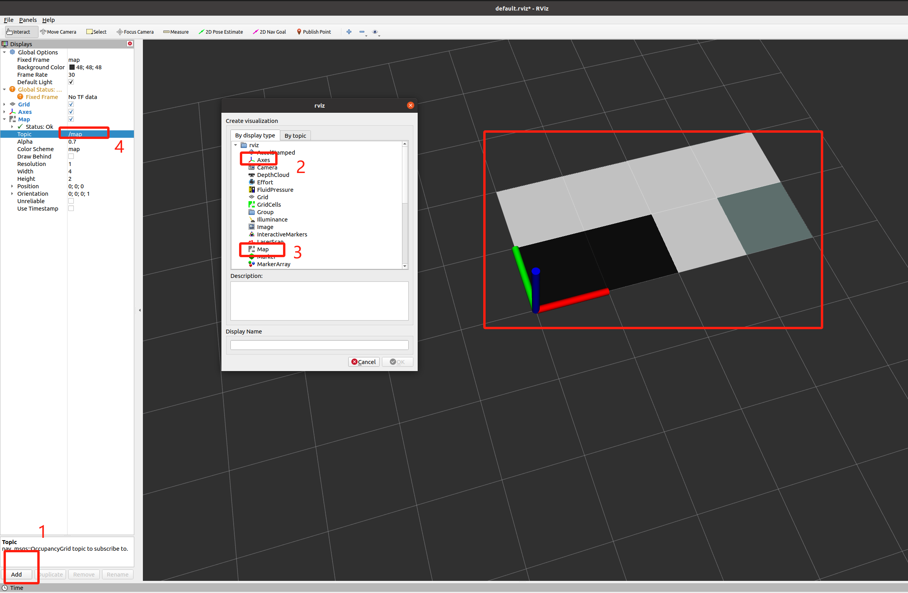

# 1. 环境准备

* ubuntu环境
  * 这里使用的`ubuntu 20.04.3`
  * 镜像名称：ubuntu-20.04.6-desktop-amd64.iso（文件大小：4.05G）
  * 下载地址：http://mirrors.ustc.edu.cn/ubuntu-releases/
* ros1环境
  * 这里使用的是`Noetic版本`。
  * 安装方式：小鱼一键安装

~~~ sh
wget http://fishros.com/install -O fishros && bash fishros
~~~

# 2. 创建项目

以下创建一个示例工程，也基于此工程完成本项目，后续的所有项目创建都是这个流程。

**步骤一：创建工程**

1. 创建一个工作空间文件夹（就是一个工程文件夹）
   1. 工作空间中可以有多个软件包
   2. 软件包中又可以又多个节点

比如这里想创建一个基于泰山派的小车项目，就可以创建下面的文件目录

* TspCarWs
  * src：存放代码，源代码、功能包等

创建一个`TspCarWs`目录作为本项目的工作空间。

~~~ sh
haozi@haozi:~/work/develop$ mkdir TspCarWs
haozi@haozi:~/work/develop$ cd TspCarWs/
haozi@haozi:~/work/develop/TspCarWs$ mkdir src
~~~

**步骤二：创建软件包**

本项目采用上下位机的架构进行设计，上下位机通过通信进行交互和控制，首先实现一个用于控制下位机运动的软件包`lower_ctrl_pkg`。

切换到工作空间的src目录下，执行如下指令：

~~~ sh
catkin_create_pkg 包名 <依赖项1> <依赖项2> ...
~~~

如下：

~~~ sh
haozi@haozi:~/work/develop/TspCarWs/src$ catkin_create_pkg lower_ctrl_pkg rospy roscpp std_msgs
Created file lower_ctrl_pkg/package.xml
Created file lower_ctrl_pkg/CMakeLists.txt
Created folder lower_ctrl_pkg/include/lower_ctrl_pkg
Created folder lower_ctrl_pkg/src
Successfully created files in /home/haozi/work/develop/TspCarWs/src/lower_ctrl_pkg. Please adjust the values in package.xml.
~~~

执行完成后，在src目录下就会多出一个新的目录`catkin_create_pkg`，该目录就是一个包了，包里面又包含了多个文件。

~~~ sh
haozi@haozi:~/work/develop/TspCarWs/src$ ls
lower_ctrl_pkg
haozi@haozi:~/work/develop/TspCarWs/src$ cd lower_ctrl_pkg/
haozi@haozi:~/work/develop/TspCarWs/src/lower_ctrl_pkg$ ls
CMakeLists.txt  include  package.xml  src
~~~

**步骤三：添加代码**

在软件包的src目录下创建代码文件`main.cpp`

~~~ cpp
#include <ros/ros.h>

int main(int argc, char *argv[])
{
    printf("lower_ctrl_node running~ \n");
    
    // 后面的是节点名称
    ros::init(argc, argv, "lower_ctrl_node");

    while(ros::ok())
    {
        printf("lower_ctrl_node running~ \n");
        sleep(1);
    }
    return 0;
}
~~~

在CMakeLists.txt文件中，build部分，找到对应的注释的位置，添加如下两条（没注释掉的是添加的，注释掉的是原有的）。

~~~ cmake
## Declare a C++ executable
## With catkin_make all packages are built within a single CMake context
## The recommended prefix ensures that target names across packages don't collide
# add_executable(${PROJECT_NAME}_node src/lower_ctrl_pkg_node.cpp)
add_executable(lower_ctrl_node src/main.cpp)

## Specify libraries t
o link a library or executable target against
# target_link_libraries(${PROJECT_NAME}_node
#   ${catkin_LIBRARIES}
# )
target_link_libraries(lower_ctrl_node
  ${catkin_LIBRARIES}
)
~~~

其中

add_executable：表示需要编译可执行文件

target_link_libraries：表示需要链接ros库

**步骤四：编译代码**

在工作空间目录（tsp_car_ws）下执行编译命令

~~~ sh
haozi@haozi:~/work/develop/TspCarWs$ pwd
/home/haozi/work/develop/TspCarWs
haozi@haozi:~/work/develop/TspCarWs$ catkin_make
Base path: /home/haozi/work/develop/TspCarWs
Source space: /home/haozi/work/develop/TspCarWs/src
Build space: /home/haozi/work/develop/TspCarWs/build
Devel space: /home/haozi/work/develop/TspCarWs/devel
Install space: /home/haozi/work/develop/TspCarWs/install
####
#### Running command: "make cmake_check_build_system" in "/home/haozi/work/develop/TspCarWs/build"
####
####
#### Running command: "make -j4 -l4" in "/home/haozi/work/develop/TspCarWs/build"
####
[100%] Built target lower_ctrl_node
~~~

编译完成后，工作空间下就会多出来两个文件夹，build、devel

~~~ sh
haozi@haozi:~/work/develop/TspCarWs$ ls
build  devel  src
~~~

* build：编译文件
* devel：执行文件，执行前需要在这里添加源

**步骤五：执行**

启动一个新的终端，启动ros

~~~ sh
roscore
~~~

添加代码源（注意相对目录或者绝对目录）

~~~ sh
haozi@haozi:~/work/develop/TspCarWs$ source devel/setup.bash
~~~

执行代码

~~~ sh
# rosrun：执行
# lower_ctrl_pkg：报名
# lower_ctrl_node：节点名roslaunch launch_pkg all.launch tf
haozi@haozi:~/work/develop/TspCarWs$ rosrun lower_ctrl_pkg lower_ctrl_node
lower_ctrl_node running~
~~~

到这里，创建一个ros软件包，并执行的流程就完成了。

# 3. 小车开发

## 3.1 速度订阅

为了结构化实现功能，我们不会把所有逻辑都放到一个文件中，会按照功能进行划分一下。

还是在`lower_ctrl_pkg`软件包下。

~~~ sh
haozi@haozi:~/work/develop/TspCarWs/src/lower_ctrl_pkg/src$ pwd
/home/haozi/work/develop/TspCarWs/src/lower_ctrl_pkg/src
haozi@haozi:~/work/develop/TspCarWs/src/lower_ctrl_pkg/src$ ls
lower_ctrl.cpp  lower_ctrl.h  main.cpp  uart.cpp  uart.h
~~~

功能如下：

1. main.c：启动功能
2. uart.x：提供和下位机通信的接口
3. lower_ctrl.x：逻辑写在这里

main.cpp

~~~ cpp
#include <ros/ros.h>
#include "lower_ctrl.h"

int main(int argc, char *argv[])
{
    // 防止ROS_INFO中文乱码
    setlocale(LC_CTYPE, "zh_CN.utf8");

    printf("lower_ctrl_node running~ \n");

    // 下位机控制节点
    ros::init(argc, argv, "lower_ctrl_node");

    // 通信串口
    Uart lower_uart("/dev/ttyS3");
    lower_uart.Open(115200, 8, 'N', 1);

    // 下位机控制节点
    LowerCtrl lower_ctrl(lower_uart);
    lower_ctrl.Run();

    return 0;
}
~~~

uart.cpp

~~~ cpp
#include "uart.h"
#include <fcntl.h>   // 用于 open() 函数和文件控制选项
#include <termios.h> // 用于终端I/O接口 (tcgetattr, tcsetattr等)
#include <unistd.h>  // 用于 close(), read(), write() 等系统调用
#include <stdio.h>   // 用于 printf(), perror()
#include <strings.h> // 用于 bzero()

Uart::Uart(const char *name)
{
    fd_ = 0;
    name_ = name;
}

Uart::~Uart()
{
    Close();
}

// 波特率，数据位，是否奇偶校验位，停止位
int Uart::Open(int buad, int nBits, char nEvent, int nStop)
{
    fd_ = open(name_, O_RDWR | O_NOCTTY);

    if (fd_ <= 0)
    {
        printf("open %s failed, not exist or need to chmod!", name_);
        return -1;
    }

    struct termios newtio, oldtio;
    if (tcgetattr(fd_, &oldtio) != 0)
    {
        perror("SetupSerial 1");
        return -2;
    }
    bzero(&newtio, sizeof(newtio));
    newtio.c_cflag |= CLOCAL | CREAD;
    newtio.c_cflag &= ~CSIZE;

    switch (nBits)
    {
    case 7:
        newtio.c_cflag |= CS7;
        break;
    case 8:
        newtio.c_cflag |= CS8;
        break;
    }

    switch (nEvent)
    {
    case 'O':
        newtio.c_cflag |= PARENB;
        newtio.c_cflag |= PARODD;
        newtio.c_iflag |= (INPCK | ISTRIP);
        break;
    case 'E':
        newtio.c_iflag |= (INPCK | ISTRIP);
        newtio.c_cflag |= PARENB;
        newtio.c_cflag &= ~PARODD;
        break;
    case 'N':
        newtio.c_cflag &= ~PARENB;
        break;
    }

    switch (buad)
    {
    case 2400:
        cfsetispeed(&newtio, B2400);
        cfsetospeed(&newtio, B2400);
        break;
    case 4800:
        cfsetispeed(&newtio, B4800);
        cfsetospeed(&newtio, B4800);
        break;
    case 9600:
        cfsetispeed(&newtio, B9600);
        cfsetospeed(&newtio, B9600);
        break;
    case 115200:
        cfsetispeed(&newtio, B115200);
        cfsetospeed(&newtio, B115200);
        break;
    case 460800:
        cfsetispeed(&newtio, B460800);
        cfsetospeed(&newtio, B460800);
        break;
    default:
        cfsetispeed(&newtio, B9600);
        cfsetospeed(&newtio, B9600);
        break;
    }

    if (nStop == 1)
        newtio.c_cflag &= ~CSTOPB;
    else if (nStop == 2)
        newtio.c_cflag |= CSTOPB;

    newtio.c_cc[VTIME] = 10; // 等待时间，0表示永远等待，单位是十分之一秒，10就是1秒
    newtio.c_cc[VMIN] = 0;   // 最小接收字节个数
    tcflush(fd_, TCIFLUSH);

    if ((tcsetattr(fd_, TCSANOW, &newtio)) != 0)
    {
        perror("com set error");
        return -3;
    }

    printf("vtime=%d vmin=%d\n", newtio.c_cc[VTIME], newtio.c_cc[VMIN]);

    return 0;
}

int Uart::Close()
{
    if (fd_ > 0)
        close(fd_);
    return 0;
}

int Uart::Write(uint8_t *data, int len)
{
    if (fd_ <= 0)
    {
        // printf("send_data fd_ error!");
        return -1;
    }

    int cnt = write(fd_, data, len);
    return cnt;
}

int Uart::Read(uint8_t *data, int len)
{
    // 阻塞接收，超时时间1秒（在Open函数中）
    int cnt = read(fd_, data, len);
    return cnt;
}
~~~

uart.h

~~~ cpp
#pragma once

#include <stdint.h>

class Uart
{
public:
    // 串口号
    Uart(const char *name);
    ~Uart();

    // 波特率，数据位，是否奇偶校验位，停止位
    int Open(int buad, int nBits, char nEvent, int nStop);
    int Close();

    // 读写
    int Write(uint8_t *data, int len);
    int Read(uint8_t *data, int len);

private:
    const char *name_;
    int fd_;
};
~~~

然后在`lower_ctrl.x`中实现速度订阅功能

lower_ctrl.h

~~~ h
#pragma once

#include <ros/ros.h>
#include <std_msgs/String.h>     // 标准消息
#include <geometry_msgs/Twist.h> // 速度消息

#include "uart.h"

class LowerCtrl
{
public:
    LowerCtrl(Uart &uart);
    ~LowerCtrl();

    ros::NodeHandle nh_; // 节点管理工具
    ros::Subscriber tar_speed_sub_;                                 // 订阅目标速度
    void CmdVelCallback(const geometry_msgs::Twist::ConstPtr &msg); // 收到目标速度的响应

    void Run();

private:
    Uart &uart_;
};
~~~

lower_ctrl.cpp

~~~ cpp
#include "lower_ctrl.h"

LowerCtrl::LowerCtrl(Uart &uart) : uart_(uart)
{
    tar_speed_sub_ = nh_.subscribe("/cmd_vel", 10, &LowerCtrl::CmdVelCallback, this); // 订阅目标速度
}

LowerCtrl::~LowerCtrl()
{
}

// 速度指令订阅回调函数
void LowerCtrl::CmdVelCallback(const geometry_msgs::Twist::ConstPtr &msg)
{
    ROS_INFO("tar linear = %f(m/s), angular = %f(rad/s) ~ \n", msg->linear.x, msg->angular.z);
}

void LowerCtrl::Run()
{
    int ret;

    // 20ms执行一次
    ros::Rate loop_rate(50);

    while (ros::ok())
    {
        ros::spinOnce();

        // 延时（约等于 sleep）
        loop_rate.sleep();
    }
}
~~~

这样的写法在CMakeLists.txt中也要修改，将新增的几个文件也添加上。

~~~ txt
add_executable(lower_ctrl_node 
  src/uart.cpp  
  src/lower_ctrl.cpp 
  src/main.cpp 
)
~~~

## 3.2 速度发布

另起一个软件包用来发布速度

~~~ sh
haozi@haozi:~/work/develop/TspCarWs$ cd src/
haozi@haozi:~/work/develop/TspCarWs/src$ catkin_create_pkg move_ctrl_pkg rospy roscpp std_msgs
Created file move_ctrl_pkg/package.xml
Created file move_ctrl_pkg/CMakeLists.txt
Created folder move_ctrl_pkg/include/move_ctrl_pkg
Created folder move_ctrl_pkg/src
Successfully created files in /home/haozi/work/develop/TspCarWs/src/move_ctrl_pkg. Please adjust the values in package.xml.
~~~

软件包中创建`main.cpp`，代码如下，其余操作流程同上

~~~ cpp
#include <ros/ros.h>
#include <std_msgs/String.h>
#include <geometry_msgs/Twist.h> // 速度消息

int main(int argc, char *argv[])
{
    printf("move_ctrl_node running~ \n");

    // 下位机控制节点
    ros::init(argc, argv, "move_ctrl_node");

    // 节点管理工具
    ros::NodeHandle nh;
    // 创建一个发布者，话题名称为cmd_vel, 队列长度为10
    ros::Publisher cmd_vel_pub = nh.advertise<geometry_msgs::Twist>("/cmd_vel", 10);

    // 创建一个频率控制对象,每秒循环10次
    ros::Rate loop_rate(10);

    while (ros::ok())
    {
        geometry_msgs::Twist vel_cmd;
        vel_cmd.linear.x = 0.1;
        vel_cmd.linear.y = 0.0;
        vel_cmd.linear.z = 0.0;
        vel_cmd.angular.x = 0.0;
        vel_cmd.angular.y = 0.0;
        vel_cmd.angular.z = 0.0;
        cmd_vel_pub.publish(vel_cmd);   // 发布

        // 延时（约等于 sleep）
        loop_rate.sleep();
    }
    return 0;
}
~~~

## 3.3 查看消息

将两个软件包中的两个节点都运行起来

* `rostopic list`：查看当前存在的话题
* `rostopic echo 话题名`：查看当前话题发布的消息
* `rqt_graph`：查看话题之间的关系（需要图像显示）

~~~ sh
haozi@haozi:~/work/develop/TspCarWs/src/lower_ctrl_pkg/src$ rostopic list
/cmd_vel
/rosout
/rosout_agg
haozi@haozi:~/work/develop/TspCarWs/src/lower_ctrl_pkg/src$ rostopic echo /cmd_vel
linear: 
  x: 0.1
  y: 0.0
  z: 0.0
angular: 
  x: 0.0
  y: 0.0
  z: 0.0
---
~~~

## 3.4 Launch启动

当软件包和节点多了之后，一个个启动节点需要很多很多命令，因此需要一个能同时启动多个节点的工具。

1. 重新创建一个软件包，`launch_pkg`
2. 在软件包中创建一个launch文件夹
3. 文件夹中创建一个`all.launch`文件

结果如下

~~~ sh
haozi@haozi:~/work/develop/TspCarWs/src$ catkin_create_pkg launch_pkg rospy roscpp std_msgs
haozi@haozi:~/work/develop/TspCarWs/src$ cd launch_pkg/
haozi@haozi:~/work/develop/TspCarWs/src/launch_pkg$ mkdir launch
haozi@haozi:~/work/develop/TspCarWs/src/launch_pkg$ cd launch/
haozi@haozi:~/work/develop/TspCarWs/src/launch_pkg/launch$ ls
all.launch
~~~

文件中的内容如下，每一条都表示需要启动这个包中的一个节点。

~~~ xml
<launch>
    <node pkg="lower_ctrl_pkg" type="lower_ctrl_node" name="lower_ctrl_node"/>
    <node pkg="move_ctrl_pkg" type="move_ctrl_node" name="move_ctrl_node" output="screen"/>
</launch>
~~~

> output="screen"：表示将信息输出到屏幕。

完成后编译工作空间，编译完成后，使用如下命令即可直接启动所有软件包。

~~~ sh
roslaunch <包名> <launch文件名>
~~~

结果如下

~~~ sh
haozi@haozi:~/work/develop/ros1/tsp_car_ws$ roslaunch launch_pkg all.launch 
... logging to /home/haozi/.ros/log/82134f94-36e0-11f0-bea8-1303c288b02a/roslaunch-haozi-15144.log
Checking log directory for disk usage. This may take a while.
Press Ctrl-C to interrupt
Done checking log file disk usage. Usage is <1GB.

started roslaunch server http://haozi:42535/

SUMMARY
========

PARAMETERS
 * /rosdistro: noetic
 * /rosversion: 1.17.3

NODES
  /
    lower_ctrl_node (lower_ctrl_pkg/lower_ctrl_node)
    move_ctrl_node (move_ctrl_pkg/move_ctrl_node)

auto-starting new master
process[master]: started with pid [15155]
ROS_MASTER_URI=http://localhost:11311

setting /run_id to 82134f94-36e0-11f0-bea8-1303c288b02a
process[rosout-1]: started with pid [15165]
started core service [/rosout]
process[lower_ctrl_node-2]: started with pid [15168]
process[move_ctrl_node-3]: started with pid [15173]
~~~

> 实际上，这个launch文件，放在任意一个软件包里都可以，但是为了代码结构清晰，就创建了一个空的软件包来干这件事了。

## 3.5 雷达数据发送

激光雷达数据格式

* sensor_msgs::LaserScan
  * header
    * frame_id：坐标系基准
    * stamp：本次扫描中接收到第一束反射信号的时间
  * angle_min：扫描的其实角度，弧度
  * angle_max：扫描的终止角度，弧度
  * angle_increment：相邻两次测距的旋转夹角，弧度
  * time_increment：相邻两次测距的时间差，秒
  * scan_time：两次扫描的起始时间差，秒
  * range_min：有效测距范围的最小距离，米
  * range_max：有效测距范围的最大距离，米
  * ranges[]：本次扫描的所有测距值，米
  * intensities[]：所有测距值返回的信号强度

创建雷达数据软件包，用于发送激光雷达数据

~~~ sh
haozi@haozi:~/work/develop/TspCarWs/src$ catkin_create_pkg lidar_pkg roscpp rospy sensor_msgs
Created file lidar_pkg/package.xml
Created file lidar_pkg/CMakeLists.txt
Created folder lidar_pkg/include/lidar_pkg
Created folder lidar_pkg/src
Successfully created files in /home/haozi/work/develop/TspCarWs/src/lidar_pkg. Please adjust the values in package.xml.
~~~

并在软件包中创建五个文件

~~~ sh
haozi@haozi:~/work/develop/TspCarWs/src/lidar_pkg/src$ ls
m1c1_mini.cpp  m1c1_mini.h  main.cpp  uart.cpp  uart.h
~~~

其中uart.x参考前面速度订阅的串口操作接口，内容相同。

雷达消息接口如下：

m1c1_mini.h

~~~ h
#pragma once

#include <ros/ros.h>
#include <std_msgs/Bool.h>	 // 标准消息
#include <std_msgs/String.h> // 标准消息

#include "uart.h"

/* 雷达消息结构 */
#define PKG_LEN_MIN 12
#define PKG_LEN_MAX 60
#define POINT_NUM_MAX_IN_A_PKG 25 // 一包最多25个点
#pragma pack(1)
typedef struct
{
	uint8_t head1;		  // 数据头1 0xAA
	uint8_t head2;		  // 数据头2 0x55
	uint8_t points_type;  // 点云类型1--每圈起始点;0--非一圈起始点
	uint8_t points_num;	  // 点云个数 结构体总长度 = 10 + points_num * 2
	uint16_t start_angle; // 起始角度
	uint16_t end_angle;	  // 结束角度
	uint16_t check_code;  // 校验
	uint16_t data[POINT_NUM_MAX_IN_A_PKG];
} LidarData;
#pragma pack()

class Lidar
{
public:
	Lidar(Uart &uart);
	~Lidar();

	int ReadData(std::string &lidar_data);

	ros::NodeHandle nh_;	   // 节点管理工具
	ros::Publisher lidar_pub_; // 发布雷达数据
	void Run();

private:
	Uart &uart_;
	LidarData lidar_data_;
};
~~~

m1c1_mini.cpp

~~~ cpp
#include "m1c1_mini.h"
#include <sensor_msgs/LaserScan.h>

Lidar::Lidar(Uart &uart) : uart_(uart)
{
    lidar_pub_ = nh_.advertise<sensor_msgs::LaserScan>("/scan", 10); // 发布雷达数据
}

Lidar::~Lidar()
{
}

int Lidar::ReadData(std::string &lidar_data)
{
    int recv_cnt = 0;

    // 先清空雷达数据
    lidar_data.clear();

    // 先寻找数据头，0xAA 0x55
    uint8_t buffer[100] = {0};
    for (int c = 0; c < 100; c++) // 最多尝试100次寻找AA 55开头
    {
        // 阻塞接收，超时时间1s
        recv_cnt = uart_.Read(&buffer[1], 1);
        if (recv_cnt != 1)
            return -1;

        // 逐个字节依次插入lidar_data
        lidar_data.append((char *)(&buffer[1]), 1);

        // 已经找到数据头了
        if (buffer[0] == 0xAA && buffer[1] == 0x55)
            break;

        buffer[0] = buffer[1];

        // 长度过长则返回
        if (lidar_data.size() >= 100)
        {
            printf("lidar_data100: ");
            for (int i = 0; i < lidar_data.size(); i++)
                printf("%02x ", (unsigned char)lidar_data.data()[i]);
            printf("\n");
            return -2;
        }
    }

    // 删除数据头前面的部分，有可能是错误的数据，也有可能是上一包的部分
    // 只保留末尾两个字母AA 55作为数据头
    if (lidar_data.size() > 2)
        lidar_data = lidar_data.substr(lidar_data.size() - 2);

    // 再读取两个字节 点云类型 和 点云点数(1~25)
    recv_cnt = uart_.Read(&buffer[0], 2);
    if (recv_cnt < 2)
        return -1;

    // 把读到的数据添加到消息
    lidar_data.append((char *)(&buffer[0]), 2);

    // 判断点云类型 只能是0或1
    if ((lidar_data.data()[2] != 0) && (lidar_data.data()[2] != 1))
        return -4;

    // 点云点数只会在1~25之间
    if (lidar_data.data()[3] > 25 || lidar_data.data()[3] < 1)
    {
        for (int i = 0; i < lidar_data.size(); i++)
            printf("%02x ", (unsigned char)lidar_data.data()[i]);
        printf("\n");
        return -5;
    }

    // 判断本包数据中 数据部分的长度
    int data_len = 10 + lidar_data.data()[3] * 2 - lidar_data.size();
    // 计算出的长度过长或过短，则返回错误
    if (data_len > 100 || data_len < 5)
        return -6;

    // 读取数据部分
    recv_cnt = uart_.Read(&buffer[0], data_len);
    if (recv_cnt < data_len)
    {
        // printf("read_len=%d < need_read_len=%d !\n",read_len,need_read_len);
        return -1;
    }
    lidar_data.append((char *)(&buffer[0]), data_len);

    // 如果长度不正确
    if (lidar_data.size() != 10 + lidar_data.data()[3] * 2)
    {
        printf("read len %ld != points num %d *2+10 error!\n", lidar_data.size(), lidar_data.data()[3]);
        for (int i = 0; i < lidar_data.size(); i++)
            printf("%02x ", (unsigned char)lidar_data.data()[i]);
        printf("\n");
        return -7;
    }

    return 0;
}

void Lidar::Run()
{
    int ret = 0;
    int start_cnt = 0;

    /* 创建雷达数据 */
    float laser_min_range = 0.1; // 雷达最小量程
    float laser_max_range = 8.0; // 雷达最大量程
    int points_size = 800;       // 修正和插值到800点(本身390个点左右)
    sensor_msgs::LaserScan laser_scan;
    laser_scan.header.frame_id = "laser_link";
    laser_scan.angle_min = 0;
    laser_scan.angle_max = 2 * M_PI;
    laser_scan.angle_increment = (laser_scan.angle_max - laser_scan.angle_min) / points_size;
    laser_scan.range_min = laser_min_range;
    laser_scan.range_max = laser_max_range;
    laser_scan.ranges.resize(points_size);
    std::fill(laser_scan.ranges.begin(), laser_scan.ranges.end(), std::numeric_limits<float>::infinity()); // 全部填充为无限远
    laser_scan.intensities.resize(points_size, 127);                                                       // 假设强度值为127

    std::string lidar_str_data;

    while (ros::ok())
    {
        ros::spinOnce();

        // 读取雷达数据
        ret = ReadData(lidar_str_data);
        if (ret < 0) // 报错，则重新读取
        {
            if (ret != -1) // 雷达断电后会返回-1
                ROS_WARN("read_lidar_data ret=%d", ret);
            continue;
        }

        // 校验数据长度
        if (lidar_str_data.size() < PKG_LEN_MIN || lidar_str_data.size() > PKG_LEN_MAX)
        {
            ROS_WARN("lidar_str_data size %ld error!", lidar_str_data.size());
            continue;
        }

        // 拷贝进数据包结构体
        memcpy(&lidar_data_, lidar_str_data.data(), lidar_str_data.size());

        // 每圈起始点，发布上一圈的数据
        if (lidar_data_.points_type == 1)
        {
            if (start_cnt < 10) // 前10圈数据丢弃
            {
                start_cnt++;
                continue;
            }

            laser_scan.header.stamp = ros::Time::now();
            // 发布Lidat Scan消息
            lidar_pub_.publish(laser_scan);
            ROS_INFO_ONCE("Published LaserScan OK");

            // 必须给每个点刷入无效数据，防止下一圈产生重影, 全部填充为无限远
            std::fill(laser_scan.ranges.begin(), laser_scan.ranges.end(), std::numeric_limits<float>::infinity());
        }

        // 开始解析数据包结构体中的数据
        float start_angle0 = (lidar_data_.start_angle >> 1) / 64.0;
        float end_angle0 = (lidar_data_.end_angle >> 1) / 64.0;
        // float start_angle = start_angle0-ang_corr_1;
        // float end_angle = end_angle0-ang_corr_n;

        float ang_corr_i, distance_mm_i, angle_i;
        for (int i = 0; i < lidar_data_.points_num; i++)
        {
            // 解析距离：单位mm
            distance_mm_i = lidar_data_.data[i] >> 2;

            // 根据距离来求修正角度
            ang_corr_i = (distance_mm_i == 0) ? 0 : atan(19.16 * (distance_mm_i - 90.15) / (90.15 * distance_mm_i)) * 180.0 / M_PI;

            if (lidar_data_.points_num != 1) // 分母不能为0
                angle_i = start_angle0 + (end_angle0 - start_angle0) / (lidar_data_.points_num - 1) * i - ang_corr_i;
            else
                angle_i = start_angle0 - ang_corr_i;

            angle_i = 180.0 - (angle_i + 12.0); // 12度是雷达手册中写的固有偏差，180是和雷达安装朝向有关

            // 角度限制在[0,360]度之间
            angle_i = fmod(angle_i, 360.0);                        // 使用fmod函数计算角度对360的余数
            angle_i = (angle_i < 0) ? (angle_i + 360.0) : angle_i; // 如果结果是负数，则加上360使其变为正数

            // printf("%.2f(%.2f)\n",distance_mm_i,angle_i);

            // 考虑到角度修正之后填充，并且插值到800点
            int new_i = angle_i / 360.0 * (points_size - 1) + 0.5; // 索引最大不能到points_size，而是points_size-1
            laser_scan.ranges[new_i] = distance_mm_i / 1000.0;     // 填充到LaserScan消息中
        }
    }
}
~~~

main.cpp

~~~ cpp
#include <ros/ros.h>
#include "m1c1_mini.h"

int main(int argc, char *argv[])
{
    // 防止ROS_INFO中文乱码
    setlocale(LC_CTYPE, "zh_CN.utf8");

    // 下位机控制节点
    ros::init(argc, argv, "lidar_node");

    // 通信串口
    Uart lidar_uart("/dev/ttyS5");
    lidar_uart.Open(115200, 8, 'N', 1);

    // 下位机控制节点
    Lidar lidar(lidar_uart);
    lidar.Run();

    return 0;
}
~~~

> 雷达消息话题名一般默认为：`/scan`

## 3.6 雷达数据处理

创建一个新的软件包`lidar_handle_pkg`

~~~ sh
haozi@haozi:~/work/develop/TspCarWs/src$ catkin_create_pkg lidar_handle_pkg roscpp rospy sensor_msgs
Created file lidar_handle_pkg/package.xml
Created file lidar_handle_pkg/CMakeLists.txt
Created folder lidar_handle_pkg/include/lidar_handle_pkg
Created folder lidar_handle_pkg/src
Successfully created files in /home/haozi/work/develop/TspCarWs/src/lidar_handle_pkg. Please adjust the values in package.xml.
~~~

暂时只创建一个main文件，测试接收到的激光雷达发送的数据，并判断前方障碍物的距离。

main.cpp

~~~ cpp
#include <ros/ros.h>
#include <sensor_msgs/LaserScan.h>

void LidarCallback(const sensor_msgs::LaserScan msg)
{
    float fMidDist = msg.ranges[180];
    ROS_INFO("前方距离：ranges[180] = %f 米", fMidDist);
}

int main(int argc, char *argv[])
{
    // 防止ROS_INFO中文乱码
    setlocale(LC_CTYPE, "zh_CN.utf8");

    // 下位机控制节点
    ros::init(argc, argv, "lidar_handle_node");

    ros::NodeHandle nh_;                                                     // 节点管理工具
    ros::Subscriber lidar_sub_ = nh_.subscribe("/scan", 10, &LidarCallback); // 订阅雷达数据

    ros::spin();

    return 0;
}
~~~

添加避障逻辑方法，判断当障碍物距离过近时，发送速度消息，控制小车避开。

~~~ cpp
#include <ros/ros.h>
#include <sensor_msgs/LaserScan.h>
#include <geometry_msgs/Twist.h> // 速度消息

ros::Publisher vel_pub;

void LidarCallback(const sensor_msgs::LaserScan msg)
{
    float fMidDist = msg.ranges[180];
    ROS_INFO("前方距离：ranges[180] = %f 米", fMidDist);

    geometry_msgs::Twist vel_cmd;
    if (fMidDist < 1.5)
    {
        vel_cmd.angular.z = 0.5;
    }
    else
    {
        vel_cmd.linear.x = 0.05;
    }

    vel_pub.publish(vel_cmd);
}

int main(int argc, char *argv[])
{
    // 防止ROS_INFO中文乱码
    setlocale(LC_CTYPE, "zh_CN.utf8");

    // 下位机控制节点
    ros::init(argc, argv, "lidar_handle_node");

    ros::NodeHandle nh_;                                                     // 节点管理工具
    ros::Subscriber lidar_sub_ = nh_.subscribe("/scan", 10, &LidarCallback); // 订阅雷达数据

    vel_pub = nh_.advertise<geometry_msgs::Twist>("/cmd_vel", 10);

    ros::spin();

    return 0;
}
~~~

## 3.7 栅格地图

创建一个软件包`map_pkg`，用来发布地图数据。

~~~ sh
haozi@haozi:~/work/develop/TspCarWs/src$ catkin_create_pkg map_pkg roscpp rospy nav_msgs
Created file map_pkg/package.xml
Created file map_pkg/CMakeLists.txt
Created folder map_pkg/include/map_pkg
Created folder map_pkg/src
Successfully created files in /home/haozi/work/develop/TspCarWs/src/map_pkg. Please adjust the values in package.xml.
~~~

只创建一个main文件，发布一个固定的地图。

main.cpp

~~~ cpp
#include <ros/ros.h>
#include <nav_msgs/OccupancyGrid.h>

int main(int argc, char *argv[])
{
    // 防止ROS_INFO中文乱码
    setlocale(LC_CTYPE, "zh_CN.utf8");

    // 下位机控制节点
    ros::init(argc, argv, "map_pub_node");

    ros::NodeHandle nh_;                                                            // 节点管理工具
    ros::Publisher map_pub_ = nh_.advertise<nav_msgs::OccupancyGrid>("/map", 10); // 发布地图数据

    // 每秒一次
    ros::Rate r(1);

    while (ros::ok())
    {
        nav_msgs::OccupancyGrid msg;

        msg.header.frame_id = "map";
        msg.header.stamp = ros::Time::now();

        msg.info.origin.position.x = 0;
        msg.info.origin.position.y = 0;
        msg.info.resolution = 1.0; // 栅格分辨率（每个格子1米）
        msg.info.width = 4;        // 地图宽度（格子数）
        msg.info.height = 2;       // 地图高度（格子数）

        msg.data.resize(4 * 2); // 地图数据
        msg.data[0] = 100;
        msg.data[1] = 100;
        msg.data[2] = 0;
        msg.data[3] = -1;

        map_pub_.publish(msg);
        r.sleep();
    }
    return 0;
}
~~~

将软件包运行起来。

然后启动rviz工具，查看发布的栅格地图。

~~~ sh
haozi@haozi:~/work/develop/TspCarWs$ rviz
~~~

启动rviz之后，添加一个地图原点`Axes`，添加一个地图`map`，并将地图消息类型`Topic`修改为`/map`，就可以看到发布的测试消息了。

## 3.8 SLAM

地图创建流程为：

1. 激光雷达节点，发布雷达数据`/scan`
2. SLAM节点，接收雷达数据`/scan`，发送地图数据`/map`
3. 其他节点，接收地图数据`/map`

也就是，SLAM节点接收雷达数据后，经过处理就可以得到地图数据了。

其中SLAM节点有现成的软件包可以用，比如`Hector_Mapping`

### 3.8.1 Hector_Mapping

安装软件包

~~~ sh
haozi@haozi:~/work/develop/TspCarWs$ sudo apt install ros-noetic-hector-mapping
~~~

运行Hector_Mapping节点

~~~ sh
haozi@haozi:~/work/develop/TspCarWs$ rosrun hector_mapping hector_mapping
~~~

rviz查看建图数据

~~~ sh
haozi@haozi:~$ rosrun rviz rviz
~~~

创建一个新的软件包`slam_pkg`

~~~ sh
haozi@haozi:~/work/develop/TspCarWs/src$ catkin_create_pkg slam_pkg roscpp rospy std_msgs
Created file slam_pkg/package.xml
Created file slam_pkg/CMakeLists.txt
Created folder slam_pkg/include/slam_pkg
Created folder slam_pkg/src
Successfully created files in /home/haozi/work/develop/TspCarWs/src/slam_pkg. Please adjust the values in package.xml.
~~~

