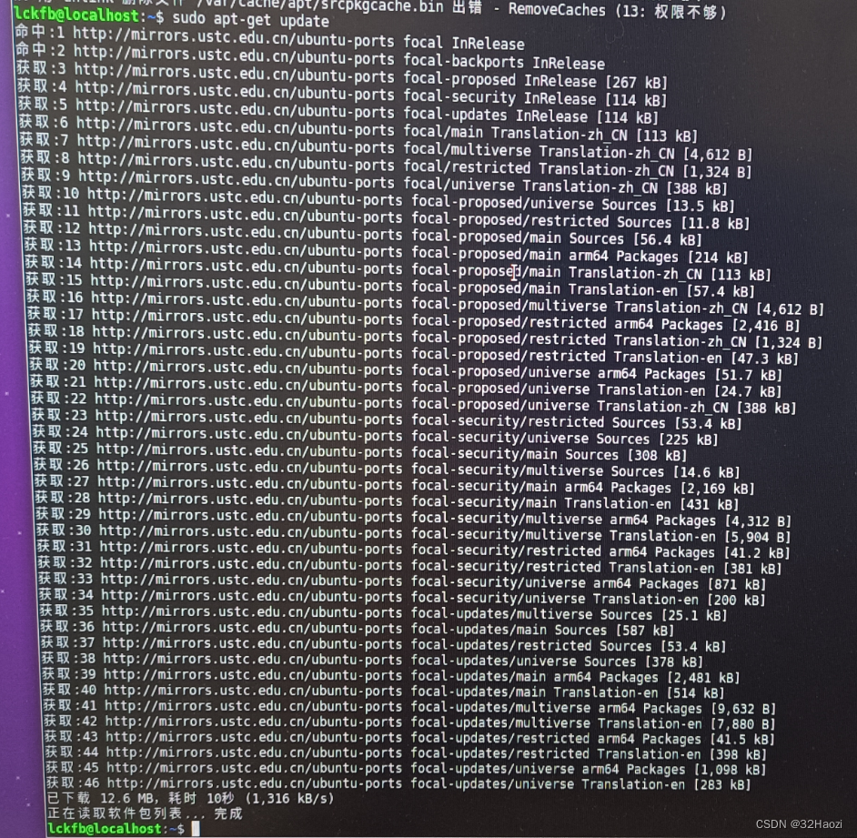

# 1. 上位机准备

## 1.1 官方镜像

从官方资料中下载Ubuntu20系统镜像`ubuntu20.04_hdmi_20231130_update.img`，并按照官方教程烧录。

镜像地址：https://wiki.lckfb.com/zh-hans/tspi-rk3566/download-center.html

烧录完成后，板子上就有Ubuntu系统了。

## 1.2 内核修改

默认镜像中仅引出一个用户可以使用的串口，上位机需要的端口如下：

* 下位机通信，串口
* 雷达通信，串口
* 其他，用到了再说，非必须

最基础的功能，控制**下位机控制、雷达通信**还差一个串口。

因此需要修改内核配置：

> 编译过程参考：https://wiki.lckfb.com/zh-hans/tspi-rk3566/project-case/fat-little-cell-phone/sdk-compile.html

文件需要做的修改如下：

1. 调试串口波特率修改（非必须）

找到下面这个文件

~~~ sh
tsp/kernel/arch/arm64/boot/dts/rockchip/tspi-rk3566-core-v10.dtsi
~~~

修改下面这段，把调试串口波特率从1500000修改位115200。非必须。

~~~ dtsi
	fiq-debugger {
		compatible = "rockchip,fiq-debugger";
		rockchip,serial-id = <2>;
		rockchip,wake-irq = <0>;
		/* If enable uart uses irq instead of fiq */
		rockchip,irq-mode-enable = <1>;
		rockchip,baudrate = <115200>;  /* Only 115200 and 1500000 */
		interrupts = <GIC_SPI 252 IRQ_TYPE_LEVEL_LOW>;
		pinctrl-names = "default";
		pinctrl-0 = <&uart2m0_xfer>;
		status = "okay";
	};
~~~

2. 添加一个串口（必须）

板子上引出的排针功能定义如下，选择一个合适的串口使用，此处使用`串口5`。

> 引脚定义：https://wiki.lckfb.com/zh-hans/tspi-rk3566/documentation/io-allocation-table.html

找到下面这个文件

~~~ sh
tsp/kernel/arch/arm64/boot/dts/rockchip/tspi-rk3566-user-v10-linux.dts
~~~

找到串口3的位置，将其复制一份，然后将3修改为5即可。

~~~ dtsi
//用户串口3
&uart3 {
	status = "okay";
	pinctrl-names = "default";
	pinctrl-0 = <&uart3m1_xfer>;
};

//用户串口5（新添加的）
&uart5 {
	status = "okay";
	pinctrl-names = "default";
	pinctrl-0 = <&uart5m1_xfer>;
};
~~~

然后按照教程中的步骤，**只编译内核，生成boot.img文件**即可，然后单独将boot.img烧录进板子。

> 烧录方法同样参考官方资料，比较简单。

烧录完成之后，板子上就的串口5就也可以用了，可以先接个串口工具试试能不能使用串口5收发数据。

## 1.3 空间分配

镜像烧录后，16G的EMMC空间有很大一部分都是空闲的，不能被直接使用，可用的空间还不够安装ROS的，因此需要将空闲的空间重新分配一下。

> 以下步骤需要将泰山派连接屏幕，下面的图片是最早的时候拍的，如果你按照我的流程生成的镜像，用户名可能不是这个。

在shell窗口中安装分配工具

~~~ sh
sudo apt-get install gparted
~~~

使用下面命令启动磁盘分配工具，将磁盘`oem`和`userdata`右键`取消挂载`，再右键`删除`。

~~~ sh
sudo gparted
~~~

将删除掉的空间分配给`rootfs`，右键选择Resize。

完成之后，即可看到效果，点击对号应用即可。

查看磁盘空间，已分配完成。

## 1.4 安装SSH

更新包

~~~ sh
sudo apt-get update
~~~

安装服务

~~~ sh
sudo apt-get install openssh-server
~~~

提示依赖关系不对时，提示需要哪个版本就安装哪个版本。

安装完成之后，将泰山派连接一个WIFI，使用ifconfig命令查看一下板子的IP地址，并记录一下。

~~~ sh
ifconfig
~~~

> 上面的步骤完成之后，就不再需要屏幕了，后续的步骤就可以使用SSH远程连接实现了。

## 1.5 安装ROS

这里使用小鱼的一键安装，方便省力。

~~~ sh
wget http://fishros.com/install -O fishros && bash fishros
~~~

~~~ sh
lckfb@MiWiFi-R3GV2-srv:~$
lckfb@MiWiFi-R3GV2-srv:~$ wget http://fishros.com/install -O fishros && bash fishros
--2025-05-24 16:05:00--  http://fishros.com/install

# 省略一堆文字
# 等待弹出选项

ROS相关:
  [1]:一键安装(推荐):ROS(支持ROS/ROS2,树莓派Jetson)
  [3]:一键安装:rosdep(小鱼的rosdepc,又快又好用)
  [4]:一键配置:ROS环境(快速更新ROS环境设置,自动生成环境选择)
  [9]:一键安装:Cartographer(18 20测试通过,16未测. updateTime 20240125)
  [11]:一键安装:ROS Docker版(支持所有版本ROS/ROS2)
  [16]:一键安装：系统自带ROS (！！警告！！仅供特殊情况下使用)

常用软件:
  [2]:一键安装:github桌面版(小鱼常用的github客户端)
  [6]:一键安装:NodeJS环境
  [7]:一键安装:VsCode开发工具
  [8]:一键安装:Docker
  [10]:一键安装:微信(可以在Linux上使用的微信)
  [12]:一键安装:PlateformIO MicroROS开发环境(支持Fishbot)
  [15]:一键安装：QQ for Linux

配置工具:
  [5]:一键配置:系统源(更换系统源,支持全版本Ubuntu系统)
  [13]:一键配置:python国内源
  [17]:一键配置: Docker代理(支持VPN+代理服务两种模式)

[0]:quit

请输入[]内的数字以选择:1

# 输入1 选择安装ros

# 省略一堆文字
# 等待弹出选项

RUN Choose Task:[请输入括号内的数字]
新手或首次安装一定要一定要一定要换源并清理三方源，换源!!!系统默认国外源容易失败!!
[1]:更换系统源再继续安装
[2]:不更换继续安装
[0]:quit
请输入[]内的数字以选择:1
RUN Choose Task:[请输入括号内的数字]
请选择换源方式,如果不知道选什么请选2
[1]:仅更换系统源
[2]:更换系统源并清理第三方源
[0]:quit
请输入[]内的数字以选择:2

# 分别输入1、2

# 省略一堆文字
# 等待弹出选项

RUN Choose Task:[请输入括号内的数字]
请选择你要安装的ROS版本名称(请注意ROS1和ROS2区别):
[1]:foxy(ROS2)
[2]:galactic(ROS2)
[3]:noetic(ROS1)
[4]:rolling(ROS2)
[0]:quit
请输入[]内的数字以选择:3
RUN Choose Task:[请输入括号内的数字]
请选择安装的具体版本(如果不知道怎么选,请选1桌面版):
[1]:noetic(ROS1)桌面版
[2]:noetic(ROS1)基础版(小)
[0]:quit
请输入[]内的数字以选择:1

# 分别输入3、1；这里很重要安装的版本一定不要选错
# 然后开始等待
~~~

等待一段时间后，第一次提示软件包依赖不对，这里先敲回车继续。

~~~ sh
============================================================
请注意我，检测你在安装过程中出现依赖问题，请在稍后输入n,再选择y,即可解决（若无法解决，清在稍后手动运行命令: sudo aptitude install ros-noetic-desktop-full)
确认了解情况，请输入回车继续安装

# 第一次弹出上面的框，直接敲回车继续
# 片刻后，第一次弹出推荐方案。

是否接受该解决方案？[Y/n/q/?] n

# 输入n敲回车，拒绝第一次的方案。
# 片刻后，第二次弹出推荐方案。

是否接受该解决方案？[Y/n/q/?] Y

# 输入Y敲回车，接收第二次的方案。
# 片刻后，弹出要安装的包需要确认。

40 个软件包被升级，新安装 1025 个， 1 个将被删除， 同时 199 个将不升级。
需要获取 575 MB 的存档。 解包后将要使用 3,812 MB。
您要继续吗？[Y/n/?] Y

# 输入Y确认即可。
# 然后就是漫长漫长漫长漫长漫长漫长的等待

# 最后看到下面这句话 就安装完成了

恭喜你，安装成功了，再附赠你机器人学习宝藏网站：鱼香社区:https://fishros.org.cn/forum
Run CMD Task:[ls /opt/ros/noetic/setup.bash]
[-][0.01s] CMD Result:success

小鱼，黄黄的提示：您安装的是ROS1，可以打开一个新的终端输入roscore测试！
~~~

> 如果，这里第二次接受方案，然后往下走还是报错了，那就从头来，然后前两次都拒绝，第三次再接受。如果还失败，就再从头来，第四次再接受。 

安装完成后，重新起一个终端，输入`roscore`指令，能看到如下信息，就表示ros安装完成了。

~~~ sh
lckfb@MiWiFi-R3GV2-srv:~$ roscore
... logging to /home/lckfb/.ros/log/1647e6b0-38bd-11f0-b3d3-b81332af56be/roslaunch-MiWiFi-R3GV2-srv-16753.log
Checking log directory for disk usage. This may take a while.
Press Ctrl-C to interrupt
Done checking log file disk usage. Usage is <1GB.

started roslaunch server http://MiWiFi-R3GV2-srv:35197/
ros_comm version 1.17.3

SUMMARY
========

PARAMETERS
 * /rosdistro: noetic
 * /rosversion: 1.17.3

NODES

auto-starting new master
process[master]: started with pid [16761]
ROS_MASTER_URI=http://MiWiFi-R3GV2-srv:11311/

setting /run_id to 1647e6b0-38bd-11f0-b3d3-b81332af56be
process[rosout-1]: started with pid [16771]
started core service [/rosout]
~~~

## 1.6 安装Vscode

非必须。

Vscode其实相对好装，但是这里还是使用一键安装命令，省时省力。

~~~ sh
wget http://fishros.com/install -O fishros && bash fishros
~~~

~~~ sh
lckfb@MiWiFi-R3GV2-srv:~$ wget http://fishros.com/install -O fishros && bash fishros
--2025-05-25 08:07:07--  http://fishros.com/install

# 稍等片刻，然后选择数字7即可

ROS相关:
  [1]:一键安装(推荐):ROS(支持ROS/ROS2,树莓派Jetson)
  [3]:一键安装:rosdep(小鱼的rosdepc,又快又好用)
  [4]:一键配置:ROS环境(快速更新ROS环境设置,自动生成环境选择)
  [9]:一键安装:Cartographer(18 20测试通过,16未测. updateTime 20240125)
  [11]:一键安装:ROS Docker版(支持所有版本ROS/ROS2)
  [16]:一键安装：系统自带ROS (！！警告！！仅供特殊情况下使用)

常用软件:
  [2]:一键安装:github桌面版(小鱼常用的github客户端)
  [6]:一键安装:NodeJS环境
  [7]:一键安装:VsCode开发工具
  [8]:一键安装:Docker
  [10]:一键安装:微信(可以在Linux上使用的微信)
  [12]:一键安装:PlateformIO MicroROS开发环境(支持Fishbot)
  [15]:一键安装：QQ for Linux

配置工具:
  [5]:一键配置:系统源(更换系统源,支持全版本Ubuntu系统)
  [13]:一键配置:python国内源
  [17]:一键配置: Docker代理(支持VPN+代理服务两种模式)

[0]:quit

请输入[]内的数字以选择:7

# 然后等待安装完成即可
~~~

# 2. 下位机开发

下位机一共需要实现以下功能：

1. 串口接收上位机发送的目标电机速度，使用PID调节电机速度，保持速度稳定；
3. 获取电机编码器值、电池电量、MPU数据（暂时不用），通过串口定时上报；

# 3. 上位机开发

主要规划和构建各个软件包的功能。

## 3.1 创建项目

创建一个工作空间文件夹（就是一个工程文件夹）

1. 工作空间中可以有多个软件包
2. 软件包中又可以又多个节点

**步骤1：创建工作空间**

比如这里想创建一个小车项目，就可以创建下面的文件目录

* Ros1CarWs
  * src：存放代码，源代码、功能包等

创建一个`Ros1CarWs`目录作为本项目的工作空间。

~~~ sh
haozi@computer:~/develop$ mkdir Ros1CarWs
haozi@computer:~/develop$ cd Ros1CarWs/
haozi@computer:~/develop/Ros1CarWs$ mkdir src
~~~

**步骤2：创建软件包**

在工作空间的src目录下可以有多个软件包。

因此需要在src目录下进行创建，切换到工作空间的src目录下，执行如下格式指令：

~~~ sh
catkin_create_pkg 包名 <依赖项1> <依赖项2> ...
~~~

比如，创建一个名叫`test_pkg`的包，指令如下：

~~~ sh
haozi@computer:~/develop/Ros1CarWs/src$ catkin_create_pkg test_pkg rospy roscpp std_msgs
~~~

执行完成后，在src目录下就会多出一个新的目录`test_pkg`，该目录就是一个包了，包里面又包含了多个文件。

~~~ sh
haozi@computer:~/develop/Ros1CarWs/src$ ls
CMakeLists.txt  test_pkg  wpr_simulation
haozi@computer:~/develop/Ros1CarWs/src$ cd test_pkg/
haozi@computer:~/develop/Ros1CarWs/src/test_pkg$ ls
CMakeLists.txt  include  package.xml  src
~~~

**步骤3：添加节点代码**

在软件包的src目录下创建代码文件`main.cpp`

~~~ cpp
#include <ros/ros.h>

int main(int argc, char *argv[])
{
    printf("test_pkg running~ \n");
    
    // 后面的是节点名称
    ros::init(argc, argv, "test_node");

    while(ros::ok())
    {
        printf("test_node running~ \n");
        sleep(1);
    }
    return 0;
}
~~~

在这个包的CMakeLists.txt文件中，build部分，找到对应的注释的位置，添加如下两条（没注释掉的是添加的，注释掉的是原有的）。

~~~ cmake
## Declare a C++ executable
## With catkin_make all packages are built within a single CMake context
## The recommended prefix ensures that target names across packages don't collide
# add_executable(${PROJECT_NAME}_node src/test_pkg_node.cpp)
add_executable(test_node src/main.cpp)

## Specify libraries to link a library or executable target against
# target_link_libraries(${PROJECT_NAME}_node
#   ${catkin_LIBRARIES}
# )
target_link_libraries(test_node
  ${catkin_LIBRARIES}
)
~~~

其中：

* add_executable：表示需要编译可执行文件
* target_link_libraries：表示需要链接ros库

**步骤4：编译代码**

在工作空间目录Ros1CarWs下执行编译命令

~~~ sh
haozi@computer:~/develop/Ros1CarWs$ pwd
/home/haozi/develop/Ros1CarWs
haozi@computer:~/develop/Ros1CarWs$ catkin_make
[100%] Linking CXX executable /home/haozi/develop/Ros1CarWs/devel/lib/test_pkg/test_node
[100%] Built target test_node
~~~

编译完成后，工作空间下就会多出来两个文件夹，build、devel

~~~ sh
haozi@computer:~/develop/Ros1CarWs$ ls
build  devel  src
~~~

* build：编译文件
* devel：执行文件，执行前需要在这里添加源

**步骤5：执行**

启动一个新的终端，启动ros

~~~ sh
roscore
~~~

添加代码源（注意相对目录或者绝对目录）

~~~ sh
haozi@computer:~/develop/Ros1CarWs$ source devel/setup.bash
~~~

执行代码

~~~ sh
# 命令格式：rosrun 包名 节点名
haozi@computer:~/develop/Ros1CarWs$ rosrun test_pkg test_node
test_pkg running~ 
test_node running~ 
test_node running~ 
test_node running~
~~~

到这里，创建一个ros软件包并执行的流程就完成了。

还可以继续重复步骤2-5，就可以创建多个不同的软件包了。

**步骤6：优化**

每次打开终端总要source一下，可以修改配置，打开终端时自动source。

执行如下指令

~~~ sh
haozi@computer:~$ gedit ~/.bashrc
~~~

在弹出的编辑器中，最后一行添加如下内容。

~~~ sh
source ~/Ros1CarWs/devel/setup.bash
~~~

这样每次打开终端，就会自动执行这一行命令了。

> 不过这里我还是不用了，手动挺好的。

## 3.2 电脑端可视化

小车主控不具有可视化能力，需要借用电脑来进行可视化操作。

1. 将电脑和开发板链接同一个wifi
2. 查看电脑端和开发板IP地址和设备名

电脑端

~~~ sh
192.168.186.128	# IP
computer		# 主机名
~~~

开发板端

~~~ sh
192.168.31.35		# IP
MiWiFi-R3GV2-srv	# 主机名
~~~

3. 编辑`/etc/hosts`文件，添加一行

电脑端

~~~ sh
192.168.186.128    computer
~~~

开发板端

~~~ sh
192.168.31.35    MiWiFi-R3GV2-srv
~~~

4. 编辑`~/.bashrc`文件，添加几行

如果是开发板作为主机端（可以跑ros的话，开发板作为主机合理一点）

开发板端

~~~ sh
# ROS网络配置
export ROS_MASTER_URI=http://MiWiFi-R3GV2-srv:11311
export ROS_HOSTNAME=MiWiFi-R3GV2-srv
# 或者使用IP地址（如果主机名解析有问题）：
# export ROS_MASTER_URI=http://192.168.31.35:11311
# export ROS_IP=192.168.31.35
source ~/.bashrc
~~~

电脑端

~~~ sh
# ROS网络配置
export ROS_MASTER_URI=http://MiWiFi-R3GV2-srv:11311
export ROS_HOSTNAME=computer
# 或者使用IP地址（如果主机名解析有问题）：
# export ROS_MASTER_URI=http://192.168.31.35:11311
# export ROS_IP=192.168.186.128
source ~/.bashrc
~~~

然后在开发板端运行roscore及其他服务，在电脑端就可以使用相关命令看到状态了。

## 3.3 下位机控制包（base_ctrl_pkg）

本软件包主要实现以下功能：

1. 接收下位机编码器值、电池电压；
2. 发布里程计消息；
3. 订阅速度控制`/vel`消息，定时下发给下位机。

## 3.4 雷达软件包（lidar_pkg）

本软件包主要实现以下功能

1. 解析雷达数据，并发布`/scan`消息；

雷达消息格式：

~~~ cpp
sensor_msgs/LaserScan.msg
~~~

比如

~~~ markdown
---
header: 
  seq: 5250
  stamp: 
    secs: 696
    nsecs: 435000000
  frame_id: "laser"
angle_min: -3.141590118408203
angle_max: 3.141590118408203
angle_increment: 0.017501894384622574
time_increment: 0.0
scan_time: 0.0
range_min: 0.23999999463558197
range_max: 6.0
ranges: "<array type: float32, length: 360>"
intensities: "<array type: float32, length: 360>"
---
~~~

创建一个新的软件包`lidar_pkg`，用于发布雷达数据。

~~~ sh
haozi@computer:~/develop/Ros1CarWs/src$ catkin_create_pkg lidar_pkg rospy roscpp std_msgs sensor_msgs
~~~

