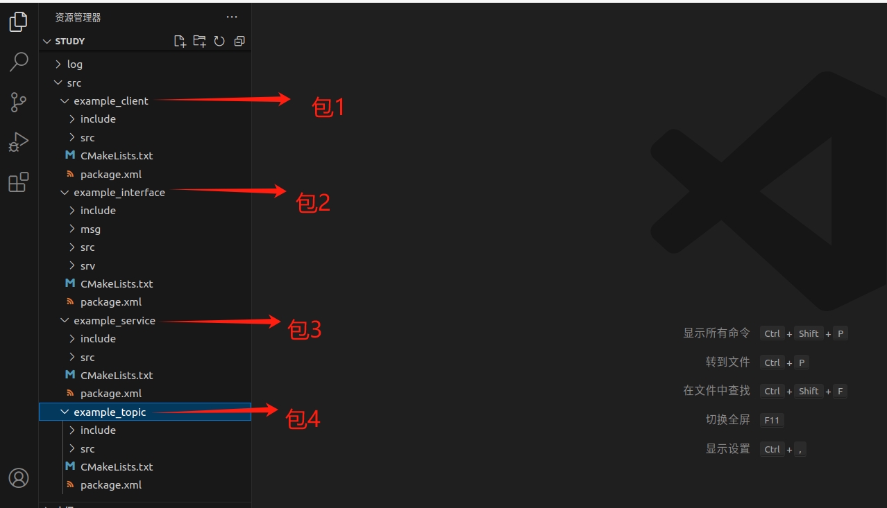
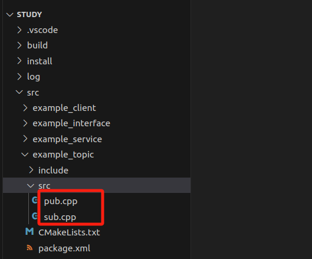
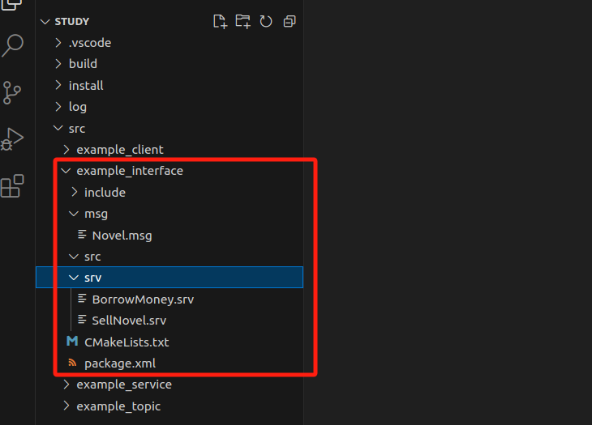
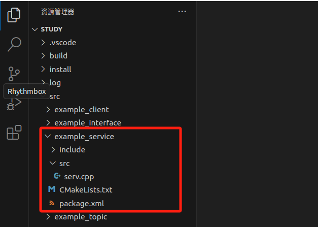
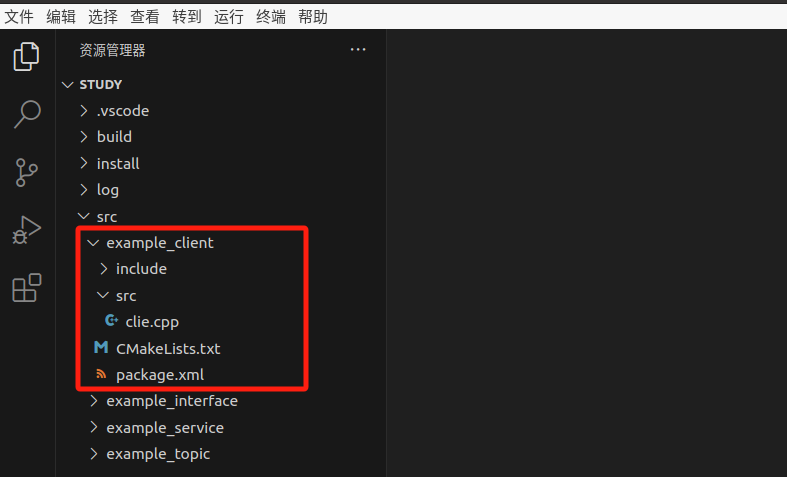

# 1. 环境准备

## 1.1 Linux

* 这里使用的`ubuntu 20.04.3`

* 镜像名称：ubuntu-20.04.6-desktop-amd64.iso（文件大小：4.05G）

* 下载地址：http://mirrors.ustc.edu.cn/ubuntu-releases/

* 安装方法：参考【正点原子】I.MX6U嵌入式Linux C应用编程指南V1.4。**第一章**

* 配置方法：参考【正点原子】I.MX6U嵌入式Linux C应用编程指南V1.4。**第四章**（按需配置）

  * ubuntu下的ftp服务

    ~~~ sh
    # 1 安装服务
    sudo apt-get install vsftpd
    # 2 修改配置文件
    sudo vi /etc/vsftpd.conf
    # 打开下面两行的注释
    local_enable=YES
    write_enable=YES
    
    # 3 重启服务
    sudo /etc/init.d/vsftpd restart
    ~~~

    

> 这里配置了：
>
> 1. ubuntu下的ftp服务
> 2. 电脑端安装MobaXterm软件

## 1.2 Ros2

* 这里使用的是`foxy版本`。

* 安装方式1：https://fishros.com/d2lros2/#/

~~~ sh
wget http://fishros.com/install -O fishros && bash fishros
~~~

> ROS2入门篇 -> 动手安装ROS2 -> 一键安装ROS2。

* 安装方式2：手动安装

~~~ sh
# 下载密钥
sudo apt install curl gnupg2 -y

curl -s https://gitee.com/ohhuo/rosdistro/raw/master/ros.asc | sudo apt-key add -

# 导出到系统
echo "deb [arch=$(dpkg --print-architecture)] https://repo.huaweicloud.com/ros2/ubuntu/ $(lsb_release -cs) main" | sudo tee /etc/apt/sources.list.d/ros2.list > /dev/null

# 更新
sudo apt update

# 安装
sudo apt install ros-foxy-desktop

# 安装额外依赖
sudo apt install python3-argcomplete -y

# 配置环境变量
echo "source /opt/ros/foxy/setup.bash" >> ~/.bashrc

# 添加源
source /opt/ros/foxy/setup.bash
# 查看结果
ros2
~~~

* 卸载方式

~~~ sh
sudo apt remove ros-foxy-* && sudo apt autoremove
~~~


## 1.3 VScode

1. 下载安装包 地址：https://code.visualstudio.com/

   软件包名称：code_1.85.1-1702462158_amd64.deb

2. 传输安装包到ubuntu

3. 安装（在安装包目录下输入）

   ~~~ sh
   sudo dpkg -i code_1.85.1-1702462158_amd64.deb 
   ~~~

> 上面的一键安装还可以，也可以自己装。


# 2. 命令行

## 2.1 案例

**自带案例**

~~~ sh
# 格式 #
ros2 run <package_name> <executable_name>  # 启动包下面的节点

# 1.启动一只海龟 #
ros2 run turtlesim turtlesim_node		# 创建一个海龟(shell 1)
ros2 run turtlesim turtle_teleop_key	# 添加一个控制程序(shell 2)

# 2. 节点相关 #
ros2 node			# 查看此命令帮助信息
ros2 node list		# 查看当前节点列表(shell 3)
#结果如下
/teleop_turtle
/turtlesim
ros2 node info /teleop_turtle	# 查看节点信息(最后是节点名)(shell 3)

# 3. 话题相关 #
ros2 topic 			# 查看此命令帮助信息
ros2 topic list		# 查看当前话题列表(shell 3)
#结果如下
/parameter_events
/rosout
/turtle1/cmd_vel    # turtle1是默认的海龟名字
/turtle1/color_sensor
/turtle1/pose		# 海龟的姿势
ros2 topic echo /turtle1/pose	# ehco:订阅该话题,不断收到位置信息(shell 3)
ros2 topic pub --rate  1 /turtle1/cmd_vel geometry_msgs/msg/Twist "{linear:{x: 2.0, y: 0.0, z: 0.0}, angular:{x: 0.0, y: 0.0, z: 1.8}}"
publisher: beginning loop		# 发布话题控制海龟做圆周运动(shell 3)
#停止后，继续下面操作
ros2 service call /spawn turtlesim/srv/Spawn "{x: 2, y: 2, theta: 0.2, name: "abc"}"  # 创建一只新海龟(shell 3)
#停止后，继续下面操作
ros2 topic list	 # 再次查看话题(shell 3)
/abc/cmd_vel	# 多了abc海龟的
/abc/color_sensor
/abc/pose
/parameter_events
/rosout
/turtle1/cmd_vel
/turtle1/color_sensor
/turtle1/pose
ros2 topic pub --rate  1 /abc/cmd_vel geometry_msgs/msg/Twist "{linear:{x: 2.0, y: 0.0, z: 0.0}, angular:{x: 0.0, y: 0.0, z: 1.8}}"  # 控制abc海龟圆周运动

#停止后，继续下面操作
# 3. 记录 #
ros2 bag							# 查看命令帮助信息
ros2 bag record /turtle1/cmd_vel	# 记录turtle1的速度信息
# 结束之后会保存到当前shell的目录下
ros2 bag play rosbag2_2023_11_02-17_14_36/  # 复现刚刚记录的路径信息（最后是保存的文件夹名称）
~~~

## 2.3 总结

~~~ sh
# 运行节点(常用)
ros2 run <package_name> <executable_name>
# 查看节点列表(常用)：
ros2 node list
# 查看节点信息(常用)：
ros2 node info <node_name>
~~~


# 3. 开始编程

## 3.1 简单概念

* 工作空间：存放项目开发相关文件的文件夹。
* 功能包：功能源码。ROS软件中的基本单元，包含节点源码、配置文件、数据定义等
* 节点：工作细胞。执行单元。
* 话题：节点间传递数据的桥梁。异步通信。发布者/订阅者模型。多对多。用于数据传输。
* 服务：节点间的你问我答。同步通信。客户端/服务器模型。一对多。多用逻辑处理。
* 通信接口：数据传递的标准结构。
* 参数：机器人系统的全局字典。
* 动作：完整行为的流程管理
* 分布式通信：多计算平台的任务分配
* DDS：机器人的神经网络

## 3.2 文件结构

* WorkSpace

  * src：代码空间，源代码，功能包

  * install：安装
  * build：编译
  * log：日志

## 3.3 编译工具

（可能）用到的工具，也不知道啥时候用到，反正都装上就行了。

~~~ sh
# g++
sudo apt install g++
# 编译指令
g++ hello_world.cpp

# make
sudo apt install make
# 编译指令（在Makefile同级目录）
make build

# Cmake
sudo apt install cmake
# 先不用

# colcon 功能包构建工具
sudo apt-get install python3-colcon-common-extensions
# 编译指令
colcon build
~~~

## 3.4 创建ROS节点

1. 建立工作空间文件夹

~~~ sh
# ros2文件夹存放所有的ros工程（可以不要）
haozi@haozi-machine:~/ros2$ pwd
/home/haozi/ros2
# 创建工作空间
haozi@haozi-machine:~/ros2$ mkdir test_ws
# test_ws文件夹就是一个工作空间
haozi@haozi-machine:~/ros2$ ls
test_ws
~~~

2. 创建src文件夹

~~~ sh
# 进入工作空间
haozi@haozi-machine:~/ros2$ cd test_ws
# 创建src文件夹
haozi@haozi-machine:~/ros2/test_ws$ mkdir src
haozi@haozi-machine:~/ros2/test_ws$ ls
src
~~~

3. 创建一个功能包

~~~ sh
# 先进入src文件夹
haozi@haozi-machine:~/ros2/test_ws$ cd src/
# 创建example_cpp功能包，使用ament-cmake作为编译类型，并为其添加rclcpp依赖。
haozi@haozi-machine:~/ros2/test_ws/src$ ros2 pkg create example_cpp --build-type ament_cmake --dependencies rclcpp
going to create a new package
package name: example_cpp
destination directory: /home/haozi/ros2/test_ws/src
package format: 3
version: 0.0.0
description: TODO: Package description
maintainer: ['haozi <haozi@todo.todo>']
licenses: ['TODO: License declaration']
build type: ament_cmake
dependencies: ['rclcpp']
creating folder ./example_cpp
creating ./example_cpp/package.xml
creating source and include folder
creating folder ./example_cpp/src
creating folder ./example_cpp/include/example_cpp
creating ./example_cpp/CMakeLists.txt
# src文件夹下多出 example_cpp 文件夹
haozi@haozi-machine:~/ros2/test_ws/src$ ls
example_cpp
~~~

> - pkg create 是创建包的意思
> - --build-type 用来指定该包的编译类型，一共有三个可选项`ament_python`、`ament_cmake`、`cmake`
> - --dependencies 指的是这个功能包的依赖，这里是ros2的C++客户端接口`rclcpp`

此时的目录就会变成这个样子

* test_ws
  * src
    * example_cpp
      * Cmakelists.txt
      * include
        * example_cpp
      * package.xml
      * src

4. 创建节点

在test_ws/src/example_cpp/src文件夹下创建 node.cpp 文件，方法任意。

~~~ sh
haozi@haozi-machine:~/ros2/test_ws/src/example_cpp/src$ pwd
/home/haozi/ros2/test_ws/src/example_cpp/src
haozi@haozi-machine:~/ros2/test_ws/src/example_cpp/src$ ls
node.cpp
~~~

文件内容如下：

~~~ c++
#include "rclcpp/rclcpp.hpp"

int main(int argc, char **argv)
{
    /* 初始化rclcpp  */
    rclcpp::init(argc, argv);
    /*产生一个node的节点*/
    auto node = std::make_shared<rclcpp::Node>("node");
    // 打印一句自我介绍
    RCLCPP_INFO(node->get_logger(), "node节点已经启动.");
    /* 运行节点，并检测退出信号 Ctrl+C*/
    rclcpp::spin(node);
    /* 停止运行 */
    rclcpp::shutdown();
    return 0;
}
~~~

完成后目录如下：

test_ws

* src
  * example_cpp
    * Cmakelists.txt
    * include
      * example_cpp
    * package.xml
    * src
      * node.cpp

5. 修改CmakeLists

在 CMakeLists.txt 的最后添加如下代码，将其添加为可执行文件，并使用`install`指令将其安装到`install`目录。

~~~ cmake
# 添加可执行目标node, 参数为node.cpp
add_executable(node src/node.cpp)
ament_target_dependencies(node rclcpp)

install(TARGETS
  node
  DESTINATION lib/${PROJECT_NAME}
)
~~~

6. 编译节点

~~~ sh
# cd回到工作空间目录
haozi@haozi-machine:~/ros2/test_ws$ pwd
/home/haozi/ros2/test_ws
# 执行编译（上面修改的文件一定要点保存之后再编译）
haozi@haozi-machine:~/ros2/test_ws$ colcon build
Starting >>> example_cpp
Finished <<< example_cpp [4.87s]                  

Summary: 1 package finished [8.85s]
# 编译完成可以看到多出来几个文件夹
haozi@haozi-machine:~/ros2/test_ws$ ls
build  install  log  src
~~~

7. source环境

~~~ sh
haozi@haozi-machine:~/ros2/test_ws$ source install/setup.bash
~~~

8. 运行节点

~~~ sh
haozi@haozi-machine:~/ros2/test_ws$ ros2 run example_cpp node
[INFO] [1698995834.649833335] [node]: node节点已经启动.
~~~

9. 测试

另开一个窗口，查看现有节点。

~~~ sh
haozi@haozi-machine:~/ros2/test_ws$ ros2 node list
/node
~~~

> 如果`ros2 node list`显示不出来，就使用`ros2 node list --no-daemon`。理由未知。

至此，自己编写代码的流程就结束了。每次修改完成之后，需要重新编译，添加资源。


补充：

~~~ sh
# 只编译一个包
colcon build --packages-select YOUR_PKG_NAME 

# 允许通过更改src下的部分文件来改变install（重要）（不知道啥意思）
# 每次调整 python 脚本时都不必重新build了
colcon build --symlink-install
~~~


# 4. 四大通信

通信方式：**话题**、**服务**、动作、参数

媒介：**接口**

> 本章节所有代码都将在一个工作空间下完成



## 4.1 话题

> 同一个话题，发布者和订阅者都可以有多个。
>
> 一对一、多对一、一对多、多对多，都可以。

### 4.1.1 自带案例

~~~ shell
# 运行ros自带的两个案例
haozi@haozi-machine:~$ ros2 run demo_nodes_cpp talker
haozi@haozi-machine:~$ ros2 run demo_nodes_py listener

# 查看节点关系图
rqt_graph

# 话题相关指令
ros2 topic -h

ros2 topic list		# 返回系统中当前活动的所有主题的列表
ros2 topic list -t	# 增加消息类型
ros2 topic echo /chatter	# 打印实时话题内容
ros2 topic info /chatter	# 查看主题信息
ros2 interface show std_msgs/msg/String	# 查看消息类型
ros2 topic pub /chatter std_msgs/msg/String 'data: "123"'	# 手动发布消息
~~~


### 4.1.2 自定义案例

**新建一个包：example_topic，在这里面编写话题测试案例**




创建话题发布者程序流程

1. 导入相关接口（若有）
2. 编程接口初始化
3. 创建节点并初始化
4. 创建发布者对象
5. 创建并填充话题消息
6. 发布话题消息
7. 销毁节点并关闭接口

创建话题订阅者程序流程

1. 导入相关接口（若有）
2. 编程接口初始化
3. 创建节点并初始化
4. 创建订阅者对象
5. 回调函数处理话题数据
6. 销毁节点并关闭接口


第一步：在包下的src文件夹中新建文件：`pub.cpp`，在这个文件中编写发布者代码。

~~~ c++
#include "rclcpp/rclcpp.hpp"
// 消息类型头文件
#include "std_msgs/msg/string.hpp"
#include "std_msgs/msg/u_int32.hpp"

// 定义一个类
class TopicPublisher : public rclcpp::Node
{
private:
    // 声名定时器指针
    rclcpp::TimerBase::SharedPtr timer_;
    // 声明话题发布者指针
    rclcpp::Publisher<std_msgs::msg::String>::SharedPtr command_publisher_;
    // 定时器回调函数
    void timer_callback()
    {
        // 创建消息
        std_msgs::msg::String message;
        message.data = "text";
        // 日志打印
        RCLCPP_INFO(this->get_logger(), "Publishing: '%s'", message.data.c_str());
        // 发布消息
        command_publisher_->publish(message);
    }

public:
    // 构造函数,有一个参数为节点名称
    TopicPublisher(std::string name) : Node(name)
    {
        RCLCPP_INFO(this->get_logger(), "大家好，我是%s.", name.c_str());
        // 创建发布者（发布话题名称为：sexy_girl）
        command_publisher_ = this->create_publisher<std_msgs::msg::String>("sexy_girl", 10);
        // 创建定时器，500ms为周期，定时发布消息
        timer_ = this->create_wall_timer(std::chrono::milliseconds(500), std::bind(&TopicPublisher::timer_callback, this));
    }
};

int main(int argc, char **argv)
{
    rclcpp::init(argc, argv);
    /*产生一个节点*/
    auto node = std::make_shared<TopicPublisher>("pub");
    /* 运行节点，并检测退出信号*/
    rclcpp::spin(node);
    rclcpp::shutdown();
    return 0;
}
~~~

第二步：在包下的src文件夹中新建文件：`sub.cpp`，在这个文件中编写订阅者代码。

~~~ c++
#include "rclcpp/rclcpp.hpp"
// 消息类型头文件
#include "std_msgs/msg/string.hpp"
#include "std_msgs/msg/u_int32.hpp"

using std::placeholders::_1;
using std::placeholders::_2;

// 定义一个类
class TopicSublisher : public rclcpp::Node
{
private:
    // 声明一个订阅者（成员变量）,用于订阅小说
    rclcpp::Subscription<std_msgs::msg::String>::SharedPtr sub_novel;

    // 声明一个发布者（成员变量）,用于给钱
    rclcpp::Publisher<std_msgs::msg::UInt32>::SharedPtr pub_money;

    // 收到话题数据的回调函数
    void topic_callback(const std_msgs::msg::String::SharedPtr msg)
    {
        // 新建一张人民币
        std_msgs::msg::UInt32 money;
        money.data = 10;
        // 发送人民币
        pub_money->publish(money);

        RCLCPP_INFO(this->get_logger(), "朕已阅：'%s'，打赏：%d 元稿费", msg->data.c_str(), money.data);
    };

public:
    // 构造函数,有一个参数为节点名称
    TopicSublisher(std::string name) : Node(name)
    {
        // 打印一句自我介绍
        RCLCPP_INFO(this->get_logger(), "大家好，我是%s.", name.c_str());
        // 创建一个订阅者来订阅小说，通过名字sexy_girl
        sub_novel = this->create_subscription<std_msgs::msg::String>("sexy_girl", 10, std::bind(&TopicSublisher::topic_callback, this, _1));
        // 创建发布者
        pub_money = this->create_publisher<std_msgs::msg::UInt32>("sexy_girl_money", 10);
    }
};

int main(int argc, char **argv)
{
    rclcpp::init(argc, argv);
    /*产生一个节点*/
    auto node = std::make_shared<TopicSublisher>("sub");
    /* 运行节点，并检测退出信号*/
    rclcpp::spin(node);
    rclcpp::shutdown();
    return 0;
}
~~~

第三步：添加`CMakeLists.txt`配置。

~~~ cmake
# add by user. 让编译器编译sub.cpp这个文件
add_executable(sub src/sub.cpp)
ament_target_dependencies(sub rclcpp)
# add by user. 让编译器编译pub.cpp这个文件
add_executable(pub src/pub.cpp)
ament_target_dependencies(pub rclcpp)

# add by user. 需要手动将编译好的文件安装到 install/example_cpp/lib/example_cpp 下
install(TARGETS
  sub
  pub
  DESTINATION lib/${PROJECT_NAME}
)
~~~

编译运行即可。


## 4.2 接口

**三种接口形式**

话题接口格式：`xxx.msg`

~~~ sh
int64 num
~~~

 服务接口格式：`xxx.srv`

```
int64 a
int64 b
---
int64 sum
```

动作接口格式：`xxx.action`

```
int32 order
---
int32[] sequence
---
int32[] partial_sequence
```

**数据类型**

基本类型，9类，每个后面都可以加`[]`将其变为数组。

~~~ txt
bool
byte
char
float32, float64
int8, uint8
int16, uint16
int32, uint32
int64, uint64
string
~~~

扩展类型，上述类型的套娃。

**接口常用命令**

~~~ sh
# 查看当前环境下接口列表
ros2 interface list
# 查看所有接口包
ros2 interface packages
# 查看某一个包下所有接口
ros2 interface package std_msgs
# 查看某一个接口详细内容
ros2 interface show std_msgs/msg/String
# 输出某一个接口所有属性
ros2 interface proto sensor_msgs/msg/Image

~~~

### 4.2.1 自定义消息接口

**新建一个包：example_interface，在这里面编写自定义消息测试案例**




第一步：在包下新建一个文件夹（不是src目录下，和src是同级目录）：`msg`

第二步：在msg文件夹下新建一个消息文件：`Novel.msg`（首字母必须大写），内容如下

~~~ msg
# 直接使用ROS2原始的数据类型
string content

# 图像消息，调用sensor_msgs下的Image类型
sensor_msgs/Image image
~~~

第三步：添加`CMakeLists.txt`配置。

~~~ cmake
# add by user.查找sensor_msgs库
find_package(sensor_msgs REQUIRED)
find_package(rosidl_default_generators REQUIRED)
# add by user.添加消息文件和依赖
rosidl_generate_interfaces(${PROJECT_NAME}
  "msg/Novel.msg"
   DEPENDENCIES sensor_msgs
 )
~~~

第四步：添加`package.xml`配置。

~~~ xml
  <build_depend>sensor_msgs</build_depend>
  <build_depend>rosidl_default_generators</build_depend>
  <exec_depend>rosidl_default_runtime</exec_depend>
  <member_of_group>rosidl_interface_packages</member_of_group>
~~~

编译后，验证。

~~~ sh
haozi@computer:~/ros_place/study$ source install/setup.bash 
haozi@computer:~/ros_place/study$ ros2 interface package example_interface
example_interface/msg/Novel
haozi@computer:~/ros_place/study$ ros2 interface show example_interface/msg/Novel
# 直接使用ROS2原始的数据类型
string content

# 图像消息，调用sensor_msgs下的Image类型
sensor_msgs/Image image
haozi@computer:~/ros_place/study$ ros2 interface proto example_interface/msg/Novel
"content: ''
image:
  header:
    stamp:
      sec: 0
      nanosec: 0
    frame_id: ''
  height: 0
  width: 0
  encoding: ''
  is_bigendian: 0
  step: 0
  data: []
"
~~~


### 4.2.2 自定义服务接口

**还在包：example_interface，下进行**

创建服务自定义接口，步骤如下（4.3小节后面用）：

- 新建`srv`文件夹，并在文件夹下新建`xxx.srv`
- 在`xxx.srv`下编写服务接口内容并保存
- 在`CmakeLists.txt`添加依赖和srv文件目录
- 在`package.xml`中添加`xxx.srv`所需的依赖
- 编译功能包即可生成`python`与c++头文件

还在上面这个包里添加

第一步：在包下新建一个文件夹：`srv`

第二步：在srv文件夹下新建一个服务接口文件：`BorrowMoney.srv`（首字母必须大写），内容如下

~~~ msg
# 输入参数
string name
uint32 money
---
# 
bool success
uint32 money
~~~

第三步：添加`CMakeLists.txt`配置（比上面多添加了一行）。

~~~ cmake
# add by user.查找sensor_msgs库
find_package(sensor_msgs REQUIRED)
find_package(rosidl_default_generators REQUIRED)
# add by user.添加消息文件和依赖
rosidl_generate_interfaces(${PROJECT_NAME}
  #---msg---
  "msg/Novel.msg"
  #---srv---
  "srv/BorrowMoney.srv"
  DEPENDENCIES sensor_msgs
 )
~~~

第四步：添加`package.xml`配置，前面添加过了这里就不需要了。

编译后，验证

~~~ sh
haozi@computer:~/ros_place/study$ source install/setup.bash 
haozi@computer:~/ros_place/study$ ros2 interface package example_interface
example_interface/msg/Novel
example_interface/srv/BorrowMoney
haozi@computer:~/ros_place/study$ ros2 interface show example_interface/srv/BorrowMoney
# 输入参数
string name
uint32 money
---
# 返回参数
bool success
uint32 money
haozi@computer:~/ros_place/study$ ros2 interface proto example_interface/srv/BorrowMoney 
"name: ''
money: 0
"
~~~


同理，再添加一个服务接口：SellNovel.srv

~~~ srv
uint32 money
---
string[] novels
~~~

CMakeLists.txt（比上面又多了一行）

~~~ cmake
rosidl_generate_interfaces(${PROJECT_NAME}
  #---msg---
  "msg/Novel.msg"
  #---srv---
  "srv/BorrowMoney.srv"
  "srv/SellNovel.srv"
   DEPENDENCIES sensor_msgs
 )
~~~

同样，编译即可。


## 4.3 服务

### 4.3.1 自带案例

~~~ sh
# 运行自带的加法器服务
haozi@haozi-machine:~$ ros2 run examples_rclpy_minimal_service service
# 手动调用服务
ros2 service call /add_two_ints example_interfaces/srv/AddTwoInts "{a: 5,b: 10}"


# 查看服务列表
haozi@haozi-machine:~$ ros2 service list
# 查看服务接口类型
haozi@haozi-machine:~$ ros2 service type /add_two_ints
# 查找使用某一接口的服务
haozi@haozi-machine:~$ ros2 service find example_interfaces/srv/AddTwoInts
~~~

创建服务服务端的程序流程

1. 导入相关接口（若有）
2. 编程接口初始化
3. 创建节点并初始化
4. 创建客户端对象
5. 创建并发送请求数据
6. 等待服务器端应答数据
7. 销毁节点并关闭接口

创建服务客户端的程序流程

1. 导入相关接口（若有）
2. 编程接口初始化
3. 创建节点并初始化
4. 创建客户端对象
5. 创建并发送请求数据
6. 等待服务器端应答数据
7. 销毁节点并关闭接口


### 4.3.2 自定义服务端

**新建一个包：example_service，在这里面编写服务端测试案例**



程序步骤：

1. 导入服务接口
2. 创建服务端回调函数
3. 声明并创建服务端
4. 编写回调函数逻辑处理请求


第一步：`package.xml`，等会需要用到这个接口

~~~ xml
  <depend>example_interface</depend>
~~~

第二步：`CMakeLists.txt`

~~~ cmake
# find dependencies
find_package(ament_cmake REQUIRED)
find_package(rclcpp REQUIRED)
# add by user.自定义接口
find_package(example_interface REQUIRED)
# add by user.
add_executable(serv src/serv.cpp)
ament_target_dependencies(serv rclcpp example_interface)

# add by user. 需要手动将编译好的文件安装到 install/example_cpp/lib/example_cpp 下
install(TARGETS
  serv
  DESTINATION lib/${PROJECT_NAME}
)
~~~

第三步：在包下的src文件夹中新建文件：`serv.cpp`，在这个文件中编写服务代码。

~~~ c++
#include "rclcpp/rclcpp.hpp"
// 消息类型头文件
#include "std_msgs/msg/string.hpp"
#include "std_msgs/msg/u_int32.hpp"
// 自定义消息类型头文件
#include "example_interface/srv/sell_novel.hpp"
// 队列
#include <queue>

using std::placeholders::_1;
using std::placeholders::_2;

/*
    创建一个类节点，名字叫做Serv,继承自Node.
*/
class Serv : public rclcpp::Node
{

public:
    // 构造函数
    Serv() : Node("wang2")
    {
        // 打印一句自我介绍
        RCLCPP_INFO(this->get_logger(), "大家好，我是单身汉王二.");
        // 创建一个订阅者来订阅李四写的小说，通过名字sexy_girl
        sub_ = this->create_subscription<std_msgs::msg::String>("sexy_girl", 10, std::bind(&Serv::topic_callback, this, _1));
        // 创建发布者
        pub_ = this->create_publisher<std_msgs::msg::UInt32>("sexy_girl_money", 10);
        // 实例化回调组
        callback_group_service_ = this->create_callback_group(rclcpp::CallbackGroupType::MutuallyExclusive);
        // 实例化卖二手书的服务
        server_ = this->create_service<example_interface::srv::SellNovel>("sell_novel",
                                                                          std::bind(&Serv::sell_book_callback, this, _1, _2),
                                                                          rmw_qos_profile_services_default,
                                                                          callback_group_service_);
    }

private:
    // 声明一个服务回调组
    rclcpp::CallbackGroup::SharedPtr callback_group_service_;

    // 声明一个订阅者（成员变量）
    rclcpp::Subscription<std_msgs::msg::String>::SharedPtr sub_;

    // 声明一个发布者（成员变量）
    rclcpp::Publisher<std_msgs::msg::UInt32>::SharedPtr pub_;

    // 创建一个小说章节队列
    std::queue<std::string> novels_queue;

    // 声明一个服务端
    rclcpp::Service<example_interface::srv::SellNovel>::SharedPtr server_;

    // 收到话题数据的回调函数
    void topic_callback(const std_msgs::msg::String::SharedPtr msg)
    {
        // 新建一张人民币
        std_msgs::msg::UInt32 money;
        money.data = 10;

        // 发送人民币给李四
        pub_->publish(money);
        RCLCPP_INFO(this->get_logger(), "王二：我收到了：'%s' ，并给了李四：%d 元的稿费", msg->data.c_str(), money.data);

        // 将小说放入novels_queue中
        novels_queue.push(msg->data);
    };

    // 声明一个回调函数，当收到买书请求时调用该函数，用于处理数据
    void sell_book_callback(const example_interface::srv::SellNovel::Request::SharedPtr request,
                            const example_interface::srv::SellNovel::Response::SharedPtr response)
    {
        RCLCPP_INFO(this->get_logger(), "收到一个买书请求，一共给了%d钱", request->money);
        unsigned int novelsNum = request->money * 1; // 应给小说数量，一块钱一章

        // 判断当前书库里书的数量是否满足张三要买的数量，不够则进入等待函数
        if (novels_queue.size() < novelsNum)
        {
            RCLCPP_INFO(this->get_logger(), "当前艳娘传奇章节存量为%d：不能满足需求,开始等待", novels_queue.size());

            // 设置rate周期为1s，代表1s检查一次
            rclcpp::Rate loop_rate(1);

            // 当书库里小说数量小于请求数量时一直循环
            while (novels_queue.size() < novelsNum)
            {
                // 判断系统是否还在运行
                if (!rclcpp::ok())
                {
                    RCLCPP_ERROR(this->get_logger(), "程序被终止了");
                    return;
                }
                // 打印一下当前的章节数量和缺少的数量
                RCLCPP_INFO(this->get_logger(), "等待中，目前已有%d章，还差%d章", novels_queue.size(), novelsNum - novels_queue.size());

                // rate.sleep()让整个循环1s运行一次
                loop_rate.sleep();
            }
        }
        // 章节数量满足需求了
        RCLCPP_INFO(this->get_logger(), "当前艳娘传奇章节存量为%d：已经满足需求", novels_queue.size());

        // 一本本把书取出来，放进请求响应对象response中
        for (unsigned int i = 0; i < novelsNum; i++)
        {
            response->novels.push_back(novels_queue.front());
            novels_queue.pop();
        }
    }
};

int main(int argc, char **argv)
{
    rclcpp::init(argc, argv);
    /*产生一个Wang2的节点*/
    auto node = std::make_shared<Serv>();
    /* 运行节点，并检测退出信号*/
    rclcpp::executors::MultiThreadedExecutor exector;
    exector.add_node(node);
    exector.spin();
    rclcpp::shutdown();
    return 0;
}
~~~

编译运行即可。


### 4.3.3 自定义客户端

**新建一个包：example_client，在这里面编写客户端测试案例**



程序步骤：

1. 导入服务接口
2. 创建请求结果接收回调函数
3. 声明并创建客户端
4. 编写结果接收逻辑
5. 调用客户端发送请求


第一步：`package.xml`，等会需要用到这个接口

~~~ xml
  <depend>example_interface</depend>
~~~

第二步：`CMakeLists.txt`

~~~ cmake
# find dependencies
find_package(ament_cmake REQUIRED)
find_package(rclcpp REQUIRED)
# add by user.自定义接口
find_package(example_interface REQUIRED)
# add by user.添加可执行文件
add_executable(clie src/clie.cpp)
# add by user.
ament_target_dependencies(clie
  rclcpp 
  example_interface
)

install(TARGETS
  clie
  DESTINATION lib/${PROJECT_NAME}
)
~~~

第三步：在包下的src文件夹中新建文件：`clie.cpp`，在这个文件中编写服务代码。

~~~ c++
#include "rclcpp/rclcpp.hpp"
#include "example_interface/srv/sell_novel.hpp"

using std::placeholders::_1;
using std::placeholders::_2;

/*
    创建一个类节点，名字叫做Clie,继承自Node.
*/
class Clie : public rclcpp::Node
{

public:
    Clie() : Node("wang2")
    {
        // 打印一句自我介绍
        RCLCPP_INFO(this->get_logger(), "大家好，我是得了穷病的张三.");
        client_ = this->create_client<example_interface::srv::SellNovel>("sell_novel");
    }

    void buy_novel()
    {
        RCLCPP_INFO(this->get_logger(), "买小说去喽");
        while (!client_->wait_for_service(std::chrono::seconds(1)))
        {
            if (!rclcpp::ok())
            {
                RCLCPP_ERROR(this->get_logger(), "等待服务的过程中被打断...");
                return;
            }
            RCLCPP_INFO(this->get_logger(), "等待服务端上线中");
        }
        // 构造请求的钱
        auto request = std::make_shared<example_interface::srv::SellNovel_Request>();
        // 先来五块钱的看看好不好看
        request->money = 5;
        // 发送异步请求，然后等待返回，返回时调用回调函数
        client_->async_send_request(request, std::bind(&Clie::novels_callback, this, _1));
    };
    // 创建接收到小说的回调函数
    void novels_callback(rclcpp::Client<example_interface::srv::SellNovel>::SharedFuture response)
    {
        auto result = response.get();
        RCLCPP_INFO(this->get_logger(), "收到%d章的小说，现在开始按章节开读", result->novels.size());
        for (std::string novel : result->novels)
        {
            RCLCPP_INFO(this->get_logger(), "%s", novel.c_str());
        }
        RCLCPP_INFO(this->get_logger(), "小说读完了，好刺激，写的真不错，好期待下面的章节呀！");
    }

private:
    // 创建一个客户端
    rclcpp::Client<example_interface::srv::SellNovel>::SharedPtr client_;
};

int main(int argc, char **argv)
{
    rclcpp::init(argc, argv);
    /*产生一个Wang2的节点*/
    auto node = std::make_shared<Clie>();
    node->buy_novel();
    /* 运行节点，并检测退出信号*/
    rclcpp::spin(node);
    rclcpp::shutdown();
    return 0;
}
~~~

编译运行即可。


把客户端、服务端、话题发布者同时运行起来即可看到效果。


## 4.4 参数

参数：由键值对组成。

* 键：字符串
* 值：
  * bool 和 bool[]，布尔类型用来表示开关，比如我们可以控制雷达控制节点，开始扫描和停止扫描。
  * int64 和 int64[]，整形表示一个数字，含义可以自己来定义
  * float64 和 float64[]，浮点型，可以表示小数类型的参数值
  * string 和 string[]，字符串，可以用来表示雷达控制节点中真实雷达的ip地址
  * byte[]，字节数组，这个可以用来表示图片，点云数据等信息

~~~ sh
# 查看参数列表
ros2 param list

# 查看参数描述信息
ros2 param describe <node_name> <param_name>

# 查看键对应的值
ros2 param get <node_name> <param_name>

# 设置键的值
ros2 param set <node_name> <parameter_name> <value>

# 给节点的参数保存一份快照（在当前目录下，yaml格式）
ros2 param dump <node_name>

# 恢复节点参数
ros2 param load <node_name> <file_name>
# 如：ros2 param load  /turtlesim ./turtlesim.yaml

# 直接使用参数文件启动
ros2 run <package_name> <executable_name> --ros-args --params-file <file_name>
# 如：ros2 run turtlesim turtlesim_node --ros-args --params-file ./turtlesim.yaml
~~~


## 4.5 动作（暂未用到）

* Action的三大组成部分目标、反馈和结果。
  * 目标：即Action客户端告诉服务端要做什么，服务端针对该目标要有响应。解决了不能确认服务端接收并处理目标问题
  * 反馈：即Action服务端告诉客户端此时做的进度如何（类似与工作汇报）。解决执行过程中没有反馈问题
  * 结果：即Action服务端最终告诉客户端其执行结果，结果最后返回，用于表示任务最终执行情况。

> Action是由话题和服务共同构建出来的（一个Action = 三个服务+两个话题）
>
> 三个服务分别是：1、目标传递服务。2、结果传递服务。3、取消执行服务
>
> 两个话题：1、反馈话题（服务发布，客户端订阅） 2、状态话题（服务端发布，客户端订阅）


~~~ sh
# 继续运行小乌龟
ros2 run turtlesim turtlesim_node
ros2 run turtlesim turtle_teleop_key


# 该命令用于获取目前系统中的action列表。
ros2 action list
/turtle1/rotate_absolute

# 顺便查看Action使用的接口类型
ros2 action list -t
/turtle1/rotate_absolute [turtlesim/action/RotateAbsolute]

# 查看接口定义
ros2 interface show turtlesim/action/RotateAbsolute

# 查看Action信息（action客户端和服务段的数量以及名字）
ros2 action info /turtle1/rotate_absolute 

# 发送请求到服务端
ros2 action send_goal /turtle1/rotate_absolute turtlesim/action/RotateAbsolute "{theta: 1.6}"
# 发送请求到服务端，并查看反馈
~~~


# 5. ament_cmake

一个功能包的构建信息包含在

- `CMakeLists.txt`：描述了如何构建此功能包
- `package.xml`：包含该功能包的依赖信息，它可以帮助编译工具colcon确定多个功能包编译的顺序

## 5.1 CmakeLists.txt

ROS2的构建系统叫做`ament_cmake`，它是基于`CMake`改进而来的。接下来介绍一下`ament_cmake`常用的一些命令：

找一个比较全的，自己的包找找一样的命令即可。

~~~ cmake
# 指定cmake的最低版本(3.5)
cmake_minimum_required(VERSION 3.5)
# 功能包的名字
project(nav2_costmap_2d)

# 查找ament_cmake包
find_package(ament_cmake REQUIRED)
# 查找依赖构建此功能包所需要的依赖（ROS2自带的）
find_package(rclcpp REQUIRED)
find_package(geometry_msgs REQUIRED)
find_package(laser_geometry REQUIRED)
find_package(map_msgs REQUIRED)
find_package(message_filters REQUIRED)
find_package(nav2_common REQUIRED)
find_package(nav2_msgs REQUIRED)
find_package(nav2_util)
find_package(nav2_voxel_grid REQUIRED)
find_package(nav_msgs REQUIRED)
find_package(pluginlib REQUIRED)
find_package(rclcpp REQUIRED)
find_package(rclcpp_lifecycle REQUIRED)
find_package(rmw REQUIRED)
find_package(sensor_msgs REQUIRED)
find_package(std_msgs REQUIRED)
find_package(std_srvs REQUIRED)
find_package(tf2_geometry_msgs REQUIRED)
find_package(tf2 REQUIRED)
find_package(tf2_ros REQUIRED)
find_package(tf2_sensor_msgs REQUIRED)
find_package(visualization_msgs REQUIRED)
find_package(angles REQUIRED)
# 查找依赖构建此功能包所需要的依赖（非ROS2自带的）
find_package(Eigen3 REQUIRED)
include_directories(
  include
  ${EIGEN3_INCLUDE_DIRS}
)

# 使用add_library构建库
add_library(nav2_costmap_2d_core SHARED
  src/array_parser.cpp
  src/costmap_2d.cpp
  src/layer.cpp
  src/layered_costmap.cpp
  src/costmap_2d_ros.cpp
  src/costmap_2d_publisher.cpp
  src/costmap_math.cpp
  src/footprint.cpp
  src/costmap_layer.cpp
  src/observation_buffer.cpp
  src/clear_costmap_service.cpp
  src/footprint_collision_checker.cpp
  plugins/costmap_filters/costmap_filter.cpp
)

# 设置变量dependencies，这里主要添加的是ROS2功能包
set(dependencies
  geometry_msgs
  laser_geometry
  map_msgs
  message_filters
  nav2_msgs
  nav2_util
  nav2_voxel_grid
  nav_msgs
  pluginlib
  rclcpp
  rclcpp_lifecycle
  sensor_msgs
  std_msgs
  std_srvs
  tf2
  tf2_geometry_msgs
  tf2_ros
  tf2_sensor_msgs
  visualization_msgs
  angles
)

# 通过ament_target_dependencies添加ROS2功能包依赖，它将依赖的库、头文件以及自身依赖添加到目标中
# 即nav2_costmap_2d_core是依赖${dependencies}的（前面定义了变量）
ament_target_dependencies(nav2_costmap_2d_core
  ${dependencies}
)

# 通过add_executable构建可执行文件，同时也需要使用ament_target_dependencies添加相关依赖
# 构建nav2_costmap_2d_markers可执行文件，参数为：src/costmap_2d_markers.cpp
add_executable(nav2_costmap_2d_markers src/costmap_2d_markers.cpp)
target_link_libraries(nav2_costmap_2d_markers
  nav2_costmap_2d_core
)
# nav2_costmap_2d_markers是依赖${dependencies}的（前面定义了变量）
ament_target_dependencies(nav2_costmap_2d_markers
  ${dependencies}
)

add_executable(nav2_costmap_2d_cloud src/costmap_2d_cloud.cpp)
target_link_libraries(nav2_costmap_2d_cloud
  nav2_costmap_2d_core
)

add_executable(nav2_costmap_2d src/costmap_2d_node.cpp)
ament_target_dependencies(nav2_costmap_2d
  ${dependencies}
)

target_link_libraries(nav2_costmap_2d
  nav2_costmap_2d_core
  layers
  filters
)

# 安装库
install(TARGETS
  nav2_costmap_2d_core
  layers
  filters
  nav2_costmap_2d_client
  ARCHIVE DESTINATION lib
  LIBRARY DESTINATION lib
  RUNTIME DESTINATION bin
)

# 安装可执行文件，注意这里的可执行文件路径为： lib/${PROJECT_NAME}而不是bin
install(TARGETS
  nav2_costmap_2d
  nav2_costmap_2d_markers
  nav2_costmap_2d_cloud
  RUNTIME DESTINATION lib/${PROJECT_NAME}
)

# 导出头文件
install(DIRECTORY include/
  DESTINATION include/
)

# 导出launch和参数文件
install(
  DIRECTORY launch params
  DESTINATION share/${PROJECT_NAME}
)

# 通过ament_export_include_directories导出该功能包的头文件，以便其他功能包依赖此功能包时，能够找到对应的头文件
ament_export_include_directories(include)

# 通过ament_export_libraries导出该功能包构建的库，以便其他功能包能够顺利链接到
ament_export_libraries(layers filters nav2_costmap_2d_core nav2_costmap_2d_client)

# 通过ament_export_dependencies导出此功能包所有的ROS相关的依赖，依赖其他功能包依赖此功能包时，不必再通过find_package重复添加这些依赖
ament_export_dependencies(${dependencies})
~~~


## 5.2 package.xml

~~~ xml
<!-- 编译的工具依赖 -->
<buildtool_depend>ament_cmake</buildtool_depend>

<!-- 依赖的ROS2功能包 -->
<depend>geometry_msgs</depend>
<depend>laser_geometry</depend>
<depend>map_msgs</depend>
<depend>message_filters</depend>
<depend>nav2_msgs</depend>
<depend>nav2_util</depend>
<depend>nav2_voxel_grid</depend>
<depend>nav_msgs</depend>
<depend>pluginlib</depend>
<depend>rclcpp</depend>
<depend>rclcpp_lifecycle</depend>
<depend>sensor_msgs</depend>
<depend>std_msgs</depend>
<depend>std_srvs</depend>
<depend>tf2</depend>
<depend>tf2_geometry_msgs</depend>
<depend>tf2_ros</depend>
<depend>tf2_sensor_msgs</depend>
<depend>visualization_msgs</depend>
<depend>angles</depend>


<!-- 导出依赖 -->
<export>
    <build_type>ament_cmake</build_type>
</export>
~~~


# 6. 工具

## 6.1 Launch


# 补充：

安装配套支持

~~~ shell
#首先切换到工作空间下的src目录下，然后执行下面操作
sudo apt install python3-pip		# python包管理工具

sudo pip3 install rosdepc		# 安装ros依赖工具

sudo resdepc init & rosdepc update		# 更新

#切回工作空间目录下，然后执行下面操作
rosdepc install -i --from-path src --rosdistro foxy -y # 自动添加依赖

#如果报如下错误，是缺少依赖（最后括号里面的）
ERROR: the following packages/stacks could not have their rosdep keys resolved
to system dependencies:
learning_urdf: Cannot locate rosdep definition for [joint_state_publisher_gui]
learning_tf: Cannot locate rosdep definition for [tf_transformations]
#解决办法：缺啥安装啥，如第一个（ros-foxy-依赖名字）
udo apt-get install ros-foxy-joint_state_publisher_gui
#如果报错就把_换成-
#所有的都安装完了之后，重新执行
rosdepc install -i --from-path src --rosdistro foxy -y # 自动添加依赖


sudo apt install python3-colcon-ros # 安装编译器

colcon build	# 编译当前工程指令


#编译完成之后，工作空间就有了
#build、install、log文件夹
#src（原来就有）文件夹


#配置环境变量
#在install文件夹中有 local_setup.sh文件
source install/local_setup.sh

#添加环境变量
#在用户home文件夹，ctrl + H 显示隐藏文件
#找到 .bashrc 文件，在文件末尾添加 （最后有个空格！）
source ~/ROS2_Sapce/0_dev_ws/install/local_setup.sh 
~~~


功能包

~~~ shell
ros2 pkg create --build-type <build-type><package_name>
#创建功能包
cd ~/dev_ws/src
ros2 pkg create --build-type ament_cmake learning_pkg_c	# c++
ros2 pkg create --build-type ament_python learning_pkg_python # python
#编译功能包
cd ~/dev_ws/src
colcon build
source install/local_setup.bash
~~~


