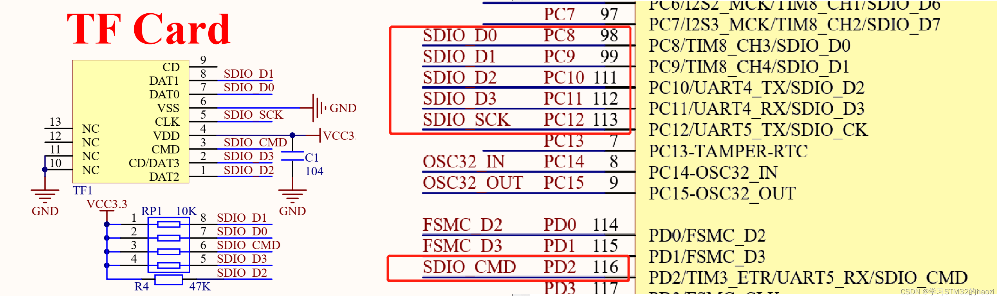
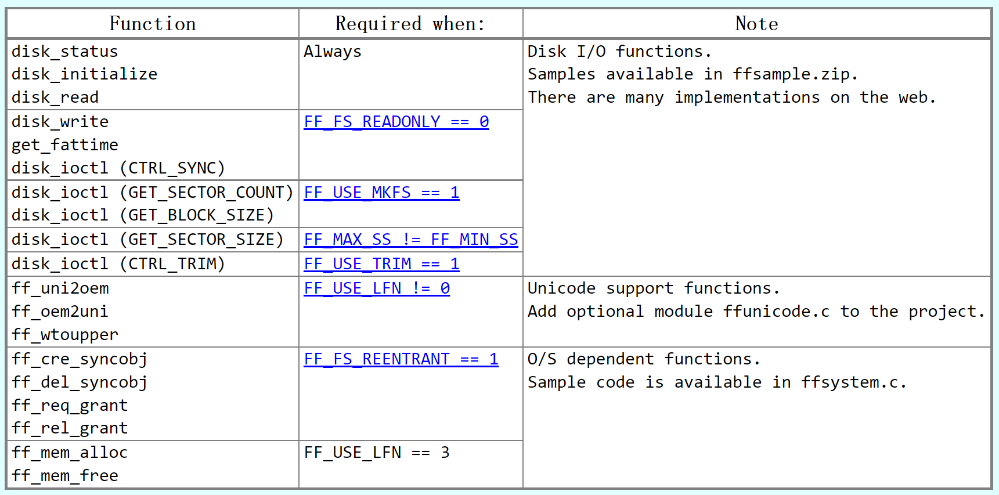

使用的开发板：RTT&正点原子的潘多拉loT Board开发板、普中Z-100开发板。主控：STM32L475VET6、STM32F103ZET6

软件：CubeMX 6.7.0、Keil 5.38、FatFs R0.15

学习路线：

1. 学会FATFS文件系统的移植；
2. 学会API的使用；

# 第一部分：移植

FatFs 是一个通用的文件系统(FAT/exFAT)模块，用于在小型嵌入式系统中实现FAT文件系统。 

FatFs 组件的编写遵循ANSI C(C89)，完全分离于磁盘 I/O 层l，因此不依赖于硬件平台。它可以嵌入到资源有限的微控制器中，如 8051, PIC, AVR, ARM, Z80, RX等等，不需要做任何修改。

# 1. 准备源码

FATFS网站：http://elm-chan.org/fsw/ff/00index_e.html

从官网中即可下载源码。这里选择最新版本`R0.15`。

下载压缩包解压后目录如下：

* ff15
  * documents（官网网页，没啥用可删除）
  * source（源码）
    * `diskio.c \ diskio.h`
    * ``ff.c \ ff.h`
    * `ffconf.h`
    * ``ffsystem.h`
    * `ffunicode.c`
    * 00history.txt
    * 00readme.txt
  * LICENSE.txt（开源协议）

其中：

1. ff.c / ff.h：文件系统协议层，几乎不用修改；
2. ffconf.h：FatFs模块的配置文件；
3. diskio.c \ diskio.h：将现有磁盘I/O模块连接到FatFs的粘合功能，即适配低层硬件接口读写操作，是主要移植修改的重点；
4. ffunicode.c：字符编码层，可以选择utf8、ascii、GBK。根据需要选择。
5. ffsystem.c：可选O/S相关功能的示例。

这是 FatFs 官方所提供的程序之间的依赖网络。其中虚线框不是必须的，为用户自行编写定义。

在官方提供的文件中，**ff.c、ff.h、diskio.h** 是不需要操作的。

> 需要修改的有：
>
> * ffconf.h：通过修改其中的宏定义可裁剪 FatFs 的部分功能。
> * diskio.c：底层驱动函数。
>
> 具体文件如何配置或修改看移植部分。

# 2. TF卡 SDIO 模式移植(尚有问题未解决)

这里使用**普中Z-100开发板**，主控芯片为**STM32F103ZET6**。开发板上TF卡与主控的通信采用**SDIO通信**。

原理图如下：

## 2.1 创建工程

使用CubeMX创建一个工程。需要配置的项目有：

* 时钟
* 程序调试接口
* 串口（用于观察调试信息）
* SDIO接口（带DMA）

其中 SDIO 接口的配置如下：

* **Clock transition on which the bit capture is made：**`Rising transition`。主时钟 SDIOCLK 产生 CLK 引脚时钟有效沿选择，可选上升沿或下降沿，它设定 SDIO 时钟控制寄存器(SDIO_CLKCR)的 NEGEDGE 位的值，一般选择设置为`上升沿`。

* **SDIO Clock divider bypass：**`Disable`。时钟分频旁路使用，可选使能或禁用，它设定 SDIO_CLKCR 寄存器的 BYPASS 位。如果使能旁路，SDIOCLK 直接驱动 CLK 线输出时钟；如果禁用，使用 SDIO_CLKCR 寄存器的 CLKDIV 位值分频 SDIOCLK，然后输出到 CLK 线。一般选择禁用时钟分频旁路。
* **SDIO Clock output enable when the bus is idle：** `Disable the power save for the clock`。节能模式选择，可选使能或禁用，它设定 SDIO_CLKCR 寄存器的 PWRSAV 位的值。如果使能节能模式，CLK 线只有在总线激活时才有时钟输出；如果禁用节能模式，始终使能 CLK 线输出时钟。
* **SDIO hardware flow control：** `The hardware control flow is disabled`。硬件流控制选择，可选使能或禁用，它设定 SDIO_CLKCR 寄存器的 HWFC_EN 位的值。硬件流控制功能可以避免 FIFO 发送上溢和下溢错误。
* **SDIOCLK clock divide factor：** `2`。时钟分频系数，它设定 SDIO_CLKCR 寄存器的 CLKDIV 位的值，设置 SDIOCLK 与 CLK 线输出时钟分频系数：CLK 线时钟频率=SDIOCLK/([CLKDIV+2])。

>SDIO相关的时钟分为两部分：
>
>1. **SDIO适配器时钟(SDIOCLK)**，用于驱动SDIO适配器，可用于产生SDIO_CK时钟。在STM32F1中，SDIOCLK来自HCLK(72MHz)。改时钟经过上述的分频后产生SDIO_CK时钟。
>
>2. **AHB总线接口时钟(HCLK/2)**，该时钟用于驱动SDIO的AHB总线接口，其频率为HCLK/2(36MHz)（）在cubemx时钟配置页面可以看得到。
>
>需要注意的是，不同的SD卡对时钟的最高频率范围不同。因此建议将**SDIOCLK clock divide factor：**从0开始慢慢增大试试，可以读写数据成功即可。
>
>我这里用的卡，经过测试设置为0时，卡信息读写成功，数据读写失败。设置为2时，均可成功。

DMA配置如下：（一般应用中都是用DMA传输）

此处，可以发现，DMA只能配置一个方向的，即两个方向共用了一个传输通道。在使用时，实际上可以通过重新初始化DMA来更改传输方向。这里先随便设置一个方向即可。

最后勾选上中断：

---

生成工程后：

修改`sdio.c`文件中的`void MX_SDIO_SD_Init(void)`函数。正确的如下：

~~~ c
void MX_SDIO_SD_Init(void)
{
  hsd.Instance = SDIO;
  hsd.Init.ClockEdge = SDIO_CLOCK_EDGE_RISING;
  hsd.Init.ClockBypass = SDIO_CLOCK_BYPASS_DISABLE;
  hsd.Init.ClockPowerSave = SDIO_CLOCK_POWER_SAVE_DISABLE;
  hsd.Init.BusWide = SDIO_BUS_WIDE_1B;	// 注意要修改这里为 SDIO_BUS_WIDE_1B
  hsd.Init.HardwareFlowControl = SDIO_HARDWARE_FLOW_CONTROL_DISABLE;
  hsd.Init.ClockDiv = 2;
  if (HAL_SD_Init(&hsd) != HAL_OK)
  {
    Error_Handler();
  }
  if (HAL_SD_ConfigWideBusOperation(&hsd, SDIO_BUS_WIDE_4B) != HAL_OK)
  {
    Error_Handler();
  }
}
~~~

> 如果生成的代码中 本来就是 hsd.Init.BusWide = SDIO_BUS_WIDE_1B; 那就不用管。
>
> 如果生成的默认是 4B，则要修改为 1B，否则此函数执行的时候不会通过。
>
> （不同固件包生成的不一样，因此要确认一下）

## 2.2 SD卡读写验证

### 2.2.1 sdio_sdcard.h

两个 test 函数，测试完成之后不需要的话可以删除。跟后续移植关系不是很大。

~~~ c
#ifndef __SDIO_SDCARD_H
#define __SDIO_SDCARD_H

#include "sdio.h"
#include "stdint.h"

void SD_info_print(void);
void SD_read_writer_test(void);
HAL_StatusTypeDef SDIO_ReadBlocks_DMA(SD_HandleTypeDef *hsd, uint8_t *pData, uint32_t BlockAdd, uint32_t NumberOfBlocks);
HAL_StatusTypeDef SDIO_WriteBlocks_DMA(SD_HandleTypeDef *hsd, uint8_t *pData, uint32_t BlockAdd, uint32_t NumberOfBlocks);
void SD_read_writer_dma_test(void);

#endif	/* __SDIO_SDCARD_H */

~~~

### 2.2.2 sdio_sdcard.c

~~~c
#include "sdio_sdcard.h"

#include "stdio.h"  // 调试信息输出
#include "sdio.h"   // cubemx生成的

extern SD_HandleTypeDef hsd;
extern DMA_HandleTypeDef hdma_sdio;

/**
 * @brief   打印SD卡信息
 *
 * @param   none
 *
 * @return  none
 */
void SD_info_print(void)
{
    HAL_SD_CardInfoTypeDef  SDCardInfo;		// SD卡信息结构体
	HAL_SD_CardCIDTypeDef sdcard_cid;		// 
    
	
    HAL_SD_GetCardInfo(&hsd, &SDCardInfo);	// 得到卡的信息
	// 打印SD卡基本信息
	printf("SD card information! \r\n");
    printf("Card Type:%d \r\n",			SDCardInfo.CardType);			// 卡类型
    printf("Card CardVersion:%d \r\n",	SDCardInfo.CardVersion);		// CardVersion
	
	printf("Card Class:%d \r\n",		SDCardInfo.Class);				// 卡Class
	printf("Card RCA:%d \r\n",			SDCardInfo.RelCardAdd);			// 卡相对地址
	
	printf("Card BlockNumber: %d \r\n", 	SDCardInfo.BlockNbr);		// 有多少个块
	printf("Card BlockSize(Byte): %d \r\n",	SDCardInfo.BlockSize);		// 块大小 默认512个字节
	printf("Card Capacity(Byte): %llu \r\n", ((unsigned long long)SDCardInfo.BlockSize * SDCardInfo.BlockNbr));	// 容量
	
    printf("Card Capacity:%d MB \r\n", (uint32_t)(SDCardInfo.LogBlockNbr) >> 11); // 显示容量
    printf("Card BlockSize:%d \r\n", 	SDCardInfo.LogBlockSize);       // 显示块大小

	
	// 读取并打印SD卡的CID信息
	HAL_SD_GetCardCID(&hsd, &sdcard_cid);
	printf("ManufacturerID: %d \r\n", sdcard_cid.ManufacturerID);	// 制造商
}

/**
 * @brief   SD卡读写测试
 *
 * @param   none
 *
 * @return  none
 */
void SD_read_writer_test(void)
{
    /* SD卡状态 */
    int sdcard_status = 0;

    uint8_t read_buf[512];      // 读数据缓存
    uint8_t write_buf[512];     // 写数据缓存

    /* 读取未操作之前的数据 */
    printf("------------------- Read SD card block data Test ------------------\r\n");
    /*
        读一个扇区的数据：
        0: 从第0个扇区开始。
        1：读一个扇区的数据。
        0xffff：等待时间。
        note：也就是只读了第0个扇区。
    */
    sdcard_status = HAL_SD_ReadBlocks(&hsd, (uint8_t *)read_buf, 0, 1, 0xffff);
    if(sdcard_status == HAL_OK)
    {
        printf("Read block data ok! \r\n");
        for(int i = 0; i < 512; i++)
        {
            printf("0x%02x ", read_buf[i]);
            if((i + 1) % 16 == 0)
            {
                printf("\r\n");
            }
        }
    }
    else
    {
        printf("Read block data fail! status = %d \r\n", sdcard_status);
    }

    /* 向SD卡块写入数据 */
    printf("------------------- Write SD card block data Test ------------------\r\n");
    /* 填充缓冲区数据 */
    for(int i = 0; i < 512; i++)
    {
        write_buf[i] = i % 256;
    }
    // 开始写入数据
    /*
        写一个扇区的数据：
        0: 从第0个扇区开始。
        1：写一个扇区的数据。
        0xffff：等待时间。
        note：也就是只写了第0个扇区。
    */
    sdcard_status = HAL_SD_WriteBlocks(&hsd, (uint8_t *)write_buf, 0, 1, 0xffff);
    if(sdcard_status == HAL_OK)
    {
        /* 传输完成不代表写入完成，因此要等待SD卡状态变为可传输状态。擦除操作也是一样。 */
        printf("Writing block data. state = %d \r\n", HAL_SD_GetCardState(&hsd));
        while(HAL_SD_GetCardState(&hsd) == HAL_SD_CARD_PROGRAMMING);
        printf("Write block data ok，state = %d \r\n", HAL_SD_GetCardState(&hsd));
    }
    else
    {
        printf("Write block data fail! status = %d \r\n", sdcard_status);
    }

    /* 读取写入之后的数据 */
    printf("------------------- Read SD card block data after Write ------------------\r\n");
    sdcard_status = HAL_SD_ReadBlocks(&hsd, (uint8_t *)read_buf, 0, 1, 0xffff);
    if(sdcard_status == HAL_OK)
    {
        printf("Read block data ok! \r\n");
        for(int i = 0; i < 512; i++)
        {
            printf("0x%02x ", read_buf[i]);
            if((i + 1) % 16 == 0)
            {
                printf("\r\n");
            }
        }
    }
    else
    {
        printf("Read block data fail! status = %d \r\n", sdcard_status);
    }

    /* 擦除SD卡块 */
    printf("------------------- Block Erase -------------------------------\r\n");
    /*
        擦除512个扇区的数据：
        0: 从第0个扇区开始。
        1：一直擦除到512扇区。
        note：擦除第0到第512个扇区数据，也包括0和512，也就是一共512个。
    */
    sdcard_status = HAL_SD_Erase(&hsd, 0, 512);
    // 等待擦除完毕
    if(sdcard_status == HAL_OK)
    {
        printf("Erasing block. state = %d \r\n", HAL_SD_GetCardState(&hsd));
        while(HAL_SD_GetCardState(&hsd) == HAL_SD_CARD_PROGRAMMING);
        printf("Erase block ok state = %d \r\n", HAL_SD_GetCardState(&hsd));
    }
    else
    {
        printf("Erase block fail! status = %d \r\n", sdcard_status);
    }

    /* 读取擦除之后的数据 */
    printf("------------------- Read SD card block data after Erase ------------------\r\n");
    sdcard_status = HAL_SD_ReadBlocks(&hsd, (uint8_t *)read_buf, 0, 1, 0xffff);
    if(sdcard_status == HAL_OK)
    {
        printf("Read block data ok \r\n");
        for(int i = 0; i < 512; i++)
        {
            printf("0x%02x ", read_buf[i]);
            if((i + 1) % 16 == 0)
            {
                printf("\r\n");
            }
        }
    }
    else
    {
        printf("Read block data fail! status = %d \r\n", sdcard_status);
    }
}

/**
 * @brief   SD卡DMA读数据（开始前重新初始化DMA，更改传输方向）
 *
 * @param   hsd
 * @param   pData
 * @param   BlockAdd
 * @param   NumberOfBlocks
 *
 * @return  none
 */
HAL_StatusTypeDef SDIO_ReadBlocks_DMA(SD_HandleTypeDef *hsd, uint8_t *pData, uint32_t BlockAdd, uint32_t NumberOfBlocks)
{
    HAL_StatusTypeDef Return_Status;
    HAL_SD_CardStateTypeDef SD_Card_Status;

	// 读之前，确保SD卡处于可传输状态
    do
    {
        SD_Card_Status = HAL_SD_GetCardState(hsd);
    } while(SD_Card_Status != HAL_SD_CARD_TRANSFER);

	// 重新初始化MDA传输方向
    HAL_DMA_DeInit(&hdma_sdio);
    hdma_sdio.Instance = DMA2_Channel4;
    hdma_sdio.Init.Direction = DMA_PERIPH_TO_MEMORY;
    hdma_sdio.Init.PeriphInc = DMA_PINC_DISABLE;
    hdma_sdio.Init.MemInc = DMA_MINC_ENABLE;
    hdma_sdio.Init.PeriphDataAlignment = DMA_PDATAALIGN_WORD;
    hdma_sdio.Init.MemDataAlignment = DMA_MDATAALIGN_WORD;
    hdma_sdio.Init.Mode = DMA_NORMAL;
    hdma_sdio.Init.Priority = DMA_PRIORITY_LOW;
    if(HAL_DMA_Init(&hdma_sdio) != HAL_OK)
    {
        Error_Handler();
    }
    __HAL_LINKDMA(hsd, hdmarx, hdma_sdio);

	// 开始一次DMA传输
    Return_Status = HAL_SD_ReadBlocks_DMA(hsd, pData, BlockAdd, NumberOfBlocks);

    return Return_Status;
}

/**
 * @brief   SD卡DMA写数据（开始前重新初始化DMA，更改传输方向）
 *
 * @param   hsd
 * @param   pData
 * @param   BlockAdd
 * @param   NumberOfBlocks
 *
 * @return  none
 */
HAL_StatusTypeDef SDIO_WriteBlocks_DMA(SD_HandleTypeDef *hsd, uint8_t *pData, uint32_t BlockAdd, uint32_t NumberOfBlocks)
{
    HAL_StatusTypeDef Return_Status;
    HAL_SD_CardStateTypeDef SD_Card_Status;

    do
    {
        SD_Card_Status = HAL_SD_GetCardState(hsd);
    } while(SD_Card_Status != HAL_SD_CARD_TRANSFER);

    // 重新初始化MDA传输方向
    HAL_DMA_DeInit(&hdma_sdio);
    hdma_sdio.Instance = DMA2_Channel4;
    hdma_sdio.Init.Direction = DMA_MEMORY_TO_PERIPH;
    hdma_sdio.Init.PeriphInc = DMA_PINC_DISABLE;
    hdma_sdio.Init.MemInc = DMA_MINC_ENABLE;
    hdma_sdio.Init.PeriphDataAlignment = DMA_PDATAALIGN_WORD;
    hdma_sdio.Init.MemDataAlignment = DMA_MDATAALIGN_WORD;
    hdma_sdio.Init.Mode = DMA_NORMAL;
    hdma_sdio.Init.Priority = DMA_PRIORITY_LOW;
    if(HAL_DMA_Init(&hdma_sdio) != HAL_OK)
    {
        Error_Handler();
    }
    __HAL_LINKDMA(hsd, hdmatx, hdma_sdio);

	// 开始一次DMA传输
    Return_Status = HAL_SD_WriteBlocks_DMA(hsd, pData, BlockAdd, NumberOfBlocks);

    return Return_Status;
}

/**
 * @brief   SD卡DMA读写测试
 *
 * @param   none
 *
 * @return  none
 */
void SD_read_writer_dma_test(void)
{
    /* SD卡状态 */
    int sdcard_status = 0;

    uint8_t read_buf[512];      // 读数据缓存
    uint8_t write_buf[512];     // 写数据缓存

    /* 读取未操作之前的数据 */
    printf("------------------- Read SD card block data Test ------------------\r\n");
    /*
        读一个扇区的数据：
        0: 从第0个扇区开始。
        1：读一个扇区的数据。
        note：也就是只读了第0个扇区。
    */
    sdcard_status = SDIO_ReadBlocks_DMA(&hsd, (uint8_t *)read_buf, 0, 1);

    if(sdcard_status == HAL_OK)
    {
        printf("Read block data ok! \r\n");
        for(int i = 0; i < 512; i++)
        {
            printf("0x%02x ", read_buf[i]);
            if((i + 1) % 16 == 0)
            {
                printf("\r\n");
            }
        }
    }
    else
    {
        printf("Read block data fail! status = %d \r\n", sdcard_status);
    }

    /* 向SD卡块写入数据 */
    printf("------------------- Write SD card block data Test ------------------\r\n");
    /* 填充缓冲区数据 */
    for(int i = 0; i < 512; i++)
    {
        write_buf[i] = i % 256;
    }
    // 开始写入数据
    /*
        写一个扇区的数据：
        0: 从第0个扇区开始。
        1：写一个扇区的数据。
        note：也就是只写了第0个扇区。
    */
    sdcard_status = SDIO_WriteBlocks_DMA(&hsd, (uint8_t *)write_buf, 0, 1);

    if(sdcard_status == HAL_OK)
    {
        /* 传输完成不代表写入完成，因此要等待SD卡状态变为可传输状态。擦除操作也是一样。 */
        printf("Writing block data. state = %d \r\n", HAL_SD_GetCardState(&hsd));
        while(HAL_SD_GetCardState(&hsd) == HAL_SD_CARD_PROGRAMMING);
        printf("Write block data ok，state = %d \r\n", HAL_SD_GetCardState(&hsd));
    }
    else
    {
        printf("Write block data fail! status = %d \r\n", sdcard_status);
    }

    /* 读取写入之后的数据 */
    printf("------------------- Read SD card block data after Write ------------------\r\n");

    sdcard_status = SDIO_ReadBlocks_DMA(&hsd, (uint8_t *)read_buf, 0, 1);

    if(sdcard_status == HAL_OK)
    {
        printf("Read block data ok! \r\n");
        for(int i = 0; i < 512; i++)
        {
            printf("0x%02x ", read_buf[i]);
            if((i + 1) % 16 == 0)
            {
                printf("\r\n");
            }
        }
    }
    else
    {
        printf("Read block data fail! status = %d \r\n", sdcard_status);
    }
}

~~~

### 2.2.3 main.c

添加printf支持，在usart.c中添加如下代码

~~~ c
// 需要调用stdio.h文件
#include <stdio.h>
// 取消ARM的半主机工作模式
#pragma import(__use_no_semihosting)// 标准库需要的支持函数                 
struct __FILE 
{ 
	int handle; 
}; 
FILE __stdout;       
void _sys_exit(int x) // 定义_sys_exit()以避免使用半主机模式
{ 
	x = x;
} 
void _ttywrch(int ch)	// 这个函数一般情况下应该是不需要的，但是在这里需要
{
	ch = ch;
}
int fputc(int ch, FILE *f)
{  
	HAL_UART_Transmit(&huart1, (uint8_t *)&ch, 1, 0xffff);
	return ch;
}

~~~

在`main.c`中while之前运行：

~~~ c
SD_info_print();
SD_read_writer_test();    // 阻塞式读写测试
SD_read_writer_dma_test();	// DMA读写测试
~~~

如果均能正常执行，即表示配置无误。

如果第二个函数读写失败：参照修改2.1小节**SDIOCLK clock divide factor**参数。

如果生成的初始化函数运行卡死：参照修改2.1小节中的`void MX_SDIO_SD_Init(void)`函数。

> 注意：如果按照上述流程配置下来，`SD_read_writer_test();`写出错，而`SD_read_writer_dma_test();`正常运行是没什么问题的。
>
> 因为上面的时钟频率设置的挺高的（**SDIOCLK clock divide factor：** `2`），在此情况下，只能使用DMA模式。
>
> 如果不放心，可以把这个参数调大一点之后，然后验证阻塞式读写。验证可以之后再调回来（实际应用中肯定希望速度快一点）。

## 2.3 移植 FATFS 系统

### 2.3.1 添加源码

在确保SD卡读写无误之后，开始移植。

在工程目录创建文件夹并放入FATFS系统源码

* Middlewares\FATFS_R0.15
  * ffunicode.c
  * ffsystem.c
  * ffconf.h
  * ff.h
  * ff.c
  * diskio.h
  * diskio.c
  * 00readme.txt
  * 00history.txt

并在 Keil 中添加文件和头文件路径。

---

然后开始适配工作。

### 2.3.2 修改配置 ffconf.h

一些声明的含义可以参考一下网址：http://elm-chan.org/fsw/ff/doc/config.html。

以下内容是把原有的英文注释换成了中文的。并且修改了自己需要的配置。

需要注意的点（需要进行适配）：

* `#define FF_CODE_PAGE	936 // 支持中文`	
* `#define FF_USE_LFN		3 // 支持长文件名，且存在堆区`
* `#define FF_VOLUMES		1 // 一共有一个卷`

~~~c
/* 以下是全部默认拥有的配置 */

/* 版本ID */
#define FFCONF_DEF	80286	/* Revision ID */

/* 设置是否只读。建议为0，否则很多API用不了（0：可读写。1：只读）*/
#define FF_FS_READONLY	0

/* 
	此选项定义了最小化级别，以删除一些基本API函数。 
	
	0：基本功能已完全启用。建议为0
	1：f_stat(), f_getfree(), f_unlink(), f_mkdir(), f_truncate() and f_rename() 被移除
	2：在 1 的基础上 f_opendir(), f_readdir() and f_closedir() 被移除
	3：在 2 的基础上 f_lseek() 被移除
*/

#define FF_FS_MINIMIZE	0

/* 
	设置是否使用查找功能 f_findfirst() and f_findnext(). 
	
	0：不启用
	1：启用
	2：同时启用匹配altname[]
*/
#define FF_USE_FIND		0

/* 
	是否启用格式化功能 f_mkfs()，对于没有格式化为Fat32的U盘或者SD卡，设置为1，否则无法正常初始化。
	
	0：禁止使用 f_mkfs()
	1：允许使用 f_mkfs()
*/
#define FF_USE_MKFS		1

/* 设置是否使用快速查找功能（0：不使用。1：使用）*/
#define FF_USE_FASTSEEK	1

/* 设置是否使用拓展功能（0：不使用。1：使用） */
#define FF_USE_EXPAND	1

/* 切换属性操作函数 f_chmod（）和 f_utime（）（0：不使用。1：使用）仅在 FF_FS_READONLY 模式下可用*/
#define FF_USE_CHMOD	0

/* 切换卷标函数 f_getlabel() and f_setlabel() （0：不使用。1：使用）*/
#define FF_USE_LABEL	1

/* 此选项切换 f_forward（）函数。（0:禁用或1:启用） */
#define FF_USE_FORWARD	0

/* 设置对字符串的操作 */
#define FF_USE_STRFUNC	1
#define FF_PRINT_LLI	1
#define FF_PRINT_FLOAT	1
#define FF_STRF_ENCODE	3
/* FF_USE_STRFUNC switches string functions, f_gets(), f_putc(), f_puts() and f_printf().
/
/   0: Disable. FF_PRINT_LLI, FF_PRINT_FLOAT and FF_STRF_ENCODE have no effect.
/   1: Enable without LF-CRLF conversion.
/   2: Enable with LF-CRLF conversion.
/
/  FF_PRINT_LLI = 1 makes f_printf() support long long argument and FF_PRINT_FLOAT = 1/2
/  makes f_printf() support floating point argument. These features want C99 or later.
/  When FF_LFN_UNICODE >= 1 with LFN enabled, string functions convert the character
/  encoding in it. FF_STRF_ENCODE selects assumption of character encoding ON THE FILE
/  to be read/written via those functions.
/
/   0: ANSI/OEM in current CP
/   1: Unicode in UTF-16LE
/   2: Unicode in UTF-16BE
/   3: Unicode in UTF-8
*/

/* 设置语言支持（932：中文支持。437：英文支持）*/
#define FF_CODE_PAGE	932
/* This option specifies the OEM code page to be used on the target system.
/  Incorrect code page setting can cause a file open failure.
/   437 - U.S.
/   720 - Arabic
/   737 - Greek
/   771 - KBL
/   775 - Baltic
/   850 - Latin 1
/   852 - Latin 2
/   855 - Cyrillic
/   857 - Turkish
/   860 - Portuguese
/   861 - Icelandic
/   862 - Hebrew
/   863 - Canadian French
/   864 - Arabic
/   865 - Nordic
/   866 - Russian
/   869 - Greek 2
/   932 - Japanese (DBCS)
/   936 - Simplified Chinese (DBCS)
/   949 - Korean (DBCS)
/   950 - Traditional Chinese (DBCS)
/     0 - Include all code pages above and configured by f_setcp()
*/

#define FF_USE_LFN		0
#define FF_MAX_LFN		255
/* The FF_USE_LFN switches the support for LFN (long file name).
/
/   0: Disable LFN. FF_MAX_LFN has no effect.（默认最长12个字符）
/   1: Enable LFN with static  working buffer on the BSS. Always NOT thread-safe.
/   2: Enable LFN with dynamic working buffer on the STACK.
/   3: Enable LFN with dynamic working buffer on the HEAP.
/
/  To enable the LFN, ffunicode.c needs to be added to the project. The LFN function
/  requiers certain internal working buffer occupies (FF_MAX_LFN + 1) * 2 bytes and
/  additional (FF_MAX_LFN + 44) / 15 * 32 bytes when exFAT is enabled.
/  The FF_MAX_LFN defines size of the working buffer in UTF-16 code unit and it can
/  be in range of 12 to 255. It is recommended to be set it 255 to fully support LFN
/  specification.
/  When use stack for the working buffer, take care on stack overflow. When use heap
/  memory for the working buffer, memory management functions, ff_memalloc() and
/  ff_memfree() exemplified in ffsystem.c, need to be added to the project. */

#define FF_LFN_UNICODE	0
/* This option switches the character encoding on the API when LFN is enabled.
/
/   0: ANSI/OEM in current CP (TCHAR = char)
/   1: Unicode in UTF-16 (TCHAR = WCHAR)
/   2: Unicode in UTF-8 (TCHAR = char)
/   3: Unicode in UTF-32 (TCHAR = DWORD)
/
/  Also behavior of string I/O functions will be affected by this option.
/  When LFN is not enabled, this option has no effect. */

#define FF_LFN_BUF		255
#define FF_SFN_BUF		12
/* This set of options defines size of file name members in the FILINFO structure
/  which is used to read out directory items. These values should be suffcient for
/  the file names to read. The maximum possible length of the read file name depends
/  on character encoding. When LFN is not enabled, these options have no effect. */

#define FF_FS_RPATH		0
/* This option confatfs文件系统移植 support for relative path.
/
/   0: Disable relative path and remove related functions.
/   1: Enable relative path. f_chdir() and f_chdrive() are available.
/   2: f_getcwd() function is available in addition to 1.
*/

/* Number of volumes (logical drives) to be used. (1-10) */
#define FF_VOLUMES		1

#define FF_STR_VOLUME_ID	0
#define FF_VOLUME_STRS		"RAM","NAND","CF","SD","SD2","USB","USB2","USB3"
/* FF_STR_VOLUME_ID switches support for volume ID in arbitrary strings.
/  When FF_STR_VOLUME_ID is set to 1 or 2, arbitrary strings can be used as drive
/  number in the path name. FF_VOLUME_STRS defines the volume ID strings for each
/  logical drives. Number of items must not be less than FF_VOLUMES. Valid
/  characters for the volume ID strings are A-Z, a-z and 0-9, however, they are
/  compared in case-insensitive. If FF_STR_VOLUME_ID >= 1 and FF_VOLUME_STRS is
/  not defined, a user defined volume string table is needed as:
/
/  const char* VolumeStr[FF_VOLUMES] = {"ram","flash","sd","usb",...
*/

#define FF_MULTI_PARTITION	0
/* This option switches support for multiple volumes on the physical drive.
/  By default (0), each logical drive number is bound to the same physical drive
/  number and only an FAT volume found on the physical drive will be mounted.
/  When this function is enabled (1), each logical drive number can be bound to
/  arbitrary physical drive and partition listed in the VolToPart[]. Also f_fdisk()
/  function will be available. */

#define FF_MIN_SS		512
#define FF_MAX_SS		512
/* This set of options confatfs文件系统移植 the range of sector size to be supported. (512,
/  1024, 2048 or 4096) Always set both 512 for most systems, generic memory card and
/  harddisk, but a larger value may be required for on-board flash memory and some
/  type of optical media. When FF_MAX_SS is larger than FF_MIN_SS, FatFs is configured
/  for variable sector size mode and disk_ioctl() function needs to implement
/  GET_SECTOR_SIZE command. */

#define FF_LBA64		0
/* This option switches support for 64-bit LBA. (0:Disable or 1:Enable)
/  To enable the 64-bit LBA, also exFAT needs to be enabled. (FF_FS_EXFAT == 1) */

#define FF_MIN_GPT		0x10000000
/* Minimum number of sectors to switch GPT as partitioning format in f_mkfs and
/  f_fdisk function. 0x100000000 max. This option has no effect when FF_LBA64 == 0. */

#define FF_USE_TRIM		0
/* This option switches support for ATA-TRIM. (0:Disable or 1:Enable)
/  To enable Trim function, also CTRL_TRIM command should be implemented to the
/  disk_ioctl() function. */

#define FF_FS_TINY		0
/* This option switches tiny buffer configuration. (0:Normal or 1:Tiny)
/  At the tiny configuration, size of file object (FIL) is shrinked FF_MAX_SS bytes.
/  Instead of private sector buffer eliminated from the file object, common sector
/  buffer in the filesystem object (FATFS) is used for the file data transfer. */

#define FF_FS_EXFAT		0
/* This option switches support for exFAT filesystem. (0:Disable or 1:Enable)
/  To enable exFAT, also LFN needs to be enabled. (FF_USE_LFN >= 1)
/  Note that enabling exFAT discards ANSI C (C89) compatibility. */

#define FF_FS_NORTC		0
#define FF_NORTC_MON	1
#define FF_NORTC_MDAY	1
#define FF_NORTC_YEAR	2022
/* The option FF_FS_NORTC switches timestamp feature. If the system does not have
/  an RTC or valid timestamp is not needed, set FF_FS_NORTC = 1 to disable the
/  timestamp feature. Every object modified by FatFs will have a fixed timestamp
/  defined by FF_NORTC_MON, FF_NORTC_MDAY and FF_NORTC_YEAR in local time.
/  To enable timestamp function (FF_FS_NORTC = 0), get_fattime() function need to be
/  added to the project to read current time form real-time clock. FF_NORTC_MON,
/  FF_NORTC_MDAY and FF_NORTC_YEAR have no effect.
/  These options have no effect in read-only configuration (FF_FS_READONLY = 1). */

#define FF_FS_NOFSINFO	0
/* If you need to know correct free space on the FAT32 volume, set bit 0 of this
/  option, and f_getfree() function at the first time after volume mount will force
/  a full FAT scan. Bit 1 controls the use of last allocated cluster number.
/
/  bit0=0: Use free cluster count in the FSINFO if available.
/  bit0=1: Do not trust free cluster count in the FSINFO.
/  bit1=0: Use last allocated cluster number in the FSINFO if available.
/  bit1=1: Do not trust last allocated cluster number in the FSINFO.
*/

#define FF_FS_LOCK		0
/* The option FF_FS_LOCK switches file lock function to control duplicated file open
/  and illegal operation to open objects. This option must be 0 when FF_FS_READONLY
/  is 1.
/
/  0:  Disable file lock function. To avoid volume corruption, application program
/      should avoid illegal open, remove and rename to the open objects.
/  >0: Enable file lock function. The value defines how many files/sub-directories
/      can be opened simultaneously under file lock control. Note that the file
/      lock control is independent of re-entrancy. */

#define FF_FS_REENTRANT	0
#define FF_FS_TIMEOUT	1000
/* The option FF_FS_REENTRANT switches the re-entrancy (thread safe) of the FatFs
/  module itself. Note that regardless of this option, file access to different
/  volume is always re-entrant and volume control functions, f_mount(), f_mkfs()
/  and f_fdisk() function, are always not re-entrant. Only file/directory access
/  to the same volume is under control of this featuer.
/
/   0: Disable re-entrancy. FF_FS_TIMEOUT have no effect.
/   1: Enable re-entrancy. Also user provided synchronization handlers,
/      ff_mutex_create(), ff_mutex_delete(), ff_mutex_take() and ff_mutex_give()
/      function, must be added to the project. Samples are available in ffsystem.c.
/
/  The FF_FS_TIMEOUT defines timeout period in unit of O/S time tick.
*/
~~~

这里设置了支持长文件名，并且相关内容要申请堆中的内存，因此这里需要增大堆内存的空间。

也可以直接从启动文件处修改

### 2.3.3 底层适配 diskio.c

需要适配的函数如下

**第一步：设备编号定义**

这里只有一个设备（SD卡），把`DEV_MMC`编号改为**0**。（要求从0开始按顺序增加）

其他的可以按顺序编号，当然也可以直接删掉。但是为了以后增加，建议保留。

~~~ c
/* Definitions of physical drive number for each drive */
#define DEV_RAM		1	/* Example: Map Ramdisk to physical drive 0 */
#define DEV_MMC		0	/* Example: Map MMC/SD card to physical drive 1 */
#define DEV_USB		2	/* Example: Map USB MSD to physical drive 2 */
~~~

这里名字其实是可以改的，比如改为（正点原子就是这样的）：

~~~ c
#define SD_CARD	 	0  			// SD卡,卷标为0
#define EX_FLASH 	1			// 外部spi flash,卷标为1
~~~

> 如果改了，下面的适配函数也都一样改就可以了。

**第二步：添加头文件**

因为需要用到我们前面写好的驱动以及printf调试输出，把头文件添加进来。

~~~ c
#include "spi_sdcard.h"
#include "stdio.h"
~~~

**第三步：函数适配**

这里直接默认返回OK，没什么问题，其他类型的设备注释掉即可。需要用的话再修改。

~~~ c
DSTATUS disk_status (
	BYTE pdrv		/* Physical drive nmuber to identify the drive */
)
{
	DSTATUS stat;

	switch (pdrv) {
	case DEV_RAM :	// 还没用到，先注释掉
		// result = RAM_disk_status();

		// translate the reslut code here

		return stat;

	case DEV_MMC :
	
		return 0;	// 默认没什么问题

	case DEV_USB :	// 还没用到，先注释掉
		// result = USB_disk_status();

		// translate the reslut code here

		return stat;
	}
	return STA_NOINIT;
}
~~~

初始化调用我们前面写好的驱动

~~~ c
DSTATUS disk_initialize (
	BYTE pdrv				/* Physical drive nmuber to identify the drive */
)
{
	DSTATUS stat;

	switch (pdrv) {
	case DEV_RAM :	// 还没用到，先注释掉
		// result = RAM_disk_initialize();

		// translate the reslut code here

		return stat;

	case DEV_MMC :
		
		if(SD_Init() == 0)    // SD_Init()是SD初始化函数，无错误返回0
            return 0;
        else
            return STA_NOINIT;

	case DEV_USB :	// 还没用到，先注释掉
		// result = USB_disk_initialize();

		// translate the reslut code here

		return stat;
	}
	return STA_NOINIT;
}

~~~

读扇区函数，一样的调用前面的驱动

~~~ c
DRESULT disk_read (
	BYTE pdrv,		/* Physical drive nmuber to identify the drive */
	BYTE *buff,		/* Data buffer to store read data */
	LBA_t sector,	/* Start sector in LBA */
	UINT count		/* Number of sectors to read */
)
{
	DRESULT res;

	switch (pdrv) {
	case DEV_RAM :
		// translate the arguments here

		// result = RAM_disk_read(buff, sector, count);

		// translate the reslut code here

		return res;

	case DEV_MMC :
		
		res = (DRESULT) SD_ReadDisk(buff, sector, count);
	
		while(res)	// 读出错
		{
			printf("sd read error:%d\r\n", res);
			SD_Init();	// 重新初始化SD卡
			res =  (DRESULT) SD_ReadDisk(buff,sector,count);
		}

		return res;

	case DEV_USB :
		// translate the arguments here

		// result = USB_disk_read(buff, sector, count);

		// translate the reslut code here

		return res;
	}

	return RES_PARERR;
}
~~~

写扇区函数，还是调用写好的驱动

~~~ c
DRESULT disk_write (
	BYTE pdrv,			/* Physical drive nmuber to identify the drive */
	const BYTE *buff,	/* Data to be written */
	LBA_t sector,		/* Start sector in LBA */
	UINT count			/* Number of sectors to write */
)
{
	DRESULT res;

	switch (pdrv) {
	case DEV_RAM :
		// translate the arguments here

		// result = RAM_disk_write(buff, sector, count);

		// translate the reslut code here

		return res;

	case DEV_MMC :
		
		res = (DRESULT) SD_WriteDisk((uint8_t *)buff, sector, count);

		while(res)	// 写出错
		{
			printf("sd write error:%d\r\n", res);
			SD_Init();	// 重新初始化SD卡
			res = (DRESULT) SD_WriteDisk((uint8_t *)buff, sector, count);			
		}

		return res;

	case DEV_USB :
		// translate the arguments here

		// result = USB_disk_write(buff, sector, count);

		// translate the reslut code here

		return res;
	}

	return RES_PARERR;
}
~~~

命令函数

~~~ c
DRESULT disk_ioctl (
	BYTE pdrv,		/* Physical drive nmuber (0..) */
	BYTE cmd,		/* Control code */
	void *buff		/* Buffer to send/receive control data */
)
{
	DRESULT res;

	switch (pdrv) {
	case DEV_RAM :

		// Process of the command for the RAM drive

		return res;

	case DEV_MMC :

		switch(cmd)
	    {
#if FF_FS_READONLY == 0
		    case CTRL_SYNC:
				res = RES_OK; 
		        break;
#endif
#if FF_USE_MKFS == 1
		    case GET_SECTOR_COUNT:
		        *(DWORD*)buff = SD_GetSectorCount();
		        res = RES_OK;
		        break;
		    case GET_BLOCK_SIZE:
				*(WORD*)buff = 8;
		        res = RES_OK;
		        break;
#endif
#if FF_MAX_SS != FF_MIN_SS
		    case GET_SECTOR_SIZE:
				*(DWORD*)buff = 512; 
		        res = RES_OK;
		        break;	 
#endif
		    default:
		        res = RES_PARERR;
		        break;
	    }
		return res;

	case DEV_USB :

		// Process of the command the USB drive

		return res;
	}

	return RES_PARERR;
}
~~~

在此文件的最后添加一个获取时间的函数，默认返回0

~~~ c
DWORD get_fattime(void)
{				 
	return 0;
}
~~~

### 2.3.4 验证 main.c

把以下代码放在main函数中执行，如果成功执行，说明没问题。

> 这里执行 f_res = f_mount(&fs, "0:", 1)，标号0就是diskio.c开头定义的标号。

~~~ c
	FATFS fs;				/* FatFs 文件系统对象 */
	FRESULT f_res;			/* 文件操作结果 */
	BYTE work[FF_MAX_SS];

	FIL file;                       /* 文件对象 */
	UINT fnum;                      /* 文件成功读写数量 */
	BYTE ReadBuffer[1024] = {0};    /* 读缓冲区 */
	BYTE WriteBuffer[] = "This is STM32 working with FatFs \r\n";	/* 写缓冲区 */

	// 在外部 SD 卡挂载文件系统，文件系统挂载时会对 SD 卡初始化
	// note:必须先要保证SD卡正常拥有FAT文件系统，如果没有会失败。
    f_res = f_mount(&fs, "0:", 1);
	
	/* 如果没有文件系统就格式化创建创建文件系统 */
    if(f_res == FR_NO_FILESYSTEM)
    {
        printf("The SD card does not yet have a file system and is about to be formatted... \r\n");
        /* 格式化 */
		f_res = f_mkfs("0:", NULL, work, sizeof(work));	/* Create a FAT volume */
		
        if(f_res == FR_OK)
        {
            printf("The SD card successfully formatted the file system\r\n");
            /* 格式化后，先取消挂载 */
            f_res = f_mount(NULL, "0:", 1);
            /* 重新挂载 */
            f_res = f_mount(&fs, "0:", 1);
        }
        else
        {
            printf("The format failed\r\n");
            while(1);
        }
    }
    else if(f_res != FR_OK)
    {
        printf("mount error : %d \r\n", f_res);
        while(1);
    }
    else
    {
        printf("mount sucess!!! \r\n");
    }
	
	/*----------------------- 文件系统测试：写测试 -----------------------------*/
    /* 打开文件，如果文件不存在则创建它 */
    printf("\r\n ****** Create and Open new text file objects with write access ****** \r\n");
    
	f_res = f_open(&file, "0:FatFs STM32cube.txt", FA_CREATE_ALWAYS | FA_WRITE);
    if(f_res == FR_OK)
    {
        printf("open file sucess!!! \r\n");
        /* 将指定存储区内容写入到文件内 */
        printf("\r\n****** Write data to the text files ******\r\n");
        f_res = f_write(&file, WriteBuffer, sizeof(WriteBuffer), &fnum);
        if(f_res == FR_OK)
        {
            printf("write file sucess!!! (%d)\r\n", fnum);
            printf("write Data : %s\r\n", WriteBuffer);
        }
        else
        {
            printf("write file error : %d\r\n", f_res);
        }
        /* 不再读写，关闭文件 */
        f_close(&file);
    }
    else
    {
        printf("open file error : %d\r\n", f_res);
    }
    
    /*------------------- 文件系统测试：读测试 ------------------------------------*/
    printf("\r\n****** Read data from the text files ******\r\n");
    f_res = f_open(&file, "0:FatFs STM32cube.txt", FA_OPEN_EXISTING | FA_READ);
    if(f_res == FR_OK)
    {
        printf("open file sucess!!! \r\n");
        f_res = f_read(&file, ReadBuffer, sizeof(ReadBuffer), &fnum);
        if(f_res == FR_OK)
        {
            printf("read sucess!!! (%d)\r\n", fnum);
            printf("read Data : %s\r\n", ReadBuffer);
        }
        else
        {
            printf(" read error!!! %d\r\n", f_res);
        }
    }
    else
    {
        printf("open file error : %d\r\n", f_res);
    }
    /* 不再读写，关闭文件 */
    f_close(&file);
    /* 不再使用文件系统，取消挂载文件系统 */
    f_mount(NULL, "0:", 1);
    /* 操作完成，停机 */
~~~

其他 API 的使用参考 FATFS 官网：http://elm-chan.org/fsw/ff/00index_e.html

# 3. TF卡 SPI 模式移植

这里使用**RTT&正点原子的潘多拉loT Board开发板**，主控芯片为**STM32L475VET6**。开发板上TF卡与主控的通信采用**SPI通信**。

原理图如下：

* SPI1_SCK：PA5
* SPI1_MISO：PA6
* SPI1_MOSI：PA7
* SD_CS：PC3

## 3.1 创建工程

使用CubeMX创建一个工程。需要配置的项目有：

* 时钟
* 程序调试接口
* 串口（用于观察调试信息）
* SPI 接口
* 片选引脚CS（推挽输出，默认高电平，速度最快，上拉）

其中 SPI 接口的配置如下： 

>SPI 与 SD卡 通信，在卡识别阶段，时钟频率不能超过400K。在传输数据阶段可以更高，最多不超过25M。不同的卡上限不太一样。
>
>这里初始化时先设置一个较低的速度，识别完成之后更改 SPI 波特率即可。

## 3.2 SD卡读写验证

### 3.2.1 spi_sdcard.h

~~~ c
#ifndef __SPI_SDCARD_H
#define __SPI_SDCARD_H

#include "stdint.h"

/*
	SD_CS:		PC3		// 片选
*/
#define	SD_CS_SET(n)	(n?HAL_GPIO_WritePin(GPIOC, GPIO_PIN_3, GPIO_PIN_SET):HAL_GPIO_WritePin(GPIOC, GPIO_PIN_3, GPIO_PIN_RESET))

// SD卡类型定义  
#define SD_TYPE_ERR     0X00
#define SD_TYPE_MMC     0X01
#define SD_TYPE_V1      0X02
#define SD_TYPE_V2      0X04
#define SD_TYPE_V2HC    0X06
// SD卡指令表  	   
#define CMD0    0       // 卡复位
#define CMD1    1
#define CMD8    8       // 命令8 ，SEND_IF_COND
#define CMD9    9       // 命令9 ，读CSD数据
#define CMD10   10      // 命令10，读CID数据
#define CMD12   12      // 命令12，停止数据传输
#define CMD16   16      // 命令16，设置SectorSize 应返回0x00
#define CMD17   17      // 命令17，读sector
#define CMD18   18      // 命令18，读Multi sector
#define CMD23   23      // 命令23，设置多sector写入前预先擦除N个block
#define CMD24   24      // 命令24，写sector
#define CMD25   25      // 命令25，写Multi sector
#define CMD41   41      // 命令41，应返回0x00
#define CMD55   55      // 命令55，应返回0x01
#define CMD58   58      // 命令58，读OCR信息
#define CMD59   59      // 命令59，使能/禁止CRC，应返回0x00
// 数据写入回应字意义
#define MSD_DATA_OK                0x05
#define MSD_DATA_CRC_ERROR         0x0B
#define MSD_DATA_WRITE_ERROR       0x0D
#define MSD_DATA_OTHER_ERROR       0xFF
// SD卡回应标记字
#define MSD_RESPONSE_NO_ERROR      0x00
#define MSD_IN_IDLE_STATE          0x01
#define MSD_ERASE_RESET            0x02
#define MSD_ILLEGAL_COMMAND        0x04
#define MSD_COM_CRC_ERROR          0x08
#define MSD_ERASE_SEQUENCE_ERROR   0x10
#define MSD_ADDRESS_ERROR          0x20
#define MSD_PARAMETER_ERROR        0x40
#define MSD_RESPONSE_FAILURE       0xFF

/* ========================== 以下通信部分修改区 ============================*/
void SD_SPI_SetSpeed(uint8_t SPI_BaudRatePrescaler);
uint8_t SD_SPI_ReadWriteByte(uint8_t TxData);
uint8_t SD_SPI_WriteByte(uint8_t TxData);
/* ========================== 以上通信部分修改区 ============================*/

/* ========================== 以下SD卡通信修改区 ============================*/
extern uint8_t  SD_Type;			//SD卡的类型

uint8_t SD_ReadWriteByte(uint8_t data);
void SD_SpeedLow(void);
void SD_SpeedHigh(void);
/* ========================== 以上SD卡通信修改区 ============================*/

/* ========================== 以下SD卡通信实现区（无需修改） ============================*/
uint8_t SD_WaitReady(void);										// 等待SD卡准备
void SD_DisSelect(void);										// 取消片选
uint8_t SD_Select(void);										// 片选选中
uint8_t SD_GetResponse(uint8_t Response);						// 获得响应
uint8_t SD_RecvData(uint8_t *buf, uint16_t len);				// 读sd卡512字节（一个扇区）
uint8_t SD_SendBlock(uint8_t *buf, uint8_t cmd);				// 向sd卡写512字节（一个扇区）
uint8_t SD_SendCmd(uint8_t cmd, uint32_t arg, uint8_t crc);		// 发送命令
uint8_t SD_GetCID(uint8_t *cid_data);							// 读SD卡CID
uint8_t SD_GetCSD(uint8_t *csd_data);							// 读SD卡CSD
uint32_t SD_GetSectorCount(void);								// 读扇区数
uint8_t SD_Init(void);											// 初始化
uint8_t SD_ReadDisk(uint8_t *buf, uint32_t sector, uint8_t cnt);	// 写块，连续读扇区
uint8_t SD_WriteDisk(uint8_t *buf, uint32_t sector, uint8_t cnt);	// 读块，连续写扇区
/* ========================== 以上SD卡通信实现区（无需修改） ============================*/

#endif	/* __SPI_SDCARD_H */

~~~

### 3.2.2 spi_sdcard.c

~~~ c
#include "spi_sdcard.h"
#include "stdio.h"	// 调试信息输出

#include "spi.h"    // cubemx生成的
#include "usart.h"  // cubemx生成的

/* ========================== 以下通信部分修改区 ============================*/

extern SPI_HandleTypeDef hspi1;
#define SD_SPI hspi1            // 减少移植时需要修改的地方

/**
 * @brief   SD_SPI 速度设置函数
 *
 * @param   SPI_BaudRate_Prescaler  SPI_BAUDRATEPRESCALER_2~SPI_BAUDRATEPRESCALER_256（2的倍数）
 *
 * @return  void
 *
 * @remark  SD卡初始化时，波特率不能超过400k，传输数据时可以很高（不同SD卡的最高范围不同）。
 *
 */
void SD_SPI_SetSpeed(uint8_t SPI_BaudRatePrescaler)
{
    assert_param(IS_SPI_BAUDRATE_PRESCALER(SPI_BaudRatePrescaler)); // 判断有效性

    __HAL_SPI_DISABLE(&SD_SPI);            // 先关闭SPI

    // hspi1.Init.BaudRatePrescaler = SPI_BAUDRATEPRESCALER_256;    // 设置波特率

    SD_SPI.Instance->CR1 &= 0XFFC7;                 // 位3-5清零，用来设置波特率
    SD_SPI.Instance->CR1 |= SPI_BaudRatePrescaler;  // 设置SPI速度

    __HAL_SPI_ENABLE(&SD_SPI);             // 重新使能SPI
}

/**
 * @brief   SD_SPI 读写一个字节
 *
 * @param   TxData      要写入的字节
 *
 * @return  uint8_t     读取到的字节
 */
uint8_t SD_SPI_ReadWriteByte(uint8_t TxData)
{
    uint8_t Rxdata;
    HAL_SPI_TransmitReceive(&SD_SPI, &TxData, &Rxdata, 1, 1000);
    return Rxdata;
}

/**
 * @brief   SD_SPI 写入一个字节
 *
 * @param   TxData      要写入的字节
 *
 * @return  uint8_t     0:写入成功,其他:写入失败
 */
uint8_t SD_SPI_WriteByte(uint8_t TxData)
{
    return HAL_SPI_Transmit(&SD_SPI, &TxData, 1, 1000);
}

/* ========================== 以上通信部分修改区 ============================*/

/* ========================== 以下SD卡通信修改区 ============================*/

uint8_t  SD_Type = 0;   // SD卡的类型

/**
 * @brief   SD卡底层读写一个字节
 *
 * @param   data        要写入的字节
 *
 * @return  uint8_t     读取到的字节
 *
 * @remark  调用SPI读写
 */
uint8_t SD_ReadWriteByte(uint8_t data)
{
    return SD_SPI_ReadWriteByte(data);
}

/**
 * @brief   SD卡初始化的时候,需要低速（400K以下）
 *
 * @param   void
 *
 * @return  void
 *
 * @remark  根据自己的芯片选择合适的分频系数 STM32L475VET6在这个分频系数下对应的是312.5K
 */
void SD_SpeedLow(void)
{
    // 初始化时设置到低速模式
    SD_SPI_SetSpeed(SPI_BAUDRATEPRESCALER_256);
}

/**
 * @brief   SD卡正常工作的时候,可以高速
 *
 * @param   void
 *
 * @return  void
 *
 * @remark  根据自己的芯片选择合适的分频系数 STM32L475VET6在这个分频系数下对应的是40M
 */
void SD_SpeedHigh(void)
{
    // 传输数据时设置到高速模式
    SD_SPI_SetSpeed(SPI_BAUDRATEPRESCALER_2);   // STM32L475VET6对应的是40M
}

/* ========================== 以上SD卡通信修改区 ============================*/

/* ========================== 以下SD卡通信实现区（无需修改） ============================*/

/**
 * @brief   等待卡准备好
 *
 * @param   void
 *
 * @return  uint8_t 0,准备好了;其他,错误代码
 */
uint8_t SD_WaitReady(void)
{
    uint32_t t = 0;
    do
    {
        if(SD_SPI_ReadWriteByte(0XFF) == 0XFF)
			return 0;		// OK
        t++;
    } while(t < 0XFFFFFF);	// 等待
    return 1;
}

/**
 * @brief   取消选择,释放SPI总线
 *
 * @param   void
 *
 * @return  void
 */
void SD_DisSelect(void)
{
    SD_CS_SET(1);
    SD_ReadWriteByte(0xff); // 提供额外的8个时钟
}

/**
 * @brief   选择SD卡,并且等待卡准备OK
 *
 * @param   void
 *
 * @return  0,成功;1,失败;
 */
uint8_t SD_Select(void)
{
    SD_CS_SET(0);
    
	if(SD_WaitReady() == 0)
        return 0;	// 等待成功
	
    SD_DisSelect();
	
    return 1;	// 等待失败
}

/**
 * @brief   等待SD卡回应
 *
 * @param   Response	要得到的回应值
 *
 * @return  uint8_t		0,成功得到了该回应值。其他,得到回应值失败。
 */
uint8_t SD_GetResponse(uint8_t Response)
{
    uint16_t Count = 0xFFFF; // 等待次数
    while((SD_SPI_ReadWriteByte(0XFF) != Response) && Count)
		Count--; 	// 等待得到准确的回应
    if(Count == 0)
		return MSD_RESPONSE_FAILURE;	// 得到回应失败
    else 
		return MSD_RESPONSE_NO_ERROR;	// 正确回应
}

/**
 * @brief   从sd卡读取一个数据包的内容
 *
 * @param   buf     	数据缓存区
 * @param   len     	要读取的数据长度
 *
 * @return  uint8_t     0,成功;其他,失败
 */
uint8_t SD_RecvData(uint8_t *buf, uint16_t len)
{
    if(SD_GetResponse(0xFE))
		return 1;	// 等待SD卡发回数据起始令牌0xFE
    while(len--)	// 开始接收数据
    {
        *buf = SD_ReadWriteByte(0xFF);
        buf++;
    }
    //下面是2个伪CRC（dummy CRC）
    SD_SPI_ReadWriteByte(0xFF);
    SD_SPI_ReadWriteByte(0xFF);
    return 0; // 读取成功
}

/**
 * @brief   向sd卡写入一个数据包的内容 512字节
 *
 * @param   buf     	数据缓存区
 * @param   cmd     	指令
 *
 * @return  uint8_t     0,成功;其他,失败
 */
uint8_t SD_SendBlock(uint8_t *buf, uint8_t cmd)
{
    uint16_t t;
	
    if(SD_WaitReady())
		return 1;	// 等待准备失效
	
    SD_ReadWriteByte(cmd);
	
    if(cmd != 0XFD)	// 不是结束指令
    {
        for(t = 0; t < 512; t++)
			SD_ReadWriteByte(buf[t]);		// 提高速度,减少函数传参时间
		
        SD_ReadWriteByte(0xFF);	// 忽略crc
        SD_ReadWriteByte(0xFF);
        
		t = SD_SPI_ReadWriteByte(0xFF);	// 接收响应
        
		if((t & 0x1F) != 0x05)
			return 2;	// 响应错误
    }
    return 0;	// 写入成功
}

/**
 * @brief   向SD卡发送一个命令
 *
 * @param   cmd     	命令
 * @param   arg     	命令参数
 * @param   crc     	crc校验值
 *
 * @return  uint8_t     SD卡返回的响应
 */
uint8_t SD_SendCmd(uint8_t cmd, uint32_t arg, uint8_t crc)
{
    uint8_t r1;
    uint8_t Retry = 0;
    SD_DisSelect();		// 取消上次片选
    if(SD_Select())
		return 0XFF;	// 片选失效
    
	// 发送
    SD_ReadWriteByte(cmd | 0x40);	// 分别写入命令
    SD_ReadWriteByte(arg >> 24);
    SD_ReadWriteByte(arg >> 16);
    SD_ReadWriteByte(arg >> 8);
    SD_ReadWriteByte(arg);
    SD_ReadWriteByte(crc);
	
    if(cmd == CMD12)
		SD_ReadWriteByte(0xff); // Skip a stuff byte when stop reading
    // 等待响应，或超时退出
    Retry = 0X1F;
	do
    {
        r1 = SD_ReadWriteByte(0xFF);
    } while((r1 & 0X80) && Retry--);
    
    return r1;	// 返回状态值
}

/**
 * @brief   获取SD卡的CID信息，包括制造商信息
 *
 * @param   cid_data    存放CID的内存，至少16Byte
 *
 * @return  uint8_t		0：NO_ERR。1：错误
 */
uint8_t SD_GetCID(uint8_t *cid_data)
{
    uint8_t r1;
    // 发CMD10命令，读CID
    r1 = SD_SendCmd(CMD10, 0, 0x01);
    if(r1 == 0x00)
    {
        r1 = SD_RecvData(cid_data, 16); // 接收16个字节的数据
    }
	
    SD_DisSelect();	// 取消片选
	
    if(r1)
		return 1;
    else
		return 0;
}

/**
 * @brief   获取SD卡的CSD信息，包括容量和速度信息
 *
 * @param   cid_data    存放CSD的内存，至少16Byte
 *
 * @return  uint8_t		0：NO_ERR。1：错误
 */
uint8_t SD_GetCSD(uint8_t *csd_data)
{
    uint8_t r1;
    r1 = SD_SendCmd(CMD9, 0, 0x01);		// 发CMD9命令，读CSD
    if(r1 == 0)
    {
        r1 = SD_RecvData(csd_data, 16); // 接收16个字节的数据
    }
    SD_DisSelect();//取消片选
    if(r1)return 1;
    else return 0;
}

/**
 * @brief   获取SD卡的总扇区数（扇区数）每扇区的字节数必为512，因为如果不是512，则初始化不能通过.
 *
 * @param   void
 *
 * @return  uint32_t	0： 取容量出错。其他:SD卡的容量(扇区数/512字节)
 */
uint32_t SD_GetSectorCount(void)
{
    uint8_t csd[16];
    uint32_t Capacity;
    uint8_t n;
    uint16_t csize;
	
    // 取CSD信息，如果期间出错，返回0
    if(SD_GetCSD(csd) != 0)
		return 0;
	
    printf("SD_GetCSD(csd):[%d]\r\n", csd[0]);
	
    // 如果为SDHC卡，按照下面方式计算
    if((csd[0] & 0xC0) == 0x40)	// V2.00的卡
    {
        csize = csd[9] + ((uint16_t)csd[8] << 8) + 1;
        Capacity = (uint32_t)csize << 10;	// 得到扇区数
    }
    else // V1.XX的卡
    {
        n = (csd[5] & 15) + ((csd[10] & 128) >> 7) + ((csd[9] & 3) << 1) + 2;
        csize = (csd[8] >> 6) + ((uint16_t)csd[7] << 2) + ((uint16_t)(csd[6] & 3) << 10) + 1;
        Capacity = (uint32_t)csize << (n - 9); // 得到扇区数
    }
    return Capacity;
}

/**
 * @brief   初始化SD卡
 *
 * @param   void
 *
 * @return  uint8_t     0:初始化成功,其他：初始化错误
 */
uint8_t SD_Init(void)
{
    uint8_t r1;			// 存放SD卡的返回值
    uint16_t retry;		// 用来进行超时计数
    uint8_t buf[4];
    uint16_t i;

    SD_SpeedLow();		// 设置到低速模式
	
    for(i = 0; i < 10; i++)
		SD_ReadWriteByte(0XFF);	// 发送最少74个脉冲
	
    retry = 20;
    do
    {
        r1 = SD_SendCmd(CMD0, 0, 0x95); // 进入IDLE状态
    } while((r1 != 0X01) && retry--);
	
    SD_Type = 0;	// 默认无卡
    if(r1 == 0X01)
    {
        if(SD_SendCmd(CMD8, 0x1AA, 0x87) == 1)	// SD V2.0
        {
            for(i = 0; i < 4; i++)
				buf[i] = SD_ReadWriteByte(0XFF);	// Get trailing return value of R7 resp
            if(buf[2] == 0X01 && buf[3] == 0XAA)		// 卡是否支持2.7~3.6V
            {
                retry = 0XFFFE;
                do
                {
                    SD_SendCmd(CMD55, 0, 0X01);		// 发送CMD55
                    r1 = SD_SendCmd(CMD41, 0x40000000, 0X01);	// 发送CMD41
                } while(r1 && retry--);
                if(retry && SD_SendCmd(CMD58, 0, 0X01) == 0)	// 鉴别SD2.0卡版本开始
                {
                    for(i = 0; i < 4; i++)
						buf[i] = SD_ReadWriteByte(0XFF);	// 得到OCR值
                    if(buf[0] & 0x40)
						SD_Type = SD_TYPE_V2HC;					// 检查CCS
                    else 
						SD_Type = SD_TYPE_V2;
                }
            }
        }
        else // SD V1.x/ MMC V3
        {
            SD_SendCmd(CMD55, 0, 0X01);			// 发送CMD55
            r1 = SD_SendCmd(CMD41, 0, 0X01);	// 发送CMD41
            if(r1 <= 1)
            {
                SD_Type = SD_TYPE_V1;
                retry = 0XFFFE;
                do // 等待退出IDLE模式
                {
                    SD_SendCmd(CMD55, 0, 0X01);			// 发送CMD55
                    r1 = SD_SendCmd(CMD41, 0, 0X01);	// 发送CMD41
                } while(r1 && retry--);
            }
            else // MMC卡不支持CMD55+CMD41识别
            {
                SD_Type = SD_TYPE_MMC; // MMC V3
                retry = 0XFFFE;
                do // 等待退出IDLE模式
                {
                    r1 = SD_SendCmd(CMD1, 0, 0X01); // 发送CMD1
                } while(r1 && retry--);
            }
            if(retry == 0 || SD_SendCmd(CMD16, 512, 0X01) != 0)SD_Type = SD_TYPE_ERR; // 错误的卡
        }
    }
    SD_DisSelect();		// 取消片选
    SD_SpeedHigh();		// 高速
    if(SD_Type)
		return 0;
    else if(r1)
		return r1;
	
    return 0xaa;	// 其他错误
}

/**
 * @brief   读SD卡，连续读扇区
 *
 * @param   buf     	数据缓存区
 * @param   sector  	扇区
 * @param   cnt     	扇区数
 *
 * @return  uint8_t     0,OK;其他,失败.
 */
uint8_t SD_ReadDisk(uint8_t *buf, uint32_t sector, uint8_t cnt)
{
    uint8_t r1;
    if(SD_Type != SD_TYPE_V2HC)
		sector <<= 9;	// 转换为字节地址
    if(cnt == 1)
    {
        r1 = SD_SendCmd(CMD17, sector, 0X01); // 读命令
        if(r1 == 0) // 指令发送成功
        {
            r1 = SD_RecvData(buf, 512); // 接收512个字节
        }
    }
    else
    {
        r1 = SD_SendCmd(CMD18, sector, 0X01);	// 连续读命令
        do
        {
            r1 = SD_RecvData(buf, 512);			// 接收512个字节
            buf += 512;
        } while(--cnt && r1 == 0);
        SD_SendCmd(CMD12, 0, 0X01);				// 发送停止命令
    }
    SD_DisSelect();	// 取消片选
	
    return r1;
}

/**
 * @brief   写SD卡，连续写扇区
 *
 * @param   buf     数据缓存区
 * @param   sector  起始扇区
 * @param   cnt     扇区数
 *
 * @return  uint8_t     0,OK;其他,失败.
 */
uint8_t SD_WriteDisk(uint8_t *buf, uint32_t sector, uint8_t cnt)
{
    uint8_t r1;
    if(SD_Type != SD_TYPE_V2HC)
		sector *= 512;	// 转换为字节地址
    if(cnt == 1)
    {
        r1 = SD_SendCmd(CMD24, sector, 0X01); // 读命令
        if(r1 == 0) // 指令发送成功
        {
            r1 = SD_SendBlock(buf, 0xFE);	// 写512个字节
        }
    }
    else
    {
        if(SD_Type != SD_TYPE_MMC)
        {
            SD_SendCmd(CMD55, 0, 0X01);
            SD_SendCmd(CMD23, cnt, 0X01);		// 发送指令
        }
        r1 = SD_SendCmd(CMD25, sector, 0X01);	// 连续读命令
        if(r1 == 0)
        {
            do
            {
                r1 = SD_SendBlock(buf, 0xFC);	// 接收512个字节
                buf += 512;
            } while(--cnt && r1 == 0);
            r1 = SD_SendBlock(0, 0xFD);			// 接收512个字节
        }
    }
    SD_DisSelect();	// 取消片选
    return r1;
}

/* ========================== 以上SD卡通信实现区（无需修改） ============================*/

~~~

### 3.2.3 main.c

添加printf支持，在usart.c中添加如下代码

~~~ c
// 需要调用stdio.h文件
#include <stdio.h>
// 取消ARM的半主机工作模式
#pragma import(__use_no_semihosting)// 标准库需要的支持函数                 
struct __FILE 
{ 
	int handle; 
}; 
FILE __stdout;       
void _sys_exit(int x) // 定义_sys_exit()以避免使用半主机模式
{ 
	x = x;
} 
void _ttywrch(int ch)	// 这个函数一般情况下应该是不需要的，但是在这里需要
{
	ch = ch;
}
int fputc(int ch, FILE *f)
{  
	HAL_UART_Transmit(&huart1, (uint8_t *)&ch, 1, 0xffff);
	return ch;
}

~~~

把以下代码放在main函数中执行

~~~ c
uint8_t buf[512];
uint8_t sta = 0;

while(SD_Init())	// 检测不到SD卡
{
    printf("initing...!\r\n");
    HAL_Delay(100);
}

printf("SD Card Size = %d MB \r\n", SD_GetSectorCount() >> 11);	// 每个扇区512字节
printf("SD Card Capacity = %d\r\n", SD_GetSectorCount());		// 每个扇区512字节

// 从0扇区开始，读取一个扇区的数据
if(SD_ReadDisk(buf, 0, 1) == 0)
{
    printf("USART1 Sending Data...\r\n");
    printf("SECTOR 0 DATA:\r\n");

    for(uint32_t sd_size = 0; sd_size < 512; sd_size++)
        printf("%x ", buf[sd_size]); // 打印0扇区数据

    printf("\r\n USART1 Send Data Over! \r\n");
}

// 修改数组中的数据
for(uint32_t i = 0; i < 512; i++)
    buf[i] = i * 3;		// 初始化写入的数据,是3的倍数.

// 从第0个扇区开始读取一个扇区的数据
sta = SD_WriteDisk(buf, 0, 1);
if(sta == 0)
    printf("Write over!\r\n");
else
    printf("err:%d\r\n", sta);

// 从0扇区开始，读取一个扇区的数据（验证是否是写入的数据）
if(SD_ReadDisk(buf, 0, 1) == 0)
{
    printf("USART1 Sending Data...\r\n");
    printf("SECTOR 0 DATA:\r\n");

    for(uint32_t sd_size = 0; sd_size < 512; sd_size++)
        printf("%x ", buf[sd_size]); // 打印0扇区数据

    printf("\r\n USART1 Send Data Over! \r\n");
}
~~~

如果程序正常执行，说明SD卡读写没问题。可以进行下一步。

## 3.3 移植 FATFS 系统

### 3.3.1 添加源码

在工程目录创建文件夹并放入FATFS系统源码

* Middlewares\FATFS_R0.15
  * ffunicode.c
  * ffsystem.c
  * ffconf.h
  * ff.h
  * ff.c
  * diskio.h
  * diskio.c
  * 00readme.txt
  * 00history.txt

并在 Keil 中添加文件和头文件路径。

### 3.3.2 修改配置 ffconf.h

一些声明的含义可以参考一下网址：http://elm-chan.org/fsw/ff/doc/config.html。

以下内容是把原有的英文注释换成了中文的。并且修改了自己需要的配置。

需要注意的点（需要进行适配）：

* `#define FF_CODE_PAGE	936 // 支持中文`	
* `#define FF_USE_LFN		3 // 支持长文件名，且存在堆区`
* `#define FF_VOLUMES		1 // 一共有一个卷`

~~~c
/* 版本ID */
#define FFCONF_DEF	80286	/* Revision ID */

/*---------------------------------------------------------------------------/
/ Function Configurations
/---------------------------------------------------------------------------*/

/* 设置是否只读。建议为0，否则很多API用不了（0：可读写。1：只读）*/
#define FF_FS_READONLY	0

/* 
	此选项定义了最小化级别，以删除一些基本API函数。 
	
	0：基本功能已完全启用。建议为0
	1：f_stat(), f_getfree(), f_unlink(), f_mkdir(), f_truncate() and f_rename() 被移除
	2：在 1 的基础上 f_opendir(), f_readdir() and f_closedir() 被移除
	3：在 2 的基础上 f_lseek() 被移除
*/
#define FF_FS_MINIMIZE	0

/* 
	设置是否使用查找功能 f_findfirst() and f_findnext(). 
	
	0：不启用
	1：启用
	2：同时启用匹配altname[]
*/
#define FF_USE_FIND		0

/* 
	是否启用格式化功能 f_mkfs()，对于没有格式化为Fat32的U盘或者SD卡，设置为1，否则无法正常初始化。
	
	0：禁止使用 f_mkfs()
	1：允许使用 f_mkfs()
*/
#define FF_USE_MKFS		1

/* 设置是否使用快速查找功能（0：不使用。1：使用）*/
#define FF_USE_FASTSEEK	1

/* 设置是否使用拓展功能（0：不使用。1：使用） */
#define FF_USE_EXPAND	1

/* 切换属性操作函数 f_chmod（）和 f_utime（）（0：不使用。1：使用）仅在 FF_FS_READONLY 模式下可用*/
#define FF_USE_CHMOD	0

/* 切换卷标函数 f_getlabel() and f_setlabel() （0：不使用。1：使用）*/
#define FF_USE_LABEL	1

/* 此选项切换 f_forward（）函数。（0:禁用或1:启用） */
#define FF_USE_FORWARD	0

/* 设置对字符串的操作 */
#define FF_USE_STRFUNC	1
#define FF_PRINT_LLI	1
#define FF_PRINT_FLOAT	1
#define FF_STRF_ENCODE	3
/* FF_USE_STRFUNC switches string functions, f_gets(), f_putc(), f_puts() and f_printf().
/
/   0: Disable. FF_PRINT_LLI, FF_PRINT_FLOAT and FF_STRF_ENCODE have no effect.
/   1: Enable without LF-CRLF conversion.
/   2: Enable with LF-CRLF conversion.
/
/  FF_PRINT_LLI = 1 makes f_printf() support long long argument and FF_PRINT_FLOAT = 1/2
/  makes f_printf() support floating point argument. These features want C99 or later.
/  When FF_LFN_UNICODE >= 1 with LFN enabled, string functions convert the character
/  encoding in it. FF_STRF_ENCODE selects assumption of character encoding ON THE FILE
/  to be read/written via those functions.
/
/   0: ANSI/OEM in current CP
/   1: Unicode in UTF-16LE
/   2: Unicode in UTF-16BE
/   3: Unicode in UTF-8
*/

/*---------------------------------------------------------------------------/
/ Locale and Namespace Configurations
/---------------------------------------------------------------------------*/

/* 设置语言支持（936：中文支持。437：英文支持）*/
#define FF_CODE_PAGE	936
/* This option specifies the OEM code page to be used on the target system.
/  Incorrect code page setting can cause a file open failure.
/   437 - U.S.
/   720 - Arabic
/   737 - Greek
/   771 - KBL
/   775 - Baltic
/   850 - Latin 1
/   852 - Latin 2
/   855 - Cyrillic
/   857 - Turkish
/   860 - Portuguese
/   861 - Icelandic
/   862 - Hebrew
/   863 - Canadian French
/   864 - Arabic
/   865 - Nordic
/   866 - Russian
/   869 - Greek 2
/   932 - Japanese (DBCS)
/   936 - Simplified Chinese (DBCS)
/   949 - Korean (DBCS)
/   950 - Traditional Chinese (DBCS)
/     0 - Include all code pages above and configured by f_setcp()
*/

/* 
	设置是否支持长文件名（如果设置了支持中文，建议一定要使用，中文一个字符两个字节）
	
	0：不启用（最长12个字符，FF_MAX_LFN参数不生效）
	1：启用(工作空间在BSS段，线程不安全。可以使用)
	2：启用（使用动态缓存在栈区。不推荐）
	3：启用（使用动态缓存在堆区。推荐使用）
*/
#define FF_USE_LFN		3
#define FF_MAX_LFN		255

/* 
	当FF_USE_LFN启用时，此处设置字符编码。（IO函数也会被影响）

	0: ANSI/OEM in current CP (TCHAR = char)
	1: Unicode in UTF-16 (TCHAR = WCHAR)
	2: Unicode in UTF-8 (TCHAR = char)
	3: Unicode in UTF-32 (TCHAR = DWORD)
*/
#define FF_LFN_UNICODE	0

/* 
	这组选项定义FILINFO结构中用于读取目录项的文件名成员的大小。
	这些值应该足以读取文件名。读取文件名的最大可能长度取决于字符编码。
	当LFN未启用时，这些选项无效。
*/
#define FF_LFN_BUF		255
#define FF_SFN_BUF		12

/* 
	设置是否支持相对路径

	0: 不支持相对路径，并删除相关函数
	1: 支持相对路径，f_chdir（）和f_chdrive（）可用。
	2: 在1的基础上，f_getcwd() 可用。
*/
#define FF_FS_RPATH		0

/*---------------------------------------------------------------------------/
/ Drive/Volume Configurations
/---------------------------------------------------------------------------*/

/*
	一共有几个卷。（1-10）
	有几个存储设备就设置为几，比如只有SD卡就是1；如果有SD卡和W25Q128就是2。
*/
#define FF_VOLUMES		1

/*
	FF_STR_VOLUME_ID：卷标从几开始。
	当 FF_STR_VOLUME_ID 设置为1或2时，路径名称中的驱动器号可以使用任意字符串。
	
	FF_VOLUME_STRS 定义每个逻辑驱动器的卷ID字符串。项目数量不得小于FF_VOLUMES。
	卷ID字符串的有效字符为A-Z、A-Z和0-9，但是，会对它们进行不区分大小写的比较。
	如果 FF_STR_VOLUME_ID>=1 且未定义 FF_VOLUME_STRS，则需要用户定义的卷字符串表，如下所示：
	const char* VolumeStr[FF_VOLUMES] = {"ram","flash","sd","usb",...
*/
#define FF_STR_VOLUME_ID	0
#define FF_VOLUME_STRS		"RAM","NAND","CF","SD","SD2","USB","USB2","USB3"

/* 
	多分区支持。（将一个物理设备分为多个磁盘）
	0：不支持。默认每个设备就是一个磁盘分区。
	1：支持。每个逻辑驱动器号都可以绑定到VolToPart[]中列出的任意物理驱动器和分区。
		并且支持 f_fdisk() 函数
*/
#define FF_MULTI_PARTITION	0

/*
	设置设备扇区的大小范围。（对于SD卡，固定就是512）
	
	如果 FF_MAX_SS > FF_MIN_SS。	FatFs被配置为可变扇区大小模式。
	disk_ioctl() 函数需要实现 GET_SECTOR_SIZE 命令
*/
#define FF_MIN_SS		512
#define FF_MAX_SS		512

/*
	此选项切换对64位LBA的支持。
	0:禁用
	1:启用
	要启用64位LBA，还需要启用exFAT（FF_FS_EXFAT==1）
*/
#define FF_LBA64		0

/*
	在f_mkfs和f_fdisk函数中将GPT切换为分区格式的最小扇区数。
	0x100000000最大值。当FF_LBA64==0时，此选项无效。
*/
#define FF_MIN_GPT		0x10000000

/*
	此选项切换对ATA-TRIM的支持。
	0：禁用
	1：启用
	要启用Trim函数，还应将CTRL_TRIM命令实现到disk_ioctl（）函数。
*/
#define FF_USE_TRIM		0

/*---------------------------------------------------------------------------/
/ System Configurations
/---------------------------------------------------------------------------*/

/*
	此选项切换小缓冲区配置。
	0:正常
	1:微小。	在微小配置下，文件对象（FIL）的大小收缩为FF_MAX_SS字节。
		文件系统对象（FATFS）中的公共扇区缓冲区用于文件数据传输，而不是从文件对象中删除私有扇区缓冲区
*/
#define FF_FS_TINY		0

/*
	此选项切换对exFAT文件系统的支持。
	0：禁用
	1：启用
	要启用exFAT，还需要启用LFN。（FF_USE_LFN>=1）
*/
#define FF_FS_EXFAT		0

/*
	FF_FS_NORTC：系统是否有RTC时钟，以支持时间戳功能。（FF_FS_READONLY = 1时，该选项不受影响）
	0：有RTC，支持时间戳。需要添加 get_fattime() 函数。
		FF_NORTC_YEAR、FF_NORTC_MDAY、FF_NORTC_MON 不受影响
	1：没有RTC，不支持时间戳。
		使用默认的FF_NORTC_YEAR、FF_NORTC_MDAY、FF_NORTC_MON
	
*/
#define FF_FS_NORTC		0
#define FF_NORTC_MON	1
#define FF_NORTC_MDAY	1
#define FF_NORTC_YEAR	2022

/*
	如果您需要知道FAT32卷上的正确可用空间，请设置此选项的位0，
	并且在卷装载后的第一时间执行f_getfree（）函数将强制进行完整的FAT扫描。
	位1控制最后分配的簇号的使用。
	
	bit0=0: Use free cluster count in the FSINFO if available.
	bit0=1: Do not trust free cluster count in the FSINFO.
	bit1=0: Use last allocated cluster number in the FSINFO if available.
	bit1=1: Do not trust last allocated cluster number in the FSINFO.
*/
#define FF_FS_NOFSINFO	0

/*
	选项 FF_FS_LOCK 切换文件锁定功能以控制重复文件打开和非法操作以打开对象。
	当 FF_FS_READONLY 为1时，此选项必须为0。
	
	0:禁用文件锁定功能。为了避免卷损坏，应用程序应避免非法打开、删除和重命名打开的对象。
	!0:启用文件锁定功能。该值定义在文件锁定控制下可以同时打开的文件/子目录的数量。
		请注意，文件锁定控制与重新进入无关。
*/
#define FF_FS_LOCK		0

/*
	选项FF_FS_REENTRANT切换FatFs模块本身的再入（线程安全）。
	请注意，无论此选项如何，对不同卷的文件访问始终是可重入的，
	卷控制函数f_mount（）、f_mkfs（）和f_fdisk（）始终不是可重入函数。
	只有对同一卷的文件/目录访问受此功能控制。
	
	0:禁用重入。FF_FS_TIMEOUT无效。
	1：启用重新进入。
		此外，必须将用户提供的同步处理程序ff_mutex_create（）、ff_mutexdelete（）
		ff_mutex_take（）和ff_mutex_give（）函数添加到项目中。
		样品可在ffsystem.c中获得。
		
	FF_FS_TIMEOUT 以 O/S 时间刻度为单位定义超时时间。
*/
#define FF_FS_REENTRANT	0
#define FF_FS_TIMEOUT	1000

~~~

这里设置了支持长文件名，并且相关内容要申请堆中的内存，因此这里需要增大堆内存的空间。

也可以直接从启动文件处修改

### 3.3.3 底层适配 diskio.c

需要适配的函数如下

**第一步：设备编号定义**

这里只有一个设备（SD卡），把`DEV_MMC`编号改为**0**。（要求从0开始按顺序增加）

其他的可以按顺序编号，当然也可以直接删掉。但是为了以后增加，建议保留。

~~~ c
/* Definitions of physical drive number for each drive */
#define DEV_RAM		1	/* Example: Map Ramdisk to physical drive 0 */
#define DEV_MMC		0	/* Example: Map MMC/SD card to physical drive 1 */
#define DEV_USB		2	/* Example: Map USB MSD to physical drive 2 */
~~~

这里名字其实是可以改的，比如改为（正点原子就是这样的）：

~~~ c
#define SD_CARD	 	0  			// SD卡,卷标为0
#define EX_FLASH 	1			// 外部spi flash,卷标为1
~~~

> 如果改了，下面的适配函数也都一样改就可以了。

**第二步：添加头文件**

因为需要用到我们前面写好的驱动以及printf调试输出，把头文件添加进来。

~~~ c
#include "spi_sdcard.h"
#include "stdio.h"
~~~

**第三步：函数适配**

这里直接默认返回OK，没什么问题，其他类型的设备注释掉即可。需要用的话再修改。

~~~ c
DSTATUS disk_status (
	BYTE pdrv		/* Physical drive nmuber to identify the drive */
)
{
	DSTATUS stat;

	switch (pdrv) {
	case DEV_RAM :	// 还没用到，先注释掉
		// result = RAM_disk_status();

		// translate the reslut code here

		return stat;

	case DEV_MMC :
	
		return 0;	// 默认没什么问题

	case DEV_USB :	// 还没用到，先注释掉
		// result = USB_disk_status();

		// translate the reslut code here

		return stat;
	}
	return STA_NOINIT;
}
~~~

初始化调用我们前面写好的驱动

~~~ c
DSTATUS disk_initialize (
	BYTE pdrv				/* Physical drive nmuber to identify the drive */
)
{
	DSTATUS stat;

	switch (pdrv) {
	case DEV_RAM :	// 还没用到，先注释掉
		// result = RAM_disk_initialize();

		// translate the reslut code here

		return stat;

	case DEV_MMC :
		
		if(SD_Init() == 0)    // SD_Init()是SD初始化函数，无错误返回0
            return 0;
        else
            return STA_NOINIT;

	case DEV_USB :	// 还没用到，先注释掉
		// result = USB_disk_initialize();

		// translate the reslut code here

		return stat;
	}
	return STA_NOINIT;
}

~~~

读扇区函数，一样的调用前面的驱动

~~~ c
DRESULT disk_read (
	BYTE pdrv,		/* Physical drive nmuber to identify the drive */
	BYTE *buff,		/* Data buffer to store read data */
	LBA_t sector,	/* Start sector in LBA */
	UINT count		/* Number of sectors to read */
)
{
	DRESULT res;

	switch (pdrv) {
	case DEV_RAM :
		// translate the arguments here

		// result = RAM_disk_read(buff, sector, count);

		// translate the reslut code here

		return res;

	case DEV_MMC :
		
		res = (DRESULT) SD_ReadDisk(buff, sector, count);
	
		while(res)	// 读出错
		{
			printf("sd read error:%d\r\n", res);
			SD_Init();	// 重新初始化SD卡
			res =  (DRESULT) SD_ReadDisk(buff,sector,count);
		}

		return res;

	case DEV_USB :
		// translate the arguments here

		// result = USB_disk_read(buff, sector, count);

		// translate the reslut code here

		return res;
	}

	return RES_PARERR;
}
~~~

写扇区函数，还是调用写好的驱动

~~~ c
DRESULT disk_write (
	BYTE pdrv,			/* Physical drive nmuber to identify the drive */
	const BYTE *buff,	/* Data to be written */
	LBA_t sector,		/* Start sector in LBA */
	UINT count			/* Number of sectors to write */
)
{
	DRESULT res;

	switch (pdrv) {
	case DEV_RAM :
		// translate the arguments here

		// result = RAM_disk_write(buff, sector, count);

		// translate the reslut code here

		return res;

	case DEV_MMC :
		
		res = (DRESULT) SD_WriteDisk((uint8_t *)buff, sector, count);

		while(res)	// 写出错
		{
			printf("sd write error:%d\r\n", res);
			SD_Init();	// 重新初始化SD卡
			res = (DRESULT) SD_WriteDisk((uint8_t *)buff, sector, count);			
		}

		return res;

	case DEV_USB :
		// translate the arguments here

		// result = USB_disk_write(buff, sector, count);

		// translate the reslut code here

		return res;
	}

	return RES_PARERR;
}
~~~

命令函数

~~~ c
DRESULT disk_ioctl (
	BYTE pdrv,		/* Physical drive nmuber (0..) */
	BYTE cmd,		/* Control code */
	void *buff		/* Buffer to send/receive control data */
)
{
	DRESULT res;

	switch (pdrv) {
	case DEV_RAM :

		// Process of the command for the RAM drive

		return res;

	case DEV_MMC :

		switch(cmd)
	    {
#if FF_FS_READONLY == 0
		    case CTRL_SYNC:
				res = RES_OK; 
		        break;
#endif
#if FF_USE_MKFS == 1
		    case GET_SECTOR_COUNT:
		        *(DWORD*)buff = SD_GetSectorCount();
		        res = RES_OK;
		        break;
		    case GET_BLOCK_SIZE:
				*(WORD*)buff = 8;
		        res = RES_OK;
		        break;
#endif
#if FF_MAX_SS != FF_MIN_SS
		    case GET_SECTOR_SIZE:
				*(DWORD*)buff = 512; 
		        res = RES_OK;
		        break;	 
#endif
		    default:
		        res = RES_PARERR;
		        break;
	    }
		return res;

	case DEV_USB :

		// Process of the command the USB drive

		return res;
	}

	return RES_PARERR;
}
~~~

在此文件的最后添加一个获取时间的函数，默认返回0

~~~ c
DWORD get_fattime(void)
{				 
	return 0;
}
~~~

### 3.3.4 验证 main.c

把以下代码放在main函数中执行，如果成功执行，说明没问题。

> 这里执行 f_res = f_mount(&fs, "0:", 1)，标号0就是diskio.c开头定义的标号。

~~~ c
	FATFS fs;				/* FatFs 文件系统对象 */
	FRESULT f_res;			/* 文件操作结果 */
	BYTE work[FF_MAX_SS];

	FIL file;                       /* 文件对象 */
	UINT fnum;                      /* 文件成功读写数量 */
	BYTE ReadBuffer[1024] = {0};    /* 读缓冲区 */
	BYTE WriteBuffer[] = "This is STM32 working with FatFs \r\n";	/* 写缓冲区 */

	// 在外部 SD 卡挂载文件系统，文件系统挂载时会对 SD 卡初始化
	// note:必须先要保证SD卡正常拥有FAT文件系统，如果没有会失败。
    f_res = f_mount(&fs, "0:", 1);
	
	/* 如果没有文件系统就格式化创建创建文件系统 */
    if(f_res == FR_NO_FILESYSTEM)
    {
        printf("The SD card does not yet have a file system and is about to be formatted... \r\n");
        /* 格式化 */
		f_res = f_mkfs("0:", NULL, work, sizeof(work));	/* Create a FAT volume */
		
        if(f_res == FR_OK)
        {
            printf("The SD card successfully formatted the file system\r\n");
            /* 格式化后，先取消挂载 */
            f_res = f_mount(NULL, "0:", 1);
            /* 重新挂载 */
            f_res = f_mount(&fs, "0:", 1);
        }
        else
        {
            printf("The format failed\r\n");
            while(1);
        }
    }
    else if(f_res != FR_OK)
    {
        printf("mount error : %d \r\n", f_res);
        while(1);
    }
    else
    {
        printf("mount sucess!!! \r\n");
    }
	
	/*----------------------- 文件系统测试：写测试 -----------------------------*/
    /* 打开文件，如果文件不存在则创建它 */
    printf("\r\n ****** Create and Open new text file objects with write access ****** \r\n");
    
	f_res = f_open(&file, "0:FatFs STM32cube.txt", FA_CREATE_ALWAYS | FA_WRITE);
    if(f_res == FR_OK)
    {
        printf("open file sucess!!! \r\n");
        /* 将指定存储区内容写入到文件内 */
        printf("\r\n****** Write data to the text files ******\r\n");
        f_res = f_write(&file, WriteBuffer, sizeof(WriteBuffer), &fnum);
        if(f_res == FR_OK)
        {
            printf("write file sucess!!! (%d)\r\n", fnum);
            printf("write Data : %s\r\n", WriteBuffer);
        }
        else
        {
            printf("write file error : %d\r\n", f_res);
        }
        /* 不再读写，关闭文件 */
        f_close(&file);
    }
    else
    {
        printf("open file error : %d\r\n", f_res);
    }
    
    /*------------------- 文件系统测试：读测试 ------------------------------------*/
    printf("\r\n****** Read data from the text files ******\r\n");
    f_res = f_open(&file, "0:FatFs STM32cube.txt", FA_OPEN_EXISTING | FA_READ);
    if(f_res == FR_OK)
    {
        printf("open file sucess!!! \r\n");
        f_res = f_read(&file, ReadBuffer, sizeof(ReadBuffer), &fnum);
        if(f_res == FR_OK)
        {
            printf("read sucess!!! (%d)\r\n", fnum);
            printf("read Data : %s\r\n", ReadBuffer);
        }
        else
        {
            printf(" read error!!! %d\r\n", f_res);
        }
    }
    else
    {
        printf("open file error : %d\r\n", f_res);
    }
    /* 不再读写，关闭文件 */
    f_close(&file);
    /* 不再使用文件系统，取消挂载文件系统 */
    f_mount(NULL, "0:", 1);
    /* 操作完成，停机 */
~~~

其他 API 的使用参考 FATFS 官网：http://elm-chan.org/fsw/ff/00index_e.html

# 4. W25Q128 (Q)SPI模式移植

这里不同开发板与外部FALSH（W25Q128）的通信方式有一丢丢的区别。

两种流程是一样的，只有驱动部分有一丢丢区别。两个开发板都整一份。

## 4.1 W25QXX系列芯片

W25QXX系列芯片，共有八个引脚，可以使用不同的通信方式。

| 引脚编号 | QSPI通信 |            备注            | SPI通信 |                             备注                             |
| :------: | :------: | :------------------------: | :-----: | :----------------------------------------------------------: |
|    1     |   CS#    | 片选引脚。低电平表示选中。 |   CS#   |                  片选引脚。低电平表示选中。                  |
|    2     |   IO1    |   数据线1，QSPI_BK1_IO1    |   SO    |                       SPI数据输出接口                        |
|    3     |   IO2    |   数据线2，QSPI_BK1_IO2    |   WP#   | 硬件写保护引脚，输入高电平可以正常写入数据，输入低电平禁止写入。 |
|    4     |   GND    |           公共地           |   GND   |                            公共地                            |
|    5     |   IO0    |   数据线0，QSPI_BK1_IO0    |   SI    |                       SPI数据输入接口                        |
|    6     |   CLK    |    时钟线，QSPI_BK1_CLK    |   CLK   |                         SPI时钟接口                          |
|    7     |   IO3    |   数据线3，QSPI_BK1_IO3    |  HOLD   | 状态保存接口，输入低电平禁止操作芯片，输入高电平可正常操作芯片。 |
|    8     |   VCC    |   电源接口，2.7-3.6电源    |   VCC   |                    电源接口，2.7-3.6电源                     |

以W25Q64为例，其容量规划如下：

| 单位 |        大小        |     比例     |  数量  |
| :--: | :----------------: | :----------: | :----: |
|  页  |      256字节       |   最小单位   |        |
| 扇区 | 4K字节（4096字节） | 1扇区=16个页 | 2048个 |
|  块  |      64K字节       | 1块=16个扇区 | 128个  |

其总容量为 64 * 1024 * 128 = 8388608字节 = 8192K字节 = 8M 字节。

对于W25Q128，其共拥有256个块，总容量就为 16M 字节。

> 芯片每次最小擦写单位为一个扇区，即4K字节。

## 4.2 创建工程

使用CubeMX创建一个工程。需要配置的项目有：

* 时钟
* 程序调试接口
* 串口（用于观察调试信息）
* (Q)SPI。这里需要根据不同的通讯方式创建工程。

如果使用QSPI创建工程（潘多拉loT Board开发板），则配置如下：

得到的初始化代码如下：

其中代码生成后需要手动修改的为：**hqspi.Init.FlashSize**，根据使用的Flash的大小修改。

~~~ c
void MX_QUADSPI_Init(void)
{
  hqspi.Instance = QUADSPI;
  hqspi.Init.ClockPrescaler = 0;	// QPSI分频比，W25Q128最大频率为104M，这里为80MHz
  hqspi.Init.FifoThreshold = 4;		// FIFO阈值为4个字节
  hqspi.Init.SampleShifting = QSPI_SAMPLE_SHIFTING_HALFCYCLE;	// 采样移位半个周期(DDR模式下,必须设置为0)
  hqspi.Init.FlashSize = POSITION_VAL(0x1000000)-1;		// SPI FLASH大小，W25Q128大小为16M字节
  hqspi.Init.ChipSelectHighTime = QSPI_CS_HIGH_TIME_4_CYCLE;	// 片选高电平时间为4个时钟(12.5*4=50ns),即手册里面的tSHSL参数
  hqspi.Init.ClockMode = QSPI_CLOCK_MODE_0;	// 模式0
  if (HAL_QSPI_Init(&hqspi) != HAL_OK)
  {
    Error_Handler();
  }
}
~~~

# 5. 多磁盘移植

这里我们直接在第三章的基础上改。

**第一步：创建工程**根据两种存储介质配置相应的接口。

**第二步：添加每种存储介质的驱动、FATFS的源码**

**第三步：修改配置文件 ffconf.h**

相较于上面的配置，需要修改的有

~~~ c
#define FF_VOLUMES		1	// 有几个存储介质，这里就改为几（1-10）
~~~

**第四步：修改底层接口 diskio.c**

设备定义。有几个就写几个，名字可以自己拟，但是标号要从0开始，这个标号就是挂载时的编号。

> 如果自拟了名字，那后面的函数中switch (pdrv) 的选项名字要对应的改一下

~~~ c
/* Definitions of physical drive number for each drive */
#define DEV_RAM		1	/* Example: Map Ramdisk to physical drive 0 */
#define DEV_MMC		0	/* Example: Map MMC/SD card to physical drive 1 */
#define DEV_USB		2	/* Example: Map USB MSD to physical drive 2 */
~~~

其他需要配置的接口如下，直接照抄上面，在需要的 case 中添加对应存储介质的实现即可。

~~~c
DSTATUS disk_status (BYTE pdrv);
DSTATUS disk_initialize (BYTE pdrv);
DRESULT disk_read (BYTE pdrv, BYTE *buff, LBA_t sector,	UINT count);
DRESULT disk_write (BYTE pdrv, BYTE *buff, LBA_t sector, UINT count);
DRESULT disk_ioctl (BYTE pdrv, BYTE cmd, void *buff);
DWORD get_fattime(void);
~~~

**第五步：挂载**

有几个存储设备，就挂载几个。其余操作和原来的一样。

~~~ c
FATFS fs0, fs1;
f_res = f_mount(&fs0, "0:", 1);
if()	// 判断是否成功
{    
}
f_res = f_mount(&fs1, "1:", 1);
if()	// 判断是否成功
{    
}
~~~

