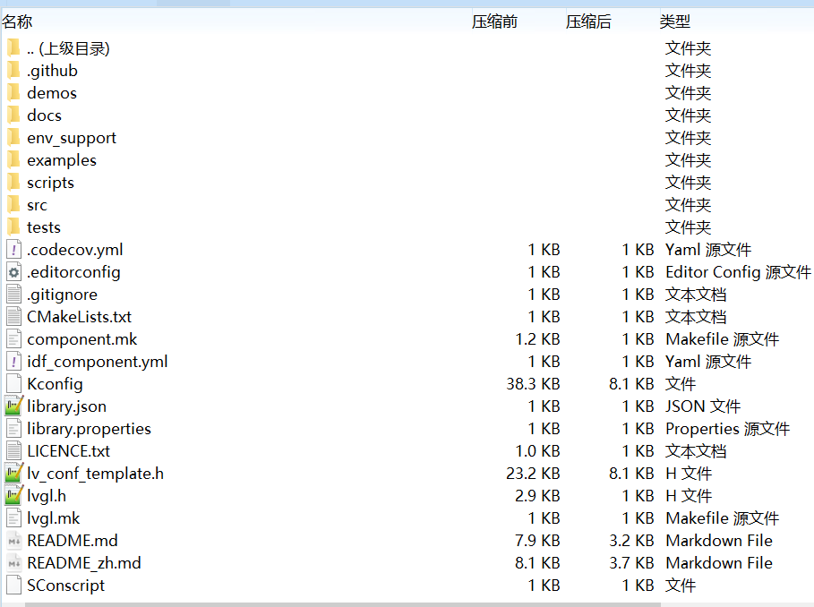
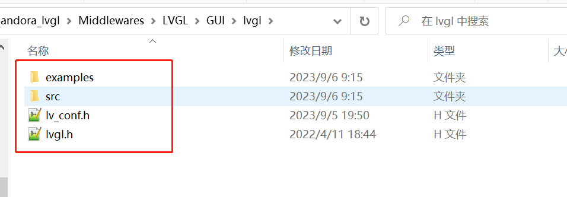
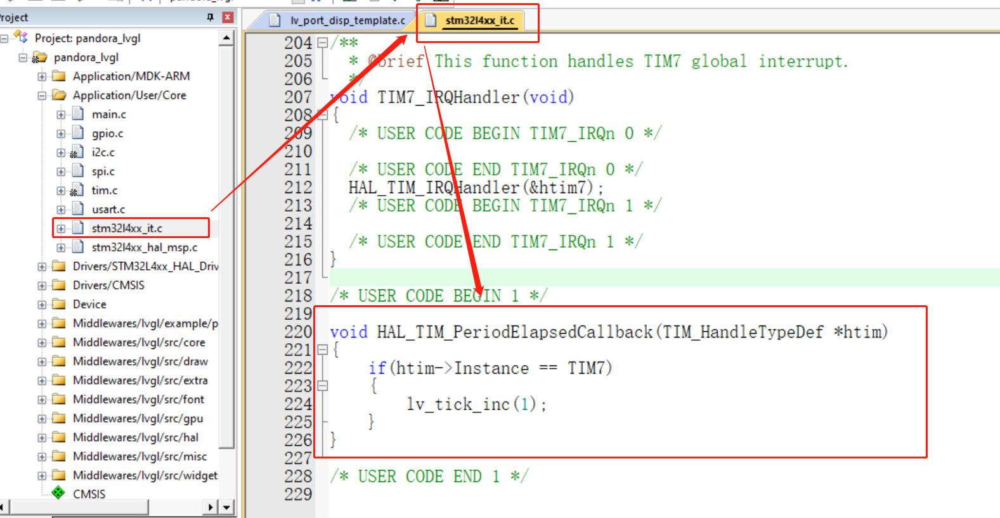

# 1. LVGL 裸机移植

* 所用硬件：正点原子潘多拉开发板，SPI 通信、ST7789、1.3英寸、屏幕分辨率为 240*240、**不带触摸功能**。
* 软件准备：CubeMX、Keil5。

* LVGL 版本：8.2

> LVGL 可以在不同的显示屏上移植，移植区别不大，这里无需准备任何例程从头理解移植过程。
>
> 如果用的是其他的显示屏，只要有能在裸机下显示的例程，即有显示的驱动即可。

## 1.1 源码准备

首先下载 lvgl 的源码，注意这里选择 8.2版本。

> 官网在 Github，访问太慢了，就在 Gitee 上随便搜了一下，都一样。
>
> Gitee 地址：https://gitee.com/my_lvgl/lvgl/tree/release%2Fv8.2/

下载完成之后文件比较多

这里对其进行简化，解压之后，删掉无用的文件，留下以下文件。

然后进一步简化，把 examples 文件夹中无用的代码删掉。仅留下其中的 porting 文件夹。

最后简化后的代码是这样的：

* demos 文件夹（没动过里面内容）
* examples 文件夹
  * porting 文件夹（没动过里面内容）
* src 文件夹（没动过里面内容）
* lv_conf.h 文件（lv_conf_template.h 改名来的）
* lvgl.h 文件

## 1.2 新建工程

使用 cubemx 新建一个空白的工程，需要的配置内容如下：

* 调试接口、时钟。
* 配置 spi 接口，用于驱动屏幕（如果是其他接口的屏，按照自己的配置即可）。
* 配置按键，用于作为输入。
* 一个定时器，用于给 lvgl 提供时基。

spi 配置如下（根据自己的开发板修改引脚）：

屏幕控制引脚配置如下（根据自己的开发板修改引脚）：

按键配置如下，根据自己的原理图配置上拉还是下拉。

定时器配置如下，记得勾选上中断。（用其他的定时器也行，有中断即可）

中断勾选

配置完成后生成工程即可。

> 此时工程直接编译不应该有错误，如果有排查之后再进行下一步。

生成工程后，如果自己有裸机显示的程序，可以添加进去试试，即证明软件配置和硬件设备都是好用的。

## 1.3 添加源码

在生成的工程目录下添加如下文件夹

* 工程目录
  * Device 文件夹（我添加的）
    * LCD_SPI_ST7789 文件夹（我添加的）
      * lcd_lvgl.c 文件（内容需要自己写，后面提供）
      * lcd_lvgl.h 文件（内容需要自己写，后面提供）
  * Middleware 文件夹（我添加的）
    * LVGL 文件夹（我添加的）
      * GUI 文件夹（我添加的）
        * lvgl 文件夹（我添加的）
      * GUI_APP 文件夹（我添加的）

如下图

然后把我们刚刚裁剪过的 LVGL 源码放进来。其中

* `工程名\Middlewares\LVGL\GUI\lvgl`目录下放
  * examples 文件夹
  * src 文件夹
  * lv_conf.h 文件
  * lvgl.h 文件

* `工程名\Middlewares\LVGL\GUI_APP`目录下放
  * demos 文件夹

给 LCD_SPI_ST7789 提供的驱动文件如下：

**lcd_lvgl.c 文件**（这是从正点原子这个屏幕的驱动文件里摘抄修改出来的，把 lvgl 用不到的部分删掉了）

~~~ c
u#include "lcd_lvgl.h"

//lcd控制io初始化
static void LCD_GPIO_Init(void)
{
    /* 初始化引脚 */
    //MX_GPIO_Init();	// cube生成的已经初始化过了

    /* 复位LCD */
    LCD_PWR(0);
    LCD_RST(0);
	LCD_CS(1);
    HAL_Delay(100);
    LCD_RST(1);

    /* 初始化SPI3接口 */
    //MX_SPI3_Init();  // cube生成的已经初始化过了
}

//lcd开
void LCD_DisplayOn(void)
{
    LCD_PWR(1);
}

//lcd关
void LCD_DisplayOff(void)
{
    LCD_PWR(0);
}

//spi写字节
static void LCD_SPI_WriteByte(uint8_t *TxData, uint16_t size)
{
	LCD_CS(0);	// 片选选中
    HAL_SPI_Transmit(&LCD_SPI_Handler, TxData, size, 1000);
	LCD_CS(1);	// 取消片选
}

//spi写多长数据
static void LCD_SPI_Send(uint8_t *data, uint32_t size)
{
    uint32_t i;
    uint32_t delta;
    
    delta = size/0xFFFF;
    
    for(i = 0; i <= delta; i++)
    {
        if(i == delta)  /* 发送最后一帧数据 */
            LCD_SPI_WriteByte(&data[i*0xFFFF], size%0xFFFF);
        
        else    /* 超长数据一次发送0xFFFF字节数据 */
            LCD_SPI_WriteByte(&data[i*0xFFFF], 0xFFFF);
    }
}

//lcd写命令
static void LCD_Write_Cmd(uint8_t cmd)
{
    LCD_WR(0);
    LCD_SPI_Send(&cmd, 1);
}

//lcd写数据
static void LCD_Write_Data(uint8_t dat)
{
    LCD_WR(1);
    LCD_SPI_Send(&dat, 1);
}

//lcd设置显示地址
static void LCD_Address_Set(uint16_t x1, uint16_t y1, uint16_t x2, uint16_t y2)
{
    /* 指定X方向操作区域 */
    LCD_Write_Cmd(0x2a);
    LCD_Write_Data(x1 >> 8);
    LCD_Write_Data(x1);
    LCD_Write_Data(x2 >> 8);
    LCD_Write_Data(x2);

    /* 指定Y方向操作区域 */
    LCD_Write_Cmd(0x2b);
    LCD_Write_Data(y1 >> 8);
    LCD_Write_Data(y1);
    LCD_Write_Data(y2 >> 8);
    LCD_Write_Data(y2);

    /* 发送该命令，LCD开始等待接收显存数据 */
    LCD_Write_Cmd(0x2C);
}

//lcd初始化
void LCD_Init(void)
{
    /* 初始化和LCD通信的引脚 */
    LCD_GPIO_Init();
    HAL_Delay(120);

    /* 关闭睡眠模式 */
    LCD_Write_Cmd(0x11);
    HAL_Delay(120);

    /* 开始设置显存扫描模式，数据格式等 */
    LCD_Write_Cmd(0x36);
    LCD_Write_Data(0x00);
    /* RGB 5-6-5-bit格式  */
    LCD_Write_Cmd(0x3A);
    LCD_Write_Data(0x65);
    /* porch 设置 */
    LCD_Write_Cmd(0xB2);
    LCD_Write_Data(0x0C);
    LCD_Write_Data(0x0C);
    LCD_Write_Data(0x00);
    LCD_Write_Data(0x33);
    LCD_Write_Data(0x33);
    /* VGH设置 */
    LCD_Write_Cmd(0xB7);
    LCD_Write_Data(0x72);
    /* VCOM 设置 */
    LCD_Write_Cmd(0xBB);
    LCD_Write_Data(0x3D);
    /* LCM 设置 */
    LCD_Write_Cmd(0xC0);
    LCD_Write_Data(0x2C);
    /* VDV and VRH 设置 */
    LCD_Write_Cmd(0xC2);
    LCD_Write_Data(0x01);
    /* VRH 设置 */
    LCD_Write_Cmd(0xC3);
    LCD_Write_Data(0x19);
    /* VDV 设置 */
    LCD_Write_Cmd(0xC4);
    LCD_Write_Data(0x20);
    /* 普通模式下显存速率设置 60Mhz */
    LCD_Write_Cmd(0xC6);
    LCD_Write_Data(0x0F);
    /* 电源控制 */
    LCD_Write_Cmd(0xD0);
    LCD_Write_Data(0xA4);
    LCD_Write_Data(0xA1);
    /* 电压设置 */
    LCD_Write_Cmd(0xE0);
    LCD_Write_Data(0xD0);
    LCD_Write_Data(0x04);
    LCD_Write_Data(0x0D);
    LCD_Write_Data(0x11);
    LCD_Write_Data(0x13);
    LCD_Write_Data(0x2B);
    LCD_Write_Data(0x3F);
    LCD_Write_Data(0x54);
    LCD_Write_Data(0x4C);
    LCD_Write_Data(0x18);
    LCD_Write_Data(0x0D);
    LCD_Write_Data(0x0B);
    LCD_Write_Data(0x1F);
    LCD_Write_Data(0x23);
    /* 电压设置 */
    LCD_Write_Cmd(0xE1);
    LCD_Write_Data(0xD0);
    LCD_Write_Data(0x04);
    LCD_Write_Data(0x0C);
    LCD_Write_Data(0x11);
    LCD_Write_Data(0x13);
    LCD_Write_Data(0x2C);
    LCD_Write_Data(0x3F);
    LCD_Write_Data(0x44);
    LCD_Write_Data(0x51);
    LCD_Write_Data(0x2F);
    LCD_Write_Data(0x1F);
    LCD_Write_Data(0x1F);
    LCD_Write_Data(0x20);
    LCD_Write_Data(0x23);
    /* 显示开 */
    LCD_Write_Cmd(0x21);
    LCD_Write_Cmd(0x29);

    /*打开显示*/
    LCD_PWR(1);
}

//填充函数，提供给lvgl
void lcd_fill_array(uint16_t x_start, uint16_t y_start, uint16_t x_end, uint16_t y_end, void *pcolor)
{
    uint32_t size = 0;

    size = (x_end - x_start + 1) * (y_end - y_start + 1) * 2;
    LCD_Address_Set(x_start, y_start, x_end, y_end);
	
	LCD_WR(1);
	LCD_SPI_Send(pcolor, size);
}
~~~

**lcd_lvgl.h 文件**

~~~ c
#ifndef __LCD_LVGL_H
#define __LCD_LVGL_H

#include "stdint.h"
#include "spi.h"
#include "gpio.h"

// SPI驱动LCD屏幕（ST7789）
// LCD屏幕分辨率定义
#define LCD_Width   240
#define LCD_Height  240

#define		LCD_SPI_Handler		hspi3

// 引脚定义
#define		LCD_PWR_PIN			GPIO_PIN_7
#define		LCD_PWR_GPIO_PORT	GPIOB

#define		LCD_RST_PIN			GPIO_PIN_6
#define		LCD_RST_GPIO_PORT	GPIOB

#define		LCD_WR_PIN			GPIO_PIN_4
#define		LCD_WR_GPIO_PORT	GPIOB

#define		LCD_CS_PIN			GPIO_PIN_7
#define		LCD_CS_GPIO_PORT	GPIOD

// LCD_SPI_SDA 对应 PB5
// LCD_SPI_SCK 对应 PB3

// 控制引脚定义
#define    LCD_PWR(n)	(n?\
                        HAL_GPIO_WritePin(LCD_PWR_GPIO_PORT, LCD_PWR_PIN, GPIO_PIN_SET):\
                        HAL_GPIO_WritePin(LCD_PWR_GPIO_PORT, LCD_PWR_PIN, GPIO_PIN_RESET))
#define    LCD_WR(n)	(n?\
                        HAL_GPIO_WritePin(LCD_WR_GPIO_PORT, LCD_WR_PIN, GPIO_PIN_SET):\
                        HAL_GPIO_WritePin(LCD_WR_GPIO_PORT, LCD_WR_PIN, GPIO_PIN_RESET))
#define    LCD_RST(n)   (n?\
                        HAL_GPIO_WritePin(LCD_RST_GPIO_PORT, LCD_RST_PIN, GPIO_PIN_SET):\
                        HAL_GPIO_WritePin(LCD_RST_GPIO_PORT, LCD_RST_PIN, GPIO_PIN_RESET))
#define    LCD_CS(n)	(n?\
                        HAL_GPIO_WritePin(LCD_CS_GPIO_PORT, LCD_CS_PIN, GPIO_PIN_SET):\
                        HAL_GPIO_WritePin(LCD_CS_GPIO_PORT, LCD_CS_PIN, GPIO_PIN_RESET))

void LCD_Init(void);
void LCD_DisplayOn(void);
void LCD_DisplayOff(void);
void lcd_fill_array(uint16_t x_start, uint16_t y_start, uint16_t x_end, uint16_t y_end, void *pcolor);

#endif /* __LCD_LVGL_H */
~~~

## 1.4 软件配置

在 KEIL 中把代码添加进去。

在 keil 中添加如下几个文件夹。

其中，

* Device：添加 LCD 设备驱动代码，即 `lcd_lvgl.c` 文件。
* Middlewares/lvgl/example/porting：添加 example/porting 文件夹下的`lv_port_disp_template.c`和`lv_port_indev_template.c`文件（这两个分别是显示接口、触摸等控制接口，还有一个文件系统的接口暂时没用先不添加）。
* Middlewares/lvgl/src/core：添加 src/core 文件夹下的全部 c 文件。
* Middlewares/lvgl/src/draw：添加 src/draw 文件夹下除了`nxp_pxp`、`nxp_vglite`、`sdl`和`stm32_dma2d`文件夹之外的全部 c 文件。
* Middlewares/lvgl/src/extra：添加 src/extra 文件夹下的全部 c 文件。
* Middlewares/lvgl/src/font：添加 src/font 文件夹下的全部 c 文件。
* Middlewares/lvgl/src/gpu：添加 `src/draw/sdl`和`src/draw/stm32_dma2d`文件夹下的全部 c 文件。
* Middlewares/lvgl/src/hal：添加 src/hal 文件夹下的全部 c 文件。
* Middlewares/lvgl/src/misc：添加 src/misc 文件夹下的全部 c 文件。
* Middlewares/lvgl/src/widgets：添加 src/widgets 文件夹下的全部 c 文件。

然后添加头文件路径。

> 所有的都添加完成之后，直接编译，会有几十个警告，但是不会有错误出现。如果有错误，先排查前面哪一步有问题然后再继续下一步。

## 1.5 软件适配

### 1.5.1 添加时基

在中断函数的文件中可以看到定时器的中断处理函数，在这里添加中断回调函数，处理 lvgl 的时基即可。

记得要在main中开启定时器中断，`HAL_TIM_Base_Start_IT(&htim7);`

~~~ c
#include "lvgl.h"	//添加在最上方

void HAL_TIM_PeriodElapsedCallback(TIM_HandleTypeDef *htim)
{
    if(htim->Instance == TIM7)
    {
		lv_tick_inc(1);
    }
}
~~~

### 1.5.2 显示部分

1. 打开显示适配文件的宏定义，把 0 改为 1。
2. 添加 lcd 显示驱动的头文件，因为下面需要调用里面的函数。
3. 添加屏幕尺寸大小的宏定义。

下图中展示了上面三个步骤。

~~~ c
#include "lcd_lvgl.h"

//		下面用到的			在 lcd.h中有
#define MY_DISP_HOR_RES		LCD_Width	//水平分辨率
#define MY_DISP_VER_RES		LCD_Height 	//纵向分辨率
~~~

4. `lv_port_disp_init`函数修改，选择一种缓冲区方式，注释掉另外两种；修改自己的屏幕尺寸。这里使用这种，省内存。

如果想使用第二种，记得把下面缓冲区的名字换一下。

第三种同理，但是多了下面还要打开一个full_flash的定义，并添加一个LV_VER_RES_MAX的宏定义，就是数当然也是越大越好，能直接为LV_DISP_HOR_RES应该是最好了。

5. 显示初始化函数：添加 LCD 初始化函数。显示刷新函数：添加自己的显示接口。

> 刷新函数中注释掉的部分：`LCD_Draw_ColorPoint`函数，内容如下。但是我的驱动文件里没有添加。因为速度特别特别慢。
>
> 如果想用的话，把下面两个函数放到`lcd_lvgl.c`中，并在头文件中声明下面的画点函数即可。
>
> ~~~ c
> static void LCD_Write_HalfWord(const uint16_t da)
> {
>     uint8_t data[2] = {0};
> 
>     data[0] = da >> 8;
>     data[1] = da;
> 
>     LCD_WR(1);
>     LCD_SPI_Send(data, 2);
> }
> 
> void LCD_Draw_ColorPoint(uint16_t x, uint16_t y, uint16_t color)
> {
>     LCD_Address_Set(x, y, x, y);
>     LCD_Write_HalfWord(color);
> }
> ~~~

### 1.5.3 输入部分

> 跳过这部分不影响输出测试，只是没有交互。

输入支持多种，触摸、鼠标、键盘、编码器、按键。

因为我这里开发板上只有按键，因此这里可以使用键盘、按键，这两种方式稍微有点区别。这里以键盘为例。

1. 打开输入适配文件的宏定义，把 0 改为 1。
2. 添加获取输入的头文件，因为下面需要调用里面的函数。

3. 打开键盘输入需要的函数定义声明。

3. 适配后面的输入函数。留下以下的内容，其他部分注释掉即可。如果使用其他输入，道理是一样的，打开相应部分的注释即可。

~~~ c
void lv_port_indev_init(void)
{
    static lv_indev_drv_t indev_drv;
    
     /*------------------
     * Keypad
     * -----------------*/

    /*Initialize your keypad or keyboard if you have*/
    keypad_init();

    /*Register a keypad input device*/
    lv_indev_drv_init(&indev_drv);
    indev_drv.type = LV_INDEV_TYPE_KEYPAD;
    indev_drv.read_cb = keypad_read;
    indev_keypad = lv_indev_drv_register(&indev_drv);
}

/*------------------
 * Keypad
 * -----------------*/

/*Initialize your keypad*/
static void keypad_init(void)
{
    /*Your code comes here*/
}

/*Will be called by the library to read the mouse*/
static void keypad_read(lv_indev_drv_t * indev_drv, lv_indev_data_t * data)
{
    static uint32_t last_key = 0;

    /*Get the current x and y coordinates*/
//    mouse_get_xy(&data->point.x, &data->point.y);

    /*Get whether the a key is pressed and save the pressed key*/
    uint32_t act_key = keypad_get_key();
    if(act_key != 0) {
        data->state = LV_INDEV_STATE_PR;

        /*Translate the keys to LVGL control characters according to your key definitions*/
        switch(act_key) 
        {
        case 2:		//下
            act_key = LV_KEY_ENTER;
            break;
        case 3:		//左
            act_key = LV_KEY_PREV;
            break;
        case 4:		//右
            act_key = LV_KEY_NEXT;
            break;
        }

        last_key = act_key;
    } else {
        data->state = LV_INDEV_STATE_REL;
    }

    data->key = last_key;
}

/*Get the currently being pressed key.  0 if no key is pressed*/
static uint32_t keypad_get_key(void)
{
    /*Your code comes here*/
	//按键up
	if(HAL_GPIO_ReadPin(GPIOC, GPIO_PIN_13) == GPIO_PIN_SET)
		return 1;
	
	//按键down
	else if(HAL_GPIO_ReadPin(GPIOD, GPIO_PIN_9) == GPIO_PIN_RESET)
		return 2;

	//按键left
	else if(HAL_GPIO_ReadPin(GPIOD, GPIO_PIN_8) == GPIO_PIN_RESET)
		return 3;

	//按键right
	else if(HAL_GPIO_ReadPin(GPIOD, GPIO_PIN_10) == GPIO_PIN_RESET)
		return 4;
	
	else
		return 0;
}
~~~

> 注意，这个配置在下面的demo中，大多都不能用，因为还要绑定组。测试这个按钮的话，直接看第3章，实体按钮控制。

## 1.6 测试代码

在 main.c 里添加

~~~ c
#include "lvgl.h"
#include "lv_port_disp_template.h"
//#include "lv_port_indev_template.h"

int main(void)
{
    //原有的
    HAL_Init();
    SystemClock_Config();
    MX_GPIO_Init();
    MX_SPI3_Init();
    MX_USART1_UART_Init();
    MX_I2C3_Init();
    MX_TIM7_Init();

    //自己添加的
    HAL_TIM_Base_Start_IT(&htim7);	// 使能定时器中断
    lv_init();
    lv_port_disp_init();
    //	lv_port_indev_init();

    lv_obj_t* switch_obj = lv_switch_create(lv_scr_act());
    lv_obj_set_size(switch_obj, 120, 60);
    lv_obj_align(switch_obj, LV_ALIGN_CENTER, 0, 0);

    while (1)
    {
        HAL_Delay(5);
        lv_timer_handler();
    }
}
~~~

编译后应该是不能有错误，会有警告可以先不管。运行效果如下：

有此图像产生即表示移植正常。

## 1.7 案例测试

最刚开始的Demo文件夹中有很多已经写好的测试案例。可以试试。

**压力测试步骤**

1. 将 demos 文件夹复制到 Middlewares/LVGL/GUI_APP 路径下；（前面已完成）
2. 添加头文件路径
   1. ..\Middlewares\LVGL\GUI_APP\demos
   2. ..\Middlewares\LVGL\GUI_APP\demos\stress
3. 打开 lv_conf.h 文件，找到宏定义 LV_USE_DEMO_STRESS 将其设置为1。
4. 在 keil 中新建 Middlewares/LVGL/GUI_APP 工程组，添加 demos\stress 文件夹下的 lv_demo_stress.c 文件
5. main.c 文件里包含头文件：#include "lv_demo_stress.h"
6. 初始化官方 demo：lv_demo_stress();

**音乐播放器测试步骤**（我这里内存不够，会报上千个错误）

1. 将 demos 文件夹复制到 Middlewares/LVGL/GUI_APP 路径下；（前面已完成）
2. 添加头文件路径
   1. ..\Middlewares\LVGL\GUI_APP\demos
   2. ..\Middlewares\LVGL\GUI_APP\demos\music
3. 打开 lv_conf.h 文件，找到宏定义 LV_USE_DEMO_MUSIC 将其设置为1。
4. 在 keil 中新建 Middlewares/LVGL/GUI_APP 工程组，添加 demos\music 文件夹下的全部 c 文件。
5. main.c 文件里包含头文件：#include "lv_demo_music.h"
6. 初始化官方 demo：lv_demo_music();

