# 1. CAN协议

* 和串口、I2C、SPI、485、232等通讯协议一样，CAN也是种传送数据的方式。

## 1.1 物理接线

* CAN通信需要两根线，`CAN_H`、`CAN_L`，两根线采用双绞线的方式缠绕。
* 每个通讯节点的`CAN_H`接在一起，`CAN_L`接在一起。
* 两端接两个120欧的电阻。

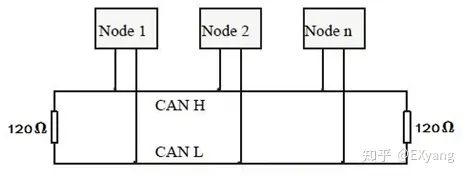

## 1.2 信号传输

* 线上的电位采用差分信号进行判别，抗干扰能力强。
* 电平判断
  * CAN_H - CAN_L < 0.5V 时候为隐性的，逻辑信号表现为"逻辑1"- 高电平。
  * CAN_H - CAN_L > 0.9V 时候为显性的，逻辑信号表现为"逻辑0"- 低电平。

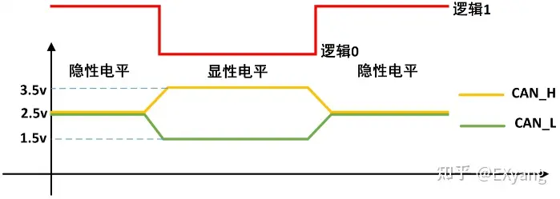

> CAN总线在电平传输上，具有仲裁判断逻辑，优先级为：显性（低电平）>隐形（高电平）！

## 1.3 协议规定

CAN规定了5种不同的数据帧（发送一次数据就是一帧数据，类似于串口发送一个字节数据？）。

* **数据帧（重要）**：向接受单元传送数据用的。
* 遥控帧：向远端节点请求数据用的。
* 错误帧：当检测出错误是向其他单元通知错误。
* 过载帧：接收单元通知其未做好准备。
* 帧间隔：用于将数据帧和遥控真与前面的分离开。

> 主要掌握数据帧，遥控帧基本上已经不用了。其他的先知道即可。 

对于数据帧和遥控帧，帧结构都由以下7个段组成。

该结构有两种格式：**标准格式**和**扩展格式**。可以看出，两种格式的区别仅在于仲裁段和控制段不同。

每个段都有自己的格式，用户需要关注的段为：**仲裁段**、**数据段**。更具体的说是，**仲裁段的 ID**和**数据段**。

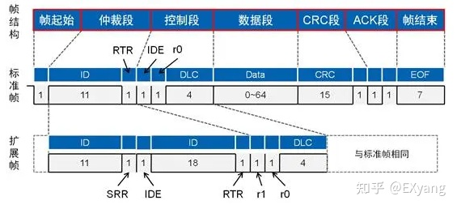

仲裁段有一套仲裁机制，当总线上的各个节点同时发送设备时，根据ID优先级判断哪个节点的信息有效。**ID 越小，优先级越高**。

> 更具体的仲裁机制还需要根据不同的段做出不同的反应，比如退出竞争、产生错误等。这里就不详细说了，有兴趣的可以再去详细了解。

数据段中是每次要发送的数据，其长度为 0-8 个字节。

作为写应用的，我们只需要关注这两部分即可。

比如 RT-Thread 中的 CAN 发送函数（[来源](https://www.rt-thread.org/document/site/#/rt-thread-version/rt-thread-standard/programming-manual/device/can/can?id=can-%e8%ae%be%e5%a4%87%e4%bd%bf%e7%94%a8%e7%a4%ba%e4%be%8b)）。需要我们注意的有`ID`、`格式`、`帧类型`、`数据`、`长度`。

~~~ c
struct rt_can_msg msg = {0};

msg.id = 0x78;              /* ID 为 0x78 */
msg.ide = RT_CAN_STDID;     /* 标准格式 */
msg.rtr = RT_CAN_DTR;       /* 数据帧 */
msg.len = 8;                /* 数据长度为 8 */
/* 待发送的 8 字节数据 */
msg.data[0] = 0x00;
msg.data[1] = 0x11;
msg.data[2] = 0x22;
msg.data[3] = 0x33;
msg.data[4] = 0x44;
msg.data[5] = 0x55;
msg.data[6] = 0x66;
msg.data[7] = 0x77;
/* 发送一帧 CAN 数据 */
size = rt_device_write(can_dev, 0, &msg, sizeof(msg));
~~~

而相关的内容，API 都已经封装好了，就不用我们管了。

~~~ c
struct rt_can_msg
{
    rt_uint32_t id  : 29;
    rt_uint32_t ide : 1;
    rt_uint32_t rtr : 1;
    rt_uint32_t rsv : 1;
    rt_uint32_t len : 8;
    rt_uint32_t priv : 8;
    rt_int32_t hdr : 8;
    rt_uint32_t reserved : 8;
    rt_uint8_t data[8];
};
typedef struct rt_can_msg *rt_can_msg_t;
~~~

接收也是一样的封装好了，我们只需要取出我们需要的 ID 和数据即可。

~~~ c
/* 从 CAN 读取一帧数据 */
rt_device_read(can_dev, 0, &rxmsg, sizeof(rxmsg));
/* 打印数据 ID 及内容 */
rt_kprintf("ID:%x", rxmsg.id);
for (i = 0; i < 8; i++)
{
    rt_kprintf("%2x", rxmsg.data[i]);
}
~~~

至此，CAN 的使用需要了解的应该就够了。

> 如果想了解的更详细，别人的文章，上面有水印的图就是他的。[知乎文章](https://zhuanlan.zhihu.com/p/538834760)

# 2. CANopen概念

从上面可以看出，CAN 总线确定了一种数据传输的物理和数据方式。即，用什么设备传输数据、怎么传输数据、格式是什么。

但是，在我们写应用的时候，数据传输时每个人对于 ID 或者数据都有自己的规定，不统一。即，在这个层面上缺乏一个统一的标准去规定不同**ID**和**数据**的含义是什么。

因此，CANopen做的就是这个工作。

## 2.1 通信特点

CANopen规定的报文特点：

* 报文传输采用 CAN **标准帧**格式。即 11bit 的 ID 域，以尽量减小传输时间；
* 网络控制报文均采用数据最小字节数。比如心跳报文，只有1个字节数据；
* 实时更新的**过程数据无需接收方报文应答**。即采用生产消费模型，降低总线负载；
* 需要接收方确认的配置参数一般都是采用快速单字传输。即1个报文最多传送1个32字节的参数变量，避免了分帧引起的实时性降低。

> 规定上述特点的原因是，CAN通信具有可以突发发送的实时性优势，但是多个节点下，突发具有较大的冲突可能性。因此，上述特点可以尽可能保证实时性。

CANopen 协议通常分为用户应用层、**对象字典**以及**通信**三个部分。

* 用户应用层：用户根据实际的需求编写的应用对象。
* 对象字典：最核心的部分，描述了应用对象和 CANopen 报文之间的关系。
* 通信：很重要的部分，定义了 CANopen 协议通信规则以及与CAN控制器驱动之间对应关系，掌握这部分才能让我们写自己的应用对象。

前面我们说了，CAN通信中，我们需要关注的就是`CAN-ID`和`DATA`。

在CANopen中也是一样的，我们需要知道这两部分是怎么设置的，分别有什么含义。

## 2.2 对象字典(OD)

CANopen 对象字典（OD: Object Dictionary）是 CANopen 协议最为核心的概念。

对象字典就是一个有序的对象组，描述了对应 CANopen 节点的所有参数，包括通讯数据的存放位置也列入其索引，这个表变成可以传递形式就叫做**EDS文件**（电子数据文档 Electronic Data Sheet）。

其中，每个对象采用一个 16 位的索引值来寻址，这个索引值通常被称为**索引**，其范围在**0x0000**到**0xFFFF**之间。为了避免数据大量时无索引可分配，所以在某些索引下也定义了一个8 位的索引值，这个索引值通常被称为**子索引**，其范围是**0x00**到**0xFF**之间。每个索引内具体的参数，最大用**32**位的变量来表示，四个字节。

如下图是某遵循 CANopen 协议的电机的 EDS 文件。

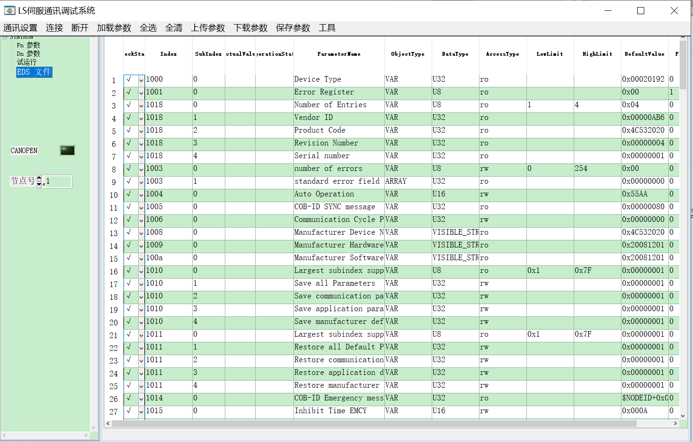

> EDS 文件是每个节点都有的，采用字典的形式保存了该节点的参数等信息。其他节点可以通过索引等信息访问或者修改这些信息。

理解：

对于某个设备而言，预定义了各个节点通信需要收发的信息都有什么，表现形式上就是如上图的一个表格。**每一行就是一个对象**，每个对象中存放的是什么内容可以自定（有些条目是固定的）。CANopen的收发就是在收发这些对象。

## 2.3 数据传输(PDO、SDO)

### 2.3.1 对象分类

说数据传输之前先说两种数据收发模型：

* 生产消费模型：生产者向外发送数据，不指定对象，消费者消费数据。即，==生产者并不会得到回复==。
* 服务器客户端模型：客户端向服务器发送数据请求，服务器回复请求的数据。即，==客户端会得到数据回复==。其中，从服务器读取的动作是**上传**，向服务器写入的动作是**下载**（可以看出该动作是相对于服务器而言的）。

在 CANopen 中配置信息或应用信息的传输是通过两种对象进行传输的：**过程数据对象 PDO**（Process data object）、**服务数据对象 SDO**（Service data object），其中：

* PDO：属于过程数据，即单向传输，无需接收节点回应 CAN 报文来确认，即，生产消费模型。
* SDO：属于服务数据，有指定被接收节点的地址（Node-ID），并且需要指定的接收节点回应 CAN 报文来确认已经接，如果超时没有确认，则发送节点将会重新发送原报文。即服务器客户端模型。

> 即，把上面的那些对象分为两类，PDO、SDO，第一类表示发过去无需回复。第二类表示发送过去之后需要接收方进行回复的对象。

对于 PDO 对象：由于需要区分每个 CANopen 节点的输入和输出，所以 PDO 分为 TPDO（发送PDO）和 RPDO（接收PDO），发送和接收是以 CANopen 从站节点为参考（如果CAN主站就相反）。TPDO 和 RPDO 分别有4个数据对象，每种数据对象就是1条CAN报文封装，这些都是数据收发的容器。

* TPDO1（发送PDO）：从站主动传输TXPDO数据给主站，从站发送。
* RPDO1（接收PDO）：主站主动传输RxPDO数据给从站，从站接收。
* TPDO2
* RPDO2
* TPDO3
* RPDO3
* TPDO4
* RPDO5

可以看到这个RT是站在从站的角度看的。

> 另外，不同类别对象的索引，是有规定的，不是随便定的。

### 2.3.2 对象编号

CANopen 预定义了强制性的缺省标识符（CAN-ID）分配表，该分配表是基于11 位CAN-ID 的标准帧格式。将其划分为**4 位的功能码（Function-ID）**和**7 位的节点号（Node-ID）**。

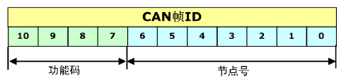

从这张图中，要搞清楚一个概念。

* 节点号：一个网络中的每个节点都有一个自己的编号，用 7bit 表示，即，一个网络中最多能有127个通讯节点（0不行）。

* 通信对象编号（COB-ID）：在 CANopen 中就是 CAN-ID，可以看出，节点号被包含在 COB-ID 中。

# 3. 数据通信

前面提到，不管是CAN还是CANopen需要我们关注的都是`CAN-ID`和`DATA`。

## 3.1 服务数据对象SDO

特性：SDO 主要用于 CANopen 主站对从节点的参数配置。**服务确认是**SDO的最大的特点，为每个消息都生成一个应答，确保数据传输的准确性。

在收发 SDO 对象时比较简单固定。一般在 CANopen 网络中，只有 NMT 主机能发起 SDO 通讯，进行节点参数配置或者关键性参数的传递。当然从节点也可以对其他从节点发起SDO通讯。

> NMT主机后面会介绍，这里只需要知道，主机（主动方）可以发起SDO通讯就行了。

### 3.1.1 ID设置

* 发送方（客户端）：发送 CAN-ID 为`600h + Node-ID`的报文，其中 Node-ID 为接收方（服务器）的节点地址，数据长度均为8字节；

* 接收方（服务器）：成功接收后，回应 CAN-ID 为`580h + Node-ID`的报文。这里的 Node-ID 也是是接收方（刚刚的发送方）的节点地址，数据长度均为8字节。

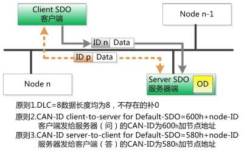

如下图中的最后两行，为 CANopen 预定义报文的 SDO 报文中的 ID 分类。

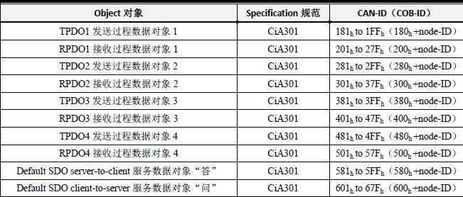

### 3.1.2 数据设置

在发送数据时分为两类，`快速SDO协议`、`普通SDO协议`。

**快速SDO协议**（常用）

最常用最常见的 SDO 协议是快速 SDO，快速，就是1次来回就搞定。前提是读取和写入的值不能大于 32 位。如图所示，为快速 SDO 协议的示意图。命令中直接包含了要读写的索引、子索引、数据。可谓直接命中。

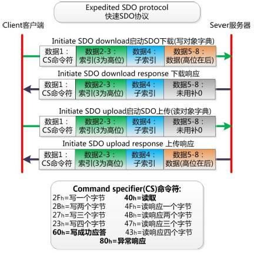

通过快速 SDO，可以直接对 CANopen 节点的对象字典中的值进行读取和修改，所以在做参数配置之外，也经常作为关键性数据传输之用。比如 CANopen 控制机器人的电机转动角度时，就使用 SDO 来传输，保证可靠。

---

举个例子，保利时电机将电机设置为转矩模式。

需要发送的数据为：

* ID：`0x00 00 06 02`，其中0x2是要发送给（接收方）的节点号。（可以对照3.1.1小节的图）
* DATA：`0x2F 60 60 00 04 00 00 00`，其中0x2F为命令符，0x60 60为索引，0x00为子索引，0x04 00 00 00为要发送的数据。

接收到的回复为：

* ID：`0x00 00 05 82`，其中0x2表示是谁给出的回复。（参考2.3小节最后）
* DATA：`0x60 60 60 00 00 00 00 00`，其中0x60表示成功，0x60 60为索引，0x00为子索引，0x00 00 00 00为回复的数据。

这就是一个发送SDO对象的案例。这里更改的对象为：索引为0x60 60，子索引为0x00，对象含义为电机的运行模式。

---

**普通SDO协议**（了解）

当需要传输的值超过 32 位时，就不能使用快速 SDO 传输。必须使用普通 SDO 进行分帧传输。在应用中较少用到。
普通 SDO 协议难点在于分包逻辑与 CS 命令符的变化。依然难以记忆。
当然普通 SDO 的 CAN 帧 ID 与快速 SDO 相同，依然发送方（客户端）发送的报文CAN-ID为`600h + Node-ID`，接收方（服务器）成功接收后，回应CAN-ID为`580h + Node-ID`的报文。

**下载协议download protocol**

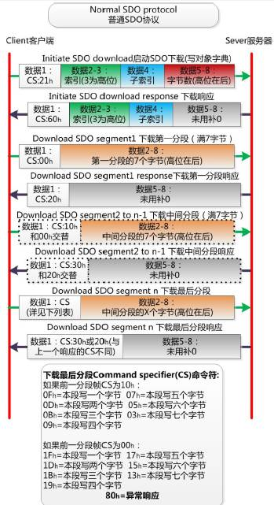

**上传协议upload protocol**

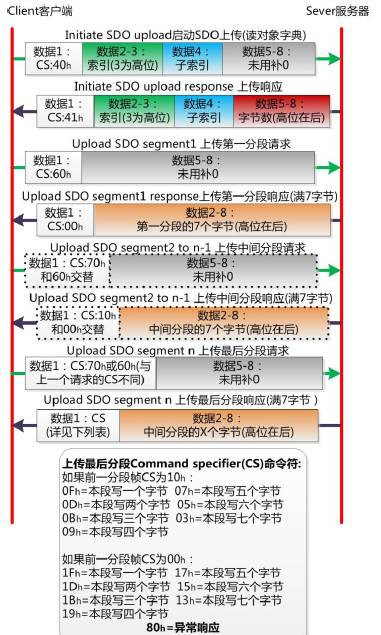

## 3.2 过程数据对象PDO

PDO 属于过程数据，用来传输实时数据，即单向传输，无需接收节点回应 CAN 报文来确认，属于“生产消费”模型 PDO。数据长度被限制为1~8 字节。最多只要1帧就可以把一条信息或者一个变量传递结束。

但是PDO的收发不只是简单的设置ID和DATA的问题，这个相对来说有点麻烦。

### 3.2.1 ID设置

* 发送方：根据自己属于哪一类对象 PDO 对象决定自己的 ID。比如，发送 CAN-ID 为`180h + Node-ID`的报文，其中 Node-ID 为发送方（自己）的节点地址，用于告诉是谁发送出去的。数据长度 1 - 8 字节。

如下图中的前面 8 行，为 CANopen 预定义报文的 PDO 报文中的 ID 分类。

当然，如果某个节点需要传递的资源特别多，则有出现例如 TPDO5 之类的数据对象，而它们的 CAN-ID 定义就需要打破预定义的规则，比如我们可以定义Node-ID为1的节点中 TPDO5 是 182h，这里的 PDO 的 COB-ID 中的低 7 位不再是表示 Node-ID。其实所有的 PDO 的 COB-ID 与 Node-ID 无必然规则上的联系。

---

也举个例子，保利时电机驱动器接通后，会一直循环上报编码器位置。

上位机接收到的数据为：

* ID：`0x01 82`，其中0x2是驱动器自己的节点号。（0x01 80 可以对照到上图中的TPDO1）。
* DATA：`0x2F 60 60 00`，为编码器的读数。

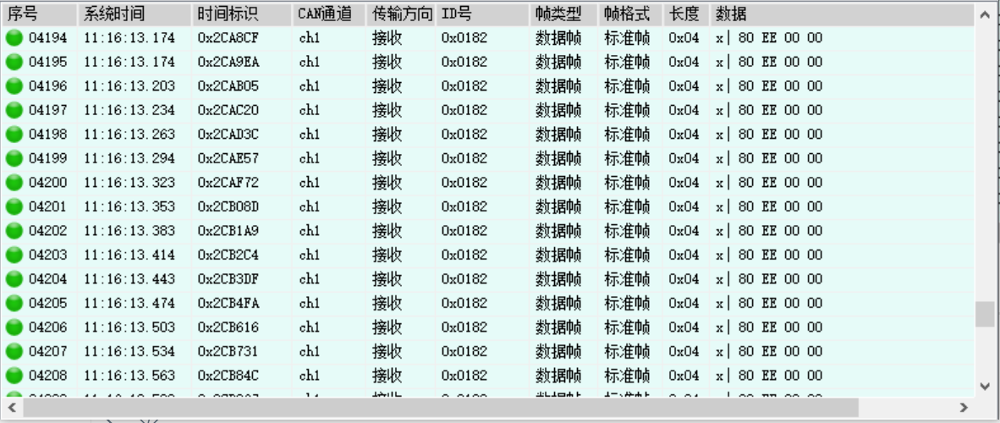

这就是一个上位机接收PDO对象的案例。这里主要是为了看这个ID，数据先不用在意，等会看后面。

---

### 3.2.2 传输方式

PDO的两种传输方式：同步传输和异步传输。如图所示，1、2为异步传输，3、4为同步传输。

上面的例子中，就是用的第一种异步传输的方式。

### 3.2.3 数据设置

PDO 的通信数据中，定义了该设备所使用的 COB-ID、传输类型、定时周期等。

其中，RPDO通讯参数位于对象字典索引的 1400h to 15FFh，TPDO通讯参数位于对象字典索引的 1800h to 19FFh。

> 前面说过，不同类别对象的索引，是有规定的，不是随便定的。这里就看到了。

每条索引代表一个PDO的通信参数集，其中的子索引分别指向具体的各种参数。如表所示。

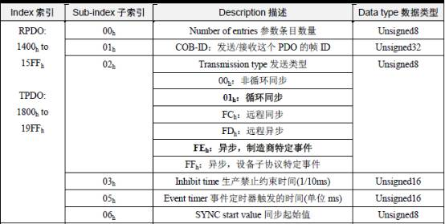

* Number of entries 参数条目数量：即本索引中有几条参数；
* COB-ID：即这个PDO发出或者接收的对应CAN帧ID；
* 发送类型：即这个PDO发送或者接收的传输形式，通常使用循环同步和异步 制造商特定事件较多；
* Inhibit time生产禁止约束时间(1/10ms)：约束PDO发送的最小间隔，避免导致总线负载剧烈增加，比如数字量输入过快，导致状态改变发送的TPDO频繁发送，总线负载加大，所以需要一个约束时间来进行“滤波”，这个时间单位为0.1ms；
* Event timer事件定时器触发的时间(单位ms)：定时发送的PDO，它的定时时间，如果这个时间为0，则这个PDO为事件改变发送。
* SYNC start value同步起始值：同步传输的PDO，收到诺干个同步包后，才进行发送，这个同步起始值就是同步包数量。比如设置为2，即收到2个同步包后才进行发送。

### 3.2.4 PDO映射参数（难）

PDO 对象并不是和 SDO 一样直接看着表使用`ID + DATA`发送出去的。

PDO 所携带的实时数据类型和内容是由设备对象字典中所规定的该 PDO 映射结构决定。

PDO映射参数，包含了一个对象字典中的对象列表，这些对象映射到相应的PDO，其中包括数据的长度（单位，位），对于生产者和消费者都必须要知道这个映射参数，才能够正确的解释PDO内容。就是将通信参数、应用数据和具体CAN报文中数据联系起来。

* RPDO 通讯参数 1400h to 15FFh，映射参数 1600h to 17FFh，数据存放为 2000h 之后厂商自定义区域；
* TPDO 通讯参数 1800h to 19FFh，映射参数 1A00h to 1BFFh，数据存放为 2000h 之后厂商自定义区域。

有点懵逼哈，整个例子，看下图。

解释一下这张图：

* 第一个表：从 Index 索引可以看出这是个 TPDO 对象。子索引和对应的对象内容，定义了该对象的ID、发送类型等。
* 第二个表：从 Index 索引可以看出，这是上面那个 TPDO 对象的映射对象。
  * 子索引 01h 的内容为 0x2000 01 08，表示索引为 0x1800 的 TPDO 对象的前 8 位值为：索引为2000h、子索引为 0x01 的对象的值。
  * 子索引 02h 的内容为 0x2003 03 10，表示索引为 0x1800 的 TPDO 对象的接着 16 位值为：索引为2003h、子索引为 0x03 的对象的值。（注意，低位在前）
  * 子索引 03h 的内容为 0x2003 01 08，表示索引为 0x1800 的 TPDO 对象的接着 8 位值为：索引为2003h、子索引为 0x01 的对象的值。
* 第三个表，从 Index 可以看出，这里是厂商自定义区域。
* 第四个表，我们实际发送的内容
  * ID：0x181。（从第一个表看）
  * DATA：就是按照上面映射得到的值。

另外，前面说对象的索引不是能随便定义的。

* 分配对象：索引为0x1cxx
* 映射对象：索引为0x16xx、0x1Axx
* 应用对象：索引为0x6xxx、0x7xxx

比如，3.1小节的案例中，发送的对象的索引为0x6060，就是一个应用对象。这里的映射对象的索引也是确定的。

### 3.2.5 设置步骤

PDO报文用来传输有实时性要求的过程数据，传输类型可以是事件类型、同步传输、周期传输。PDO报文基于生产者消费者模式，所以使用之前需要先配置好生产者和消费者，这些在映射参数（1600h+n）和通信参数（1400h+n）里面完成。具体分以下三步完成。注：n 为设备地址。

**接收型 RPDO**

1. 在索引`1400h + n`，子索引 01 确定的变量里写入`COB-ID`(4字节)

2. 在索引`1400h + n`，子索引 02 里面写入传输类型`t`（1字节）t = 1--240，表示设备每收到 t 个同步报文发送一次 PDO；t = 253，表示每收到一个远程（RTR = 1）PDO 请求后方可发送；t = 254，表示事件触发传输模式（制造商特定事件）；t = 255，事件触发传输模式（设备子协议CiA 401特定事件），即利用设备自身内部的定时器，定时发送一条 PDO 报文。

3. 在索引`1600h + n`下面定义映射关系，子索引 00：定义其后面的总子索引数目，在该例子中为2；

4. 在索引`1600h + n`下面定义映射关系，子索引 01：写入第一个变量的映射地址，按以下格式写：

   索引（2字节）- 子索引（1字节）- 数据类型（1字节）。例如将1号通道的模拟量值定义为映射变量，它的索引为6401h，子索引为01，数据类型为2字节16位，代号为10h，连起来即64010110h；

5. 在索引`1600h + n`下面定义映射关系，子索引 02：这里定义 1-8 通道的数字量输入（索引6000h：01）为映射变量，故其内容为60000108h。至此已完成配置。

**发送型 PDO**

1. 在索引`1800h + n`，子索引 01 写入 COB-ID；
2. 在其对应子索引 02 写入传输类型，同 RPDO；
3. 在索引`1A00h + n`配置映射，具体同 RPDO。

# 4. 补充

这也是很关键的部分，但是为了防止影响理解上面的PDO、SDO，后说这部分。

## 4.1 NMT网络管理

在 CAN 通讯中，所有节点通信地位平等，运行时允许自行发送报文。

但，CANopen 网络为了稳定可靠可控。在一个通讯网络中需要设置：

* 一个网络管理主机**NMT-Master（Network Management-Master）**。一般是 CANopen 网络中具备监控的 PLC 或者 PC。也称为 CANopen 主站。
* 剩下的一个或多个为从机**NMT-slaves**。

NMT主机和NMT从机之间通讯的报文就称为**NMT网络管理报文**。管理报文负责层管理、网络管理和ID分配服务。例如，初始化、配置和网络管理（其中包括节点保护）。

另外，为了**协调各个节点的同步、心跳、时间、错误提示**等通讯控制，CANopen还定义了一系列**特殊协议**（Special protocols）报文。

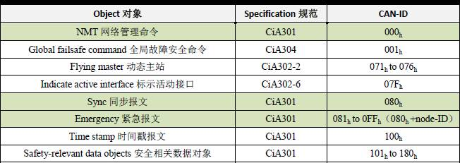

上图中，绿色底纹的常用。

每个**CANopen从节点**的 CANopen 协议栈中，必须具备 NMT 管理的相应代码。这是节点具备 CANopen 协议的最基本的要素。

## 4.2 NMT节点状态

NMT管理涉及到一个CANopen节点从上电开始的6钟状态，包括：

1. 初始化（Initializing）：节点上电后对功能部件包括 CAN 控制器进行初始化；
2. 应用层复位(Application Reset）：节点中的应用程序复位(开始），比如开关量输出模拟量输出模拟量输出的初始值；
3. 通讯复位（Communication reset）：节点的 CANopen 通讯复位（开始），从这个时刻，此节点就可以进行  CANopen 通讯了；
4. 预操作状态（Pre-operational）：节点的 CANopen 通讯处于操作就绪状态，此时此节点不能进行 PDO 通信，而可以进行 SDO 进行参数配置和 NMT 网络管理的操作；
5. 操作状态（operational）：节点收到 NMT 主机发来的启动命令后，CANopen 通讯被激活，PDO 通信启动后，按照对象字典里面规定的规则进行传输，同样 SDO 也可以对节点进行数据传输和参数修改；
6. 停止状态（Stopped）：节点收到 NMT 主机发来的停止命令后，节点的 PDO 通信被停止，但 SDO 和 NMT 网络管理依然可以对节点进行操作；

除了初始化状态，NMT 主机通过 NMT 命令可以让网络中任意一个的 CANopen 节点进行其他5种状态的切换。当然 CANopen 节点也可以程序自动完成这些状态的切换。

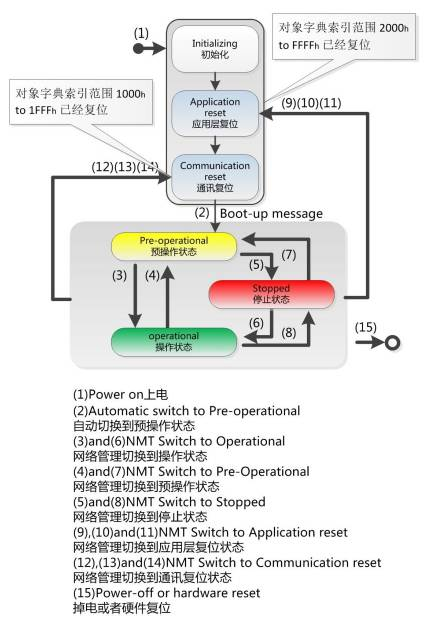

## 4.3 NMT节点报文

* 节点上线报文：任何一个 CANopen 从站上线后，为了提示主站它已经加入网络（便于热插拔），或者避免与其他从站 Node-ID 冲突。这个从站必须发出**节点上线报文（boot-up）**，节点上线报文的**ID为 700h + Node-ID**，**数据为1个字节0**。生产者为 CANopen 从站。

> 简单来说，一个从节点上线需要先发送个报文，告诉主机我上线了。

* 心跳报文：为了监控 CANopen 节点是否在线与目前的节点状态。从站需要定时发送状态报文（心跳报文）。ID与节点上线报文相同为**700h + Node-ID**，**数据为1个字节**，代表节点目前的状态，04h为停止状态，05h为操作状态，7Fh为预操作状。

> CANopen 从站按其对象字典中 1017h 中填写的心跳生产时间（ms）进行心跳报文的发送，而 CANopen 主站（NMT主站）则会按其 1016h 中填写的心跳消费时间进行检查，假设超过诺干次心跳消费时间没有收到从站的心跳报文，则认为从站已经离线或者损坏。

* 节点守护：在早期 CANopen 应用中，可以通过轮询模式监视从站状态的节点守护模式，它与心跳报文模式二者不能并存。通过节点守护，MNT主机可以检查每个节点的当前状态。很少用了。

* NMT节点状态切换命令：NMT网络管理中，最核心的就是NMT节点状态切换命令，这是NMT主站所进行网络管理的“命令”报文。
  * CAN-ID 均为 000h，具备最高的 CAN 优先级。数据为2个字节：
    * 第1个字节代表命令类型：
      * 01h 为启动命令（让节点进入操作状态）；
      * 02h 为停止命令（让节点进入停止状态）；
      * 80h 为进入预操作状态（让节点进入预操作状态）；
      * 81h 为复位节点应用层（让节点的应用恢复初始状态，比如列车门都恢复打开状态）；
      * 82h 为复位节点通讯（让节点的 CAN 和 CANopen 通讯重新初始化，一般用于总线收到干扰，导致节点总线错误被动，或者总线关闭时）。
    * 第二个字节代表被控制的节点 Node-ID，如果要对整个网络所有节点同时进行控制，则这个数值为0即可。

另外还有

* 同步协议（Syncprotocol）
* 时间戳协议（Time-stamp protocol）：CAN-ID 为 100h，数据长度为 6，数据为当前时刻与1984年1月1日0时的时间差。
* 紧急报文协议（Emergency protocol）：其 CAN-ID 存储在 1014h 的索引中，一般会定义为`0x080 + Node-ID`，数据包含8个字节。
