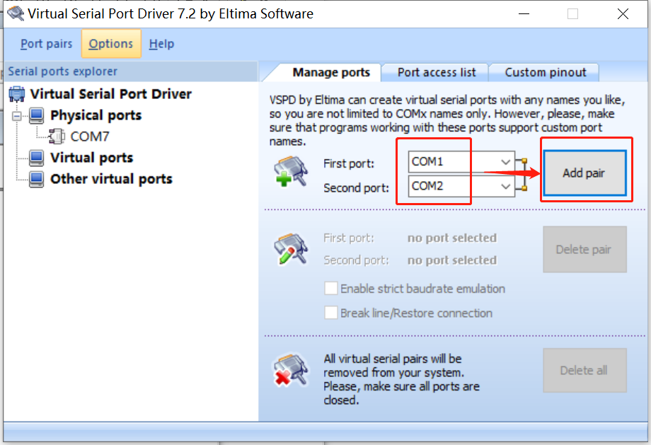
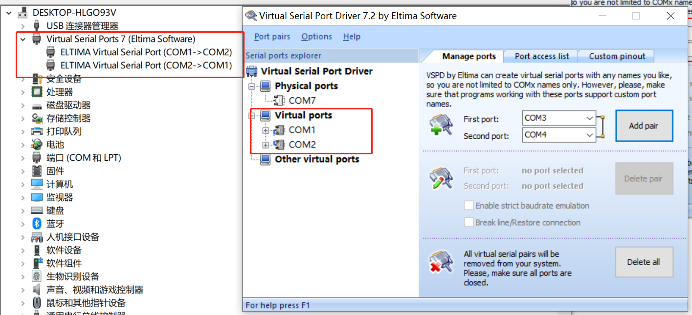
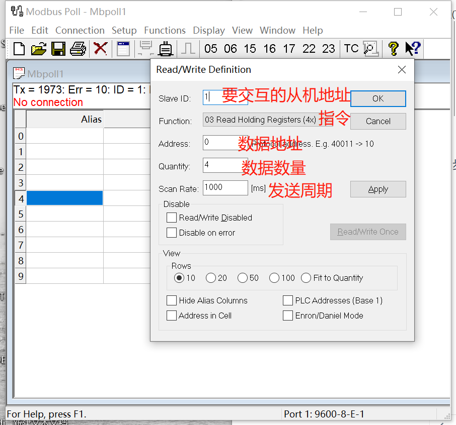
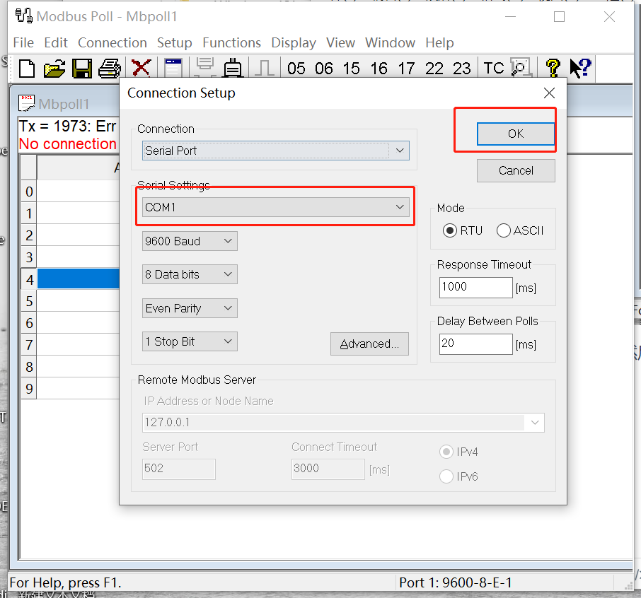
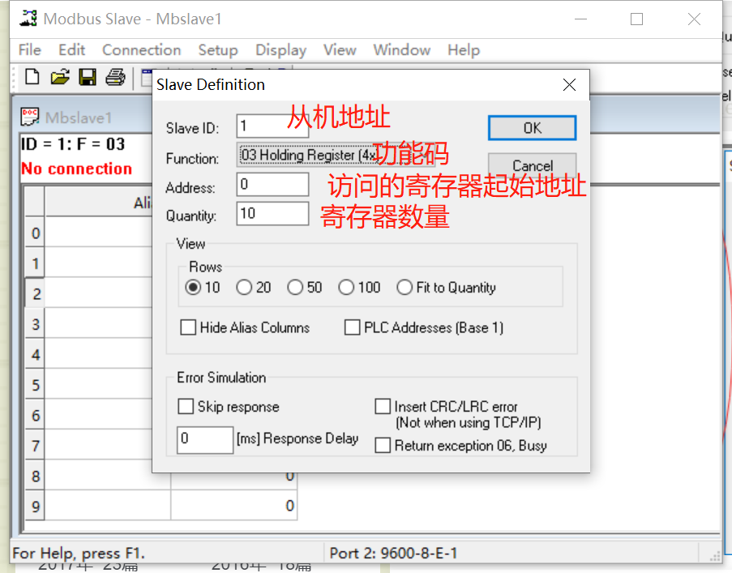
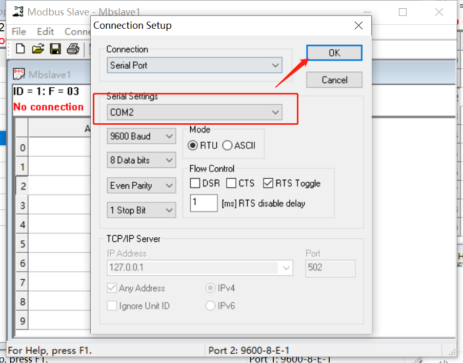
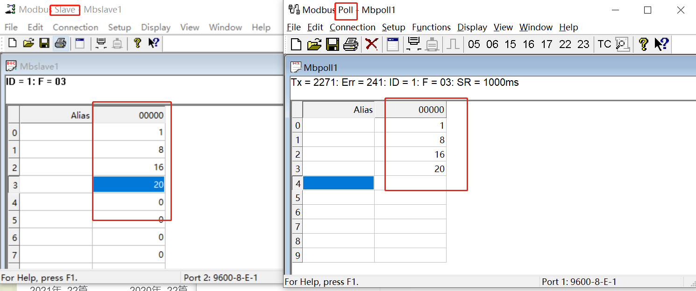
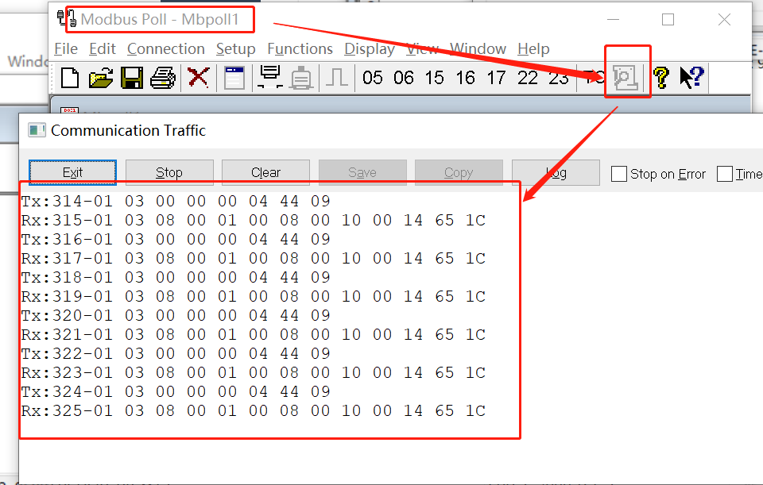
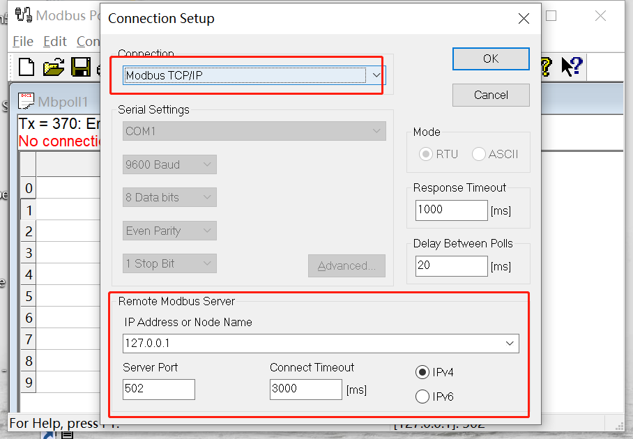
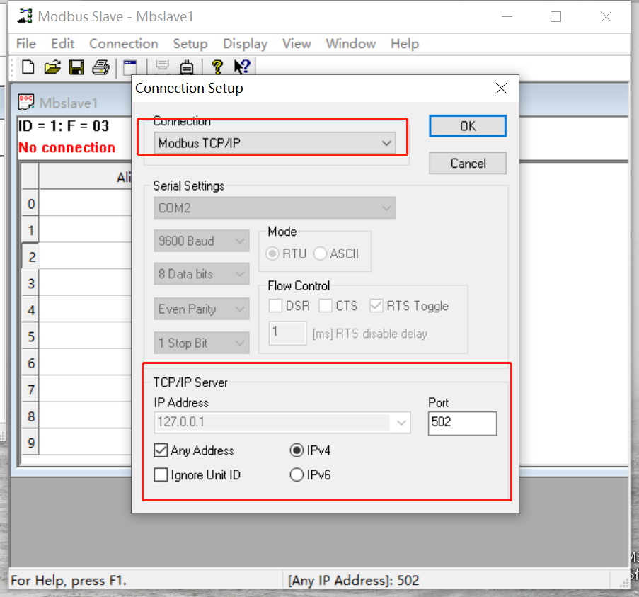

# 1. 简介

特点

* 免费
* 简单
* 接口：Modbus协议只是一种规约，属于应用层的协议，因此不仅可以应用在串口（485/232/422），也可以在以太网、光纤、蓝牙、无线上传输。

# 2. Modbus 思路

## 2.1 存储区分类

我们想要制定一个协议，我们首先要明确，协议的目的是为了数据传输。

把数据分类：

* 布尔数据（线圈，即只有开断的概念，也就是值只有0/1）
* 非布尔数据（寄存器，即各种不同的数据，一般为16位）

这些数据按照输入还是输出，还可以继续分类。

* 输入意味着该存储区里的值必须由外部设备接入，是`只读`的。
* 输出表示输出结果给外部设备，是`可读可写`的。

因此，进一步分类之后得到：

| 序号 | 读写 | 存储类型 | 存储区名称 |
| :--: | :--: | :------: | :--------: |
|  1   | 只读 |   线圈   |  输入线圈  |
|  2   | 读写 |   线圈   |  输出线圈  |
|  3   | 只读 |  寄存器  | 输入寄存器 |
|  4   | 读写 |  寄存器  | 保持寄存器 |

## 2.2 存储区代号

Modbus 用数字给这些存储区取了一个代号，就有了下面的存储区代号的规定：

| 序号 | 读写 | 存储类型 | 存储区名称 | 存储区代号 |
| :--: | :--: | :------: | :--------: | :--------: |
|  1   | 只读 |   线圈   |  输入线圈  |    1区     |
|  2   | 读写 |   线圈   |  输出线圈  |    0区     |
|  3   | 只读 |  寄存器  | 输入寄存器 |    3区     |
|  4   | 读写 |  寄存器  | 保持寄存器 |    4区     |

## 2.3 存储区范围

Modbus 规定，每个存储区的最大范围是 65536。那么，访问一个数据，我们需要知道它在哪个存储区、它在这个存储区的索引是什么。

这里我们按照绝对地址、相对地址的概念来理解：

我们把：

* `存储区编号` + `地址索引` 理解为**绝对地址**。
* 后面的地址索引 理解为**相对地址**。

那么对于 Modbus：绝对地址 = 区号 + 相对地址

---

| 存储区名称 | 存储区代号 |  绝对地址范围   | 相对地址范围 |
| :--------: | :--------: | :-------------: | :----------: |
|  输入线圈  |    1区     | 100001 - 165536 |  0 - 65535   |
|  输出线圈  |    0区     | 000001 - 065536 |  0 - 65535   |
| 输入寄存器 |    3区     | 300001 - 365536 |  0 - 65535   |
| 保持寄存器 |    4区     | 400001 - 465535 |  0 - 65535   |

> 以保持型寄存器为例，可以看到，第一个绝对地址是400001，这个地方不是400000，这个是由 Modbus 规约决定的，其它存储区也是类似。

但在实际使用中，我们一般用不了这么多地址，一般情况下，10000 以内就已经足够我们使用了，因此，为了方便起见，我们有一种短的地址模型，如下：

| 存储区名称 | 存储区代号 | 绝对地址范围  | 相对地址范围 |
| :--------: | :--------: | :-----------: | :----------: |
|  输入线圈  |    1区     | 10001 - 19999 |   0 - 9998   |
|  输出线圈  |    0区     | 00001 - 09999 |   0 - 9998   |
| 输入寄存器 |    3区     | 30001 - 39999 |   0 - 9998   |
| 保持寄存器 |    4区     | 40001 - 49999 |   0 - 9998   |

## 2.4 功能码

我们的初衷是，传输数据，即读取或者写入数据。

我们根据数据的类型已经分好区域了，只需对其读写就好了。那么，我们怎么表示我们是要读还是写呢？这个动作就是功能码。好了，继续分类。

数据（存储区）有四种，读写这个动作是两种，但是有两种数据是只读的，没有写动作。因此一共有六种行为。

| 行为序号 |      行为      |
| :------: | :------------: |
|    1     |  读取输入线圈  |
|    2     |  读取输出线圈  |
|    3     | 读取输入寄存器 |
|    4     | 读取保持寄存器 |
|    5     |  写入输出线圈  |
|    6     | 写入保持寄存器 |

但是，Modbus 规约将写入输出线圈和写入保持寄存器这 2 种行为，又进一步做了细分，包括写入单个和写入多个，因此原来的 6 种行为就变成了 8 种行为，同时给每种行为设置一个代号，就形成了下表所示的功能码列表：

| 功能码 |    功能说明    |
| :----: | :------------: |
|  0x01  |  读取输出线圈  |
|  0x02  |  读取输入线圈  |
|  0x03  | 读取保持寄存器 |
|  0x04  | 读取输入寄存器 |
|  0x05  |  写入单个线圈  |
|  0x06  | 写入单个寄存器 |
|  0x0F  |  写入多个线圈  |
|  0x10  | 写入多个寄存器 |

> Modbus 规约中的功能码其实不止这 8 个，还有一些功能码是用于诊断或异常码，但是一般很少使用，这 8 种功能码是最主要的核心功能码。

## 2.5 协议分类

Modbus 严格来说，是一个标准化的规约，而不是一个具体协议。我们常说的设备A和设备B之间通过 Modbus 协议来通信，这句话其实是不严谨的。

Modbus 规约上有三种不同的协议：

* ModbusRtu
* ModbusAscii
* ModbusTcp

一般来说，ModbusRtu 和 ModbusAscii 是运行在串口上的协议，ModbusTcp 是运行是以太网上的协议，但是这并非绝对的，我们也可以将 ModbusRtu、ModbusAscii 运行在以太网或光纤上使用，同样的，在串口网络里，我们也可以使用 ModbusTcp 的协议，因为协议只是一种规范，并不限制通信介质。

## 2.6 报文格式

* ModbusRtu 的报文格式如下（经常需要自己实现）：
  * 第一部分：从站地址，占1个字节
  * 第二部分：功能码，占1个字节
  * 第三部分：数据部分，每个数据2字节（高字节在前）
  * 第四部分：校验部分，CRC校验，占2个字节（校验前面的所有数据，结果低字节在前）

* ModbusAscii 的报文格式如下：
  * 第一部分：开始字符（:）
  * 第二部分：从站地址，占2个字节
  * 第三部分：功能码，占2个字节
  * 第四部分：数据部分，占N个字节
  * 第五部分：校验部分，LRC校验，占2个字节
  * 第六部分：结束字符（CR LF）

* ModbusTcp 的报文格式如下：
  * 第一部分：事务处理标识符，占2个字节
  * 第二部分：协议标识符，占2个字节
  * 第三部分：长度，占2个字节
  * 第四部分：单元标识符，占1个字节
  * 第五部分：功能码，占1个字节
  * 第六部分：数据部分，占N个字节

# 3. 协议补充

前面 Modbus 协议建立的过程中，没有丝毫提及通信应该用几根线、用什么样的线。

可以看出，跟串口、IIC、SPI、CAN之类的协议不同，这里定义的只是一种**消息结构**。而不管你是用哪种方式通信的。

## 3.1 主从模式

前面可以看出，数据收发需要`一个节点（主节点）`主动向`另一个节点（从节点）`发起请求，然后从节点进行回复。这种数据收发模式叫**单播模式**。

也可以，`主节点`向`所有从节点`发送请求，从节点无需发送应答，只需要执行相应的动作就可以了。这种模式叫**广播模式**。

> 一个网络中可以有一个主节点、一个或多个从节点。

## 3.2 ADU、PDU

每次 Modbus 发送的报文为：地址域 + 功能码 + 数据 + 差错校验

* 地址域：要发送给的从节点（0 广播地址，1-247 从节点地址，248-255 保留地址）。
* 功能码：要执行的动作。前面表格里说过了。
* 数据域：要发送的数据。
* 校验码：校验。

其中：

ADU（应用数据单元）= 地址域 + 功能码 + 数据 + 差错校验

PDU（协议数据单元）= 功能码 + 数据

另外，ADU 的最大长度为：256 字节。

而 PDU 的最大长度要看使用的通信方式。

* 如果使用RS232、RS485通信

ADU = 地址域（1字节）+ PDU（）+ CRC（2字节）= 256字节。

即 PDU 最大为 253 字节。

* 如果使用以太网口通信，其是再TCP/IP协议中又封装了一层 modbus 协议。

ADU = MBAP（7字节）+ PDU（）= 256字节。

即 PDU 最大为 249 字节。

# 4. 手写代码实现

实际使用中，在linux编程中，如果使用modbus，基本上都可以直接使用现成的库。

而如果使用单片机进行通信，一般用的最多的是**ModbusRtu**，因为串口（485）是比较经济的通信方式，同时为了方便，大多都是对寄存器数据的操作。

这里需要自己可以实现此种通信方式，主要需要实现以下接口（从发送和接收方都需要会实现）：

* 写单个寄存器
* 读多个寄存器

**读寄存器命令：**

1. 字节0：从机地址
2. 字节1：命令，读为0x04
3. 字节2-3：要读的寄存器地址，高字节在前
4. 字节4-5：要读的寄存器个数
5. 字节6-7：CRC校验码（低字节在前）

**响应读寄存器命令：**

1. 字节0：从机地址
2. 字节1：功能码，还是04（原样回复）
3. 字节2：数据长度（一个寄存器16位，则长度为 寄存器个数*2）
4. 字节3-4：寄存器1数据
5. 字节5-6：寄存器2数据
6. ...
7. 最后两个字节数据：CRC

**写寄存器命令：**

1. 字节0：从机地址
2. 字节1：命令，写为0x06
3. 字节2-3：要写的寄存器地址，高字节在前
4. 字节4-5：要写的寄存器值，高字节在前
5. 字节6-7：CRC校验码（低字节在前）

**响写寄存器命令：**

1. 字节0：从机地址
2. 字节1：命令，写为0x06
3. 字节2-3：写的寄存器地址，高字节在前
4. 字节4-5：写的寄存器值，高字节在前
5. 字节6-7：CRC校验码（低字节在前）

## 4.1 发送方（读 或 写的一方）

~~~ c
#include "mlcp.h"
#include "mlcp_def.h"   // modbus地址定义
#include <string.h>     // 内存比较函数
#include "Tool.h"       // 日志输出接口
#include "serial.h"     // 串口接口

// ==================================================== modbus操作接口 ==================================================== //

typedef enum _MODBUS_STATUS
{
    MODBUS_OK = 0x01,
    MODBUS_SEND_FAILED = 0x01,
    MODBUS_RECV_TIMEOUT = 0x02,
    MODBUS_ADDR_ERROR = 0x03,
    MODBUS_CRC_ERROR = 0x04,
} MODBUS_STATUS;

// 计算modbus校验码
static uint16_t modbus_crc16(uint8_t *data, uint8_t len)
{
    uint16_t crc = 0xffff;

    for (uint8_t num = 0; num < len; num++)
    {
        crc = (*data++) ^ crc;
        for (uint8_t x = 0; x < 8; x++)
        {
            if (crc & 0x0001)
            {
                crc = crc >> 1;
                crc = crc ^ 0xA001;
            }
            else
            {
                crc = crc >> 1;
            }
        }
    }
    return crc;
}

// 读寄存器操作
// reg_addr: 要读的寄存器地址。reg_num: 要读的寄存器数量。reg_data: 读到的寄存器值
static MODBUS_STATUS modbus_read_reg(uint16_t reg_addr, uint16_t reg_num, uint16_t *reg_data)
{
    // 先清空缓冲区中的数据
    uint8_t temp_tx_buf[1];
    while (SerialReceive(MLCP_UART_PORT, temp_tx_buf, 1) > 0)
    {
    }

    // 发送读寄存器命令
    uint8_t tx_message[8] = {0};
    tx_message[0] = DEFAULT_MLCP_ADDR;      // 下位机地址
    tx_message[1] = 0x03;                   // 读数据
    tx_message[2] = (reg_addr >> 8) & 0xFF; // 寄存器地址（高位）
    tx_message[3] = (reg_addr >> 0) & 0xFF; // 寄存器地址（低位）
    tx_message[4] = (reg_num >> 8) & 0xFF;  // 寄存器个数（高位）
    tx_message[5] = (reg_num >> 0) & 0xFF;  // 寄存器个数（低位）
    uint16_t crc16_tx = modbus_crc16(tx_message, 6);
    tx_message[6] = (crc16_tx >> 0) & 0xFF; // CRC校验码（低位）
    tx_message[7] = (crc16_tx >> 8) & 0xFF; // CRC校验码（高位）

    // 发送数据
    if (0 != SerialSend(MLCP_UART_PORT, tx_message, 8))
    {
        return MODBUS_SEND_FAILED;
    }

    // 等待返回数据（返回的数据会存到缓冲区中）
    task_delay(30);

    // 从缓冲区中接收返回的数据，数据长度 = 设备地址1 + 功能码1 + 数据长度1 + 返回数据reg_num*2 + CRC校验2 = 5 + reg_num * 2
    uint16_t recv_data_len = 5 + reg_num * 2;
    uint8_t rx_message[100] = {0};      // 串口缓冲区也就这么大，最大支持47个寄存器
    if (recv_data_len != SerialReceive(MLCP_UART_PORT, rx_message, recv_data_len))
    {
        return MODBUS_RECV_TIMEOUT;
    }
    
    if ((rx_message[0] == DEFAULT_MLCP_ADDR) && // 从机地址正确
        (rx_message[1] == 0x03) &&              // 功能码正确
        (rx_message[2] == (reg_num * 2)))       // 数据长度正确
    {
        // 计算CRC
        uint16_t crc_rx = modbus_crc16(rx_message, reg_num * 2 + 3);
        uint8_t crc_rx_h = crc_rx >> 8;
        uint8_t crc_rx_l = crc_rx & 0xFF;
        
        if ((rx_message[reg_num * 2 + 3] == crc_rx_l) && (rx_message[reg_num * 2 + 3 + 1] == crc_rx_h))
        {
            // 数据，高字节在前
            uint8_t i = 0;
            while (i < reg_num)
            {
                reg_data[i] = ((rx_message[3 + i * 2] << 8) | (rx_message[3 + i * 2 + 1]));
                i++;
            }
            
            return MODBUS_OK;
        }
        else
        {
            return MODBUS_CRC_ERROR;
        }
    }
    
    return MODBUS_ADDR_ERROR;
}

// 写寄存器操作
// reg_addr: 要写的寄存器地址。reg_data: 要写入到寄存器的值
static MODBUS_STATUS modbus_write_reg(uint16_t reg_addr, uint16_t reg_data)
{
    // 先清空缓冲区中的数据
    uint8_t temp_tx_buf[1];
    while (SerialReceive(MLCP_UART_PORT, temp_tx_buf, 1) > 0)
    {
    }

    // 发送写寄存器命令
    uint8_t tx_message[8] = {0};
    tx_message[0] = DEFAULT_MLCP_ADDR;      // 下位机地址
    tx_message[1] = 0x06;                   // 写数据
    tx_message[2] = (reg_addr >> 8) & 0xFF; // 寄存器地址（高位）
    tx_message[3] = (reg_addr >> 0) & 0xFF; // 寄存器地址（低位）
    tx_message[4] = (reg_data >> 8) & 0xFF; // 待写入寄存器的值（高位）
    tx_message[5] = (reg_data >> 0) & 0xFF; // 待写入寄存器的值（低位）
    uint16_t crc16_tx = modbus_crc16(tx_message, 6);
    tx_message[6] = (crc16_tx >> 0) & 0xFF; // CRC校验码（低位）
    tx_message[7] = (crc16_tx >> 8) & 0xFF; // CRC校验码（高位）

    // 发送数据
    if (0 != SerialSend(MLCP_UART_PORT, tx_message, 8))
    {
        return MODBUS_SEND_FAILED;
    }

    // 等待返回数据（返回的数据会存到缓冲区中）
    task_delay(30);

    // 从缓冲区中接收返回的数据，数据长度 = 设备地址1 + 功能码1 + 数据长度1 + 返回数据reg_num*2 + CRC校验2 = 5 + reg_num * 2
    uint8_t rx_message[10] = {0};
    if (8 != SerialReceive(MLCP_UART_PORT, rx_message, 8))
    {
        return MODBUS_RECV_TIMEOUT;
    }
    
    // 写数据时，发送的数据和返回的数据相同
    if (0 == memcmp(tx_message, rx_message, 8))
    {
        return MODBUS_OK;
    }
    
    return MODBUS_ADDR_ERROR;
}

// ==================================================== app应用读取接口 ==================================================== //

mlcp_data_t mlcp;

static void mlcp_read_version(void)
{
    MODBUS_STATUS status;
    uint16_t table[1];

    status = modbus_read_reg(SOFTWARE_VERSION_REGISTER, 1, table);
    
    if (MODBUS_OK == status)
    {
        mlcp.version = table[0];
        Log_DebugOut("[MLCP] mlcp version is %d \r\n", mlcp.version);
    }
    else
    {
        Log_DebugOut("[MLCP] mlcp read version failed, status = %d \r\n", status);
        mlcp.err_count++;
    }
}

static void mlcp_read_status(void)
{
    MODBUS_STATUS status;
    uint16_t table[33];

    status = modbus_read_reg(WORKING_MODE_REGISTER, 33, table);
    
    if (MODBUS_OK == status)
    {
        mlcp.now_work_mode = (MLCP_MODE)table[0]; // 当前工作状态
        mlcp.error_info = table[1];               // 故障信息
        mlcp.warnning_info = table[2];            // 预警信息
        mlcp.temp_in = (float)table[3] / 10 - 40;   // 进液温度
        mlcp.temp_out = (float)table[4] / 10 - 40;  // 出液温度
        mlcp.temp_env = (float)table[6] / 10 - 40;  // 环境温度
        mlcp.press_in = table[20];                // 进液压力
        mlcp.press_out = table[21];               // 出液压力
        mlcp.fan1_speed = table[23];              // 风机1转速
        mlcp.fan2_speed = table[24];              // 风机2转速
        mlcp.fan3_speed = table[25];              // 风机3转速
        mlcp.fan4_speed = table[26];              // 风机4转速
        mlcp.fan5_speed = table[27];              // 风机5转速
        mlcp.fan6_speed = table[28];              // 风机6转速
        mlcp.fan7_speed = table[29];              // 风机7转速
        mlcp.io_input_status = table[32];         // IO输入状态

        mlcp.err_count = 0;
    }
    else
    {
        Log_DebugOut("[MLCP] mlcp read status failed, status = %d \r\n", status);
        mlcp.err_count++;
    }
}

static void mlcp_write_mode(void)
{
    // 如果目标模式和实际模式不一致
    if (mlcp.now_work_mode != mlcp.need_work_mode)
    {
        MLCP_MODE set_mode = SHUTDOWN_MODE;

        // 如果当前没有故障
        if (mlcp.error_info == 0)
        {
            set_mode = (uint16_t)(mlcp.need_work_mode);
        }

        // 写 
        if (MODBUS_OK != modbus_write_reg(WORK_MODE_REGISTER, set_mode))
        {
            mlcp.err_count++;
        }
    }

    // 风机转速
    if (MODBUS_OK != modbus_write_reg(FAND_SPEED_CTRL_REGISTER, mlcp.need_fan_speed))
    {
        mlcp.err_count++;
    }
}

static void mlcp_offline_recovery()
{
    // 大概断开十几秒
    if (mlcp.err_count >= 50)
    {
        // 防止溢出
        mlcp.err_count = 50;

        SerialClose(MLCP_UART_PORT);

        task_delay(5);

        SerialOpen(MLCP_UART_PORT, 115200);

        mlcp.now_work_mode = ERROR_MODE;
    }
}

// modbus读取任务
void mlcp_task_func(void *arg)
{
    // 打开串口
    while (1)
    {
        if (0 == SerialOpen(MLCP_UART_PORT, 115200))
        {
            Log_DebugOut("[MLCP] mlcp open uart%d success! \r\n", MLCP_UART_PORT);
            break;
        }
        else
        {
            Log_DebugOut("[MLCP] mlcp open uart%d failed! \r\n", MLCP_UART_PORT);
            task_delay(1000);
        }
    }

    // 获取版本信息
    mlcp_read_version();
    
    for (;;)
    {
        task_delay(200);
        
        mlcp_read_status();

        task_delay(200);
        
        mlcp_write_mode();

        task_delay(200);

        mlcp_offline_recovery();
    }
}

void mlcp_init(void)
{
    memset(&mlcp, 0, sizeof(mlcp));

    struct task_struct *mlcp_task = NULL;

    mlcp_task = task_create(mlcp_task_func,
                            "mlcp_task",
                            (uint16_t)4096,
                            NULL,
                            (unsigned long)5);
    if (mlcp_task != NULL)
    {
        Log_DebugOut("[MLCP] Creat mlcp_task success! \r\n");
    }
    else
    {
        Log_DebugOut("[MLCP] Creat mlcp_task faild  %08x ! \r\n", (uint32_t)mlcp_task);
    }
}

// 设置当前工作模式
uint8_t mlcp_set_work_status(MLCP_MODE mode)
{
    if ((mode == SHUTDOWN_MODE) || (mode == WORKING_MODE))
    {
        mlcp.need_work_mode = mode;
        return 0;
    }

    return 1;
}

// 获取当前工作模式
MLCP_MODE mlcp_get_work_status(void)
{
    return mlcp.now_work_mode;
}

// 设置风机转速
uint8_t mlcp_set_fan_speed(uint8_t speed)
{
    if (speed <= 100)
    {
        mlcp.need_fan_speed = speed;

        return 0;
    }

    return 1;
}
~~~

## 4.2 接收方（创建寄存器/被读或写的一方）

~~~ c
/*
 * upper_modbus_task.c
 *
 *  Created on: 2024年9月9日
 *      Author: ZhangJinhao
 */

/* 功能码 */
#define READ_REGISTER 0x03  // 读寄存器
#define WRITE_REGISTER 0x06 // 读寄存器
#define ERROR_BACK 0x80     // 读寄存器(0x80+异常码)

// 计算modbus校验码
static uint16_t modbus_crc16(uint8_t *data, uint8_t len)
{
	uint16_t crc = 0xffff;

	for (uint8_t num = 0; num < len; num++)
	{
		crc = (*data++) ^ crc; // 把数据与16位的CRC寄存器的低8位相异或，结果存放于CRC寄存器
		for (uint8_t x = 0; x < 8; x++)
		{
			// 判断最低位为：“1”
			if (crc & 0x0001)
			{
				crc = crc >> 1;		// 先右移
				crc = crc ^ 0xA001; // 再与0xA001异或
			}
			else // 判断最低位为：“0”
			{
				crc = crc >> 1;
			}
		}
	}
	return crc;
}

// crc校验,0成功，1失败
static uint8_t modbus_crc_check(uint8_t *data)
{
	uint16_t result = 0;
	uint8_t crc_h, crc_l;

	result = modbus_crc16(data, 6);

	crc_h = (uint8_t)(result >> 8);
	crc_l = (uint8_t)(result & 0xFF);

	if (crc_l == data[6] && crc_h == data[7])
	{
		return 0;
	}
	else
	{
		return 1;
	}
}

// 上位机读数据，板卡回复
void upper_modbus_read_register(upper_uart_ptr dev, uint8_t *data)
{
	uint16_t register_addr = 0;
	uint16_t register_len = 0;
	uint8_t respond_data[400] = {0};	// 存储回应回去的数据

	// 解析命令
	register_addr = (data[2] << 8) | data[3];	// 目标寄存器地址
	register_len = (data[4] << 8) | data[5];	// 想要读取的寄存器个数

	// 拼接回应数据
	respond_data[0] = data[0];    //从机ID
	respond_data[1] = data[1];    //功能码
	respond_data[2] = (uint8_t)(register_len * 2);    	// 获取总的字节数
	for(uint16_t i = 0; i <= register_len; i++)			// 读取的寄存器的值
	{
		uint16_t temp_addr = register_addr + i;

		uint16_t temp_data = 0;
		uint8_t data_h = 0, data_l = 0;

        // 根据地址，填需要回复的数据
		switch(temp_addr)
		{
		/* part 1 */
		case MODUBLE_ADDR_REGISTER:			// 从机地址信息
			temp_data = upper_uart.board_addr;
			break;
		case SOFTWARE_VERSION_REGISTER:		// 软件版本信息
			temp_data = SOFT_WARE_VERSION;
			break;
		default:
			temp_data = 0;
			break;
		}

		// 计算高低位
		data_h = temp_data >> 8;
		data_l = temp_data & 0x00FF;

		// 赋值
		respond_data[3 + 2 * i] = data_h;
		respond_data[3 + 2 * i + 1] = data_l;
	}
    // 计算crc
	uint16_t crc_temp = modbus_crc16(respond_data, respond_data[2] + 3);
	respond_data[respond_data[2] + 3] = crc_temp & 0xFF;
	respond_data[respond_data[2] + 3 + 1] = crc_temp >> 8;

	// 发送回应
	upper_uart_send(dev, respond_data, respond_data[2] + 3 + 2);
}

// 上位机发送写命令，板卡处理
void upper_modbus_write_register(upper_uart_ptr dev, uint8_t *data)
{
	uint16_t register_addr = 0;
	uint16_t register_data = 0;

	// 回应上位机的写命令（原样发回去）
	upper_uart_send(dev, data, 8);

	// 解析命令
	register_addr = (data[2] << 8) | data[3];	// 目标寄存器地址
	register_data = (data[4] << 8) | data[5];	// 待写入寄存器的值

    // 根据地址执行动作
	if(register_addr == WORK_MODE_REGISTER)
	{
	}
	else if(register_addr == MOTOR_SPEED_CTRL_REGISTER)
	{
	}
}

/*
 *
 */
void upper_modbus_task(void)
{
	uint8_t temp_recv_data[8] = {0};
	memset(temp_recv_data, 0, 8);

	// modbus数据格式,最少八个字节
	// 设备地址(1)、功能码(1)、寄存器地址(2,高字节在前)、寄存器个数(2,高字节在前)、CRC校验(2,低字节在前)
	// modbus返回数据格式
	// 设备地址(1)、功能码(1)、返回数据长度(1)、返回数据(N)、CRC校验(2,低字节在前)

	// 如果当前缓冲区数据够一帧modbus
	if(upper_uart_buf_len(&upper_uart) >= 8)
	{
		// 获取一个字节数据
		if(upper_uart_recv(&upper_uart, &(temp_recv_data[0])) == 1)
		{
			// 判断是否是modbus数据头(本设备ID或广播ID)
			if((temp_recv_data[0] == upper_uart.board_addr) || (temp_recv_data[0] == 0xFF))
			{
//				uart_port_printf(&debug_uart, "temp_recv_data[0]=%d, addr=%d \r\n", temp_recv_data[0], upper_uart.board_addr);

				// 获取紧邻的7个字节
				for(uint8_t i = 1; i < 8; i++)
				{
					upper_uart_recv(&upper_uart, &(temp_recv_data[i]));
				}

				// CRC校验
				if(modbus_crc_check(temp_recv_data) == 0)
				{
					// 上位机要读数据，这里需要返回
					if(temp_recv_data[1] == 0x03)
					{
						upper_modbus_read_register(&upper_uart, temp_recv_data);
					}
					// 上位机要写数据，这里需要处理
					else if(temp_recv_data[1] == 0x06)
					{
						upper_modbus_write_register(&upper_uart, temp_recv_data);
					}
				}
                else
                {
                    // 清空缓冲区的数据 防止循环报错
                    // 
                }
			}
		}
	}
	return;
}
~~~

# 5. 测试软件

模拟 Modbus 协议有电脑即可，无需任何硬件。用于查看协议报文格式。

* Modbus Slave
* Modbus Poll
* Configure Virtual Serial Port Driver

三个软件都是傻瓜式操作，安装即可。

在弹出激活码的时候，把压缩包中的激活码填进去即可。

# 6. 测试步骤

## 6.1 添加虚拟串口

打开 VSPD 软件，添加虚拟串口。

添加完成之后，就可以看到添加的串口了，可以认为这是两个连接在一起的串口。

## 6.2 设置主机

打开 ModBus Poll 软件，点击`Setup -> Read/Write Definition`，

设置要通讯的参数，然后点击OK。

然后点击`Connection -> Connect`

> 连接上之后，左上角会显示连接超时，正常，毕竟从机还没连接呢。

## 6.3 设置从机

打开 ModBus Slave 软件，点击`Setup -> Slave Definition`，

设置要通讯的参数，注意从机地址要和刚刚主机设置的一样，然后点击OK。

然后点击`Connection -> Connect`

## 6.4 传输数据

双击从机寄存器的格子，往里面填入任意值，可以看到主机这边会读取到。

主机上面的 Tx=2271，是发送了2271次；Err=241，是失败了241次。

## 6.5 RTU报文解析

在主机端，点击`Display communication traffic`可看到主机发送出去和接收到的回复报文。

发送报文：Tx：01 03 00 00 00 04 44 09

* 01：从机地址
* 03：功能码
* 00 00：寄存器地址
* 00 04：读取数据个数，4个
* 44 09：CRC校验

接收报文：Rx：01 03 08 00 01 00 08 00 10 00 14 65 1C

* 01：从机地址
* 03：功能码
* 08：返回的字节数（16进制），8个字节。
* 00 01：第一个数据，1
* 00 08：第二个数据，8
* 00 10：第三个数据，16
* 00 14：第四个数据，20
* 65 1C：CRC校验

可以看到，就是 ModbusRtu 的报文格式（在第二步中，我们设置的就是 RTU ）。

## 6.6 TCP报文解析

如果我们不用串口，而使用TCP进行连接。

在主机端，连接时选择如下：

在从机端，连接时选择如下：

此时，数据通讯的报文如下：

发送报文：Tx：04 44 00 00 00 06 01 03 9C 4A 00 04

* 04 44：事务标识符，可以解释为报文的序列号，由于我们测试使用的Modbus Poll客户端是一直发送数据，所以每发送一次数据标识符就加一。服务器接收时会把这个数据原封返回。
* 00 00：Modbus TCP协议
* 00 06：后面有 6 字节长度的数据
* 01：单元标识符，相当于设备的地址。01
* 03：功能码
* 9C 4A：寄存器地址，从这里开始读数据
* 00 04：读取数据个数，4个

接收报文：Rx：04 44 00 00 00 0B 01 03 08 00 01 00 08 00 10 00 14

* 04 44：事务标识符，可以解释为报文的序列号，由于我们测试使用的Modbus Poll客户端是一直发送数据，所以每发送一次数据标识符就加一。服务器接收时会把这个数据原封返回。
* 00 00：Modbus TCP协议
* 00 0B：后面有 11 字节长度的数据
* 01：单元标识符，相当于设备的地址。01
* 03：功能码
* 08：返回的字节数（16进制），8个字节
* 00 01：第一个数据，1
* 00 08：第二个数据，8
* 00 10：第三个数据，16
* 00 14：第四个数据，20

> MBAP（报文头）= 事务标识符 + 协议表示 + 长度 + 单元表示符
>
> PDU（帧结构）= 功能码 + 数据

---

补充，如果读的功能码为01，即读线圈。

请求：00 01 00 00 00 06 01 01 00 02 00 04（客户端）

* 00 01：事务标识符
* 00 00：Modbus TCP协议
* 00 06：后面有00 06个字节数据
* 01：单元标识符
* 01：功能码（读线圈）
* 00 02：开始读的数据的地址。从00 02开始读数据。
* 00 04：读00 04个数据。

回应：00 01 00 00 00 04 01 01 01 0E（服务器）

* 00 01：事务标识符
* 00 00：Modbus TCP协议
* 00 04：后面有00 04个字节数据
* 01：单元标识符
* 01：功能码
* 01：后面有01个字节的数据
* 0E：表示所读地址的线圈全是2的位置是0，其余是1。说明：线圈是只有00和01两种格式，所以图中从2的位置开始读到的4位数据是：1110（二进制），转化为十六进制就是0E。

---

