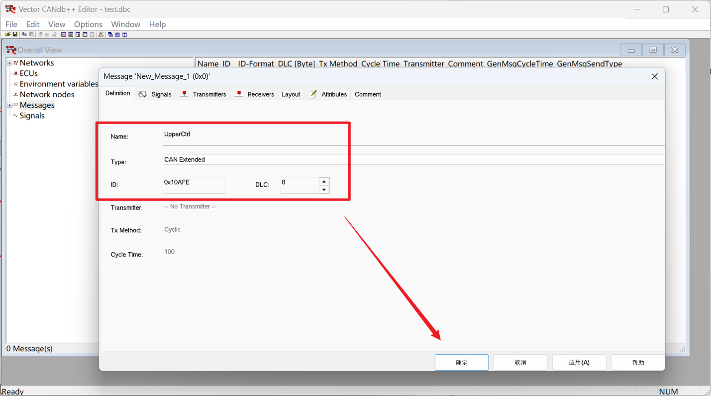
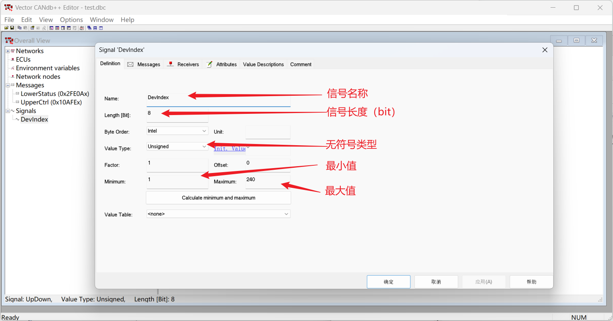
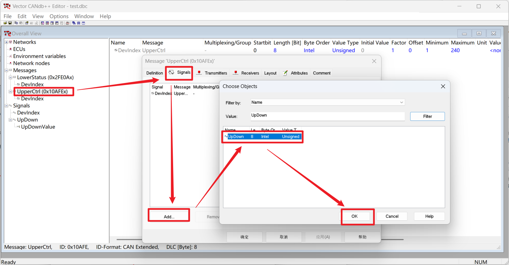
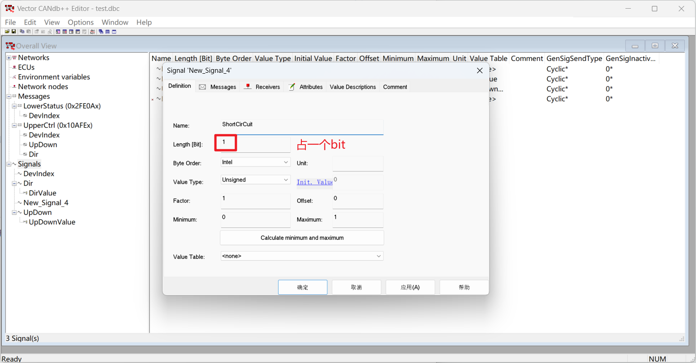
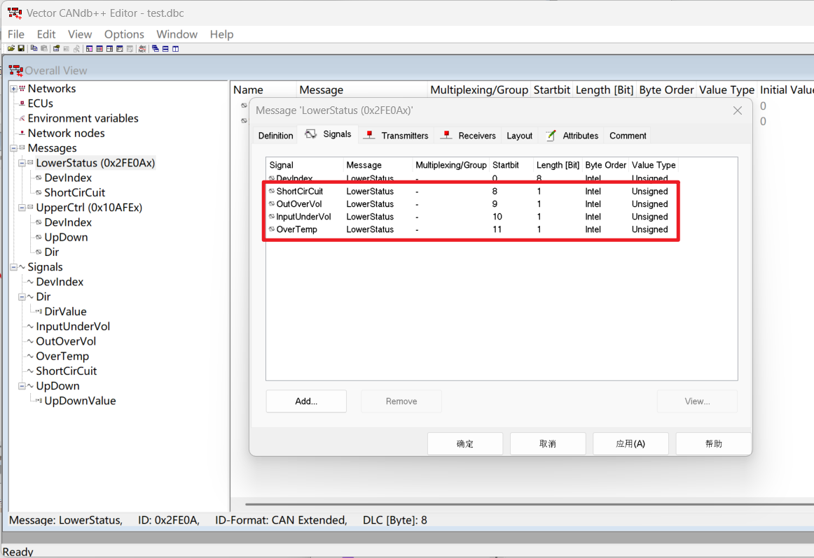

# 1. 工具下载

这里使用的工具是：Vector CANdb++ Editor

下载地址：https://www.vector.com/cn/zh/support-downloads/download-center

按照下图中的选项找到软件。

下载完成之后，按照提示安装即可。 

> 可能需要翻墙，不然加载很慢，或者加载不出来。

# 2. dbc制作

CAN消息结构如下：

* CAN消息
  * ID
  * DATA
    * 字节/位

根据上述结构，将报文进行分解：

1. 一条消息：对应一个ID
2. 一串数据：对应一串Data，标准8字节数据则共64个位
3. 一个位数据：对应Data中的一个或多个字节或位

这里创建dbc的消息也是按照这个结构开始的。

## 2.1 创建dbc文件

打开软件后，点击左上角`File`->`Create Database`

选择`CANTemplate.dbc`，然后点击OK，起个名字，保存文件即可。

创建完成后，左侧主要看**Messages**和**Signals**，

* Message定义了一共有几条消息
* Signals定义了消息中用到的各个字节和位的含义。

## 2.2 创建消息

上位机发送以下消息

~~~ markdown
id：
	0x010AFE
data：
	字节0：要控制的设备编号
	字节1：0：关机，1：启动
	字节2：0：充电，1：放电
	字节3-7：保留
len：
	8
~~~

上位机接收以下消息

~~~ markdown
id：
	0x02FE0A
data：
	字节0：设备编号
	字节1：bit0:短路; bit1:输出过压; bit2:输入欠压; bit3:过温保护;
	字节2-3：当前电压（u16,低字节在前）
    字节4-5：当前电流（u16,低字节在前）
	字节6：当前温度（u8,偏移40）
len：
	8
~~~

先创建这两条消息

在左侧目录的`Message`处，点击右键`New`，在弹出的界面中填入

1. 消息名称（随便写）
2. 消息类型（扩展帧/标准帧）
3. 消息ID
4. 消息长度

重复操作，添加需要的所有消息。

添加完成后如下图所示。

这个时候消息已经添加完成了，但是还没有定义消息中的数据分别是干啥的。

## 2.3 添加单字节信号

比如以下数据是由一个字节定义的。

* 0x010AFE
  * 字节0、1、2

* 0x02FE0A
  * 字节0

在左侧目录的`Signals`处，点击右键`New`，或者点击`Signals`后，右侧在空白处右键`New`。

在弹出的界面中填入信号信息。

然后将这个信号添加到对应的消息中。

双击消息名称，在消息的`Signals`中点击`Add`，选择创建的信号，然后点击OK即可。

同一个信号可以在多条消息中重复添加。

**枚举信号**

比如以下数据是有固定的枚举类型的，就可以给这个信号创建枚举类型的选择表。

* 0x010AFE
  * 字节1、2

同样的方法首先创建一个单字节信号，比如这里只有0和1。

然后创建一个枚举表。

点击`View`->`Value Tables`，在弹出的页面中右键`New`，在`Value Descriptions`中多次点击`Add`并修改不同枚举值的含义，`Definition`中可定义这个枚举值的名称，然后点击确定即可。

然后把这个枚举值绑定到一个`Signals`中。

双击要绑定的信号，选择目标枚举表，然后点击确定即可。

创建完成后，把这个信号也绑定到消息中。

重复上述步骤可以继续添加消息中的其他信号。

**验证**

保存当前dbc文件，在ZCANPRO中使用dbc发送，并加载此dbc文件。

1. 字节0未定义枚举，可以直接在实际值中填写
2. 字节1定义了枚举，可以在值描述中选择已经定义的值

## 2.4 添加位信号

比如以下数据是需要按位解析的

* 0x02FE0A
  * 字节1的bit0-bit4

创建一个信号，其中信号长度填1个bit。

然后将信号绑定到消息中，可以看到这个消息是从bit8开始的，长度为1个bit。

重复此操作，创建并添加剩下的bit信息。

> 这些bit信号也可以创建并绑定枚举表，比如0正常，1错误。

## 2.5 添加多字节信号

同单字节信号，将信号长度改为16位，根据实际需求设置大小端模式和倍率。

