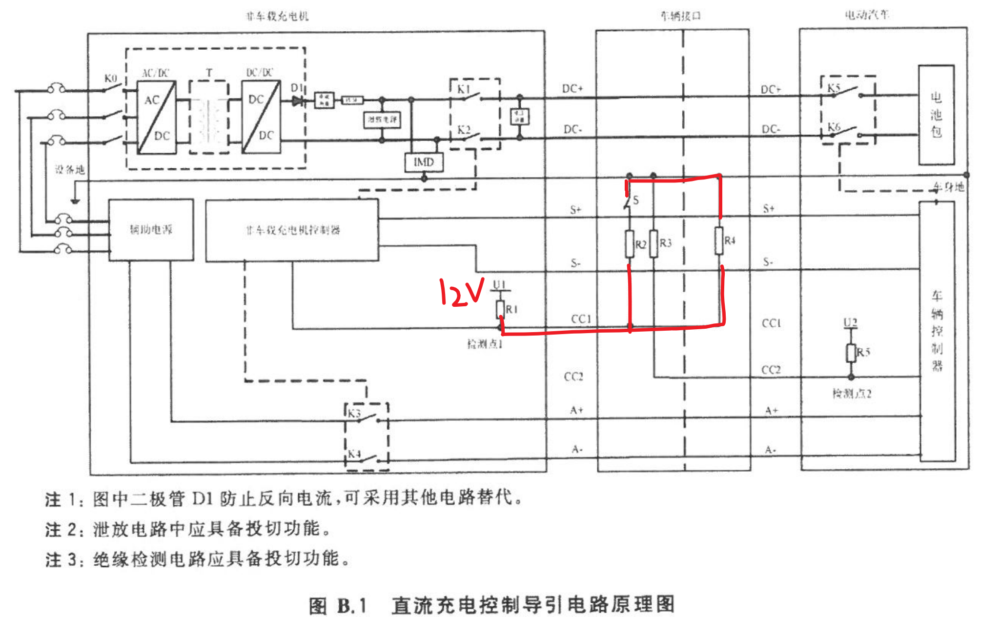
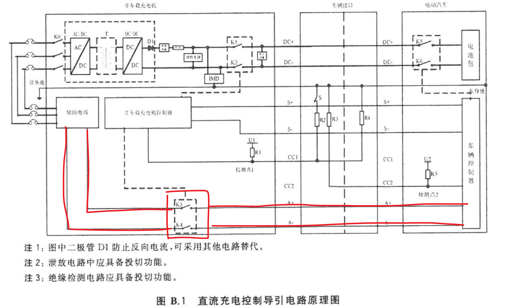

# 1. 国标概述

> 以2015国标（新国标）为主进行记录，对于2011国标（老国标）中有不同的地方进行补充。

国标充电文件主要有以下几个：

* `GBT_18487.1-2015`：主要描述了充电桩与车辆之间的**电气连接方式（连接方式C常用）**、**充电控制引导电路原理和信号编号、充电过程中状态和流程图**。
* `GBT20234.1-2015`：主要是电气连接设备通用要求，包含**充电流程描述、控制时序、直流充电电压最大1000V，电流最大400A**。
* `GBT20234.2-2015`：交流充电接口规定。
* `GBT20234.3-2015`：直流充电接口规定，**包含充电插座中线的信号定义**。

> 目前，最大电压电流分别为1000V、400A，然后根据充电枪线的限制，来做软件上的最大电流限制。

* `GBT27930-2015`：充电机和车辆之间的通信协议规定，**软件重点**。

# 2. 充电流程

1. 物理接连完成
2. 低压辅助上电
3. 充电握手阶段
4. 充电参数配置阶段
5. 充电阶段
6. 充电结束阶段
7. 结束充电

# 3. 通信协议

总则：

* 使用CAN2.0B通信协议
* CAN协议采用`SAE J1939-21`协议
* CANID使用扩展帧数据格式
  * 数据传输有两个节点，充电机、BMS
* 数据传输采用低字节在前格式
  * 电流正数代表放电，电流负数表示充电（TODO???）

**ID数据格式**

ID使用29位扩展帧格式。

地址定义：

* **充电机：0x56**（十进制86）
* **BMS：0xF4**（十进制244）

~~~ c
/*
SA：源地址
PS：目标地址
PF：命令码（PGN）
DP：数据页，固定0
R：保留，固定0
P：优先权
*/

typedef union _can_id
{
    uint32_t id;
    struct
    {
        // 从低到高
        uint32_t sa : 8; // 源地址
        uint32_t ps : 8; // 目标地址
        uint32_t pf : 8; // puu格式，确定数据域参数组编号（PGN的第二个字节）
        uint32_t dp : 1; // 数据页，固定为0
        uint32_t r : 1;  // 保留位，固定为0
        uint32_t p : 3;  // 优先权
        uint32_t : 3;
    } bits;
} can_id_t;
~~~

## 3.1 物理连接

当充电枪与车辆连接完成后，充电枪上的按键S闭合，R2和R4并联后和R1串联，供电电源12V最终分压为4V。

即：**充电机检测到`CC1`电压为`4V`时，表示充电枪与车辆连接完成**。

## 3.2 低压辅助上电

检测到车辆连接完成后，闭合继电器`K3、K4`，通过充电枪线上的`A+、A-`两根线给BMS低压辅助上电。

此时，才能和车辆进行CAN通信。

## 3.3 充电握手

充电握手分为两个阶段。

**阶段一：握手启动**

1. 充电机给BMS发送充电握手报文`CHM`，周期250ms
2. 车辆回应充电机车辆握手报文`BHM`，周期250ms

| 报文代号 | 描述       | PGN      | 优先权 | 源地址 | 目标地址 | 数据长度 | 数据（从低到高） |
| -------- | ---------- | -------- | ------ | ------ | -------- | -------- | ---------------- |
| CHM      | 充电机握手 | 0x002600 | 6      | 充电机 | BMS      | 3        | 0x01, 0x01, 0x00 |
| BHM      | 车辆握手   | 0x002700 | 6      | BMS    | 充电机   | 2        | 0x58, 0x1B       |

其中：

* CHM数据部分表示：充电机通信协议版本，一般为1.1
* BHM数据部分表示：电池最高允许电压，单位`0.1V`，比如上述0x1B58表示最高允许电压为700V

**绝缘检测** 

开始绝缘检测，可以使用最高允许的电压进行。等待绝缘检测完成。

**阶段二：握手参数辨识**

1. 充电机给BMS发送充电机辨识报文`CRM`，周期250ms
2. 车辆回应充电机车辆辨识报文`BRM`，周期250ms

| 报文代号 | 描述       | PGN      | 优先权 | 源地址 | 目标地址 | 数据长度 | 数据 |
| -------- | ---------- | -------- | ------ | ------ | -------- | -------- | ---- |
| CRM      | 充电机辨识 | 0x000100 | 6      | 充电机 | BMS      | 8        |      |
| BRM      | BMS辨识    | 0x000200 | 7      | BMS    | 充电机   | 41       |      |

其中

* CRM数据部分：
  1. 字节1：未辨识到BMS报文前0x00，收到BMS辨识报文后0xAA；
  2. 字节2-5：充电机编号，范围0到0xFFFFFFFF；
  3. 字节6-8：充电机所在的区域编码，ASCII编码。（非必须）
* BRM数据部分（超过8字节，需要进行多帧发送）：
  1. 字节1-3：BMS协议版本号，同CHM部分；
  2. 字节4：电池类型，枚举。
  3. 字节5-6：电池额定容量
  4. 字节7-8：电池额定总电压
  5. 字节9-12：厂商名称，ASCII编码（非必须）
  6. 字节13-16：电池组序号（非必须）
  7. 字节17：电池生产日期，年，偏移1985（非必须）
  8. 字节18：电池生产日期，月，偏移0（非必须）
  9. 字节19：电池生产日期，日，偏移0（非必须）
  10. 字节20-22：电池充电次数（非必须）
  11. 字节23：电池组产权（非必须）
  12. 字节24：预留（非必须）
  13. 字节25-41：VIN，车辆识别码（非必须）
  14. 字节42-49：BMS软件号（非必须）

## 3.4 充电参数配置阶段

握手完成后进入充电参数配置。

充电机向BMS发送最大输出能力，BMS判断是否能够充电。

| 报文代号 | 描述               | PGN      | 优先权 | 源地址 | 目标地址 | 数据长度 | 数据 |
| -------- | ------------------ | -------- | ------ | ------ | -------- | -------- | ---- |
| BCP      | 电池充电参数       | 0x000600 | 7      | BMS    | 充电机   | 13       |      |
| CTS      | 时间同步信息       | 0x000700 | 6      | 充电机 | BMS      | 7        |      |
| CML      | 充电机最大输出能力 | 0x000800 | 6      | 充电机 | BMS      | 8        |      |
| BRO      | 电池就绪状态       | 0x000900 | 4      | BMS    | 充电机   | 1        |      |
| CRO      | 充电机就绪状态     | 0x000A00 | 4      | 充电机 | BMS      | 1        |      |

* BCP数据部分：

